# SSIS Package: Package

**Project:** HR_UltiproEmpIDtoAD  
**Folder:** HR  
**Server:** STL-SSIS-P-01  

## Connection Managers

| Name | Type | Server | Catalog | Connection (sanitized) |
|---|---|---|---|---|
| Active Directory Connection Manager | ActiveDirectory |  |  |  |
| Active Directory Connection Manager 1 | ActiveDirectory |  |  |  |
| DW | OLEDB | papamart | dw | Data Source=papamart; Initial Catalog=dw; Provider=SQLNCLI11.1; Integrated Security=SSPI; Auto Translate=False |
| DW2 | OLEDB | papamart | dw | Data Source=papamart; Initial Catalog=dw; Provider=SQLOLEDB.1; Integrated Security=SSPI; Application Name=SSIS-HR_ActiveDirectoryDataExtract-{B97A23FE-8436-4458-9D4C-425532AC790C}papamart.dw2; Auto Translate=False |
| EmployeesCSV | FLATFILE |  |  |  |
| SMTP | SMTP |  |  |  |
| STL-DYNSNC-P-01.DBAUtility | OLEDB | STL-DYNSNC-P-01 | DBAUtility | Data Source=STL-DYNSNC-P-01; Initial Catalog=DBAUtility; Provider=SQLNCLI11.1; Integrated Security=SSPI; Auto Translate=False |
| STL-SSIS-P-01.IntegrationStaging | OLEDB | STL-SSIS-P-01 | IntegrationStaging | Data Source=STL-SSIS-P-01; Initial Catalog=IntegrationStaging; Provider=SQLNCLI11.1; Integrated Security=SSPI; Auto Translate=False |
| empIDs | FLATFILE |  |  |  |
| empNoID | FLATFILE |  |  |  |
| empNonNumericID | FLATFILE |  |  |  |
| namedAndNumbered | FLATFILE |  |  |  |
| papamart.DWStaging | OLEDB | papamart | DWStaging | Data Source=papamart; Initial Catalog=DWStaging; Provider=SQLNCLI11.1; Integrated Security=SSPI; Auto Translate=False |

## Control Flow Tasks

| Task | Type |
|---|---|
| Package | Package |
| BQ named account empID update | SEQUENCE |
| AD account wihtout EmployeeID populated (validation only) | SEQUENCE |
| AD without empID validation | Pipeline |
| count emp with no ID | ExecuteSQLTask |
| Foreach Loop Container | FOREACHLOOP |
| Send Mail | SendMailTask |
| count emp with no ID | ExecuteSQLTask |
| file for email | Pipeline |
| Foreach Loop Container | FOREACHLOOP |
| Send Mail | SendMailTask |
| people with both named and numbered accounts (validation only) | SEQUENCE |
| count emp with no ID | ExecuteSQLTask |
| Foreach Loop Container | FOREACHLOOP |
| Send Mail | SendMailTask |
| people with both named and numbered accounts | Pipeline |
| populate empID in AD | Pipeline |
| check for non-numeric EmployeeID | SEQUENCE |
| correct and send mail | SEQUENCE |
| clear non-numeric ID | Pipeline |
| Send Mail | SendMailTask |
| count of non-numeric EmployeeID | ExecuteSQLTask |
| file for email | Pipeline |
| populate empID in AD (historical) | Pipeline |
| populate empID UK CWM | Pipeline |
| repeat search for new BQ employee | SEQUENCE |
| count emp with no ID | ExecuteSQLTask |
| file for email | Pipeline |
| Foreach Loop Container | FOREACHLOOP |
| Send Mail | SendMailTask |
| populate empID in AD | Pipeline |
| update ActiveDirectoryDataStage table | SEQUENCE |
| SEQ - refresh ActiveDirectoryDataStage table | SEQUENCE |
| DataFlow - ActiveDirectoryDataStage | Pipeline |
| Truncate ActiveDirectoryDataStage | ExecuteSQLTask |

## Control Flow Outline

```text
- BQ named account empID update [SEQUENCE]
  - AD account wihtout EmployeeID populated (validation only) [SEQUENCE]
    - AD without empID validation [Pipeline]
    - Foreach Loop Container [FOREACHLOOP]
      - Send Mail [SendMailTask]
    - count emp with no ID [ExecuteSQLTask]
  - Foreach Loop Container [FOREACHLOOP]
    - Send Mail [SendMailTask]
  - count emp with no ID [ExecuteSQLTask]
  - file for email [Pipeline]
  - people with both named and numbered accounts (validation only) [SEQUENCE]
    - Foreach Loop Container [FOREACHLOOP]
      - Send Mail [SendMailTask]
    - count emp with no ID [ExecuteSQLTask]
    - people with both named and numbered accounts [Pipeline]
  - populate empID in AD [Pipeline]
- check for non-numeric EmployeeID [SEQUENCE]
  - correct and send mail [SEQUENCE]
    - Send Mail [SendMailTask]
    - clear non-numeric ID [Pipeline]
  - count of non-numeric EmployeeID [ExecuteSQLTask]
  - file for email [Pipeline]
- populate empID UK CWM [Pipeline]
- populate empID in AD (historical) [Pipeline]
- repeat search for new BQ employee [SEQUENCE]
  - Foreach Loop Container [FOREACHLOOP]
    - Send Mail [SendMailTask]
  - count emp with no ID [ExecuteSQLTask]
  - file for email [Pipeline]
  - populate empID in AD [Pipeline]
- update ActiveDirectoryDataStage table [SEQUENCE]
  - SEQ - refresh ActiveDirectoryDataStage table [SEQUENCE]
    - DataFlow - ActiveDirectoryDataStage [Pipeline]
    - Truncate ActiveDirectoryDataStage [ExecuteSQLTask]
```

## Architecture Diagram

```mermaid
flowchart TD
    n_Package_BQ_named_account_empID_update["BQ named account empID update"]
    n_Package_BQ_named_account_empID_update_AD_account_wihtout_EmployeeID_populated__validation_only_["AD account wihtout EmployeeID populated (validation only)"]
    n_Package_BQ_named_account_empID_update_AD_account_wihtout_EmployeeID_populated__validation_only__AD_without_empID_validation["AD without empID validation"]
    n_Package_BQ_named_account_empID_update_AD_account_wihtout_EmployeeID_populated__validation_only__count_emp_with_no_ID["count emp with no ID"]
    n_Package_BQ_named_account_empID_update_AD_account_wihtout_EmployeeID_populated__validation_only__Foreach_Loop_Container["Foreach Loop Container"]
    n_Package_BQ_named_account_empID_update_AD_account_wihtout_EmployeeID_populated__validation_only__Foreach_Loop_Container_Send_Mail["Send Mail"]
    n_Package_BQ_named_account_empID_update_count_emp_with_no_ID["count emp with no ID"]
    n_Package_BQ_named_account_empID_update_file_for_email["file for email"]
    n_Package_BQ_named_account_empID_update_Foreach_Loop_Container["Foreach Loop Container"]
    n_Package_BQ_named_account_empID_update_Foreach_Loop_Container_Send_Mail["Send Mail"]
    n_Package_BQ_named_account_empID_update_people_with_both_named_and_numbered_accounts__validation_only_["people with both named and numbered accounts (validation only)"]
    n_Package_BQ_named_account_empID_update_people_with_both_named_and_numbered_accounts__validation_only__count_emp_with_no_ID["count emp with no ID"]
    n_Package_BQ_named_account_empID_update_people_with_both_named_and_numbered_accounts__validation_only__Foreach_Loop_Container["Foreach Loop Container"]
    n_Package_BQ_named_account_empID_update_people_with_both_named_and_numbered_accounts__validation_only__Foreach_Loop_Container_Send_Mail["Send Mail"]
    n_Package_BQ_named_account_empID_update_people_with_both_named_and_numbered_accounts__validation_only__people_with_both_named_and_numbered_accounts["people with both named and numbered accounts"]
    n_Package_BQ_named_account_empID_update_populate_empID_in_AD["populate empID in AD"]
    n_Package_check_for_non_numeric_EmployeeID["check for non-numeric EmployeeID"]
    n_Package_check_for_non_numeric_EmployeeID_correct_and_send_mail["correct and send mail"]
    n_Package_check_for_non_numeric_EmployeeID_correct_and_send_mail_clear_non_numeric_ID["clear non-numeric ID"]
    n_Package_check_for_non_numeric_EmployeeID_correct_and_send_mail_Send_Mail["Send Mail"]
    n_Package_check_for_non_numeric_EmployeeID_count_of_non_numeric_EmployeeID["count of non-numeric EmployeeID"]
    n_Package_check_for_non_numeric_EmployeeID_file_for_email["file for email"]
    n_Package_populate_empID_in_AD__historical_["populate empID in AD (historical)"]
    n_Package_populate_empID_UK_CWM["populate empID UK CWM"]
    n_Package_repeat_search_for_new_BQ_employee["repeat search for new BQ employee"]
    n_Package_repeat_search_for_new_BQ_employee_count_emp_with_no_ID["count emp with no ID"]
    n_Package_repeat_search_for_new_BQ_employee_file_for_email["file for email"]
    n_Package_repeat_search_for_new_BQ_employee_Foreach_Loop_Container["Foreach Loop Container"]
    n_Package_repeat_search_for_new_BQ_employee_Foreach_Loop_Container_Send_Mail["Send Mail"]
    n_Package_repeat_search_for_new_BQ_employee_populate_empID_in_AD["populate empID in AD"]
    n_Package_update_ActiveDirectoryDataStage_table["update ActiveDirectoryDataStage table"]
    n_Package_update_ActiveDirectoryDataStage_table_SEQ___refresh_ActiveDirectoryDataStage_table["SEQ - refresh ActiveDirectoryDataStage table"]
    n_Package_update_ActiveDirectoryDataStage_table_SEQ___refresh_ActiveDirectoryDataStage_table_DataFlow___ActiveDirectoryDataStage["DataFlow - ActiveDirectoryDataStage"]
    n_Package_update_ActiveDirectoryDataStage_table_SEQ___refresh_ActiveDirectoryDataStage_table_Truncate_ActiveDirectoryDataStage["Truncate ActiveDirectoryDataStage"]
    n_Package_BQ_named_account_empID_update_AD_account_wihtout_EmployeeID_populated__validation_only__count_emp_with_no_ID --> n_Package_BQ_named_account_empID_update_AD_account_wihtout_EmployeeID_populated__validation_only__Foreach_Loop_Container
    n_Package_BQ_named_account_empID_update_AD_account_wihtout_EmployeeID_populated__validation_only__AD_without_empID_validation --> n_Package_BQ_named_account_empID_update_AD_account_wihtout_EmployeeID_populated__validation_only__count_emp_with_no_ID
    n_Package_BQ_named_account_empID_update_people_with_both_named_and_numbered_accounts__validation_only__people_with_both_named_and_numbered_accounts --> n_Package_BQ_named_account_empID_update_people_with_both_named_and_numbered_accounts__validation_only__count_emp_with_no_ID
    n_Package_BQ_named_account_empID_update_people_with_both_named_and_numbered_accounts__validation_only__count_emp_with_no_ID --> n_Package_BQ_named_account_empID_update_people_with_both_named_and_numbered_accounts__validation_only__Foreach_Loop_Container
    n_Package_BQ_named_account_empID_update_count_emp_with_no_ID --> n_Package_BQ_named_account_empID_update_Foreach_Loop_Container
    n_Package_BQ_named_account_empID_update_file_for_email --> n_Package_BQ_named_account_empID_update_count_emp_with_no_ID
    n_Package_BQ_named_account_empID_update_Foreach_Loop_Container --> n_Package_BQ_named_account_empID_update_populate_empID_in_AD
    n_Package_BQ_named_account_empID_update_populate_empID_in_AD --> n_Package_BQ_named_account_empID_update_AD_account_wihtout_EmployeeID_populated__validation_only_
    n_Package_BQ_named_account_empID_update_AD_account_wihtout_EmployeeID_populated__validation_only_ --> n_Package_BQ_named_account_empID_update_people_with_both_named_and_numbered_accounts__validation_only_
    n_Package_check_for_non_numeric_EmployeeID_correct_and_send_mail_Send_Mail --> n_Package_check_for_non_numeric_EmployeeID_correct_and_send_mail_clear_non_numeric_ID
    n_Package_check_for_non_numeric_EmployeeID_file_for_email --> n_Package_check_for_non_numeric_EmployeeID_count_of_non_numeric_EmployeeID
    n_Package_check_for_non_numeric_EmployeeID_count_of_non_numeric_EmployeeID --> n_Package_check_for_non_numeric_EmployeeID_correct_and_send_mail
    n_Package_repeat_search_for_new_BQ_employee_file_for_email --> n_Package_repeat_search_for_new_BQ_employee_count_emp_with_no_ID
    n_Package_repeat_search_for_new_BQ_employee_count_emp_with_no_ID --> n_Package_repeat_search_for_new_BQ_employee_Foreach_Loop_Container
    n_Package_repeat_search_for_new_BQ_employee_Foreach_Loop_Container --> n_Package_repeat_search_for_new_BQ_employee_populate_empID_in_AD
    n_Package_update_ActiveDirectoryDataStage_table_SEQ___refresh_ActiveDirectoryDataStage_table_Truncate_ActiveDirectoryDataStage --> n_Package_update_ActiveDirectoryDataStage_table_SEQ___refresh_ActiveDirectoryDataStage_table_DataFlow___ActiveDirectoryDataStage
    n_Package_BQ_named_account_empID_update --> n_Package_update_ActiveDirectoryDataStage_table
    n_Package_update_ActiveDirectoryDataStage_table --> n_Package_repeat_search_for_new_BQ_employee
    n_Package_check_for_non_numeric_EmployeeID --> n_Package_BQ_named_account_empID_update
```



## Variables

| Namespace | Name | Expression-bound |
|---|---|---|
| User | empIDfile | No |
| User | empNoIDcount | No |
| User | empNonNumericIDcount | No |
| User | empNonNumericIDfile | No |
| User | namedAndNumberedCount | No |
| User | namedAndNumberedFile | No |
| User | newBQhireCount | No |
| User | noEmpIDfile | No |

## Execute SQL Tasks

### count emp with no ID

**Path:** `Package\BQ named account empID update\AD account wihtout EmployeeID populated (validation only)\count emp with no ID`  
**Connection:** DW (papamart/dw)  

```sql
with
ADEmail as
    (
        select distinct
            EmployeeID,
            mail as Email
        from ActiveDirectoryDataStage
        where EmployeeID is NULL
        and mail like '%@buildabear.%'
and AdsPath not like '%Admin%'
		--and mail in ('03.frogspad@buildabear.com', 'Kiaras@buildabear.com')
    ),
UltiProEmail as
    (
        select
            eepeeid as uEmployeeID,
            eepaddressEmail as uEmail,
            InsertDate,
            UpdateDate
        from uhcmemp
        where --samaccountname is null
          eepaddressEmail like '%@buildabear.%'
		--and eepaddressEmail in ('03.frogspad@buildabear.com', 'Kiaras@buildabear.com')
	and EecEmplStatus = 'Active'  -- added by Ian 
    )

select count(*)
from UltiProEmail u
join ADEmail a on u.uEmail=a.Email
where u.uEmployeeID not in (select EepEEID from UHCMEmp where sAMAccountName in (select u.uEmployeeID from UltiProEmail u join ADEmail a on u.uEmail=a.Email))
```

### count emp with no ID

**Path:** `Package\BQ named account empID update\count emp with no ID`  
**Connection:** DW (papamart/dw)  

```sql
with
ADEmail as
    (
        select distinct
            EmployeeID,
            mail as Email
        from ActiveDirectoryDataStage
        where EmployeeID is NULL
        and mail like '%@buildabear.%'
    ),
UltiProEmail as
    (
        select
            eepeeid as uEmployeeID,
            eepaddressEmail as uEmail,
            InsertDate,
            UpdateDate
        from uhcmemp
        where samaccountname is null
         and eepaddressEmail like '%@buildabear.%'
		and EecEmplStatus = 'Active'   
		--order by uEmployeeID asc
    )
select  count(*)
from UltiProEmail u
join ADEmail a on u.uEmail=a.Email
left join ActiveDirectoryDataStage ads on u.uEmployeeID = ads.EmployeeId
where ads.EmployeeId is null

```

### count emp with no ID

**Path:** `Package\BQ named account empID update\people with both named and numbered accounts (validation only)\count emp with no ID`  
**Connection:** DW (papamart/dw)  

```sql
;
with
namedAccounts as
(
SELECT ADe.[EmployeeID]
      ,ADe.[samaccountName]
      ,ADe.[mail]
      ,ADe.[Department]
      ,ADe.[description]
      ,ADe.[givenName]
      ,ADe.[sn]
      ,ADe.[cn]
      ,ADe.[displayName]
      ,ADe.[company]
      ,ADe.[manager]
      ,ADe.[title]
      ,ADe.[memberOf]
      ,ADe.[InsertDate]
      ,ADe.[UpdateDate]
  FROM [dbo].[ADEmployee] ADe where ISNUMERIC(ADe.samaccountName) <> 1 
  --order by ADe.EmployeeID asc
  ),
  allADaccounts as
  (
  SELECT 
  left(ADds.UserPrincipalName, CHARINDEX('@',ADds.UserPrincipalName)-1) as 'leftUPN',
 ADds.[AccountExpirationDate]
      ,ADds.[AdsPath]
      ,ADds.[AllowReversiblePasswordEncryption]
      ,ADds.[AddressCountryAbbr]
      ,ADds.[AddressCountry]
      ,ADds.[CodePage]
      ,ADds.[Company]
      ,ADds.[CountryCode]
      ,ADds.[DelegationPermitted]
      ,ADds.[Department]
      ,ADds.[Description]
      ,ADds.[DisplayName]
      ,ADds.[EmailAddress]
      ,ADds.[EmployeeId]
      ,ADds.[EmployeeNumber]
      ,ADds.[EmployeeType]
      ,ADds.[Enabled]
      ,ADds.[FacsimileTelephoneNumber]
      ,ADds.[GivenName]
      ,ADds.[HomeDirectory]
      ,ADds.[HomeDrive]
      ,ADds.[HomePhone]
      ,ADds.[Info]
      ,ADds.[Initials]
      ,ADds.[InstanceType]
      ,ADds.[IpPhone]
      ,ADds.[AddressCity]
      ,ADds.[Mail]
      ,ADds.[Manager]
      ,ADds.[MemberOf]
      ,ADds.[MiddleName]
      ,ADds.[Mobile]
      ,ADds.[Name]
      ,ADds.[ObjectCategory]
      ,ADds.[ObjectGuid]
      ,ADds.[OtherTelephone]
      ,ADds.[Pager]
      ,ADds.[Password]
      ,ADds.[PasswordNeverExpires]
      ,ADds.[PasswordNotRequired]
      ,ADds.[PhysicalDeliveryOfficeName]
      ,ADds.[PostalAddress]
      ,ADds.[PostalCode]
      ,ADds.[PostOfficeBox]
      ,ADds.[PrimaryGroupID]
      ,ADds.[ProfilePath]
      ,ADds.[SamAccountName]
      ,ADds.[SamAccountType]
      ,ADds.[ScriptPath]
      ,ADds.[SmartcardLogonRequired]
      ,ADds.[LastName]
      ,ADds.[AddressState]
      ,ADds.[StreetAddress]
      ,ADds.[Surname]
      ,ADds.[TelephoneNumber]
      ,ADds.[ThumbnailPhoto]
      ,ADds.[Title]
      ,ADds.[UserAccountControl]
      ,ADds.[UserCannotChangePassword]
      ,ADds.[UserPrincipalName]
      ,ADds.[VoiceTelephoneNumber]
      ,ADds.[WwwHomePage]
  FROM [dbo].[ActiveDirectoryDataStage] ADds where UserPrincipalName  like '%@%'
  --order by leftUPN asc
)

select count(distinct n.EmployeeID) from namedAccounts n
join allADaccounts a on n.EmployeeID = a.SamAccountName
join allADaccounts a2 on n.samaccountName = a2.leftUPN
-- THESE SIX ACCOUNTS ARE THE EXCEPTION
where n.EmployeeID not in (0028417,0037154,0049238,0050042,0055997,0058394)
```

### count of non-numeric EmployeeID

**Path:** `Package\check for non-numeric EmployeeID\count of non-numeric EmployeeID`  
**Connection:** papamart.DWStaging (papamart/DWStaging)  

```sql
select count(*) from [dbo].[ADattributes]  where ISNUMERIC(EmployeeId) = 0 and EmployeeId is not null 
```

### count emp with no ID

**Path:** `Package\repeat search for new BQ employee\count emp with no ID`  
**Connection:** DW (papamart/dw)  

```sql
with
ADEmail as
    (
        select distinct
            EmployeeID,
            mail as Email
        from ActiveDirectoryDataStage
        where EmployeeID is NULL
        and mail like '%@buildabear.%'
    ),
UltiProEmail as
    (
        select
            eepeeid as uEmployeeID,
            eepaddressEmail as uEmail,
            InsertDate,
            UpdateDate
        from uhcmemp
        where samaccountname is null
         and eepaddressEmail like '%@buildabear.%'
  and EecEmplStatus = 'Active'   
  --order by uEmployeeID asc
    )
select  count(*)
from UltiProEmail u
join ADEmail a on u.uEmail=a.Email
left join ActiveDirectoryDataStage ads on u.uEmployeeID = ads.EmployeeId
where ads.EmployeeId is null

```

### Truncate ActiveDirectoryDataStage

**Path:** `Package\update ActiveDirectoryDataStage table\SEQ - refresh ActiveDirectoryDataStage table\Truncate ActiveDirectoryDataStage`  
**Connection:** DW (papamart/dw)  

```sql
Truncate Table ActiveDirectoryDataStage
```

## Data Flow: Sources

| Component | Source Object | Type | Data Flow Task | Connection | SQL Kind |
|---|---|---|---|---|---|
| OLE DB Source |  | OLEDBSource | AD without empID validation | DW | SqlCommand |
| OLE DB Source |  | OLEDBSource | file for email | DW | SqlCommand |
| OLE DB Source |  | OLEDBSource | people with both named and numbered accounts | DW | SqlCommand |
| OLE DB Source |  | OLEDBSource | populate empID in AD | DW | SqlCommand |
| OLE DB Source |  | OLEDBSource | clear non-numeric ID | papamart.DWStaging | SqlCommand |
| OLE DB Source |  | OLEDBSource | file for email | papamart.DWStaging | SqlCommand |
| OLE DB Source |  | OLEDBSource | populate empID in AD (historical) | DW | SqlCommand |
| OLE DB Source |  | OLEDBSource | populate empID UK CWM | papamart.DWStaging | SqlCommand |
| OLE DB Source |  | OLEDBSource | file for email | DW | SqlCommand |
| OLE DB Source |  | OLEDBSource | populate empID in AD | DW | SqlCommand |

#### OLE DB Source — SqlCommand

```sql
-- valid AD accounts where EmployeeID not set  v2
with
ADEmail as
    (
        select distinct
            EmployeeID,
            mail as Email
        from ActiveDirectoryDataStage
        where EmployeeID is NULL
        and mail like '%@buildabear.%'
and AdsPath not like '%Admin%'
		--and mail in ('03.frogspad@buildabear.com', 'Kiaras@buildabear.com')
    ),
UltiProEmail as
    (
        select
            eepeeid as uEmployeeID,
            eepaddressEmail as uEmail,
            InsertDate,
            UpdateDate
        from uhcmemp
        where --samaccountname is null
          eepaddressEmail like '%@buildabear.%'
		--and eepaddressEmail in ('03.frogspad@buildabear.com', 'Kiaras@buildabear.com')
	and EecEmplStatus = 'Active'  -- added by Ian 
    )


select
    u.uEmployeeID,
    u.uEmail,
    u.InsertDate,
    u.UpdateDate,
    a.EmployeeID,
	a.Email,
	SUBSTRING(a.Email,0,charindex('@',a.Email,0)) as 'upn'
from UltiProEmail u
join ADEmail a on u.uEmail=a.Email

where u.uEmployeeID not in (select EepEEID from UHCMEmp where sAMAccountName in (select u.uEmployeeID from UltiProEmail u join ADEmail a on u.uEmail=a.Email))
```

#### OLE DB Source — SqlCommand

```sql
with
ADEmail as
    (
        select distinct
            EmployeeID,
            mail as Email
        from ActiveDirectoryDataStage
        where EmployeeID is NULL
        and mail like '%@buildabear.%'
    ),
UltiProEmail as
    (
        select
            eepeeid as uEmployeeID,
            eepaddressEmail as uEmail,
            InsertDate,
            UpdateDate
        from uhcmemp
        where samaccountname is null
         and eepaddressEmail like '%@buildabear.%'
		and EecEmplStatus = 'Active'   
		--order by uEmployeeID asc
    )
select
    u.uEmployeeID,
    u.uEmail,
    u.InsertDate,
    u.UpdateDate,
     a.EmployeeID,
	a.Email,
	SUBSTRING(a.Email,0,charindex('@',a.Email,0)) as 'upn'
from UltiProEmail u
join ADEmail a on u.uEmail=a.Email
left join ActiveDirectoryDataStage ads on u.uEmployeeID = ads.EmployeeId
where ads.EmployeeId is null
```

#### OLE DB Source — SqlCommand

```sql
;
with
namedAccounts as
(
SELECT ADe.[EmployeeID]
      ,ADe.[samaccountName]
      ,ADe.[mail]
      ,ADe.[Department]
      ,ADe.[description]
      ,ADe.[givenName]
      ,ADe.[sn]
      ,ADe.[cn]
      ,ADe.[displayName]
      ,ADe.[company]
      ,ADe.[manager]
      ,ADe.[title]
      ,ADe.[memberOf]
      ,ADe.[InsertDate]
      ,ADe.[UpdateDate]
  FROM [dbo].[ADEmployee] ADe where ISNUMERIC(ADe.samaccountName) <> 1 
  --order by ADe.EmployeeID asc
  ),
  allADaccounts as
  (
  SELECT 
  left(ADds.UserPrincipalName, CHARINDEX('@',ADds.UserPrincipalName)-1) as 'leftUPN',
 ADds.[AccountExpirationDate]
      ,ADds.[AdsPath]
      ,ADds.[AllowReversiblePasswordEncryption]
      ,ADds.[AddressCountryAbbr]
      ,ADds.[AddressCountry]
      ,ADds.[CodePage]
      ,ADds.[Company]
      ,ADds.[CountryCode]
      ,ADds.[DelegationPermitted]
      ,ADds.[Department]
      ,ADds.[Description]
      ,ADds.[DisplayName]
      ,ADds.[EmailAddress]
      ,ADds.[EmployeeId]
      ,ADds.[EmployeeNumber]
      ,ADds.[EmployeeType]
      ,ADds.[Enabled]
      ,ADds.[FacsimileTelephoneNumber]
      ,ADds.[GivenName]
      ,ADds.[HomeDirectory]
      ,ADds.[HomeDrive]
      ,ADds.[HomePhone]
      ,ADds.[Info]
      ,ADds.[Initials]
      ,ADds.[InstanceType]
      ,ADds.[IpPhone]
      ,ADds.[AddressCity]
      ,ADds.[Mail]
      ,ADds.[Manager]
      ,ADds.[MemberOf]
      ,ADds.[MiddleName]
      ,ADds.[Mobile]
      ,ADds.[Name]
      ,ADds.[ObjectCategory]
      ,ADds.[ObjectGuid]
      ,ADds.[OtherTelephone]
      ,ADds.[Pager]
      ,ADds.[Password]
      ,ADds.[PasswordNeverExpires]
      ,ADds.[PasswordNotRequired]
      ,ADds.[PhysicalDeliveryOfficeName]
      ,ADds.[PostalAddress]
      ,ADds.[PostalCode]
      ,ADds.[PostOfficeBox]
      ,ADds.[PrimaryGroupID]
      ,ADds.[ProfilePath]
      ,ADds.[SamAccountName]
      ,ADds.[SamAccountType]
      ,ADds.[ScriptPath]
      ,ADds.[SmartcardLogonRequired]
      ,ADds.[LastName]
      ,ADds.[AddressState]
      ,ADds.[StreetAddress]
      ,ADds.[Surname]
      ,ADds.[TelephoneNumber]
      ,ADds.[ThumbnailPhoto]
      ,ADds.[Title]
      ,ADds.[UserAccountControl]
      ,ADds.[UserCannotChangePassword]
      ,ADds.[UserPrincipalName]
      ,ADds.[VoiceTelephoneNumber]
      ,ADds.[WwwHomePage]
  FROM [dbo].[ActiveDirectoryDataStage] ADds where UserPrincipalName  like '%@%'
  --order by leftUPN asc
)

select distinct(n.EmployeeID), n.samaccountName, a.AdsPath as path1, a2.AdsPath as path2 from namedAccounts n
join allADaccounts a on n.EmployeeID = a.SamAccountName
join allADaccounts a2 on n.samaccountName = a2.leftUPN
-- THESE SIX ACCOUNTS ARE THE EXCEPTION
where n.EmployeeID not in (0028417,0037154,0049238,0050042,0055997,0058394,0054402)
```

#### OLE DB Source — SqlCommand

```sql
with
ADEmail as
    (
        select distinct
            EmployeeID,
            mail as Email
        from ActiveDirectoryDataStage
        where EmployeeID is NULL
        and mail like '%@buildabear.%'
and AdsPath not like '%Admin%'
    ),
UltiProEmail as
    (
        select
            eepeeid as uEmployeeID,
            eepaddressEmail as uEmail,
            InsertDate,
            UpdateDate
        from uhcmemp
        where samaccountname is null
         and eepaddressEmail like '%@buildabear.%'
		and EecEmplStatus = 'Active'   
		--order by uEmployeeID asc
    )
select
    u.uEmployeeID,
    u.uEmail,
    u.InsertDate,
    u.UpdateDate,
     a.EmployeeID,
	a.Email,
	SUBSTRING(a.Email,0,charindex('@',a.Email,0)) as 'upn'
from UltiProEmail u
join ADEmail a on u.uEmail=a.Email
left join ActiveDirectoryDataStage ads on u.uEmployeeID = ads.EmployeeId
where ads.EmployeeId is null
```

#### OLE DB Source — SqlCommand

```sql
select null as EmployeeID, Name, SamAccountName,  Mail, Title, UserPrincipalName, Manager from [dbo].[ADattributes]  where ISNUMERIC(EmployeeId) = 0 and EmployeeId is not null
```

#### OLE DB Source — SqlCommand

```sql
select EmployeeID, Name, SamAccountName,  Mail, Title, UserPrincipalName, Manager from [dbo].[ADattributes]  where ISNUMERIC(EmployeeId) = 0 and EmployeeId is not null
```

#### OLE DB Source — SqlCommand

```sql
with
ADEmail as
    (
        select distinct
            EmployeeID,
            mail as Email
        from ActiveDirectoryDataStage
        where EmployeeID is NULL
        and mail like '%@buildabear.%'
    ),
UltiProEmail as
    (
        select
            eepeeid as uEmployeeID,
            eepaddressEmail as uEmail,
            InsertDate,
            UpdateDate
        from uhcmemp
        --where samaccountname is null
        where eepaddressEmail like '%@buildabear.%'
	--	and EecEmplStatus = 'Active'  -- added by Ian 
    )
select
    u.uEmployeeID,
    u.uEmail,
    u.InsertDate,
    u.UpdateDate,
     a.EmployeeID,
	a.Email,
	SUBSTRING(a.Email,0,charindex('@',a.Email,0)) as 'upn'
from UltiProEmail u
join ADEmail a on u.uEmail=a.Email
--where  u.uEmployeeID = '0062074'
--where u.uEmployeeID not in (select EmployeeID from ActiveDirectoryDataStage)
```

#### OLE DB Source — SqlCommand

```sql
select * from [dbo].[tmpUKCWM]
```

## Data Flow: Destinations

| Component | Target Table | Type | Data Flow Task | Connection | SQL Kind |
|---|---|---|---|---|---|
| Flat File Destination |  | FlatFileDestination | AD without empID validation | empIDs |  |
| Flat File Destination |  | FlatFileDestination | file for email | empNoID |  |
| Flat File Destination |  | FlatFileDestination | people with both named and numbered accounts | namedAndNumbered |  |
| OLE DB Destination |  | OLEDBDestination | populate empID in AD | papamart.DWStaging |  |
| Flat File Destination |  | FlatFileDestination | file for email | empNonNumericID |  |
| Flat File Destination |  | FlatFileDestination | file for email | empNoID |  |
| OLE DB Destination |  | OLEDBDestination | populate empID in AD | papamart.DWStaging |  |
| ActiveDirectoryDataStage |  | OLEDBDestination | DataFlow - ActiveDirectoryDataStage | DW |  |
