# SSIS Package: Package

**Project:** HR_UltiproEmpIDtoAD  
**Folder:** HR  
**Server:** STL-SSIS-P-01  

## Architecture Diagram

```mermaid
flowchart TD
    subgraph Connections
        Active_Directory_Connection_Manager_conn(["Active Directory Connection Manager [ActiveDirectory]"])
        Active_Directory_Connection_Manager_1_conn(["Active Directory Connection Manager 1 [ActiveDirectory]"])
        DW_conn(["DW [OLEDB]"])
        DW2_conn(["DW2 [OLEDB]"])
        empIDs_conn(["empIDs [FLATFILE]"])
        EmployeesCSV_conn(["EmployeesCSV [FLATFILE]"])
        empNoID_conn(["empNoID [FLATFILE]"])
        empNonNumericID_conn(["empNonNumericID [FLATFILE]"])
        namedAndNumbered_conn(["namedAndNumbered [FLATFILE]"])
        papamart_DWStaging_conn(["papamart.DWStaging [OLEDB]"])
        SMTP_conn(["SMTP [SMTP]"])
        STL_DYNSNC_P_01_DBAUtility_conn(["STL-DYNSNC-P-01.DBAUtility [OLEDB]"])
        STL_SSIS_P_01_IntegrationStaging_conn(["STL-SSIS-P-01.IntegrationStaging [OLEDB]"])
    end
    subgraph ControlFlow
        Package_task["Package"]
        BQ_named_account_empID_update_task["BQ named account empID update"]
        Package_task --> BQ_named_account_empID_update_task
        AD_account_wihtout_EmployeeID_populated__validation_only__task["AD account wihtout EmployeeID populated (validation only)"]
        BQ_named_account_empID_update_task --> AD_account_wihtout_EmployeeID_populated__validation_only__task
        AD_without_empID_validation_task["AD without empID validation"]
        AD_account_wihtout_EmployeeID_populated__validation_only__task --> AD_without_empID_validation_task
        count_emp_with_no_ID_task["count emp with no ID"]
        AD_without_empID_validation_task --> count_emp_with_no_ID_task
        Foreach_Loop_Container_task["Foreach Loop Container"]
        count_emp_with_no_ID_task --> Foreach_Loop_Container_task
        Send_Mail_task["Send Mail"]
        Foreach_Loop_Container_task --> Send_Mail_task
        count_emp_with_no_ID_task["count emp with no ID"]
        Send_Mail_task --> count_emp_with_no_ID_task
        file_for_email_task["file for email"]
        count_emp_with_no_ID_task --> file_for_email_task
        Foreach_Loop_Container_task["Foreach Loop Container"]
        file_for_email_task --> Foreach_Loop_Container_task
        Send_Mail_task["Send Mail"]
        Foreach_Loop_Container_task --> Send_Mail_task
        people_with_both_named_and_numbered_accounts__validation_only__task["people with both named and numbered accounts (validation only)"]
        Send_Mail_task --> people_with_both_named_and_numbered_accounts__validation_only__task
        count_emp_with_no_ID_task["count emp with no ID"]
        people_with_both_named_and_numbered_accounts__validation_only__task --> count_emp_with_no_ID_task
        Foreach_Loop_Container_task["Foreach Loop Container"]
        count_emp_with_no_ID_task --> Foreach_Loop_Container_task
        Send_Mail_task["Send Mail"]
        Foreach_Loop_Container_task --> Send_Mail_task
        people_with_both_named_and_numbered_accounts_task["people with both named and numbered accounts"]
        Send_Mail_task --> people_with_both_named_and_numbered_accounts_task
        populate_empID_in_AD_task["populate empID in AD"]
        people_with_both_named_and_numbered_accounts_task --> populate_empID_in_AD_task
        check_for_non_numeric_EmployeeID_task["check for non-numeric EmployeeID"]
        populate_empID_in_AD_task --> check_for_non_numeric_EmployeeID_task
        correct_and_send_mail_task["correct and send mail"]
        check_for_non_numeric_EmployeeID_task --> correct_and_send_mail_task
        clear_non_numeric_ID_task["clear non-numeric ID"]
        correct_and_send_mail_task --> clear_non_numeric_ID_task
        Send_Mail_task["Send Mail"]
        clear_non_numeric_ID_task --> Send_Mail_task
        count_of_non_numeric_EmployeeID_task["count of non-numeric EmployeeID"]
        Send_Mail_task --> count_of_non_numeric_EmployeeID_task
        file_for_email_task["file for email"]
        count_of_non_numeric_EmployeeID_task --> file_for_email_task
        populate_empID_in_AD__historical__task["populate empID in AD (historical)"]
        file_for_email_task --> populate_empID_in_AD__historical__task
        populate_empID_UK_CWM_task["populate empID UK CWM"]
        populate_empID_in_AD__historical__task --> populate_empID_UK_CWM_task
        repeat_search_for_new_BQ_employee_task["repeat search for new BQ employee"]
        populate_empID_UK_CWM_task --> repeat_search_for_new_BQ_employee_task
        count_emp_with_no_ID_task["count emp with no ID"]
        repeat_search_for_new_BQ_employee_task --> count_emp_with_no_ID_task
        file_for_email_task["file for email"]
        count_emp_with_no_ID_task --> file_for_email_task
        Foreach_Loop_Container_task["Foreach Loop Container"]
        file_for_email_task --> Foreach_Loop_Container_task
        Send_Mail_task["Send Mail"]
        Foreach_Loop_Container_task --> Send_Mail_task
        populate_empID_in_AD_task["populate empID in AD"]
        Send_Mail_task --> populate_empID_in_AD_task
        update_ActiveDirectoryDataStage_table_task["update ActiveDirectoryDataStage table"]
        populate_empID_in_AD_task --> update_ActiveDirectoryDataStage_table_task
        SEQ___refresh_ActiveDirectoryDataStage_table_task["SEQ - refresh ActiveDirectoryDataStage table"]
        update_ActiveDirectoryDataStage_table_task --> SEQ___refresh_ActiveDirectoryDataStage_table_task
        DataFlow___ActiveDirectoryDataStage_task["DataFlow - ActiveDirectoryDataStage"]
        SEQ___refresh_ActiveDirectoryDataStage_table_task --> DataFlow___ActiveDirectoryDataStage_task
        Truncate_ActiveDirectoryDataStage_task["Truncate ActiveDirectoryDataStage"]
        DataFlow___ActiveDirectoryDataStage_task --> Truncate_ActiveDirectoryDataStage_task
    end
```

## Connection Managers

| Name | Type |
|---|---|
| Active Directory Connection Manager | ActiveDirectory |
| Active Directory Connection Manager 1 | ActiveDirectory |
| DW | OLEDB |
| DW2 | OLEDB |
| empIDs | FLATFILE |
| EmployeesCSV | FLATFILE |
| empNoID | FLATFILE |
| empNonNumericID | FLATFILE |
| namedAndNumbered | FLATFILE |
| papamart.DWStaging | OLEDB |
| SMTP | SMTP |
| STL-DYNSNC-P-01.DBAUtility | OLEDB |
| STL-SSIS-P-01.IntegrationStaging | OLEDB |

## Control Flow Tasks

| Task | Type |
|---|---|
| Package | Microsoft.Package |
| BQ named account empID update | STOCK:SEQUENCE |
| AD account wihtout EmployeeID populated (validation only) | STOCK:SEQUENCE |
| AD without empID validation | Microsoft.Pipeline |
| count emp with no ID | Microsoft.ExecuteSQLTask |
| Foreach Loop Container | STOCK:FOREACHLOOP |
| Send Mail | Microsoft.SendMailTask |
| count emp with no ID | Microsoft.ExecuteSQLTask |
| file for email | Microsoft.Pipeline |
| Foreach Loop Container | STOCK:FOREACHLOOP |
| Send Mail | Microsoft.SendMailTask |
| people with both named and numbered accounts (validation only) | STOCK:SEQUENCE |
| count emp with no ID | Microsoft.ExecuteSQLTask |
| Foreach Loop Container | STOCK:FOREACHLOOP |
| Send Mail | Microsoft.SendMailTask |
| people with both named and numbered accounts | Microsoft.Pipeline |
| populate empID in AD | Microsoft.Pipeline |
| check for non-numeric EmployeeID | STOCK:SEQUENCE |
| correct and send mail | STOCK:SEQUENCE |
| clear non-numeric ID | Microsoft.Pipeline |
| Send Mail | Microsoft.SendMailTask |
| count of non-numeric EmployeeID | Microsoft.ExecuteSQLTask |
| file for email | Microsoft.Pipeline |
| populate empID in AD (historical) | Microsoft.Pipeline |
| populate empID UK CWM | Microsoft.Pipeline |
| repeat search for new BQ employee | STOCK:SEQUENCE |
| count emp with no ID | Microsoft.ExecuteSQLTask |
| file for email | Microsoft.Pipeline |
| Foreach Loop Container | STOCK:FOREACHLOOP |
| Send Mail | Microsoft.SendMailTask |
| populate empID in AD | Microsoft.Pipeline |
| update ActiveDirectoryDataStage table | STOCK:SEQUENCE |
| SEQ - refresh ActiveDirectoryDataStage table | STOCK:SEQUENCE |
| DataFlow - ActiveDirectoryDataStage | Microsoft.Pipeline |
| Truncate ActiveDirectoryDataStage | Microsoft.ExecuteSQLTask |

## Data Flow: Sources

| Component | SQL Preview |
|---|---|
|  | -- valid AD accounts where EmployeeID not set  v2 with ADEmail as     (         select distinct             EmployeeID,             mail as Email         from ActiveDirectoryDataStage         where EmployeeID is NULL         and mail like '%@buildabear.%' and AdsPath not like '%Admin%' 		--and mail in ('03.frogspad@buildabear.com', 'Kiaras@buildabear.com')     ), UltiProEmail as     (         sele |
|  | with ADEmail as     (         select distinct             EmployeeID,             mail as Email         from ActiveDirectoryDataStage         where EmployeeID is NULL         and mail like '%@buildabear.%'     ), UltiProEmail as     (         select             eepeeid as uEmployeeID,             eepaddressEmail as uEmail,             InsertDate,             UpdateDate         from uhcmemp         |
|  | ; with namedAccounts as ( SELECT ADe.[EmployeeID]       ,ADe.[samaccountName]       ,ADe.[mail]       ,ADe.[Department]       ,ADe.[description]       ,ADe.[givenName]       ,ADe.[sn]       ,ADe.[cn]       ,ADe.[displayName]       ,ADe.[company]       ,ADe.[manager]       ,ADe.[title]       ,ADe.[memberOf]       ,ADe.[InsertDate]       ,ADe.[UpdateDate]   FROM [dbo].[ADEmployee] ADe where ISNUMERI |
|  | with ADEmail as     (         select distinct             EmployeeID,             mail as Email         from ActiveDirectoryDataStage         where EmployeeID is NULL         and mail like '%@buildabear.%' and AdsPath not like '%Admin%'     ), UltiProEmail as     (         select             eepeeid as uEmployeeID,             eepaddressEmail as uEmail,             InsertDate,             UpdateDa |
|  | select null as EmployeeID, Name, SamAccountName,  Mail, Title, UserPrincipalName, Manager from [dbo].[ADattributes]  where ISNUMERIC(EmployeeId) = 0 and EmployeeId is not null |
|  | select EmployeeID, Name, SamAccountName,  Mail, Title, UserPrincipalName, Manager from [dbo].[ADattributes]  where ISNUMERIC(EmployeeId) = 0 and EmployeeId is not null |
|  | with ADEmail as     (         select distinct             EmployeeID,             mail as Email         from ActiveDirectoryDataStage         where EmployeeID is NULL         and mail like '%@buildabear.%'     ), UltiProEmail as     (         select             eepeeid as uEmployeeID,             eepaddressEmail as uEmail,             InsertDate,             UpdateDate         from uhcmemp         |
|  | select * from [dbo].[tmpUKCWM] |
|  | with ADEmail as     (         select distinct             EmployeeID,             mail as Email         from ActiveDirectoryDataStage         where EmployeeID is NULL         and mail like '%@buildabear.%'     ), UltiProEmail as     (         select             eepeeid as uEmployeeID,             eepaddressEmail as uEmail,             InsertDate,             UpdateDate         from uhcmemp         |
|  | with ADEmail as     (         select distinct             EmployeeID,             mail as Email         from ActiveDirectoryDataStage         where EmployeeID is NULL         and mail like '%@buildabear.%' and AdsPath not like '%Admin%'     ), UltiProEmail as     (         select             eepeeid as uEmployeeID,             eepaddressEmail as uEmail,             InsertDate,             UpdateDa |

## Data Flow: Destinations

| Component | Destination |
|---|---|
|  | [dbo].[ADmoveRejects] |
|  | [dbo].[tmpUKCWM] |
|  | [dbo].[ADmoveRejects] |
|  | [ActiveDirectoryDataStage] |

