# SSIS Package: Package

**Project:** HR_UltiproTermSamaccount  
**Folder:** HR  
**Server:** STL-SSIS-P-01  

## Connection Managers

| Name | Type | Server | Catalog | Connection (sanitized) |
|---|---|---|---|---|
| Active Directory Connection Manager 1 | ActiveDirectory |  |  |  |
| Active Directory Connection Manager 2 | ActiveDirectory |  |  |  |
| Auditworks | OLEDB | bedrocktestdb01 | auditworks | Data Source=bedrocktestdb01; Initial Catalog=auditworks; Provider=SQLNCLI11.1; Integrated Security=SSPI; Auto Translate=False |
| Azure Service Bus | Azure Service Bus (KingswaySoft) |  |  |  |
| CRM | OLEDB | crmtestdb02 | crm | Data Source=crmtestdb02; Initial Catalog=crm; Provider=SQLNCLI11.1; Integrated Security=SSPI; Auto Translate=False |
| DW | OLEDB | papamart | dw | Data Source=papamart; Initial Catalog=dw; Provider=SQLNCLI11.1; Integrated Security=SSPI; Auto Translate=False |
| DWStaging | OLEDB | papamart | DWStaging | Data Source=papamart; Initial Catalog=DWStaging; Provider=SQLNCLI11.1; Integrated Security=SSPI; Auto Translate=False |
| HTTP Connection Manager | HTTP (KingswaySoft) |  |  |  |
| IntegrationStaging | OLEDB | STL-SSIS-t-01 | IntegrationStaging | Data Source=STL-SSIS-t-01; Initial Catalog=IntegrationStaging; Provider=SQLNCLI11.1; Integrated Security=SSPI; Auto Translate=False |
| ME_01 | OLEDB | bedrocktestdb02 | me_01 | Data Source=bedrocktestdb02; Initial Catalog=me_01; Provider=SQLNCLI11.1; Integrated Security=SSPI; Auto Translate=False |
| SMTP | SMTP |  |  |  |
| UltiProImportEmailCSV | FLATFILE |  |  |  |
| UltiProImportSamAccountCSV | FLATFILE |  |  |  |
| empIDs | FLATFILE |  |  |  |
| empNoID | FLATFILE |  |  |  |
| namedAndNumbered | FLATFILE |  |  |  |
| papamart.dw1 | OLEDB | papamart | dw | Data Source=papamart; Initial Catalog=dw; Provider=SQLOLEDB.1; Integrated Security=SSPI; Application Name=SSIS-Package-{3AE9F320-D541-4496-80AB-31E67461FEC7}papamart.dw1; Auto Translate=False |

## Control Flow Tasks

| Task | Type |
|---|---|
| Package | Package |
| create file to erase samaccount in Ultipro for terms | SEQUENCE |
| count samaccounts to erase | ExecuteSQLTask |
| SEQ - Generate SamAccountName and Email CSV Files (to erase account and email) | SEQUENCE |
| Foreach Loop -  CSV | FOREACHLOOP |
| Archive File | FileSystemTask |
| SEQ - EmailCSV | SEQUENCE |
| Generate UltiPro Import Email CSV | Pipeline |
| SEQ - SamAccountCSV | SEQUENCE |
| Generate UltiPro Import SamAccountName CSV | Pipeline |
| sFTP Upload | ExecuteSQLTask |
| Sequence Container | SEQUENCE |
| AD extract Loop | FOREACHLOOP |
| Data Flow - memberOf | Pipeline |
| load ADemployeeStage | ExecuteSQLTask |
| Script - ADextract | ScriptTask |
| Merge ADEmployee | ExecuteSQLTask |
| stage employee ID | ExecuteSQLTask |
| truncate stage | ExecuteSQLTask |
| wait | ExecuteSQLTask |
| update ActiveDirectoryDataStage table | SEQUENCE |
| SEQ - refresh ActiveDirectoryDataStage table | SEQUENCE |
| DataFlow - ActiveDirectoryDataStage | Pipeline |
| Truncate ActiveDirectoryDataStage | ExecuteSQLTask |
| Send Mail Task | SendMailTask |

## Control Flow Outline

```text
- Send Mail Task [SendMailTask]
- create file to erase samaccount in Ultipro for terms [SEQUENCE]
  - SEQ - Generate SamAccountName and Email CSV Files (to erase account and email) [SEQUENCE]
    - Foreach Loop -  CSV [FOREACHLOOP]
      - Archive File [FileSystemTask]
    - SEQ - EmailCSV [SEQUENCE]
      - Generate UltiPro Import Email CSV [Pipeline]
    - SEQ - SamAccountCSV [SEQUENCE]
      - Generate UltiPro Import SamAccountName CSV [Pipeline]
    - sFTP Upload [ExecuteSQLTask]
  - Sequence Container [SEQUENCE]
    - AD extract Loop [FOREACHLOOP]
      - Data Flow - memberOf [Pipeline]
      - Script - ADextract [ScriptTask]
      - load ADemployeeStage [ExecuteSQLTask]
    - Merge ADEmployee [ExecuteSQLTask]
    - stage employee ID [ExecuteSQLTask]
    - truncate stage [ExecuteSQLTask]
  - count samaccounts to erase [ExecuteSQLTask]
  - wait [ExecuteSQLTask]
- update ActiveDirectoryDataStage table [SEQUENCE]
  - SEQ - refresh ActiveDirectoryDataStage table [SEQUENCE]
    - DataFlow - ActiveDirectoryDataStage [Pipeline]
    - Truncate ActiveDirectoryDataStage [ExecuteSQLTask]
```

## Architecture Diagram

```mermaid
flowchart TD
    n_Package_create_file_to_erase_samaccount_in_Ultipro_for_terms["create file to erase samaccount in Ultipro for terms"]
    n_Package_create_file_to_erase_samaccount_in_Ultipro_for_terms_count_samaccounts_to_erase["count samaccounts to erase"]
    n_Package_create_file_to_erase_samaccount_in_Ultipro_for_terms_SEQ___Generate_SamAccountName_and_Email_CSV_Files__to_erase_account_and_email_["SEQ - Generate SamAccountName and Email CSV Files (to erase account and email)"]
    n_Package_create_file_to_erase_samaccount_in_Ultipro_for_terms_SEQ___Generate_SamAccountName_and_Email_CSV_Files__to_erase_account_and_email__Foreach_Loop____CSV["Foreach Loop -  CSV"]
    n_Package_create_file_to_erase_samaccount_in_Ultipro_for_terms_SEQ___Generate_SamAccountName_and_Email_CSV_Files__to_erase_account_and_email__Foreach_Loop____CSV_Archive_File["Archive File"]
    n_Package_create_file_to_erase_samaccount_in_Ultipro_for_terms_SEQ___Generate_SamAccountName_and_Email_CSV_Files__to_erase_account_and_email__SEQ___EmailCSV["SEQ - EmailCSV"]
    n_Package_create_file_to_erase_samaccount_in_Ultipro_for_terms_SEQ___Generate_SamAccountName_and_Email_CSV_Files__to_erase_account_and_email__SEQ___EmailCSV_Generate_UltiPro_Import_Email_CSV["Generate UltiPro Import Email CSV"]
    n_Package_create_file_to_erase_samaccount_in_Ultipro_for_terms_SEQ___Generate_SamAccountName_and_Email_CSV_Files__to_erase_account_and_email__SEQ___SamAccountCSV["SEQ - SamAccountCSV"]
    n_Package_create_file_to_erase_samaccount_in_Ultipro_for_terms_SEQ___Generate_SamAccountName_and_Email_CSV_Files__to_erase_account_and_email__SEQ___SamAccountCSV_Generate_UltiPro_Import_SamAccountName_CSV["Generate UltiPro Import SamAccountName CSV"]
    n_Package_create_file_to_erase_samaccount_in_Ultipro_for_terms_SEQ___Generate_SamAccountName_and_Email_CSV_Files__to_erase_account_and_email__sFTP_Upload["sFTP Upload"]
    n_Package_create_file_to_erase_samaccount_in_Ultipro_for_terms_Sequence_Container["Sequence Container"]
    n_Package_create_file_to_erase_samaccount_in_Ultipro_for_terms_Sequence_Container_AD_extract_Loop["AD extract Loop"]
    n_Package_create_file_to_erase_samaccount_in_Ultipro_for_terms_Sequence_Container_AD_extract_Loop_Data_Flow___memberOf["Data Flow - memberOf"]
    n_Package_create_file_to_erase_samaccount_in_Ultipro_for_terms_Sequence_Container_AD_extract_Loop_load_ADemployeeStage["load ADemployeeStage"]
    n_Package_create_file_to_erase_samaccount_in_Ultipro_for_terms_Sequence_Container_AD_extract_Loop_Script___ADextract["Script - ADextract"]
    n_Package_create_file_to_erase_samaccount_in_Ultipro_for_terms_Sequence_Container_Merge_ADEmployee["Merge ADEmployee"]
    n_Package_create_file_to_erase_samaccount_in_Ultipro_for_terms_Sequence_Container_stage_employee_ID["stage employee ID"]
    n_Package_create_file_to_erase_samaccount_in_Ultipro_for_terms_Sequence_Container_truncate_stage["truncate stage"]
    n_Package_create_file_to_erase_samaccount_in_Ultipro_for_terms_wait["wait"]
    n_Package_update_ActiveDirectoryDataStage_table["update ActiveDirectoryDataStage table"]
    n_Package_update_ActiveDirectoryDataStage_table_SEQ___refresh_ActiveDirectoryDataStage_table["SEQ - refresh ActiveDirectoryDataStage table"]
    n_Package_update_ActiveDirectoryDataStage_table_SEQ___refresh_ActiveDirectoryDataStage_table_DataFlow___ActiveDirectoryDataStage["DataFlow - ActiveDirectoryDataStage"]
    n_Package_update_ActiveDirectoryDataStage_table_SEQ___refresh_ActiveDirectoryDataStage_table_Truncate_ActiveDirectoryDataStage["Truncate ActiveDirectoryDataStage"]
    n_Package_EventHandlers_OnError__Send_Mail_Task["Send Mail Task"]
    n_Package_create_file_to_erase_samaccount_in_Ultipro_for_terms_SEQ___Generate_SamAccountName_and_Email_CSV_Files__to_erase_account_and_email__SEQ___EmailCSV --> n_Package_create_file_to_erase_samaccount_in_Ultipro_for_terms_SEQ___Generate_SamAccountName_and_Email_CSV_Files__to_erase_account_and_email__sFTP_Upload
    n_Package_create_file_to_erase_samaccount_in_Ultipro_for_terms_SEQ___Generate_SamAccountName_and_Email_CSV_Files__to_erase_account_and_email__SEQ___SamAccountCSV --> n_Package_create_file_to_erase_samaccount_in_Ultipro_for_terms_SEQ___Generate_SamAccountName_and_Email_CSV_Files__to_erase_account_and_email__sFTP_Upload
    n_Package_create_file_to_erase_samaccount_in_Ultipro_for_terms_SEQ___Generate_SamAccountName_and_Email_CSV_Files__to_erase_account_and_email__sFTP_Upload --> n_Package_create_file_to_erase_samaccount_in_Ultipro_for_terms_SEQ___Generate_SamAccountName_and_Email_CSV_Files__to_erase_account_and_email__Foreach_Loop____CSV
    n_Package_create_file_to_erase_samaccount_in_Ultipro_for_terms_Sequence_Container_AD_extract_Loop_Script___ADextract --> n_Package_create_file_to_erase_samaccount_in_Ultipro_for_terms_Sequence_Container_AD_extract_Loop_load_ADemployeeStage
    n_Package_create_file_to_erase_samaccount_in_Ultipro_for_terms_Sequence_Container_AD_extract_Loop_load_ADemployeeStage --> n_Package_create_file_to_erase_samaccount_in_Ultipro_for_terms_Sequence_Container_AD_extract_Loop_Data_Flow___memberOf
    n_Package_create_file_to_erase_samaccount_in_Ultipro_for_terms_Sequence_Container_truncate_stage --> n_Package_create_file_to_erase_samaccount_in_Ultipro_for_terms_Sequence_Container_stage_employee_ID
    n_Package_create_file_to_erase_samaccount_in_Ultipro_for_terms_Sequence_Container_stage_employee_ID --> n_Package_create_file_to_erase_samaccount_in_Ultipro_for_terms_Sequence_Container_AD_extract_Loop
    n_Package_create_file_to_erase_samaccount_in_Ultipro_for_terms_Sequence_Container_AD_extract_Loop --> n_Package_create_file_to_erase_samaccount_in_Ultipro_for_terms_Sequence_Container_Merge_ADEmployee
    n_Package_create_file_to_erase_samaccount_in_Ultipro_for_terms_count_samaccounts_to_erase --> n_Package_create_file_to_erase_samaccount_in_Ultipro_for_terms_SEQ___Generate_SamAccountName_and_Email_CSV_Files__to_erase_account_and_email_
    n_Package_create_file_to_erase_samaccount_in_Ultipro_for_terms_wait --> n_Package_create_file_to_erase_samaccount_in_Ultipro_for_terms_Sequence_Container
    n_Package_update_ActiveDirectoryDataStage_table_SEQ___refresh_ActiveDirectoryDataStage_table_Truncate_ActiveDirectoryDataStage --> n_Package_update_ActiveDirectoryDataStage_table_SEQ___refresh_ActiveDirectoryDataStage_table_DataFlow___ActiveDirectoryDataStage
```



## Variables

| Namespace | Name | Expression-bound |
|---|---|---|
| System | Propagate | No |
| User | DateTimeStamp | Yes |
| User | EmployeeIDStage | No |
| User | EndDate | Yes |
| User | EndDateAsDATE | Yes |
| User | GetDate | Yes |
| User | GetDateAsDATE | Yes |
| User | SQL_MemberOfQuery | Yes |
| User | StartDate | Yes |
| User | StartDateAsDATE | Yes |
| User | UltiProImportEmailCSVFileName | Yes |
| User | UltiProImportFilePreStagePath | Yes |
| User | UltiProImportFiles | No |
| User | UltiProImportSamAccountCSVConnectionString | Yes |
| User | UltiProImportSamAccountCSVFileName | Yes |
| User | UltiproImportArchive | Yes |
| User | UltiproImportEmailCSVConnectionString | Yes |
| User | ad_EmployeeID | No |
| User | ad_cn | No |
| User | ad_company | No |
| User | ad_department | No |
| User | ad_description | No |
| User | ad_displayName | No |
| User | ad_givenname | No |
| User | ad_mail | No |
| User | ad_manager | No |
| User | ad_memberOf | No |
| User | ad_samaccountName | No |
| User | ad_sn | No |
| User | ad_title | No |
| User | empCount | No |

### Expression-bound variable values

#### User::DateTimeStamp

**Expression:**

```sql
(DT_WSTR,4)DATEPART("yyyy",GetDate()) 
+ (DT_WSTR,4)DATEPART("mm",GetDate()) 
+ (DT_WSTR,4)DATEPART("dd",GetDate()) 
+ (DT_WSTR,4)DATEPART("hh",GetDate()) 
+ (DT_WSTR,4)DATEPART("mi",GetDate()) 
+ (DT_WSTR,4)DATEPART("ss",GetDate()) 
+ (DT_WSTR,4)DATEPART("ms",GetDate())
```

**Evaluated value:**

```sql
2021614215743213
```

#### User::EndDate

**Expression:**

```sql
dateadd("dd", @[$Package::DaysToInclude], @[User::StartDate])
```

**Evaluated value:**

```sql
6/14/2021
```

#### User::EndDateAsDATE

**Expression:**

```sql
(DT_WSTR, 4) datepart("year", @[User::EndDate])  + "-" + 
(DT_WSTR, 2) datepart("mm", @[User::EndDate])  + "-" + 
(DT_WSTR, 2) datepart("dd",  @[User::EndDate])
```

**Evaluated value:**

```sql
2021-6-14
```

#### User::GetDate

**Expression:**

```sql
(DT_DATE)DATEDIFF("Day", (DT_DATE) 0, GETDATE())
```

**Evaluated value:**

```sql
6/14/2021
```

#### User::GetDateAsDATE

**Expression:**

```sql
(DT_WSTR, 4) datepart("year", @[User::GetDate])  + "-" + 
(DT_WSTR, 2) datepart("mm", @[User::GetDate])  + "-" + 
(DT_WSTR, 2) datepart("dd",  @[User::GetDate])
```

**Evaluated value:**

```sql
2021-6-14
```

#### User::SQL_MemberOfQuery

**Expression:**

```sql
"
SELECT cast('" + @[User::ad_EmployeeID] + "' as nvarchar(7))  as EmployeeID, cast(replace(ADsPath, 'LDAP://', '') as nvarchar(4000)) as memberOf 
FROM OPENQUERY
	(
		ADSI, 
            'SELECT * FROM ''LDAP://DC=buildabear,DC=com'' 
             WHERE employeeID = ''" + @[User::ad_EmployeeID] + "'''
	)  
"
```

**Evaluated value:**

```sql

SELECT cast('' as nvarchar(7))  as EmployeeID, cast(replace(ADsPath, 'LDAP://', '') as nvarchar(4000)) as memberOf 
FROM OPENQUERY
	(
		ADSI, 
            'SELECT * FROM ''LDAP://DC=buildabear,DC=com'' 
             WHERE employeeID = '''''
	)  

```

#### User::StartDate

**Expression:**

```sql
dateadd("dd", -@[$Package::DaysToGoBack] , @[User::GetDate] )
```

**Evaluated value:**

```sql
6/13/2021
```

#### User::StartDateAsDATE

**Expression:**

```sql
(DT_WSTR, 4) datepart("year", @[User::StartDate])  + "-" + 
(DT_WSTR, 2) datepart("mm", @[User::StartDate])  + "-" + 
(DT_WSTR, 2) datepart("dd",  @[User::StartDate])
```

**Evaluated value:**

```sql
2021-6-13
```

#### User::UltiProImportEmailCSVFileName

**Expression:**

```sql
"UPEmail" +  @[User::DateTimeStamp] + ".csv"
```

**Evaluated value:**

```sql
UPEmail2021614215743217.csv
```

#### User::UltiProImportFilePreStagePath

**Expression:**

```sql
"\\\\stl-ssis-p-01\\IntegrationStaging\\HR\\UltiProTermSamaccount\\"
```

**Evaluated value:**

```sql
\\stl-ssis-p-01\IntegrationStaging\HR\UltiProTermSamaccount\
```

#### User::UltiProImportSamAccountCSVConnectionString

**Expression:**

```sql
@[$Package::UltiProFileStagePath_SamAccountEmail] +  @[User::UltiProImportSamAccountCSVFileName]
```

**Evaluated value:**

```sql
\\STL-SSIs-p-01\integrationStaging\HR\UltiProTermSamaccount\UPSamAccount2021614215743217.csv
```

#### User::UltiProImportSamAccountCSVFileName

**Expression:**

```sql
"UPSamAccount" +  @[User::DateTimeStamp] + ".csv"
```

**Evaluated value:**

```sql
UPSamAccount2021614215743217.csv
```

#### User::UltiproImportArchive

**Expression:**

```sql
@[User::UltiProImportFilePreStagePath] + "Archive\\"
```

**Evaluated value:**

```sql
\\stl-ssis-p-01\IntegrationStaging\HR\UltiProTermSamaccount\Archive\
```

#### User::UltiproImportEmailCSVConnectionString

**Expression:**

```sql
@[$Package::UltiProFileStagePath_SamAccountEmail] +  @[User::UltiProImportEmailCSVFileName]
```

**Evaluated value:**

```sql
\\STL-SSIs-p-01\integrationStaging\HR\UltiProTermSamaccount\UPEmail2021614215743217.csv
```

## Execute SQL Tasks

### sFTP Upload

**Path:** `Package\create file to erase samaccount in Ultipro for terms\SEQ - Generate SamAccountName and Email CSV Files (to erase account and email)\sFTP Upload`  
**Connection:** IntegrationStaging (STL-SSIS-t-01/IntegrationStaging)  

```sql
declare
@winSCP varchar(1000),
@script varchar(1000),
@log varchar(1000),
@FTP varchar(4000),
@Log_query varchar(1000),
@Log_filename varchar(100),
@Log_file_location varchar(100),
@Log_bcp varchar(1000),
@body varchar(4000)

select 
@winSCP = '"\\stl-ssis-p-01\C$\Program Files (x86)\WinSCP\WinSCP.exe"',
@script = ' /script=\\STL-SSIs-p-01\integrationStaging\HR\UltiProTermSamaccount\FTP\sFTPuploadScript.txt',
@log = ' /log=\\STL-SSIs-p-01\integrationStaging\HR\UltiProTermSamaccount\FTP\FTPUpload.log',
@FTP = (@winSCP + @script + @log)

exec master..xp_cmdshell @FTP
--exec master..xp_cmdshell 'move \\STL-SSIS-P-01\integrationStaging\HR\UltiProTermSamaccount\*.csv \\STL-SSIS-P-01\integrationStaging\HR\UltiProTermSamaccount\Archive'
```

### load ADemployeeStage

**Path:** `Package\create file to erase samaccount in Ultipro for terms\Sequence Container\AD extract Loop\load ADemployeeStage`  
**Connection:** DWStaging (papamart/DWStaging)  

```sql
with stage as 
(
select 
? as EmployeeID, 
? as cn, 
? as company, 
? as description, 
? as displayName, 
? as mail, 
? as manager, 
? as samaccountName, 
? as sn,
? as Department,
? as givenname,
? as memberOf,
? as Title
)

insert ADEmployeeStage 
select *
from Stage
/*
where 
 (
  samaccountName is not NULL
  and samaccountName <> ''
  and len(samaccountName) > 0
  and samaccountName <> 'no data'
 )
OR
 (
  mail is not NULL
  and mail <> ''
  and len(mail) > 0
  and mail <> 'no data'
  and mail like '@buildabear%'
 )
*/
```

### Merge ADEmployee

**Path:** `Package\create file to erase samaccount in Ultipro for terms\Sequence Container\Merge ADEmployee`  
**Connection:** DWStaging (papamart/DWStaging)  

```sql
exec spMergeADEmployee
```

### stage employee ID

**Path:** `Package\create file to erase samaccount in Ultipro for terms\Sequence Container\stage employee ID`  
**Connection:** DW (papamart/dw)  

```sql
select EepEEID from [dbo].[vwUHCMUltiproToADouMove]

/*

select EepEEID from UHCMEmp where EepEEID
in (0059611,0060507,0027265)


*/

```

### truncate stage

**Path:** `Package\create file to erase samaccount in Ultipro for terms\Sequence Container\truncate stage`  
**Connection:** DWStaging (papamart/DWStaging)  

```sql
TRUNCATE TABLE ADEmployeeStage
```

### count samaccounts to erase

**Path:** `Package\create file to erase samaccount in Ultipro for terms\count samaccounts to erase`  
**Connection:** DW (papamart/dw)  

```sql
with 
adsPaths as
(
select distinct(AdsPAth), Name, DisplayName, samaccountname, EmployeeID, UserPrincipalName from [dbo].[ActiveDirectoryDataStage] 
),
uhcmEmpsTermed as
(
select e.EecLocation, e.EepEEID, e.EepNameFirst, e.EepNamePreferred, e.EepNameLast,e.JbcJobCode, e.EecOrgLvl1Code, e.samaccountname, e.TerminatedEffectiveDate, e.TerminatedEnteredDate, e.TermEmailSentFlag

from [dbo].[UHCMEmp] e 
--join vwADEmployee a On a.EmployeeID = e.EepEEID
left join  UHCMDepartmentMap d on e.EecLocation = d.EecLocation
where
e.EecEmplStatus = 'Terminated' 
and e.EepCompanyCode <> 'BABUK'
and e.samaccountname is not null --and e.JbcJobCode in ('CWM','CNCWM','GWM','DCWM') 
)
select count(*)
from uhcmEmpsTermed u
left join adsPaths a on u.EepEEID = a.EmployeeID
where a.UserPrincipalName is null and  a.EmployeeID is null and  a.SamAccountName is null

GO

```

### wait

**Path:** `Package\create file to erase samaccount in Ultipro for terms\wait`  
**Connection:** DW (papamart/dw)  

```sql
WAITFOR DELAY '00:00:22';
```

### Truncate ActiveDirectoryDataStage

**Path:** `Package\update ActiveDirectoryDataStage table\SEQ - refresh ActiveDirectoryDataStage table\Truncate ActiveDirectoryDataStage`  
**Connection:** DW (papamart/dw)  

```sql
Truncate Table ActiveDirectoryDataStage
```

## Data Flow: Sources

| Component | Source Object | Type | Data Flow Task | Connection | SQL Kind |
|---|---|---|---|---|---|
| SQL |  | OLEDBSource | Generate UltiPro Import Email CSV | DW | SqlCommand |
| SQL |  | OLEDBSource | Generate UltiPro Import SamAccountName CSV | DW | SqlCommand |
| LDAP |  | OLEDBSource | Data Flow - memberOf | DW |  |

#### SQL — SqlCommand

```sql
with 
adsPaths as
(
select distinct(AdsPAth), Name, DisplayName, samaccountname, EmployeeID, UserPrincipalName from [dbo].[ActiveDirectoryDataStage] 
),
uhcmEmpsTermed as
(
select e.eepCompanyCode as CompanyCode, e.EecLocation, e.EepEEID as EmployeeID , e.EepNameFirst, e.EepNamePreferred, e.EepNameLast,e.JbcJobCode, e.EecOrgLvl1Code, e.samaccountname,
 e.TerminatedEffectiveDate, 
convert(varchar,e.TerminatedEnteredDate, 101) as EffectiveDate,

 e.TermEmailSentFlag

from [dbo].[UHCMEmp] e 
--join vwADEmployee a On a.EmployeeID = e.EepEEID
left join  UHCMDepartmentMap d on e.EecLocation = d.EecLocation
where
e.EecEmplStatus = 'Terminated' 
and e.EepCompanyCode <> 'BABUK'
and e.samaccountname is not null --and e.JbcJobCode in ('CWM','CNCWM','GWM','DCWM') 
)
select 
u.CompanyCode,
convert(varchar, getdate(), 101) as EffectiveDate,
u.EmployeeID,
'^' as PrimaryEmail
from uhcmEmpsTermed u
left join adsPaths a on u.EmployeeID = a.EmployeeID
where a.UserPrincipalName is null and  a.EmployeeID is null and  a.SamAccountName is null

--where u.EmployeeID = '0010500'
```

#### SQL — SqlCommand

```sql
with 
adsPaths as
(
select distinct(AdsPAth), Name, DisplayName, samaccountname, EmployeeID, UserPrincipalName from [dbo].[ActiveDirectoryDataStage] 
),
uhcmEmpsTermed as
(
select e.eepCompanyCode as CompanyCode, e.EecLocation, e.EepEEID as EmployeeID , e.EepNameFirst, e.EepNamePreferred, e.EepNameLast,e.JbcJobCode, e.EecOrgLvl1Code, e.samaccountname,
 e.TerminatedEffectiveDate, 
convert(varchar,e.TerminatedEnteredDate, 101) as EffectiveDate,

 e.TermEmailSentFlag

from [dbo].[UHCMEmp] e 
--join vwADEmployee a On a.EmployeeID = e.EepEEID
left join  UHCMDepartmentMap d on e.EecLocation = d.EecLocation
where
e.EecEmplStatus = 'Terminated' 
and e.EepCompanyCode <> 'BABUK'
and e.samaccountname is not null --and e.JbcJobCode in ('CWM','CNCWM','GWM','DCWM') 
)
select 
u.CompanyCode,
convert(varchar, getdate(), 101) as EffectiveDate,
u.EmployeeID,
'^' as SamAccountname
from uhcmEmpsTermed u
left join adsPaths a on u.EmployeeID = a.EmployeeID
where a.UserPrincipalName is null and  a.EmployeeID is null and  a.SamAccountName is null
```

## Data Flow: Destinations

| Component | Target Table | Type | Data Flow Task | Connection | SQL Kind |
|---|---|---|---|---|---|
| UP CSV |  | FlatFileDestination | Generate UltiPro Import Email CSV | UltiProImportEmailCSV |  |
| UP CSV |  | FlatFileDestination | Generate UltiPro Import SamAccountName CSV | UltiProImportSamAccountCSV |  |
| ActiveDirectoryDataStage |  | OLEDBDestination | DataFlow - ActiveDirectoryDataStage | DW |  |
