# SSIS Package: HR_Ultipro_OU_update

**Project:** HR_Ultipro_OU_update  
**Folder:** HR  
**Server:** STL-SSIS-P-01  

## Architecture Diagram

```mermaid
flowchart TD
    subgraph Connections
        Active_Directory_Connection_Manager_1_conn(["Active Directory Connection Manager 1 [ActiveDirectory]"])
        Active_Directory_Connection_Manager_2_conn(["Active Directory Connection Manager 2 [ActiveDirectory]"])
        Auditworks_conn(["Auditworks [OLEDB]"])
        Azure_Service_Bus_conn(["Azure Service Bus [Azure Service Bus (KingswaySoft)]"])
        coredb01_conn(["coredb01 [OLEDB]"])
        CRM_conn(["CRM [OLEDB]"])
        DW_conn(["DW [OLEDB]"])
        DWStaging_conn(["DWStaging [OLEDB]"])
        empIDs_conn(["empIDs [FLATFILE]"])
        empNoID_conn(["empNoID [FLATFILE]"])
        HTTP_Connection_Manager_conn(["HTTP Connection Manager [HTTP (KingswaySoft)]"])
        IntegrationStaging_conn(["IntegrationStaging [OLEDB]"])
        ME_01_conn(["ME_01 [OLEDB]"])
        namedAndNumbered_conn(["namedAndNumbered [FLATFILE]"])
        papamart_dw1_conn(["papamart.dw1 [OLEDB]"])
        SMTP_conn(["SMTP [SMTP]"])
        UltiProImportEmailCSV_conn(["UltiProImportEmailCSV [FLATFILE]"])
        UltiProImportSamAccountCSV_conn(["UltiProImportSamAccountCSV [FLATFILE]"])
    end
    subgraph ControlFlow
        HR_Ultipro_OU_update_task["HR_Ultipro_OU_update"]
        create_file_to_reset_samaccount_and_email_in_Ultipro_ONE_EMPLOYEE_task["create file to reset samaccount and email in Ultipro ONE EMPLOYEE"]
        HR_Ultipro_OU_update_task --> create_file_to_reset_samaccount_and_email_in_Ultipro_ONE_EMPLOYEE_task
        SEQ___Generate_SamAccountName_CSV_Files_task["SEQ - Generate SamAccountName CSV Files"]
        create_file_to_reset_samaccount_and_email_in_Ultipro_ONE_EMPLOYEE_task --> SEQ___Generate_SamAccountName_CSV_Files_task
        Foreach_Loop____CSV_task["Foreach Loop -  CSV"]
        SEQ___Generate_SamAccountName_CSV_Files_task --> Foreach_Loop____CSV_task
        Archive_File_task["Archive File"]
        Foreach_Loop____CSV_task --> Archive_File_task
        SEQ___EmailCSV_task["SEQ - EmailCSV"]
        Archive_File_task --> SEQ___EmailCSV_task
        PrimaryEmail_CSV_task["PrimaryEmail CSV"]
        SEQ___EmailCSV_task --> PrimaryEmail_CSV_task
        SEQ___SamAccountCSV_task["SEQ - SamAccountCSV"]
        PrimaryEmail_CSV_task --> SEQ___SamAccountCSV_task
        SamAccount_CSV_task["SamAccount CSV"]
        SEQ___SamAccountCSV_task --> SamAccount_CSV_task
        sFTP_Upload_task["sFTP Upload"]
        SamAccount_CSV_task --> sFTP_Upload_task
        CWM_display_name___DL_update_task["CWM display name & DL update"]
        sFTP_Upload_task --> CWM_display_name___DL_update_task
        DL_updates_task["DL updates"]
        CWM_display_name___DL_update_task --> DL_updates_task
        remove_CWM_from_group_task["remove CWM from group"]
        DL_updates_task --> remove_CWM_from_group_task
        update_CWM_email_group_task["update CWM email group"]
        remove_CWM_from_group_task --> update_CWM_email_group_task
        truncate_DL_reject_stage_task["truncate DL reject stage"]
        update_CWM_email_group_task --> truncate_DL_reject_stage_task
        update_CWM_display_name_task["update CWM display name"]
        truncate_DL_reject_stage_task --> update_CWM_display_name_task
        update_CWM_display_name_w_email_task["update CWM display name w email"]
        update_CWM_display_name_task --> update_CWM_display_name_w_email_task
        OU_update_task["OU update"]
        update_CWM_display_name_w_email_task --> OU_update_task
        count_OU_moves_task["count OU moves"]
        OU_update_task --> count_OU_moves_task
        Sequence_Container_task["Sequence Container"]
        count_OU_moves_task --> Sequence_Container_task
        AD_extract_Loop_task["AD extract Loop"]
        Sequence_Container_task --> AD_extract_Loop_task
        Data_Flow___memberOf_task["Data Flow - memberOf"]
        AD_extract_Loop_task --> Data_Flow___memberOf_task
        load_ADemployeeStage_task["load ADemployeeStage"]
        Data_Flow___memberOf_task --> load_ADemployeeStage_task
        Script___ADExtract_task["Script - ADExtract"]
        load_ADemployeeStage_task --> Script___ADExtract_task
        Script___ADextract_task["Script - ADextract"]
        Script___ADExtract_task --> Script___ADextract_task
        Merge_ADEmployee_task["Merge ADEmployee"]
        Script___ADextract_task --> Merge_ADEmployee_task
        stage_employee_ID_task["stage employee ID"]
        Merge_ADEmployee_task --> stage_employee_ID_task
        truncate_stage_task["truncate stage"]
        stage_employee_ID_task --> truncate_stage_task
        update_OU_task["update OU"]
        truncate_stage_task --> update_OU_task
        update_OU_one_time_task["update OU one time"]
        update_OU_task --> update_OU_one_time_task
        wait_task["wait"]
        update_OU_one_time_task --> wait_task
        retrieve_AD_attributes_task["retrieve AD attributes"]
        wait_task --> retrieve_AD_attributes_task
        store_demotion_task["store demotion"]
        retrieve_AD_attributes_task --> store_demotion_task
        count_OU_demotes_task["count OU demotes"]
        store_demotion_task --> count_OU_demotes_task
        create_file_to_reset_samaccount_and_email_in_Ultipro_task["create file to reset samaccount and email in Ultipro"]
        count_OU_demotes_task --> create_file_to_reset_samaccount_and_email_in_Ultipro_task
        SEQ___Generate_SamAccountName_CSV_Files_task["SEQ - Generate SamAccountName CSV Files"]
        create_file_to_reset_samaccount_and_email_in_Ultipro_task --> SEQ___Generate_SamAccountName_CSV_Files_task
        Foreach_Loop____CSV_task["Foreach Loop -  CSV"]
        SEQ___Generate_SamAccountName_CSV_Files_task --> Foreach_Loop____CSV_task
        Archive_File_task["Archive File"]
        Foreach_Loop____CSV_task --> Archive_File_task
        SEQ___EmailCSV_task["SEQ - EmailCSV"]
        Archive_File_task --> SEQ___EmailCSV_task
        PrimaryEmail_CSV_task["PrimaryEmail CSV"]
        SEQ___EmailCSV_task --> PrimaryEmail_CSV_task
        SEQ___SamAccountCSV_task["SEQ - SamAccountCSV"]
        PrimaryEmail_CSV_task --> SEQ___SamAccountCSV_task
        SamAccount_CSV_task["SamAccount CSV"]
        SEQ___SamAccountCSV_task --> SamAccount_CSV_task
        sFTP_Upload_task["sFTP Upload"]
        SamAccount_CSV_task --> sFTP_Upload_task
        send_to_AD_task["send to AD"]
        sFTP_Upload_task --> send_to_AD_task
        send_to_AD_1_task["send to AD 1"]
        send_to_AD_task --> send_to_AD_1_task
        send_to_AD_2_task["send to AD 2"]
        send_to_AD_1_task --> send_to_AD_2_task
        Sequence_Container_task["Sequence Container"]
        send_to_AD_2_task --> Sequence_Container_task
        AD_extract_Loop_task["AD extract Loop"]
        Sequence_Container_task --> AD_extract_Loop_task
        Data_Flow___memberOf_task["Data Flow - memberOf"]
        AD_extract_Loop_task --> Data_Flow___memberOf_task
        load_ADemployeeStage_task["load ADemployeeStage"]
        Data_Flow___memberOf_task --> load_ADemployeeStage_task
        Script___ADExtract_task["Script - ADExtract"]
        load_ADemployeeStage_task --> Script___ADExtract_task
        Merge_ADEmployee_task["Merge ADEmployee"]
        Script___ADExtract_task --> Merge_ADEmployee_task
        stage_employee_ID_task["stage employee ID"]
        Merge_ADEmployee_task --> stage_employee_ID_task
        truncate_stage_task["truncate stage"]
        stage_employee_ID_task --> truncate_stage_task
        Sequence_Container_1_task["Sequence Container 1"]
        truncate_stage_task --> Sequence_Container_1_task
        add_to_Store_Users_DL_task["add to Store Users DL"]
        Sequence_Container_1_task --> add_to_Store_Users_DL_task
        remove_from_CWM_DL_task["remove from CWM DL"]
        add_to_Store_Users_DL_task --> remove_from_CWM_DL_task
        update_UHCMemp_table_task["update UHCMemp table"]
        remove_from_CWM_DL_task --> update_UHCMemp_table_task
        wait_task["wait"]
        update_UHCMemp_table_task --> wait_task
        store_promotion_task["store promotion"]
        wait_task --> store_promotion_task
        count_OU_promotes_task["count OU promotes"]
        store_promotion_task --> count_OU_promotes_task
        create_file_to_reset_samaccount_and_email_in_Ultipro_task["create file to reset samaccount and email in Ultipro"]
        count_OU_promotes_task --> create_file_to_reset_samaccount_and_email_in_Ultipro_task
        SEQ___Generate_SamAccountName_CSV_Files_task["SEQ - Generate SamAccountName CSV Files"]
        create_file_to_reset_samaccount_and_email_in_Ultipro_task --> SEQ___Generate_SamAccountName_CSV_Files_task
        Foreach_Loop____CSV_task["Foreach Loop -  CSV"]
        SEQ___Generate_SamAccountName_CSV_Files_task --> Foreach_Loop____CSV_task
        Archive_File_task["Archive File"]
        Foreach_Loop____CSV_task --> Archive_File_task
        SEQ___EmailCSV_task["SEQ - EmailCSV"]
        Archive_File_task --> SEQ___EmailCSV_task
        PrimaryEmail_CSV_task["PrimaryEmail CSV"]
        SEQ___EmailCSV_task --> PrimaryEmail_CSV_task
        SEQ___SamAccountCSV_task["SEQ - SamAccountCSV"]
        PrimaryEmail_CSV_task --> SEQ___SamAccountCSV_task
        SamAccount_CSV_task["SamAccount CSV"]
        SEQ___SamAccountCSV_task --> SamAccount_CSV_task
        sFTP_Upload_task["sFTP Upload"]
        SamAccount_CSV_task --> sFTP_Upload_task
        send_C_to_dataLoaderStaging_task["send C to dataLoaderStaging"]
        sFTP_Upload_task --> send_C_to_dataLoaderStaging_task
        send_RN_to_dataLoaderStaging_task["send RN to dataLoaderStaging"]
        send_C_to_dataLoaderStaging_task --> send_RN_to_dataLoaderStaging_task
        Sequence_Container_task["Sequence Container"]
        send_RN_to_dataLoaderStaging_task --> Sequence_Container_task
        AD_extract_Loop_task["AD extract Loop"]
        Sequence_Container_task --> AD_extract_Loop_task
        Data_Flow___memberOf_task["Data Flow - memberOf"]
        AD_extract_Loop_task --> Data_Flow___memberOf_task
        load_ADemployeeStage_task["load ADemployeeStage"]
        Data_Flow___memberOf_task --> load_ADemployeeStage_task
        Script___ADExtract_task["Script - ADExtract"]
        load_ADemployeeStage_task --> Script___ADExtract_task
        Merge_ADEmployee_task["Merge ADEmployee"]
        Script___ADExtract_task --> Merge_ADEmployee_task
        stage_employee_ID_task["stage employee ID"]
        Merge_ADEmployee_task --> stage_employee_ID_task
        truncate_stage_task["truncate stage"]
        stage_employee_ID_task --> truncate_stage_task
        update_UHCMemp_table_task["update UHCMemp table"]
        truncate_stage_task --> update_UHCMemp_table_task
        wait_task["wait"]
        update_UHCMemp_table_task --> wait_task
        test_update_attribute_task["test update attribute"]
        wait_task --> test_update_attribute_task
        update_ActiveDirectoryDataStage_table_task["update ActiveDirectoryDataStage table"]
        test_update_attribute_task --> update_ActiveDirectoryDataStage_table_task
        SEQ___refresh_ActiveDirectoryDataStage_table_task["SEQ - refresh ActiveDirectoryDataStage table"]
        update_ActiveDirectoryDataStage_table_task --> SEQ___refresh_ActiveDirectoryDataStage_table_task
        DataFlow___ActiveDirectoryDataStage_task["DataFlow - ActiveDirectoryDataStage"]
        SEQ___refresh_ActiveDirectoryDataStage_table_task --> DataFlow___ActiveDirectoryDataStage_task
        Truncate_ActiveDirectoryDataStage_task["Truncate ActiveDirectoryDataStage"]
        DataFlow___ActiveDirectoryDataStage_task --> Truncate_ActiveDirectoryDataStage_task
        update_all_CWM_display_names_task["update all CWM display names"]
        Truncate_ActiveDirectoryDataStage_task --> update_all_CWM_display_names_task
        update_ExtensionAttribute5_task["update ExtensionAttribute5"]
        update_all_CWM_display_names_task --> update_ExtensionAttribute5_task
        Send_Mail_Task_task["Send Mail Task"]
        update_ExtensionAttribute5_task --> Send_Mail_Task_task
    end
```

## Connection Managers

| Name | Type |
|---|---|
| Active Directory Connection Manager 1 | ActiveDirectory |
| Active Directory Connection Manager 2 | ActiveDirectory |
| Auditworks | OLEDB |
| Azure Service Bus | Azure Service Bus (KingswaySoft) |
| coredb01 | OLEDB |
| CRM | OLEDB |
| DW | OLEDB |
| DWStaging | OLEDB |
| empIDs | FLATFILE |
| empNoID | FLATFILE |
| HTTP Connection Manager | HTTP (KingswaySoft) |
| IntegrationStaging | OLEDB |
| ME_01 | OLEDB |
| namedAndNumbered | FLATFILE |
| papamart.dw1 | OLEDB |
| SMTP | SMTP |
| UltiProImportEmailCSV | FLATFILE |
| UltiProImportSamAccountCSV | FLATFILE |

## Control Flow Tasks

| Task | Type |
|---|---|
| HR_Ultipro_OU_update | Microsoft.Package |
| create file to reset samaccount and email in Ultipro ONE EMPLOYEE | STOCK:SEQUENCE |
| SEQ - Generate SamAccountName CSV Files | STOCK:SEQUENCE |
| Foreach Loop -  CSV | STOCK:FOREACHLOOP |
| Archive File | Microsoft.FileSystemTask |
| SEQ - EmailCSV | STOCK:SEQUENCE |
| PrimaryEmail CSV | Microsoft.Pipeline |
| SEQ - SamAccountCSV | STOCK:SEQUENCE |
| SamAccount CSV | Microsoft.Pipeline |
| sFTP Upload | Microsoft.ExecuteSQLTask |
| CWM display name & DL update | STOCK:SEQUENCE |
| DL updates | STOCK:SEQUENCE |
| remove CWM from group | Microsoft.Pipeline |
| update CWM email group | Microsoft.Pipeline |
| truncate DL reject stage | Microsoft.ExecuteSQLTask |
| update CWM display name | Microsoft.Pipeline |
| update CWM display name w email | Microsoft.Pipeline |
| OU update | STOCK:SEQUENCE |
| count OU moves | Microsoft.ExecuteSQLTask |
| Sequence Container | STOCK:SEQUENCE |
| AD extract Loop | STOCK:FOREACHLOOP |
| Data Flow - memberOf | Microsoft.Pipeline |
| load ADemployeeStage | Microsoft.ExecuteSQLTask |
| Script - ADExtract | Microsoft.ScriptTask |
| Script - ADextract | Microsoft.ScriptTask |
| Merge ADEmployee | Microsoft.ExecuteSQLTask |
| stage employee ID | Microsoft.ExecuteSQLTask |
| truncate stage | Microsoft.ExecuteSQLTask |
| update OU | Microsoft.Pipeline |
| update OU one time | Microsoft.Pipeline |
| wait | Microsoft.ExecuteSQLTask |
| retrieve AD attributes | Microsoft.Pipeline |
| store demotion | STOCK:SEQUENCE |
| count OU demotes | Microsoft.ExecuteSQLTask |
| create file to reset samaccount and email in Ultipro | STOCK:SEQUENCE |
| SEQ - Generate SamAccountName CSV Files | STOCK:SEQUENCE |
| Foreach Loop -  CSV | STOCK:FOREACHLOOP |
| Archive File | Microsoft.FileSystemTask |
| SEQ - EmailCSV | STOCK:SEQUENCE |
| PrimaryEmail CSV | Microsoft.Pipeline |
| SEQ - SamAccountCSV | STOCK:SEQUENCE |
| SamAccount CSV | Microsoft.Pipeline |
| sFTP Upload | Microsoft.ExecuteSQLTask |
| send to AD | Microsoft.Pipeline |
| send to AD 1 | Microsoft.Pipeline |
| send to AD 2 | Microsoft.Pipeline |
| Sequence Container | STOCK:SEQUENCE |
| AD extract Loop | STOCK:FOREACHLOOP |
| Data Flow - memberOf | Microsoft.Pipeline |
| load ADemployeeStage | Microsoft.ExecuteSQLTask |
| Script - ADExtract | Microsoft.ScriptTask |
| Merge ADEmployee | Microsoft.ExecuteSQLTask |
| stage employee ID | Microsoft.ExecuteSQLTask |
| truncate stage | Microsoft.ExecuteSQLTask |
| Sequence Container 1 | STOCK:SEQUENCE |
| add to Store Users DL | Microsoft.Pipeline |
| remove from CWM DL | Microsoft.Pipeline |
| update UHCMemp table | Microsoft.Pipeline |
| wait | Microsoft.ExecuteSQLTask |
| store promotion | STOCK:SEQUENCE |
| count OU promotes | Microsoft.ExecuteSQLTask |
| create file to reset samaccount and email in Ultipro | STOCK:SEQUENCE |
| SEQ - Generate SamAccountName CSV Files | STOCK:SEQUENCE |
| Foreach Loop -  CSV | STOCK:FOREACHLOOP |
| Archive File | Microsoft.FileSystemTask |
| SEQ - EmailCSV | STOCK:SEQUENCE |
| PrimaryEmail CSV | Microsoft.Pipeline |
| SEQ - SamAccountCSV | STOCK:SEQUENCE |
| SamAccount CSV | Microsoft.Pipeline |
| sFTP Upload | Microsoft.ExecuteSQLTask |
| send C to dataLoaderStaging | Microsoft.Pipeline |
| send RN to dataLoaderStaging | Microsoft.Pipeline |
| Sequence Container | STOCK:SEQUENCE |
| AD extract Loop | STOCK:FOREACHLOOP |
| Data Flow - memberOf | Microsoft.Pipeline |
| load ADemployeeStage | Microsoft.ExecuteSQLTask |
| Script - ADExtract | Microsoft.ScriptTask |
| Merge ADEmployee | Microsoft.ExecuteSQLTask |
| stage employee ID | Microsoft.ExecuteSQLTask |
| truncate stage | Microsoft.ExecuteSQLTask |
| update UHCMemp table | Microsoft.Pipeline |
| wait | Microsoft.ExecuteSQLTask |
| test update attribute | Microsoft.Pipeline |
| update ActiveDirectoryDataStage table | STOCK:SEQUENCE |
| SEQ - refresh ActiveDirectoryDataStage table | STOCK:SEQUENCE |
| DataFlow - ActiveDirectoryDataStage | Microsoft.Pipeline |
| Truncate ActiveDirectoryDataStage | Microsoft.ExecuteSQLTask |
| update all CWM display names | Microsoft.Pipeline |
| update ExtensionAttribute5 | Microsoft.Pipeline |
| Send Mail Task | Microsoft.SendMailTask |

## Data Flow: Sources

| Component | SQL Preview |
|---|---|
|  | with  distinctEmpPromote as ( select distinct(EepEEID)  from [dbo].[vwUHCMUltiproToADpromote] union  select '0081763' )  select e.eepCompanyCode, convert(varchar, getdate(), 101) as EffectiveDate, vP.EepEEID, 'EmilyFe@buildabear.com' as PrimaryEmail   -- '^' as PrimaryEmail  from distinctEmpPromote vP join [dbo].[UHCMEmp] e on e.EepEEID = vP.EepEEID where e.eepCompanyCode <> 'BABUK' |
|  | with  distinctEmpPromote as ( select distinct(EepEEID)  from [dbo].[vwUHCMUltiproToADpromote] union  select '0081763' )  select e.eepCompanyCode, convert(varchar, getdate(), 101) as EffectiveDate, vP.EepEEID, 'EmilyFe' as SamAccountname  from distinctEmpPromote vP join [dbo].[UHCMEmp] e on e.EepEEID = vP.EepEEID where e.eepCompanyCode <> 'BABUK' |
|  | select * from [dbo].[vwUHCMUltiproToADdlMove] where JbcJobCode <> 'DCWM'  and currentStoreDistributionList is not null |
|  | select * from [dbo].[vwUHCMUltiproToADdlMove] |
|  | exec [dbo].[spEmailUltiProToActiveDirectoryDLupdatesStaged]  @EmployeeID = ?,  @EecLocation = ?, @samaccountname = ?, @EepNameFirst = ?, @EepNameLast = ?, @LocDesc = ?, @JbcJobCode = ?, @currentGroupName = ?, @newGroupName = ? |
|  | select n.* from [dbo].[vwUHCMUltiproToADdisplayNames] n  join [dbo].[UHCMEmp] u on n.EepEEID = u.EepEEID  where 1=1  and n.JbcJobCode in ('CWM','CNCWM','GWM','DCWM','DCWMTMP','CNGWM','CWMTMP','CNDCWM')  and (u.InsertDate > getdate()-7 or u.UpdateDate > getdate()-7) and u.Samaccountname is not null |
|  | exec  [dbo].[spEmailUltiProToActiveDirectoryDisplayNameUpdate]  @EmployeeID = ?,  @EecLocation = ?, @EepNameFirst  = ?, @EepNameLast  = ?, @JbcJobCode  = ?, @EecOrgLvl1Code  = ?, @samaccountname  = ?, @displayName = ? |
|  | select n.* from [dbo].[vwUHCMUltiproToADdisplayNames] n  join [dbo].[UHCMEmp] u on n.EepEEID = u.EepEEID  where n.JbcJobCode in ('CWM','CNCWM','GWM','DCWM','DCWMTMP','CNGWM','CWMTMP','CNDCWM')  and (u.InsertDate > getdate()-7 or u.UpdateDate > getdate()-7) and u.Samaccountname is not null |
|  | Update ADEmployeeStage  set memberOf = ?  where EmployeeID = ? |
|  | -- do nothing |
|  | -- do nothing |
|  | select * from [dbo].[vwUHCMUltiproToADdisplayNames] order by EepEEID asc |
|  | select * from [dbo].[vwUHCMUltiproToADdisplayNames] order by EepEEID asc |
|  | select * from [dbo].[vwUHCMUltiproToADdisplayNames] order by EepEEID asc |
|  | exec  [dbo].[spEmailUltiProToActiveDirectoryOUupdatesStaged]  @EmployeeID = ?,  @EecLocation = ?, @EepNameFirst  = ?, @EepNameLast  = ?, @LocDesc  = ?, @JbcJobCode  = ?, @EecOrgLvl1Code  = ?, @samaccountname  = ?, @OU_current  = ?, @OU_new  = ?, @objectToMove = ?,  @newAdsPath = ?, @displayName = ? |
|  | exec  [dbo].[spEmailUltiProToActiveDirectoryOUupdatesStaged]  @EmployeeID = ?,  @EecLocation = ?, @EepNameFirst  = ?, @EepNameLast  = ?, @LocDesc  = ?, @JbcJobCode  = ?, @EecOrgLvl1Code  = ?, @samaccountname  = ?, @EmployeeADGroup  = ?, @AD_Department  = ?, @objectToMove = ?,  @newAdsPath = ?, @displayName = ? |
|  | exec  [dbo].[spEmailUltiProToActiveDirectoryOUupdatesStaged]  @EmployeeID = ?,  @EecLocation = ?, @EepNameFirst  = ?, @EepNameLast  = ?, @LocDesc  = ?, @JbcJobCode  = ?, @EecOrgLvl1Code  = ?, @samaccountname  = ?, @EmployeeADGroup  = ?, @AD_Department  = ?, @objectToMove = ?,  @newAdsPath = ?, @displayName = ? |
|  | select * from [dbo].[vwUHCMUltiproToADouMove] |
|  | select * from [dbo].[vwUHCMUltiproToADouMove2] |
|  | with  distinctEmpDemote as ( select distinct(EepEEID)  from [dbo].[vwUHCMUltiproToADdemote] --select '0044063' as 'EepEEID' )  select e.eepCompanyCode, convert(varchar, getdate(), 101) as EffectiveDate, vP.EepEEID, '^' as PrimaryEmail  from distinctEmpDemote vP join [dbo].[UHCMEmp] e on e.EepEEID = vP.EepEEID where e.eepCompanyCode <> 'BABUK' |
|  | with  distinctEmpDemote as ( select distinct(EepEEID)  from [dbo].[vwUHCMUltiproToADdemote] --select '0044063' as 'EepEEID' )  select e.eepCompanyCode, convert(varchar, getdate(), 101) as EffectiveDate, vP.EepEEID , vP.EepEEID as SamAccountname  --, '^' as SamAccountname from distinctEmpDemote vP join [dbo].[UHCMEmp] e on e.EepEEID = vP.EepEEID where e.eepCompanyCode <> 'BABUK' |
|  | SELECT [EecLocation]       ,[EepEEID]       ,[EepNameFirst]       ,[EepNamePreferred]       ,[EepNameLast]       ,[LocDesc]       ,[JbcJobCode]       ,[EecOrgLvl1Code]       ,[samaccountname]       ,[newAdsPath]       ,[objectToMove] as 'AdsPath'       ,[EmployeeADGroup]       ,[AD_Department]       ,[UserPrincipalName] 	  ,EepEEID + '@buildabear.com' as 'NewUserPrincipalName'    FROM [dbo].[vwUHC |
|  | exec  [dbo].[spEmailUltiProToActiveDirectoryDemoteStaged]  @EmployeeID = ?,  @EecLocation = ?, @EepNameFirst  = ?, @EepNameLast  = ?, @JbcJobCode  = ?, @EecOrgLvl1Code  = ?, @samaccountname  = ? |
|  | SELECT [EecLocation]       ,[EepEEID]       ,[EepNameFirst]       ,[EepNamePreferred]       ,[EepNameLast]       ,[LocDesc]       ,[JbcJobCode]       ,[EecOrgLvl1Code]       ,[samaccountname]       ,[newAdsPath]       ,[objectToMove] as 'AdsPath'       ,[EmployeeADGroup]       ,[AD_Department]       ,[UserPrincipalName] 	  ,EepEEID + '@buildabear.com' as 'NewUserPrincipalName'    FROM [dbo].[vwUHC |
|  | SELECT [EecLocation]       ,[EepEEID]       ,[EepNameFirst]       ,[EepNamePreferred]       ,[EepNameLast]       ,[LocDesc]       ,[JbcJobCode]       ,[EecOrgLvl1Code]       ,[samaccountname]       ,[newAdsPath]       ,[objectToMove] as 'AdsPath'       ,[EmployeeADGroup]       ,[AD_Department]       ,[UserPrincipalName] 	  ,EepEEID + '@buildabear.com' as 'NewUserPrincipalName'    FROM [dbo].[vwUHC |
|  | Update ADEmployeeStage  set memberOf = ?  where EmployeeID = ? |
|  | select * from [dbo].[vwUHCMUltiproToADdlMove2] where EepEEID in (  select EepEEID from [dbo].[vwUHCMUltiproToADdemote] ) and newGroupName is not null |
|  | exec [dbo].[spEmailUltiProToActiveDirectoryDLupdatesStaged]  @EmployeeID = ?,  @EecLocation = ?, @samaccountname = ?, @EepNameFirst = ?, @EepNameLast = ?, @LocDesc = ?, @JbcJobCode = ?, @currentGroupName = ?, @newGroupName = ? |
|  | select * from [dbo].[vwUHCMUltiproToADdlMove2] where EepEEID in (  select EepEEID from [dbo].[vwUHCMUltiproToADdemote] ) and currentStoreDIstributionList is not null |
|  | select distinct(EepEEID), EecLocation,EepNameFirst,EepNameLast,JbcJobCode,EecOrgLvl1Code,samaccountname from [dbo].[vwUHCMUltiproToADdemote] |
|  | update [dbo].[UHCMEmp]  set sAMAccountName = NULL where EepEEID = ?  /* update [dbo].[UHCMEmp]  set sAMAccountName = NULL, SendUpdateFlag = 1 where EepEEID = ? */ |
|  | with  distinctEmpPromote as ( select distinct(EepEEID)  from [dbo].[vwUHCMUltiproToADpromote] )  select e.eepCompanyCode, convert(varchar, getdate(), 101) as EffectiveDate, vP.EepEEID, '^' as PrimaryEmail  from distinctEmpPromote vP join [dbo].[UHCMEmp] e on e.EepEEID = vP.EepEEID where e.eepCompanyCode <> 'BABUK' |
|  | with  distinctEmpPromote as ( select distinct(EepEEID)  from [dbo].[vwUHCMUltiproToADpromote] )  select e.eepCompanyCode, convert(varchar, getdate(), 101) as EffectiveDate, vP.EepEEID, '^' as SamAccountname  from distinctEmpPromote vP join [dbo].[UHCMEmp] e on e.EepEEID = vP.EepEEID where e.eepCompanyCode <> 'BABUK' |
|  | Select  	ISNULL(e.UpdateDate, e.InsertDate) as [UpdatedTimeStamp], 	Cast(e.EecDateOfLastHire as datetime) as [StartDate], 	Cast(e.TerminatedEffectiveDate as datetime) as [EndDate], 	'C' as [ProvisioningEvent], 	Cast('' as Nvarchar) as [ProvisioningValue(s)], 	Cast(Case 		When e.JbcJobCode in ( 'BB', 'ASM', 'SL', 'CNBB', 'CNSL', 'CNASM', 'SLTMP', 'AWM', 'CNAWM') THEN 'US Bear Builder' 		When e.JbcJ |
|  | Select  	ISNULL(e.UpdateDate, e.InsertDate) as [UpdatedTimeStamp], 	Cast(e.EecDateOfLastHire as datetime) as [StartDate], 	Cast(e.TerminatedEffectiveDate as datetime) as [EndDate], 	'RN' as [ProvisioningEvent], 	Cast('' as Nvarchar) as [ProvisioningValue(s)], 	--Cast(Case 	--	When e.JbcJobCode in ( 'BB', 'ASM', 'SL', 'CNBB', 'CNSL', 'CNASM', 'SLTMP', 'AWM', 'CNAWM') THEN 'US Bear Builder' 	--	When |
|  | Update ADEmployeeStage  set memberOf = ?  where EmployeeID = ? |
|  | select distinct(EepEEID), EecLocation, 'EepNameFirst' = CASE when EepNamePreferred is null then EepNameFirst when EepNamePreferred = '' then  EepNameFirst else EepNamePreferred end ,EepNameLast,JbcJobCode,EecOrgLvl1Code,samaccountname from [dbo].[vwUHCMUltiproToADpromote] |
|  | exec  [dbo].[spEmailUltiProToActiveDirectoryPromoteStaged]  @EmployeeID = ?,  @EecLocation = ?, @EepNameFirst  = ?, @EepNameLast  = ?, @JbcJobCode  = ?, @EecOrgLvl1Code  = ?, @samaccountname  = ? |
|  | update [dbo].[UHCMEmp]  set sAMAccountName = NULL where EepEEID = ?   /* update [dbo].[UHCMEmp]  set sAMAccountName = NULL, SendUpdateFlag = 1 where EepEEID = ? */ |
|  | select EecLocation, EepEEID, EepNameFirst, EepNamePreferred, EepNameLast, JbcJobCode, EecOrgLvl1Code ,samaccountname, 'IanW@buildabear.com' as UserPrincipleName, 'Ian Wallace' as NewDisplayName, samaccountname as MailNickname from  [dbo].[UHCMEmp] where EepEEID = '0073834' |
|  | select n.* from [dbo].[vwUHCMUltiproToADdisplayNames] n  join [dbo].[UHCMEmp] u on n.EepEEID = u.EepEEID  where n.JbcJobCode in ('CWM','CNCWM','GWM','DCWM') --and u.EepEEID = '0000021' --and (u.InsertDate > getdate()-1 or u.UpdateDate > getdate()-1) |
|  | select EecLocation, EepEEID, EepNameFirst, EepNamePreferred, EepNameLast, JbcJobCode, JbcLongDesc, JbcLongDesc as title, EecOrgLvl1Code ,samaccountname,  EepEEID + '@buildabear.com' as UserPrincipleName, '' as NewDisplayName, samaccountname as MailNickname from  [dbo].[UHCMEmp] where EepEEID in  ('0048804','0056997','0057974','0060667','0064358','0066410''0066561', '0066841','0067095','0067984','0 |

## Data Flow: Destinations

| Component | Destination |
|---|---|
|  | [dbo].[vwUltiProNeedsEmail] |
|  | [dbo].[vwUltiProNeedsSamAccount] |
|  | [dbo].[ADattributesGroupRejects] |
|  | [dbo].[vwUltiProNeedsEmail] |
|  | [dbo].[vwUltiProNeedsSamAccount] |
|  | [dbo].[ADattributesGroupRejects] |
|  | [dbo].[vwUltiProNeedsEmail] |
|  | [dbo].[vwUltiProNeedsSamAccount] |
|  | [dbo].[DataLoaderStaging] |
|  | [dbo].[DataLoaderStaging] |
|  | [ActiveDirectoryDataStage] |

