# SSIS Package: Package

**Project:** HR_adPhotos  
**Folder:** HR  
**Server:** STL-SSIS-P-01  

## Architecture Diagram

```mermaid
flowchart TD
    subgraph Connections
        ad_oi_accounts_conn(["ad_oi_accounts [FLATFILE]"])
        ad_oi_accts_cwm_conn(["ad_oi_accts_cwm [FLATFILE]"])
        Auditworks_conn(["Auditworks [OLEDB]"])
        Azure_Service_Bus_conn(["Azure Service Bus [Azure Service Bus (KingswaySoft)]"])
        CRM_conn(["CRM [OLEDB]"])
        DW_conn(["DW [OLEDB]"])
        DWStaging_conn(["DWStaging [OLEDB]"])
        HTTP_Connection_Manager_conn(["HTTP Connection Manager [HTTP (KingswaySoft)]"])
        IntegrationStaging_conn(["IntegrationStaging [OLEDB]"])
        ME_01_conn(["ME_01 [OLEDB]"])
        SMTP_conn(["SMTP [SMTP]"])
        uk_ad_conn(["uk ad [FLATFILE]"])
        uk_ad_2_conn(["uk ad 2 [FLATFILE]"])
    end
    subgraph ControlFlow
        Package_task["Package"]
        add_bearemy_photo_task["add bearemy photo"]
        Package_task --> add_bearemy_photo_task
        update_AD_task["update AD"]
        add_bearemy_photo_task --> update_AD_task
        final_processing_task["final processing"]
        update_AD_task --> final_processing_task
        AD_OI_ACCOUNTS_MGR_task["AD_OI_ACCOUNTS_MGR"]
        final_processing_task --> AD_OI_ACCOUNTS_MGR_task
        populate_babw_AD_UHCMEmp_task["populate babw_AD_UHCMEmp"]
        AD_OI_ACCOUNTS_MGR_task --> populate_babw_AD_UHCMEmp_task
        populate_mgr_table_task["populate mgr table"]
        populate_babw_AD_UHCMEmp_task --> populate_mgr_table_task
        populate_mgrs_samAccountName_task["populate mgrs samAccountName"]
        populate_mgr_table_task --> populate_mgrs_samAccountName_task
        update_AD_task["update AD"]
        populate_mgrs_samAccountName_task --> update_AD_task
        update_AD_1_task["update AD 1"]
        update_AD_task --> update_AD_1_task
        generate_AD_files_task["generate AD files"]
        update_AD_1_task --> generate_AD_files_task
        cf_task["cf"]
        generate_AD_files_task --> cf_task
        cf1_task["cf1"]
        cf_task --> cf1_task
        cf2_task["cf2"]
        cf1_task --> cf2_task
        cf3_task["cf3"]
        cf2_task --> cf3_task
        create_AD_file__BQ__task["create AD file (BQ)"]
        cf3_task --> create_AD_file__BQ__task
        create_AD_file__CWMs__task["create AD file (CWMs)"]
        create_AD_file__BQ__task --> create_AD_file__CWMs__task
        create_AD_file__UK__task["create AD file (UK)"]
        create_AD_file__CWMs__task --> create_AD_file__UK__task
        create_AD_file__UK2__task["create AD file (UK2)"]
        create_AD_file__UK__task --> create_AD_file__UK2__task
        importing_csv_data_task["importing csv data"]
        create_AD_file__UK2__task --> importing_csv_data_task
        AD_OI_ACCOUNTS__BQ__task["AD_OI_ACCOUNTS (BQ)"]
        importing_csv_data_task --> AD_OI_ACCOUNTS__BQ__task
        AD_OI_ACCOUNTS__CWMs__task["AD_OI_ACCOUNTS (CWMs)"]
        AD_OI_ACCOUNTS__BQ__task --> AD_OI_ACCOUNTS__CWMs__task
        AD_OI_ACCOUNTS__UK__task["AD_OI_ACCOUNTS (UK)"]
        AD_OI_ACCOUNTS__CWMs__task --> AD_OI_ACCOUNTS__UK__task
        AD_OI_ACCOUNTS__UK2__task["AD_OI_ACCOUNTS (UK2)"]
        AD_OI_ACCOUNTS__UK__task --> AD_OI_ACCOUNTS__UK2__task
        truncate_task["truncate"]
        AD_OI_ACCOUNTS__UK2__task --> truncate_task
        Send_Mail_Task_task["Send Mail Task"]
        truncate_task --> Send_Mail_Task_task
    end
```

## Connection Managers

| Name | Type |
|---|---|
| ad_oi_accounts | FLATFILE |
| ad_oi_accts_cwm | FLATFILE |
| Auditworks | OLEDB |
| Azure Service Bus | Azure Service Bus (KingswaySoft) |
| CRM | OLEDB |
| DW | OLEDB |
| DWStaging | OLEDB |
| HTTP Connection Manager | HTTP (KingswaySoft) |
| IntegrationStaging | OLEDB |
| ME_01 | OLEDB |
| SMTP | SMTP |
| uk ad | FLATFILE |
| uk ad 2 | FLATFILE |

## Control Flow Tasks

| Task | Type |
|---|---|
| Package | Microsoft.Package |
| add bearemy photo | STOCK:SEQUENCE |
| update AD | Microsoft.ExecuteProcess |
| final processing | STOCK:SEQUENCE |
| AD_OI_ACCOUNTS_MGR | Microsoft.Pipeline |
| populate babw_AD_UHCMEmp | Microsoft.Pipeline |
| populate mgr table | Microsoft.ExecuteSQLTask |
| populate mgrs samAccountName | Microsoft.ExecuteSQLTask |
| update AD | Microsoft.ExecuteProcess |
| update AD 1 | Microsoft.ExecuteProcess |
| generate AD files | STOCK:SEQUENCE |
| cf | Microsoft.ExecuteSQLTask |
| cf1 | Microsoft.ExecuteSQLTask |
| cf2 | Microsoft.ExecuteSQLTask |
| cf3 | Microsoft.ExecuteSQLTask |
| create AD file (BQ) | Microsoft.ExecuteSQLTask |
| create AD file (CWMs) | Microsoft.ExecuteSQLTask |
| create AD file (UK) | Microsoft.ExecuteSQLTask |
| create AD file (UK2) | Microsoft.ExecuteSQLTask |
| importing csv data | STOCK:SEQUENCE |
| AD_OI_ACCOUNTS (BQ) | Microsoft.Pipeline |
| AD_OI_ACCOUNTS (CWMs) | Microsoft.Pipeline |
| AD_OI_ACCOUNTS (UK) | Microsoft.Pipeline |
| AD_OI_ACCOUNTS (UK2) | Microsoft.Pipeline |
| truncate | Microsoft.ExecuteSQLTask |
| Send Mail Task | Microsoft.SendMailTask |

## Data Flow: Sources

| Component | SQL Preview |
|---|---|
|  | select [EepNameFirst],[EepNameMiddle],[EepNameLast],[EepEEID], [EepAddressEMail], samAccountName = CASE WHEN (len([EepAddressEMail]) < 2) THEN '' ELSE left([EepAddressEMail], charindex('@', EepAddressEMail) - 1) END, WorkPhoneNumber, efoPhoneExtension,LocDesc,  [JbcJobCode],[JbcLongDesc],[SupervisorPosition],[SupervisorID],[SupervisorName]   from UHCMEmp where EecEmplStatus <> 'Terminated' and Eec |

## Data Flow: Destinations

| Component | Destination |
|---|---|
|  | [HR].[babw_AD_OI_ACCOUNTS_MGR] |
|  | [HR].[babw_AD_OI_ACCOUNTS] |
|  | [HR].[babw_AD_UHCMEmp] |
|  | [HR].[babw_AD_OI_ACCOUNTS] |
|  | [HR].[babw_AD_OI_ACCOUNTS] |
|  | [HR].[babw_AD_OI_ACCOUNTS] |
|  | [HR].[babw_AD_OI_ACCOUNTS] |

