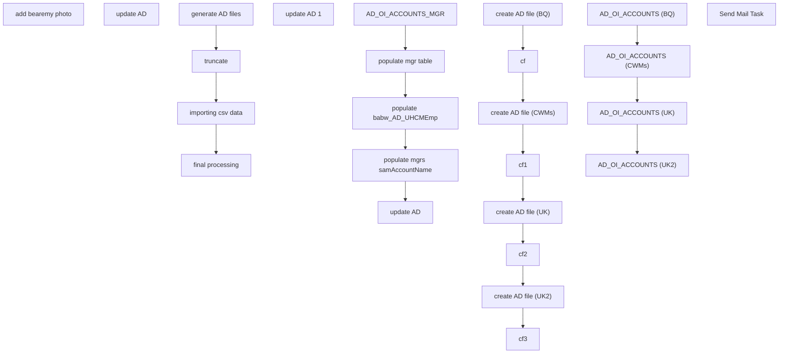

# SSIS Package: Package

**Project:** HR_adPhotos  
**Folder:** HR  
**Server:** STL-SSIS-P-01  

## Connection Managers

| Name | Type | Server | Catalog | Connection (sanitized) |
|---|---|---|---|---|
| Auditworks | OLEDB | bedrocktestdb01 | auditworks | Data Source=bedrocktestdb01; Initial Catalog=auditworks; Provider=SQLNCLI11.1; Integrated Security=SSPI; Auto Translate=False |
| Azure Service Bus | Azure Service Bus (KingswaySoft) |  |  |  |
| CRM | OLEDB | crmtestdb02 | crm | Data Source=crmtestdb02; Initial Catalog=crm; Provider=SQLNCLI11.1; Integrated Security=SSPI; Auto Translate=False |
| DW | OLEDB | papamart | dw | Data Source=papamart; Initial Catalog=dw; Provider=SQLNCLI11.1; Integrated Security=SSPI; Auto Translate=False |
| DWStaging | OLEDB | papamarttest | DWStaging | Data Source=papamarttest; Initial Catalog=DWStaging; Provider=SQLNCLI11.1; Integrated Security=SSPI; Auto Translate=False |
| HTTP Connection Manager | HTTP (KingswaySoft) |  |  |  |
| IntegrationStaging | OLEDB | STL-SSIS-P-01 | IntegrationStaging | Data Source=STL-SSIS-P-01; Initial Catalog=IntegrationStaging; Provider=SQLNCLI11.1; Integrated Security=SSPI; Auto Translate=False |
| ME_01 | OLEDB | bedrocktestdb02 | me_01 | Data Source=bedrocktestdb02; Initial Catalog=me_01; Provider=SQLNCLI11.1; Integrated Security=SSPI; Auto Translate=False |
| SMTP | SMTP |  |  |  |
| ad_oi_accounts | FLATFILE |  |  |  |
| ad_oi_accts_cwm | FLATFILE |  |  |  |
| uk ad | FLATFILE |  |  |  |
| uk ad 2 | FLATFILE |  |  |  |

## Control Flow Tasks

| Task | Type |
|---|---|
| Package | Package |
| add bearemy photo | SEQUENCE |
| update AD | ExecuteProcess |
| final processing | SEQUENCE |
| AD_OI_ACCOUNTS_MGR | Pipeline |
| populate babw_AD_UHCMEmp | Pipeline |
| populate mgr table | ExecuteSQLTask |
| populate mgrs samAccountName | ExecuteSQLTask |
| update AD | ExecuteProcess |
| update AD 1 | ExecuteProcess |
| generate AD files | SEQUENCE |
| cf | ExecuteSQLTask |
| cf1 | ExecuteSQLTask |
| cf2 | ExecuteSQLTask |
| cf3 | ExecuteSQLTask |
| create AD file (BQ) | ExecuteSQLTask |
| create AD file (CWMs) | ExecuteSQLTask |
| create AD file (UK) | ExecuteSQLTask |
| create AD file (UK2) | ExecuteSQLTask |
| importing csv data | SEQUENCE |
| AD_OI_ACCOUNTS (BQ) | Pipeline |
| AD_OI_ACCOUNTS (CWMs) | Pipeline |
| AD_OI_ACCOUNTS (UK) | Pipeline |
| AD_OI_ACCOUNTS (UK2) | Pipeline |
| truncate | ExecuteSQLTask |
| Send Mail Task | SendMailTask |

## Control Flow Outline

```text
- Send Mail Task [SendMailTask]
- add bearemy photo [SEQUENCE]
  - update AD [ExecuteProcess]
- final processing [SEQUENCE]
  - AD_OI_ACCOUNTS_MGR [Pipeline]
  - populate babw_AD_UHCMEmp [Pipeline]
  - populate mgr table [ExecuteSQLTask]
  - populate mgrs samAccountName [ExecuteSQLTask]
  - update AD [ExecuteProcess]
  - update AD 1 [ExecuteProcess]
- generate AD files [SEQUENCE]
  - cf [ExecuteSQLTask]
  - cf1 [ExecuteSQLTask]
  - cf2 [ExecuteSQLTask]
  - cf3 [ExecuteSQLTask]
  - create AD file (BQ) [ExecuteSQLTask]
  - create AD file (CWMs) [ExecuteSQLTask]
  - create AD file (UK) [ExecuteSQLTask]
  - create AD file (UK2) [ExecuteSQLTask]
- importing csv data [SEQUENCE]
  - AD_OI_ACCOUNTS (BQ) [Pipeline]
  - AD_OI_ACCOUNTS (CWMs) [Pipeline]
  - AD_OI_ACCOUNTS (UK) [Pipeline]
  - AD_OI_ACCOUNTS (UK2) [Pipeline]
- truncate [ExecuteSQLTask]
```

## Architecture Diagram



## Variables

| Namespace | Name | Expression-bound |
|---|---|---|
| System | Propagate | No |
| User | DateTimeStamp | Yes |
| User | EndDate | Yes |
| User | EndDateAsDATE | Yes |
| User | GetDate | Yes |
| User | GetDateAsDATE | Yes |
| User | StartDate | Yes |
| User | StartDateAsDATE | Yes |

### Expression-bound variable values

#### User::DateTimeStamp

**Expression:**

```sql
(DT_WSTR,4)DATEPART("yyyy",GetDate()) 
+ (DT_WSTR,4)DATEPART("mm",GetDate()) 
+ (DT_WSTR,4)DATEPART("dd",GetDate()) 
+ (DT_WSTR,4)DATEPART("hh",GetDate()) 
+ (DT_WSTR,4)DATEPART("mi",GetDate()) 
+ (DT_WSTR,4)DATEPART("ss",GetDate()) 
+ (DT_WSTR,4)DATEPART("ms",GetDate())
```

**Evaluated value:**

```sql
202141995336600
```

#### User::EndDate

**Expression:**

```sql
dateadd("dd", @[$Package::DaysToInclude], @[User::StartDate])
```

**Evaluated value:**

```sql
4/19/2021
```

#### User::EndDateAsDATE

**Expression:**

```sql
(DT_WSTR, 4) datepart("year", @[User::EndDate])  + "-" + 
(DT_WSTR, 2) datepart("mm", @[User::EndDate])  + "-" + 
(DT_WSTR, 2) datepart("dd",  @[User::EndDate])
```

**Evaluated value:**

```sql
2021-4-19
```

#### User::GetDate

**Expression:**

```sql
(DT_DATE)DATEDIFF("Day", (DT_DATE) 0, GETDATE())
```

**Evaluated value:**

```sql
4/19/2021
```

#### User::GetDateAsDATE

**Expression:**

```sql
(DT_WSTR, 4) datepart("year", @[User::GetDate])  + "-" + 
(DT_WSTR, 2) datepart("mm", @[User::GetDate])  + "-" + 
(DT_WSTR, 2) datepart("dd",  @[User::GetDate])
```

**Evaluated value:**

```sql
2021-4-19
```

#### User::StartDate

**Expression:**

```sql
dateadd("dd", -@[$Package::DaysToGoBack] , @[User::GetDate] )
```

**Evaluated value:**

```sql
4/18/2021
```

#### User::StartDateAsDATE

**Expression:**

```sql
(DT_WSTR, 4) datepart("year", @[User::StartDate])  + "-" + 
(DT_WSTR, 2) datepart("mm", @[User::StartDate])  + "-" + 
(DT_WSTR, 2) datepart("dd",  @[User::StartDate])
```

**Evaluated value:**

```sql
2021-4-18
```

## Execute SQL Tasks

### populate mgr table

**Path:** `Package\final processing\populate mgr table`  
**Connection:** IntegrationStaging (STL-SSIS-P-01/IntegrationStaging)  

```sql
UPDATE aoa
SET  aoa.mgrsAMAccountName = aoam.sAMAccountName
FROM [HR].[babw_AD_OI_ACCOUNTS] aoa, [HR].[babw_AD_OI_ACCOUNTS_MGR] aoam
WHERE aoa.manager =  aoam.DN


```

### populate mgrs samAccountName

**Path:** `Package\final processing\populate mgrs samAccountName`  
**Connection:** IntegrationStaging (STL-SSIS-P-01/IntegrationStaging)  

```sql
UPDATE aBe 
SET [Supervisor samAccountName] = aBe2.samAccountName
FROM [HR].[babw_AD_UHCMEmp] aBe 
left outer join [HR].[babw_AD_UHCMEmp] aBe2 on aBe2.EepEEID = aBe.SupervisorID 

```

### cf

**Path:** `Package\generate AD files\cf`  
**Connection:** IntegrationStaging (STL-SSIS-P-01/IntegrationStaging)  

```sql
EXEC master..xp_cmdshell '\\stl-ssis-p-01\IntegrationStaging\wua\CSVfix1.bat'
```

### cf1

**Path:** `Package\generate AD files\cf1`  
**Connection:** IntegrationStaging (STL-SSIS-P-01/IntegrationStaging)  

```sql
EXEC master..xp_cmdshell '\\stl-ssis-p-01\IntegrationStaging\wua\CSVfix2b.bat'
```

### cf2

**Path:** `Package\generate AD files\cf2`  
**Connection:** IntegrationStaging (STL-SSIS-P-01/IntegrationStaging)  

```sql
EXEC master..xp_cmdshell '\\stl-ssis-p-01\IntegrationStaging\wua\CSVfix3.bat'
```

### cf3

**Path:** `Package\generate AD files\cf3`  
**Connection:** IntegrationStaging (STL-SSIS-P-01/IntegrationStaging)  

```sql
EXEC master..xp_cmdshell '\\stl-ssis-p-01\IntegrationStaging\wua\CSVfix4.bat'
```

### create AD file (BQ)

**Path:** `Package\generate AD files\create AD file (BQ)`  
**Connection:** IntegrationStaging (STL-SSIS-P-01/IntegrationStaging)  

```sql
EXEC master..xp_cmdshell 'del \\stl-ssis-p-01\IntegrationStaging\wua\AD_OI_Export_Raw.csv' EXEC master..xp_cmdshell 'csvde -f \\stl-ssis-p-01\IntegrationStaging\wua\AD_OI_Export_Raw.csv -v -d "OU=BQ,OU=BABW,dc=buildabear,dc=com" -r "(objectClass=User)" -p SubTree -l "DN,cn,sn,displayName,SamAccountName,mail,description,l,st,postalCode,telephoneNumber,company,streetAddress,manager,mobile,facsimileTelephoneNumber"'
```

### create AD file (CWMs)

**Path:** `Package\generate AD files\create AD file (CWMs)`  
**Connection:** IntegrationStaging (STL-SSIS-P-01/IntegrationStaging)  

```sql
EXEC master..xp_cmdshell 'del \\stl-ssis-p-01\IntegrationStaging\wua\AD_OI_Export2_Raw.csv' EXEC master..xp_cmdshell 'csvde -f \\stl-ssis-p-01\IntegrationStaging\wua\AD_OI_Export2_Raw.csv -v -d "OU=CWMs,OU=Stores,OU=BABW,DC=buildabear,DC=com" -r "(objectClass=User)" -p SubTree -l "DN,cn,sn,displayName,SamAccountName,mail,description,l,st,postalCode,telephoneNumber,company,streetAddress,manager,mobile,facsimileTelephoneNumber"'
```

### create AD file (UK)

**Path:** `Package\generate AD files\create AD file (UK)`  
**Connection:** IntegrationStaging (STL-SSIS-P-01/IntegrationStaging)  

```sql
EXEC master..xp_cmdshell 'del \\stl-ssis-p-01\IntegrationStaging\wua\AD_OI_Export_UK_Raw.csv'


EXEC master..xp_cmdshell 'csvde -f \\stl-ssis-p-01\IntegrationStaging\wua\AD_OI_Export_UK_Raw.csv -v -d "OU=HomeOffice,OU=BABWUK,dc=buildabear,dc=com" -r "(objectClass=User)" -p SubTree -l "DN,cn,sn,displayName,SamAccountName,mail,description,l,st,postalCode,telephoneNumber,company,streetAddress,manager,mobile,facsimileTelephoneNumber"'


```

### create AD file (UK2)

**Path:** `Package\generate AD files\create AD file (UK2)`  
**Connection:** IntegrationStaging (STL-SSIS-P-01/IntegrationStaging)  

```sql
EXEC master..xp_cmdshell 'del \\stl-ssis-p-01\IntegrationStaging\wua\AD_OI_Export_UK2_Raw.csv'


EXEC master..xp_cmdshell 'csvde -f \\stl-ssis-p-01\IntegrationStaging\wua\AD_OI_Export_UK2_Raw.csv -v -d "OU=CWM,OU=Stores,OU=BABWUK,dc=buildabear,dc=com" -r "(objectClass=User)" -p SubTree -l "DN,cn,sn,displayName,SamAccountName,mail,description,l,st,postalCode,telephoneNumber,company,streetAddress,manager,mobile,facsimileTelephoneNumber"'


```

### truncate

**Path:** `Package\truncate`  
**Connection:** IntegrationStaging (STL-SSIS-P-01/IntegrationStaging)  

```sql
truncate table [IntegrationStaging].[HR].[babw_AD_OI_ACCOUNTS_MGR] 
 truncate table [IntegrationStaging].[HR].[babw_AD_OI_ACCOUNTS] 
 truncate TABLE [IntegrationStaging].[HR].[babw_AD_UHCMEmp]

	


```

## Data Flow: Sources

| Component | Source Object | Type | Data Flow Task | Connection | SQL Kind |
|---|---|---|---|---|---|
| OLE DB Source |  | OLEDBSource | AD_OI_ACCOUNTS_MGR | IntegrationStaging |  |
| OLE DB Source |  | OLEDBSource | populate babw_AD_UHCMEmp | DW | SqlCommand |
| Flat File Source |  | FlatFileSource | AD_OI_ACCOUNTS (BQ) | ad_oi_accounts |  |
| Flat File Source |  | FlatFileSource | AD_OI_ACCOUNTS (CWMs) | ad_oi_accts_cwm |  |
| Flat File Source |  | FlatFileSource | AD_OI_ACCOUNTS (UK) | uk ad |  |
| Flat File Source |  | FlatFileSource | AD_OI_ACCOUNTS (UK2) | uk ad 2 |  |

#### OLE DB Source — SqlCommand

```sql
select [EepNameFirst],[EepNameMiddle],[EepNameLast],[EepEEID], [EepAddressEMail],
samAccountName = CASE WHEN (len([EepAddressEMail]) < 2) THEN '' ELSE left([EepAddressEMail], charindex('@', EepAddressEMail) - 1) END,
WorkPhoneNumber, efoPhoneExtension,LocDesc,
 [JbcJobCode],[JbcLongDesc],[SupervisorPosition],[SupervisorID],[SupervisorName]  
from UHCMEmp where EecEmplStatus <> 'Terminated' and EecOrgLvl1Code in ('BQ','BRHS')  or [JbcJobCode] = 'CWM'
```

## Data Flow: Destinations

| Component | Target Table | Type | Data Flow Task | Connection | SQL Kind |
|---|---|---|---|---|---|
| OLE DB Destination |  | OLEDBDestination | AD_OI_ACCOUNTS_MGR | IntegrationStaging |  |
| OLE DB Destination |  | OLEDBDestination | populate babw_AD_UHCMEmp | IntegrationStaging |  |
| OLE DB Destination |  | OLEDBDestination | AD_OI_ACCOUNTS (BQ) | IntegrationStaging |  |
| OLE DB Destination |  | OLEDBDestination | AD_OI_ACCOUNTS (CWMs) | IntegrationStaging |  |
| OLE DB Destination |  | OLEDBDestination | AD_OI_ACCOUNTS (UK) | IntegrationStaging |  |
| OLE DB Destination |  | OLEDBDestination | AD_OI_ACCOUNTS (UK2) | IntegrationStaging |  |
