# SSIS Package: HR_expiryClear

**Project:** HR_expiryClear  
**Folder:** HR  
**Server:** STL-SSIS-P-01  

## Architecture Diagram

```mermaid
flowchart TD
    subgraph Connections
        Active_Directory_Connection_Manager_conn(["Active Directory Connection Manager [ActiveDirectory]"])
        AdImportCsv_conn(["AdImportCsv [FLATFILE]"])
        Coredb01_conn(["Coredb01 [OLEDB]"])
        DW_conn(["DW [OLEDB]"])
        DW2_conn(["DW2 [OLEDB]"])
        DWStaging_conn(["DWStaging [OLEDB]"])
        Excel_Connection_Manager_conn(["Excel Connection Manager [EXCEL]"])
        IntegrationStaging_conn(["IntegrationStaging [OLEDB]"])
        Ldap1_buildabear_com_conn(["Ldap1.buildabear.com [OLEDB]"])
        Ldap1_buildabear_com_1_conn(["Ldap1.buildabear.com 1 [ADO.NET:System.Data.OleDb.OleDbConnection, System.Data, Version=4.0.0.0, Culture=neutral, PublicKeyToken=b77a5c561934e089]"])
        SMTP_conn(["SMTP [SMTP]"])
        stl_dc_p_01_buildabear_com_conn(["stl-dc-p-01.buildabear.com [ADO.NET:System.Data.OleDb.OleDbConnection, System.Data, Version=4.0.0.0, Culture=neutral, PublicKeyToken=b77a5c561934e089]"])
        UltiProImportEmailCSV_conn(["UltiProImportEmailCSV [FLATFILE]"])
        UltiProImportSamAccountCSV_conn(["UltiProImportSamAccountCSV [FLATFILE]"])
    end
    subgraph ControlFlow
        HR_expiryClear_task["HR_expiryClear"]
        clear_expiration___TEST___task["clear expiration **TEST**"]
        HR_expiryClear_task --> clear_expiration___TEST___task
        create_rehireString_task["create rehireString"]
        clear_expiration___TEST___task --> create_rehireString_task
        Foreach_Loop_Container_task["Foreach Loop Container"]
        create_rehireString_task --> Foreach_Loop_Container_task
        clear_expiry_task["clear expiry"]
        Foreach_Loop_Container_task --> clear_expiry_task
        Send_Mail_Task_task["Send Mail Task"]
        clear_expiry_task --> Send_Mail_Task_task
        stage_rehire_samaccountnames_to_variable_task["stage rehire samaccountnames to variable"]
        Send_Mail_Task_task --> stage_rehire_samaccountnames_to_variable_task
        clear_expiration_date_for_rehires_task["clear expiration date for rehires"]
        stage_rehire_samaccountnames_to_variable_task --> clear_expiration_date_for_rehires_task
        create_rehireString_task["create rehireString"]
        clear_expiration_date_for_rehires_task --> create_rehireString_task
        Foreach_Loop_Container_task["Foreach Loop Container"]
        create_rehireString_task --> Foreach_Loop_Container_task
        clear_expiry_task["clear expiry"]
        Foreach_Loop_Container_task --> clear_expiry_task
        merge_ADattributesMerged_task["merge ADattributesMerged"]
        clear_expiry_task --> merge_ADattributesMerged_task
        populate_ADattributes_task["populate ADattributes"]
        merge_ADattributesMerged_task --> populate_ADattributes_task
        populate_ADattributes_Group_task["populate ADattributes_Group"]
        populate_ADattributes_task --> populate_ADattributes_Group_task
        Send_Mail_Task_task["Send Mail Task"]
        populate_ADattributes_Group_task --> Send_Mail_Task_task
        stage_rehire_samaccountnames_to_variable_task["stage rehire samaccountnames to variable"]
        Send_Mail_Task_task --> stage_rehire_samaccountnames_to_variable_task
        truncate_ADattributes_task["truncate ADattributes"]
        stage_rehire_samaccountnames_to_variable_task --> truncate_ADattributes_task
        update_EmployeeADGroup_task["update EmployeeADGroup"]
        truncate_ADattributes_task --> update_EmployeeADGroup_task
        clear_expiration_date_for_rehires_1_task["clear expiration date for rehires 1"]
        update_EmployeeADGroup_task --> clear_expiration_date_for_rehires_1_task
        merge_ADattributesMerged_task["merge ADattributesMerged"]
        clear_expiration_date_for_rehires_1_task --> merge_ADattributesMerged_task
        populate_ADattributes_task["populate ADattributes"]
        merge_ADattributesMerged_task --> populate_ADattributes_task
        populate_ADattributes_Group_task["populate ADattributes_Group"]
        populate_ADattributes_task --> populate_ADattributes_Group_task
        truncate_ADattributes_task["truncate ADattributes"]
        populate_ADattributes_Group_task --> truncate_ADattributes_task
        update_EmployeeADGroup_task["update EmployeeADGroup"]
        truncate_ADattributes_task --> update_EmployeeADGroup_task
        populate_ADattributes_task["populate ADattributes"]
        update_EmployeeADGroup_task --> populate_ADattributes_task
        update_CWM_full_name__powershell__task["update CWM full name (powershell)"]
        populate_ADattributes_task --> update_CWM_full_name__powershell__task
        Foreach_Loop_Container_task["Foreach Loop Container"]
        update_CWM_full_name__powershell__task --> Foreach_Loop_Container_task
        Send_Mail_Task_task["Send Mail Task"]
        Foreach_Loop_Container_task --> Send_Mail_Task_task
        update_fullname_task["update fullname"]
        Send_Mail_Task_task --> update_fullname_task
        stage_chiefs_to_variable_task["stage chiefs to variable"]
        update_fullname_task --> stage_chiefs_to_variable_task
        Send_Mail_Task_task["Send Mail Task"]
        stage_chiefs_to_variable_task --> Send_Mail_Task_task
    end
```

## Connection Managers

| Name | Type |
|---|---|
| Active Directory Connection Manager | ActiveDirectory |
| AdImportCsv | FLATFILE |
| Coredb01 | OLEDB |
| DW | OLEDB |
| DW2 | OLEDB |
| DWStaging | OLEDB |
| Excel Connection Manager | EXCEL |
| IntegrationStaging | OLEDB |
| Ldap1.buildabear.com | OLEDB |
| Ldap1.buildabear.com 1 | ADO.NET:System.Data.OleDb.OleDbConnection, System.Data, Version=4.0.0.0, Culture=neutral, PublicKeyToken=b77a5c561934e089 |
| SMTP | SMTP |
| stl-dc-p-01.buildabear.com | ADO.NET:System.Data.OleDb.OleDbConnection, System.Data, Version=4.0.0.0, Culture=neutral, PublicKeyToken=b77a5c561934e089 |
| UltiProImportEmailCSV | FLATFILE |
| UltiProImportSamAccountCSV | FLATFILE |

## Control Flow Tasks

| Task | Type |
|---|---|
| HR_expiryClear | Microsoft.Package |
| clear expiration **TEST** | STOCK:SEQUENCE |
| create rehireString | Microsoft.ExecuteSQLTask |
| Foreach Loop Container | STOCK:FOREACHLOOP |
| clear expiry | Microsoft.ExecuteProcess |
| Send Mail Task | Microsoft.SendMailTask |
| stage rehire samaccountnames to variable | Microsoft.ExecuteSQLTask |
| clear expiration date for rehires | STOCK:SEQUENCE |
| create rehireString | Microsoft.ExecuteSQLTask |
| Foreach Loop Container | STOCK:FOREACHLOOP |
| clear expiry | Microsoft.ExecuteProcess |
| merge ADattributesMerged | Microsoft.ExecuteSQLTask |
| populate ADattributes | Microsoft.Pipeline |
| populate ADattributes_Group | Microsoft.Pipeline |
| Send Mail Task | Microsoft.SendMailTask |
| stage rehire samaccountnames to variable | Microsoft.ExecuteSQLTask |
| truncate ADattributes | Microsoft.ExecuteSQLTask |
| update EmployeeADGroup | Microsoft.ExecuteSQLTask |
| clear expiration date for rehires 1 | STOCK:SEQUENCE |
| merge ADattributesMerged | Microsoft.ExecuteSQLTask |
| populate ADattributes | Microsoft.Pipeline |
| populate ADattributes_Group | Microsoft.Pipeline |
| truncate ADattributes | Microsoft.ExecuteSQLTask |
| update EmployeeADGroup | Microsoft.ExecuteSQLTask |
| populate ADattributes | Microsoft.Pipeline |
| update CWM full name (powershell) | STOCK:SEQUENCE |
| Foreach Loop Container | STOCK:FOREACHLOOP |
| Send Mail Task | Microsoft.SendMailTask |
| update fullname | Microsoft.ExecuteProcess |
| stage chiefs to variable | Microsoft.ExecuteSQLTask |
| Send Mail Task | Microsoft.SendMailTask |

## Data Flow: Sources

_None detected._

## Data Flow: Destinations

| Component | Destination |
|---|---|
|  | [dbo].[ADattributes] |
|  | [dbo].[ADattributesGroup] |
|  | [dbo].[ADattributes] |
|  | [dbo].[ADattributesGroup] |
|  | [dbo].[ADattributes] |

