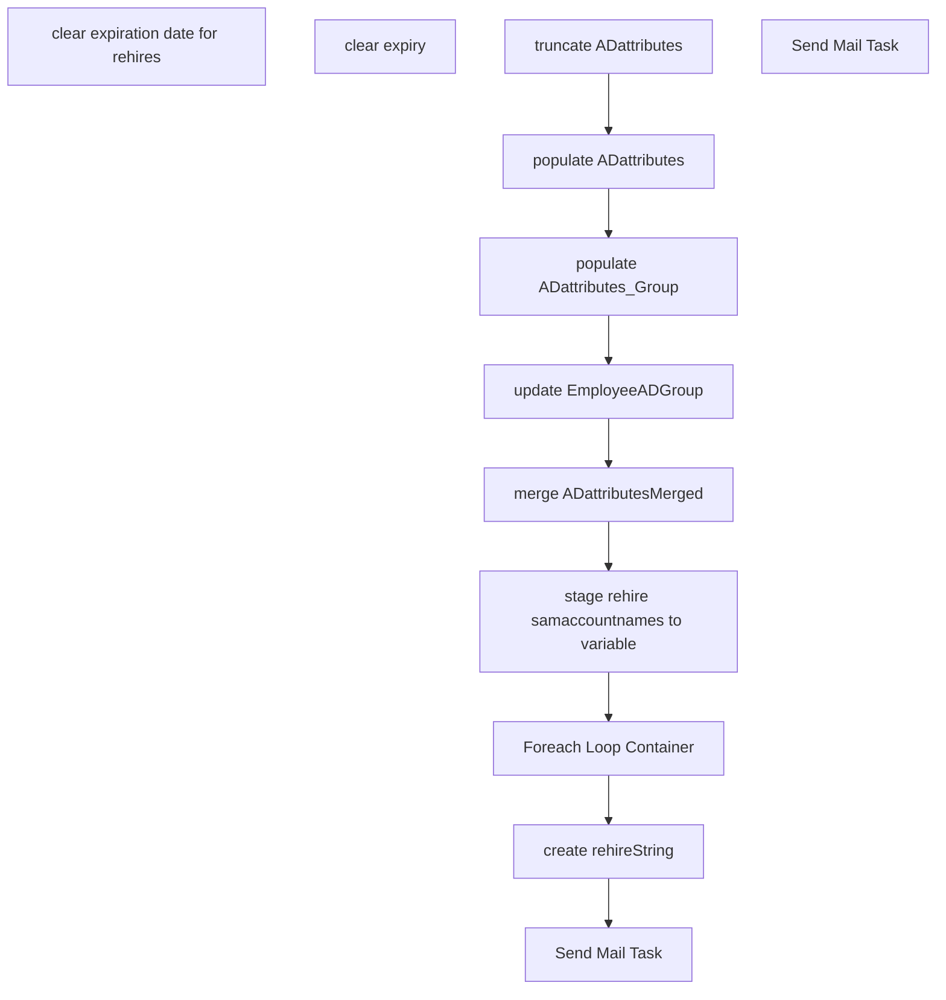

# SSIS Package: HR_expiryClear_test

**Project:** HR_expiryClear_test  
**Folder:** HR  
**Server:** STL-SSIS-P-01  

## Connection Managers

| Name | Type | Server | Catalog | Connection (sanitized) |
|---|---|---|---|---|
| Active Directory Connection Manager | ActiveDirectory |  |  |  |
| AdImportCsv | FLATFILE |  |  |  |
| Coredb01 | OLEDB | Coredb01 | AIMSConfig | Data Source=Coredb01; Initial Catalog=AIMSConfig; Provider=SQLNCLI11.1; Integrated Security=SSPI; Auto Translate=False |
| DW | OLEDB | papamart | dw | Data Source=papamart; Initial Catalog=dw; Provider=SQLNCLI11.1; Integrated Security=SSPI; Auto Translate=False |
| DW2 | OLEDB | papamart | dw | Data Source=papamart; Initial Catalog=dw; Provider=SQLOLEDB.1; Integrated Security=SSPI; Application Name=SSIS-HR_ActiveDirectoryDataExtract-{B97A23FE-8436-4458-9D4C-425532AC790C}papamart.dw2; Auto Translate=False |
| DWStaging | OLEDB | papamart | DWStaging | Data Source=papamart; Initial Catalog=DWStaging; Provider=SQLNCLI11.1; Integrated Security=SSPI; Auto Translate=False |
| Excel Connection Manager | EXCEL | \\stl-bidev-d-05\c$\TFS\IntegrationService\2016\HR_expiryClear\user_groups.xlsx |  | Provider=Microsoft.ACE.OLEDB.12.0; Data Source=\\stl-bidev-d-05\c$\TFS\IntegrationService\2016\HR_expiryClear\user_groups.xlsx; Extended Properties="EXCEL 12.0 XML; HDR=YES" |
| IntegrationStaging | OLEDB | STL-SSIS-P-01 | IntegrationStaging | Data Source=STL-SSIS-P-01; Initial Catalog=IntegrationStaging; Provider=SQLNCLI11.1; Integrated Security=SSPI; Auto Translate=False |
| Ldap1.buildabear.com | OLEDB | Ldap1.buildabear.com |  | Data Source=Ldap1.buildabear.com; Provider=ADsDSOObject; Integrated Security=SSPI |
| Ldap1.buildabear.com 1 | ADO.NET:System.Data.OleDb.OleDbConnection, System.Data, Version=4.0.0.0, Culture=neutral, PublicKeyToken=b77a5c561934e089 | Ldap1.buildabear.com |  | Data Source=Ldap1.buildabear.com; Provider=ADsDSOObject; Integrated Security=SSPI |
| SMTP | SMTP |  |  |  |
| UltiProImportEmailCSV | FLATFILE |  |  |  |
| UltiProImportSamAccountCSV | FLATFILE |  |  |  |
| stl-dc-p-01.buildabear.com | ADO.NET:System.Data.OleDb.OleDbConnection, System.Data, Version=4.0.0.0, Culture=neutral, PublicKeyToken=b77a5c561934e089 | stl-dc-p-01.buildabear.com |  | Data Source=stl-dc-p-01.buildabear.com; Provider=ADsDSOObject; Integrated Security=SSPI |

## Control Flow Tasks

| Task | Type |
|---|---|
| HR_expiryClear_test | Package |
| clear expiration date for rehires | SEQUENCE |
| create rehireString | ExecuteSQLTask |
| Foreach Loop Container | FOREACHLOOP |
| clear expiry | ExecuteProcess |
| merge ADattributesMerged | ExecuteSQLTask |
| populate ADattributes | Pipeline |
| populate ADattributes_Group | Pipeline |
| Send Mail Task | SendMailTask |
| stage rehire samaccountnames to variable | ExecuteSQLTask |
| truncate ADattributes | ExecuteSQLTask |
| update EmployeeADGroup | ExecuteSQLTask |
| Send Mail Task | SendMailTask |

## Control Flow Outline

```text
- Send Mail Task [SendMailTask]
- clear expiration date for rehires [SEQUENCE]
  - Foreach Loop Container [FOREACHLOOP]
    - clear expiry [ExecuteProcess]
  - Send Mail Task [SendMailTask]
  - create rehireString [ExecuteSQLTask]
  - merge ADattributesMerged [ExecuteSQLTask]
  - populate ADattributes [Pipeline]
  - populate ADattributes_Group [Pipeline]
  - stage rehire samaccountnames to variable [ExecuteSQLTask]
  - truncate ADattributes [ExecuteSQLTask]
  - update EmployeeADGroup [ExecuteSQLTask]
```

## Architecture Diagram



## Variables

| Namespace | Name | Expression-bound |
|---|---|---|
| System | Propagate | No |
| User | ADExtract | No |
| User | ADFileNameLocation | No |
| User | AdArchiveFileReName | Yes |
| User | AdFilePath | No |
| User | AdFilePathTest | No |
| User | AdRowsToSendCount | No |
| User | AdRowsToSendCount2 | No |
| User | CountUltiProCSVRows | No |
| User | Count_UltiProImportEmailRows | No |
| User | Count_UltiProImportSamAccountNameRows | No |
| User | DateTimeStamp | Yes |
| User | EmployeeIDStage | No |
| User | EndDate | Yes |
| User | EndDateAsDATE | Yes |
| User | GetDate | Yes |
| User | GetDateAsDATE | Yes |
| User | LDAP | No |
| User | SQL_memberOf_query | Yes |
| User | StartDate | Yes |
| User | StartDateAsDATE | Yes |
| User | UltiProClearExpiryScriptPath | No |
| User | UltiProImportArchive | Yes |
| User | UltiProImportEmailCSVConnectionString | Yes |
| User | UltiProImportEmailCSVFileName | Yes |
| User | UltiProImportFilePreStagePath | Yes |
| User | UltiProImportFiles | No |
| User | UltiProImportSamAccountCSVConnectionString | Yes |
| User | UltiProImportSamAccountCSVFileName | Yes |
| User | ad_EmployeeID | No |
| User | ad_cn | No |
| User | ad_company | No |
| User | ad_department | No |
| User | ad_description | No |
| User | ad_displayName | No |
| User | ad_givenname | No |
| User | ad_mail | No |
| User | ad_manager | No |
| User | ad_memberOf | No |
| User | ad_samaccountName | No |
| User | ad_sn | No |
| User | ad_title | No |
| User | chiefID | No |
| User | rehireObject | No |
| User | rehireString | No |
| User | varArg | No |
| User | varCWMidentity | No |
| User | varCWMnewName | No |
| User | varEmpId | No |
| User | varIdentity | No |
| User | varSamaccountname | No |
| User | varScriptString | Yes |
| User | varScriptString2 | Yes |

### Expression-bound variable values

#### User::AdArchiveFileReName

**Expression:**

```sql
"\\\\stl-ssis-p-01\\IntegrationStaging\\HR\\UHCM\\Archive\\ADImport" +  @[User::DateTimeStamp] +".csv"
```

**Evaluated value:**

```sql
\\stl-ssis-p-01\IntegrationStaging\HR\UHCM\Archive\ADImport2023124152849537.csv
```

#### User::DateTimeStamp

**Expression:**

```sql
(DT_WSTR,4)DATEPART("yyyy",GetDate()) 
+ (DT_WSTR,4)DATEPART("mm",GetDate()) 
+ (DT_WSTR,4)DATEPART("dd",GetDate()) 
+ (DT_WSTR,4)DATEPART("hh",GetDate()) 
+ (DT_WSTR,4)DATEPART("mi",GetDate()) 
+ (DT_WSTR,4)DATEPART("ss",GetDate()) 
+ (DT_WSTR,4)DATEPART("ms",GetDate())
```

**Evaluated value:**

```sql
2023124152849540
```

#### User::EndDate

**Expression:**

```sql
dateadd("dd", @[$Package::DaysToInclude], @[User::StartDate])
```

**Evaluated value:**

```sql
12/4/2023
```

#### User::EndDateAsDATE

**Expression:**

```sql
(DT_WSTR, 4) datepart("year", @[User::EndDate])  + "-" + 
(DT_WSTR, 2) datepart("mm", @[User::EndDate])  + "-" + 
(DT_WSTR, 2) datepart("dd",  @[User::EndDate])
```

**Evaluated value:**

```sql
2023-12-4
```

#### User::GetDate

**Expression:**

```sql
(DT_DATE)DATEDIFF("Day", (DT_DATE) 0, GETDATE())
```

**Evaluated value:**

```sql
12/4/2023
```

#### User::GetDateAsDATE

**Expression:**

```sql
(DT_WSTR, 4) datepart("year", @[User::GetDate])  + "-" + 
(DT_WSTR, 2) datepart("mm", @[User::GetDate])  + "-" + 
(DT_WSTR, 2) datepart("dd",  @[User::GetDate])
```

**Evaluated value:**

```sql
2023-12-4
```

#### User::SQL_memberOf_query

**Expression:**

```sql
"
SELECT cast('" + @[User::ad_EmployeeID] + "' as nvarchar(7))  as EmployeeID, cast(replace(ADsPath, 'LDAP://', '') as nvarchar(4000)) as memberOf 
FROM OPENQUERY
	(
		ADSI, 
            'SELECT * FROM ''LDAP://DC=buildabear,DC=com'' 
             WHERE employeeID = ''" + @[User::ad_EmployeeID] + "'''
	)  
"
```

**Evaluated value:**

```sql

SELECT cast('' as nvarchar(7))  as EmployeeID, cast(replace(ADsPath, 'LDAP://', '') as nvarchar(4000)) as memberOf 
FROM OPENQUERY
	(
		ADSI, 
            'SELECT * FROM ''LDAP://DC=buildabear,DC=com'' 
             WHERE employeeID = '''''
	)  

```

#### User::StartDate

**Expression:**

```sql
dateadd("dd", -@[$Package::DaysToGoBack] , @[User::GetDate] )
```

**Evaluated value:**

```sql
12/3/2023
```

#### User::StartDateAsDATE

**Expression:**

```sql
(DT_WSTR, 4) datepart("year", @[User::StartDate])  + "-" + 
(DT_WSTR, 2) datepart("mm", @[User::StartDate])  + "-" + 
(DT_WSTR, 2) datepart("dd",  @[User::StartDate])
```

**Evaluated value:**

```sql
2023-12-3
```

#### User::UltiProImportArchive

**Expression:**

```sql
@[User::UltiProImportFilePreStagePath] + "Archive\\"
```

**Evaluated value:**

```sql
\\stl-ssis-p-01\IntegrationStaging\HR\UltiProImport\Archive\
```

#### User::UltiProImportEmailCSVConnectionString

**Expression:**

```sql
@[$Package::UltiProFileStagePath_SamAccountEmail] +  @[User::UltiProImportEmailCSVFileName]
```

**Evaluated value:**

```sql
\\STL-SSIs-p-01\integrationStaging\HR\UltiProImport\UPEmail2023124152849540.csv
```

#### User::UltiProImportEmailCSVFileName

**Expression:**

```sql
"UPEmail" +  @[User::DateTimeStamp] + ".csv"
```

**Evaluated value:**

```sql
UPEmail2023124152849540.csv
```

#### User::UltiProImportFilePreStagePath

**Expression:**

```sql
"\\\\stl-ssis-p-01\\IntegrationStaging\\HR\\UltiProImport\\"
```

**Evaluated value:**

```sql
\\stl-ssis-p-01\IntegrationStaging\HR\UltiProImport\
```

#### User::UltiProImportSamAccountCSVConnectionString

**Expression:**

```sql
@[$Package::UltiProFileStagePath_SamAccountEmail] +  @[User::UltiProImportSamAccountCSVFileName]
```

**Evaluated value:**

```sql
\\STL-SSIs-p-01\integrationStaging\HR\UltiProImport\UPSamAccount2023124152849540.csv
```

#### User::UltiProImportSamAccountCSVFileName

**Expression:**

```sql
"UPSamAccount" +  @[User::DateTimeStamp] + ".csv"
```

**Evaluated value:**

```sql
UPSamAccount2023124152849543.csv
```

#### User::varScriptString

**Expression:**

```sql
"-ExecutionPolicy Unrestricted -File \"" + @[User::UltiProClearExpiryScriptPath] + "\\clearADexp.ps1\" \"" + @[User::varArg] + "\" \"" + @[User::varIdentity] + "\""
```

**Evaluated value:**

```sql
-ExecutionPolicy Unrestricted -File "\\stl-ssis-p-01\IntegrationStaging\HR\UltiproADmoveRename\clearADexp.ps1" "-identity" ""
```

#### User::varScriptString2

**Expression:**

```sql
"-ExecutionPolicy Unrestricted -File \"" + @[User::UltiProClearExpiryScriptPath] + "\\renameCWM.ps1\" \"" + @[User::varCWMidentity] + "\" \"" + @[User::varCWMnewName] + "\""
```

**Evaluated value:**

```sql
-ExecutionPolicy Unrestricted -File "\\stl-ssis-p-01\IntegrationStaging\HR\UltiproADmoveRename\renameCWM.ps1" "" ""
```

## Execute SQL Tasks

### create rehireString

**Path:** `Package\clear expiration date for rehires\create rehireString`  
**Connection:** DW (papamart/dw)  

```sql
select 'test10'

--select top 1 cleared = stuff (
--(
--select ',' + isnull(UserLogonNamePreWindows2000, EmployeeID) from [coredb01].[AIMSConfig].[dbo].[DataLoaderStaging] 
--where (ProvisioningEvent = 'R' and convert(varchar, DateInserted, 101) > getdate() -1)
--or 
--(ProvisioningEvent = 'H' and EmployeeID in (select EmployeeID from[papamart].[DWStaging].[dbo].[ADattributes]) and (datediff(hh, UpdatedTimeStamp, getdate()) <= 2))
--FOR XML PATH('') 
--),1,1,''
--)from [coredb01].[AIMSConfig].[dbo].[DataLoaderStaging] 
```

### merge ADattributesMerged

**Path:** `Package\clear expiration date for rehires\merge ADattributesMerged`  
**Connection:** DWStaging (papamart/DWStaging)  

```sql
exec [dbo].[spMergeADattributes]
```

### stage rehire samaccountnames to variable

**Path:** `Package\clear expiration date for rehires\stage rehire samaccountnames to variable`  
**Connection:** DW (papamart/dw)  

```sql
select '0063119' as 'identity'

--select isnull(UserLogonNamePreWindows2000, EmployeeID) as 'identity'  from [coredb01].[AIMSConfig].[dbo].[DataLoaderStaging] 
--where (ProvisioningEvent = 'R' and convert(varchar, DateInserted, 101) > getdate() -1)
--or 
----(ProvisioningEvent = 'H' and EmployeeID in (select EmployeeID from[papamart].[DWStaging].[dbo].[ADattributes]) and (convert(varchar, DateInserted, 101) > getdate() -1))
--(ProvisioningEvent = 'H' and EmployeeID in (select EmployeeID from[papamart].[DWStaging].[dbo].[ADattributes]) and (datediff(hh, UpdatedTimeStamp, getdate()) <= 2))

```

### truncate ADattributes

**Path:** `Package\clear expiration date for rehires\truncate ADattributes`  
**Connection:** DWStaging (papamart/DWStaging)  

```sql
truncate table [dbo].[ADattributes]
truncate table [dbo].[ADattributesGroup]
```

### update EmployeeADGroup

**Path:** `Package\clear expiration date for rehires\update EmployeeADGroup`  
**Connection:** DWStaging (papamart/DWStaging)  

```sql
update [dbo].[ADattributes] set EmployeeADGroup = 
left(REPLACE(REPLACE(REPLACE(SUBSTRING(AdsPath, CHARINDEX(',', AdsPath) + 1, 500), ',', '|'), 'OU=', ''), 'DC=', ''),
charindex('|', REPLACE(REPLACE(REPLACE(SUBSTRING(AdsPath, CHARINDEX(',', AdsPath) + 1, 500), ',', '|'), 'OU=', ''), 'DC=', ''))-1)

```

## Data Flow: Sources

_None detected._

## Data Flow: Destinations

| Component | Target Table | Type | Data Flow Task | Connection | SQL Kind |
|---|---|---|---|---|---|
| OLE DB Destination |  | OLEDBDestination | populate ADattributes | DWStaging |  |
| OLE DB Destination |  | OLEDBDestination | populate ADattributes_Group | DWStaging |  |
