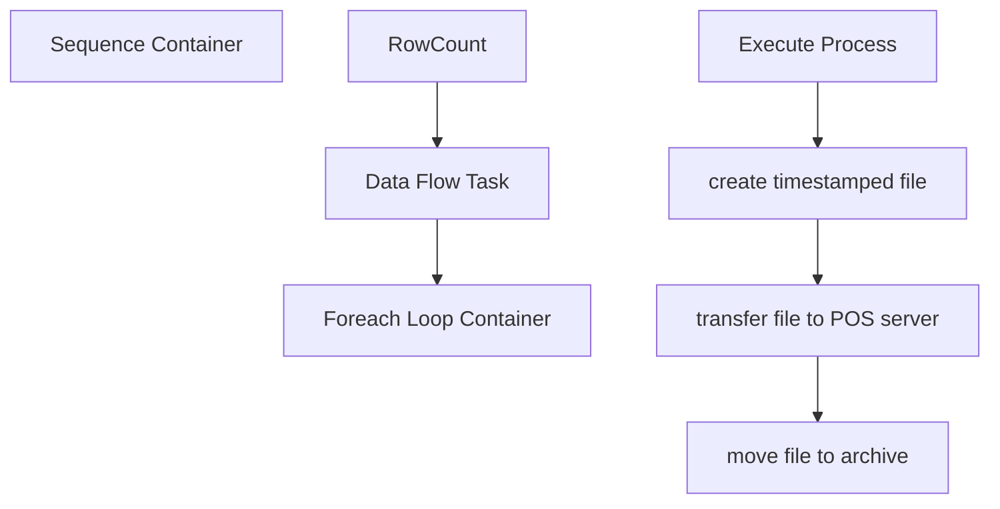

# SSIS Package: DCNterm

**Project:** HR_termDcn  
**Folder:** HR  
**Server:** STL-SSIS-P-01  

## Connection Managers

| Name | Type | Server | Catalog | Connection (sanitized) |
|---|---|---|---|---|
| DW | OLEDB | papamart | dw | Data Source=papamart; Initial Catalog=dw; Provider=SQLNCLI11.1; Integrated Security=SSPI; Auto Translate=False |
| Flat File Connection Manager | FLATFILE |  |  |  |
| dcnHeader.txt | FILE |  |  |  |

## Control Flow Tasks

| Task | Type |
|---|---|
| DCNterm | Package |
| Sequence Container | SEQUENCE |
| Data Flow Task | Pipeline |
| Foreach Loop Container | FOREACHLOOP |
| create timestamped file | FileSystemTask |
| Execute Process | ExecuteProcess |
| move file to archive | FileSystemTask |
| transfer file to POS server | FileSystemTask |
| RowCount | ExecuteSQLTask |

## Control Flow Outline

```text
- Sequence Container [SEQUENCE]
  - Data Flow Task [Pipeline]
  - Foreach Loop Container [FOREACHLOOP]
    - Execute Process [ExecuteProcess]
    - create timestamped file [FileSystemTask]
    - move file to archive [FileSystemTask]
    - transfer file to POS server [FileSystemTask]
  - RowCount [ExecuteSQLTask]
```

## Architecture Diagram



## Variables

| Namespace | Name | Expression-bound |
|---|---|---|
| User | RowCount | No |
| User | TermFile | No |
| User | varArchiveFolder | No |
| User | varDcnDatestampedFile | Yes |
| User | varDcnFile | No |
| User | varDcnFolder | No |
| User | varDcnPath | Yes |
| User | varExtension | No |
| User | varGenericFile | Yes |
| User | varPosServer | No |
| User | varPosServerFile | Yes |

### Expression-bound variable values

#### User::varDcnDatestampedFile

**Expression:**

```sql
@[User::varDcnFolder] + @[User::varDcnFile] + "_" +  "_"+ (DT_WSTR, 4) year(getdate()) +  RIGHT( "0" + (DT_WSTR, 2) MONTH(  GETDATE() ), 2) + RIGHT("0" +  (DT_WSTR, 2) DAY(  GETDATE() ), 2 ) + @[User::varExtension]
```

**Evaluated value:**

```sql
\\stl-dynsnc-p-01\d$\ssis\dcn\Ultipro_Emp_Delete__20190510.dcn
```

#### User::varDcnPath

**Expression:**

```sql
@[User::varDcnFolder] +  @[User::varDcnFile] +  @[User::varExtension]
```

**Evaluated value:**

```sql
\\stl-dynsnc-p-01\d$\ssis\dcn\Ultipro_Emp_Delete.dcn
```

#### User::varGenericFile

**Expression:**

```sql
@[User::varDcnFolder] +  "dcnHeaderEmp.txt"
```

**Evaluated value:**

```sql
\\stl-dynsnc-p-01\d$\ssis\dcn\dcnHeaderEmp.txt
```

#### User::varPosServerFile

**Expression:**

```sql
@[User::varPosServer] + @[User::varDcnFile] + "_" +  "_"+ (DT_WSTR, 4) year(getdate()) +  RIGHT( "0" + (DT_WSTR, 2) MONTH(  GETDATE() ), 2) + RIGHT("0" +  (DT_WSTR, 2) DAY(  GETDATE() ), 2 ) + @[User::varExtension]
```

**Evaluated value:**

```sql
\\deapp01\FilesForStores\Employee\Ultipro_Emp_Delete__20190510.dcn
```

## Execute SQL Tasks

### RowCount

**Path:** `Package\Sequence Container\RowCount`  
**Connection:** DW (papamart/dw)  

```sql

select count(*) as Rowz
from [dbo].[UHCMEmp] where EecOrgLvl1Code = 'STORE' and TerminatedEnteredDate > getdate()-1 and TerminatedEffectiveDate <= getdate() and EepCompanyCode = 'BABW'
and EepEEID <> '0009999'
```

## Data Flow: Sources

| Component | Source Object | Type | Data Flow Task | Connection | SQL Kind |
|---|---|---|---|---|---|
| OLE DB Source |  | OLEDBSource | Data Flow Task | DW | SqlCommand |

#### OLE DB Source — SqlCommand

```sql
use dw

select 'Employee' as 'Employee', CAST(CAST(EepEEID AS INTEGER) AS VARCHAR) as 'number' from [dbo].[UHCMEmp] where EecOrgLvl1Code = 'STORE' and TerminatedEnteredDate > getdate()-1 and TerminatedEffectiveDate <= getdate() and EepCompanyCode = 'BABW'
and EepEEID <> '0009999' order by EepEEID asc
```

## Data Flow: Destinations

| Component | Target Table | Type | Data Flow Task | Connection | SQL Kind |
|---|---|---|---|---|---|
| Flat File Destination |  | FlatFileDestination | Data Flow Task | Flat File Connection Manager |  |
