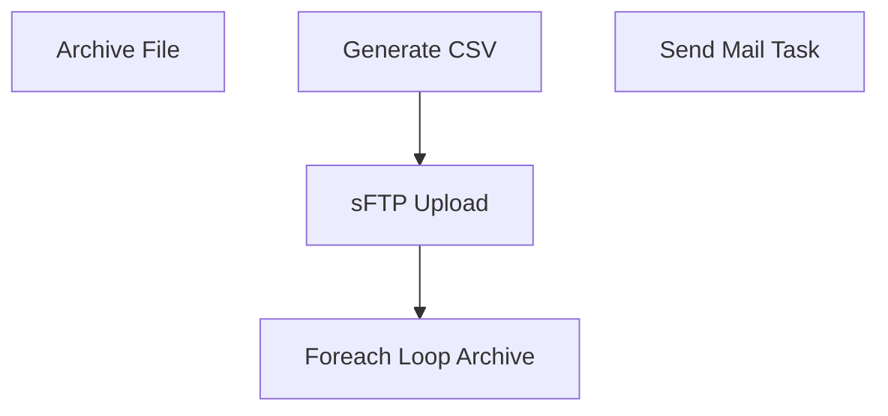

# SSIS Package: Package

**Project:** StoreForceLabor  
**Folder:** HR  
**Server:** STL-SSIS-P-01  

## Connection Managers

| Name | Type | Server | Catalog | Connection (sanitized) |
|---|---|---|---|---|
| Auditworks | OLEDB | bedrocktestdb01 | auditworks | Data Source=bedrocktestdb01; Initial Catalog=auditworks; Provider=SQLNCLI11.1; Integrated Security=SSPI; Auto Translate=False |
| CRM | OLEDB | crmtestdb02 | crm | Data Source=crmtestdb02; Initial Catalog=crm; Provider=SQLNCLI11.1; Integrated Security=SSPI; Auto Translate=False |
| DW | OLEDB | papamart | dw | Data Source=papamart; Initial Catalog=dw; Provider=SQLNCLI11.1; Integrated Security=SSPI; Auto Translate=False |
| DWStaging | OLEDB | papamart | DWStaging | Data Source=papamart; Initial Catalog=DWStaging; Provider=SQLNCLI11.1; Integrated Security=SSPI; Auto Translate=False |
| Excel Connection Manager | EXCEL | \\stl-ssis-p-01\IntegrationStaging\HR\PayPeriodDates.xlsx |  | Provider=Microsoft.ACE.OLEDB.12.0; Data Source=\\stl-ssis-p-01\IntegrationStaging\HR\PayPeriodDates.xlsx; Extended Properties="EXCEL 12.0 XML; HDR=YES" |
| Excel Connection Manager 1 | EXCEL | \\stl-ssis-p-01\IntegrationStaging\HR\PayPeriodDates.xlsx |  | Provider=Microsoft.ACE.OLEDB.12.0; Data Source=\\stl-ssis-p-01\IntegrationStaging\HR\PayPeriodDates.xlsx; Extended Properties="EXCEL 12.0 XML; HDR=YES" |
| Flat File Connection Manager | FLATFILE |  |  |  |
| IntegrationStaging | OLEDB | STL-SSIS-t-01 | IntegrationStaging | Data Source=STL-SSIS-t-01; Initial Catalog=IntegrationStaging; Provider=SQLNCLI11.1; Integrated Security=SSPI; Auto Translate=False |
| ME_01 | OLEDB | bedrocktestdb02 | me_01 | Data Source=bedrocktestdb02; Initial Catalog=me_01; Provider=SQLNCLI11.1; Integrated Security=SSPI; Auto Translate=False |
| SMTP | SMTP |  |  |  |

## Control Flow Tasks

| Task | Type |
|---|---|
| Package | Package |
| Foreach Loop Archive | FOREACHLOOP |
| Archive File | FileSystemTask |
| Generate CSV | Pipeline |
| sFTP Upload | ExecuteSQLTask |
| Send Mail Task | SendMailTask |

## Control Flow Outline

```text
- Send Mail Task [SendMailTask]
- Foreach Loop Archive [FOREACHLOOP]
  - Archive File [FileSystemTask]
- Generate CSV [Pipeline]
- sFTP Upload [ExecuteSQLTask]
```

## Architecture Diagram



## Variables

| Namespace | Name | Expression-bound |
|---|---|---|
| System | Propagate | No |
| User | CSVArchiveFileName | Yes |
| User | DateTimeStamp | Yes |
| User | EndDate | Yes |
| User | EndDateAsDATE | Yes |
| User | GetDate | Yes |
| User | GetDateAsDATE | Yes |
| User | StartDate | Yes |
| User | StartDateAsDATE | Yes |
| User | StoreForceCSVOutPut | No |
| User | ViewExpression | Yes |

### Expression-bound variable values

#### User::CSVArchiveFileName

**Expression:**

```sql
"\\\\stl-ssis-p-01\\IntegrationStaging\\HR\\StoreForceLabor"+ "\\Archive\\ReconciledPunches" + @[User::DateTimeStamp] + ".csv"
```

**Evaluated value:**

```sql
\\stl-ssis-p-01\IntegrationStaging\HR\StoreForceLabor\Archive\ReconciledPunches201972115013220.csv
```

#### User::DateTimeStamp

**Expression:**

```sql
(DT_WSTR,4)DATEPART("yyyy",GetDate()) 
+ (DT_WSTR,4)DATEPART("mm",GetDate()) 
+ (DT_WSTR,4)DATEPART("dd",GetDate()) 
+ (DT_WSTR,4)DATEPART("hh",GetDate()) 
+ (DT_WSTR,4)DATEPART("mi",GetDate()) 
+ (DT_WSTR,4)DATEPART("ss",GetDate()) 
+ (DT_WSTR,4)DATEPART("ms",GetDate())
```

**Evaluated value:**

```sql
201972115013220
```

#### User::EndDate

**Expression:**

```sql
dateadd("dd", @[$Package::DaysToInclude], @[User::StartDate])
```

**Evaluated value:**

```sql
6/19/2019
```

#### User::EndDateAsDATE

**Expression:**

```sql
(DT_WSTR, 4) datepart("year", @[User::EndDate])  + "-" + 
(DT_WSTR, 2) datepart("mm", @[User::EndDate])  + "-" + 
(DT_WSTR, 2) datepart("dd",  @[User::EndDate])
```

**Evaluated value:**

```sql
2019-6-19
```

#### User::GetDate

**Expression:**

```sql
(DT_DATE)DATEDIFF("Day", (DT_DATE) 0, GETDATE())
```

**Evaluated value:**

```sql
7/2/2019
```

#### User::GetDateAsDATE

**Expression:**

```sql
(DT_WSTR, 4) datepart("year", @[User::GetDate])  + "-" + 
(DT_WSTR, 2) datepart("mm", @[User::GetDate])  + "-" + 
(DT_WSTR, 2) datepart("dd",  @[User::GetDate])
```

**Evaluated value:**

```sql
2019-7-2
```

#### User::StartDate

**Expression:**

```sql
dateadd("dd", -@[$Package::DaysToGoBack] , @[User::GetDate] )
```

**Evaluated value:**

```sql
6/6/2019
```

#### User::StartDateAsDATE

**Expression:**

```sql
(DT_WSTR, 4) datepart("year", @[User::StartDate])  + "-" + 
(DT_WSTR, 2) datepart("mm", @[User::StartDate])  + "-" + 
(DT_WSTR, 2) datepart("dd",  @[User::StartDate])
```

**Evaluated value:**

```sql
2019-6-6
```

#### User::ViewExpression

**Expression:**

```sql
"select * from vwStoreForceLabor where WorkDate between "+ "'" + @[User::StartDateAsDATE] +"'"+ " and "  + "'" + @[User::EndDateAsDATE] + "'"
```

**Evaluated value:**

```sql
select * from vwStoreForceLabor where WorkDate between '2019-6-6' and '2019-6-19'
```

## Execute SQL Tasks

### sFTP Upload

**Path:** `Package\sFTP Upload`  
**Connection:** IntegrationStaging (STL-SSIS-t-01/IntegrationStaging)  

```sql
declare 
 @winSCP varchar(1000),
 @script varchar(1000),
 @log varchar(1000),
 @FTP varchar(4000),
 @Log_query varchar(1000),
 @Log_filename varchar(100),
 @Log_file_location varchar(100),
 @Log_bcp varchar(1000),
 @body varchar(4000)
select
 @winSCP = '"\\stl-ssis-p-01\C$\Program Files (x86)\WinSCP\WinSCP.exe"',
 @script = ' /script=\\stl-ssis-p-01\IntegrationStaging\HR\StoreForceLabor\FTP\sFTPuploadScript.txt',
 @log = ' /log=\\stl-ssis-p-01\IntegrationStaging\HR\StoreForceLabor\FTP\Upload.log',
 @FTP = (@winSCP + @script + @log)
   
   
exec master..xp_cmdshell @FTP
```

## Data Flow: Sources

| Component | Source Object | Type | Data Flow Task | Connection | SQL Kind |
|---|---|---|---|---|---|
| vwStoreForceLabor |  | OLEDBSource | Generate CSV | DW | SqlCommand |

#### vwStoreForceLabor — SqlCommand

```sql
With Dates
as
(
select Max(StartDate) as StartDate,
Max(EndDate) as EndDate
from PayPeriodDates
Where StartDate < GetDate() 
--and datediff(dd, StartDate, Getdate()) >= 14
and EndDate < GetDate()
)

select * 
from vwStoreForceLabor vw
Join Dates d
On vw.WorkDate between d.StartDate and d.EndDate
```

## Data Flow: Destinations

| Component | Target Table | Type | Data Flow Task | Connection | SQL Kind |
|---|---|---|---|---|---|
| ReconciledPunches |  | FlatFileDestination | Generate CSV | Flat File Connection Manager |  |
