# SSIS Package: concurETL

**Project:** concurETL  
**Folder:** HR  
**Server:** STL-SSIS-P-01  

## Connection Managers

| Name | Type | Server | Catalog | Connection (sanitized) |
|---|---|---|---|---|
| SMTP Connection Manager | SMTP |  |  |  |
| STL-SSIS-P-01.IntegrationStaging | OLEDB | STL-SSIS-P-01 | IntegrationStaging | Data Source=STL-SSIS-P-01; Initial Catalog=IntegrationStaging; Provider=SQLNCLI11.1; Integrated Security=SSPI; Auto Translate=False |
| sae.txt | FLATFILE |  |  |  |
| sae_sorted.txt | FLATFILE |  |  |  |

## Control Flow Tasks

| Task | Type |
|---|---|
| concurETL | Package |
| file prep | SEQUENCE |
| 5 second pause | FORLOOP |
| 5 second pause 1 | FORLOOP |
| rename pipe sae_sorted | FileSystemTask |
| retreive pipe | FileSystemTask |
| retreive and decrypt | SEQUENCE |
| 5 second pause | FORLOOP |
| delete prev sae | FileSystemTask |
| delete prev sae sorted | FileSystemTask |
| file decryption | SEQUENCE |
| ps1 | ExecuteProcess |
| FTP retrieve today's file | ExecuteSQLTask |
| Sequence Container | SEQUENCE |
| archive sae | FileSystemTask |
| delete prev sae | FileSystemTask |
| delete prev sae sorted | FileSystemTask |
| Foreach Loop Container | FOREACHLOOP |
| archive PGP file | FileSystemTask |
| transform data and produce file | SEQUENCE |
| archive sae_sorted | FileSystemTask |
| export file | Pipeline |
| import file | Pipeline |
| no file | SendMailTask |
| record count | ExecuteSQLTask |
| send file | SendMailTask |
| truncate AP_SAE | ExecuteSQLTask |
| Send Mail Task | SendMailTask |

## Control Flow Outline

```text
- Send Mail Task [SendMailTask]
- Sequence Container [SEQUENCE]
  - Foreach Loop Container [FOREACHLOOP]
    - archive PGP file [FileSystemTask]
  - archive sae [FileSystemTask]
  - delete prev sae [FileSystemTask]
  - delete prev sae sorted [FileSystemTask]
- file prep [SEQUENCE]
  - 5 second pause [FORLOOP]
  - 5 second pause 1 [FORLOOP]
  - rename pipe sae_sorted [FileSystemTask]
  - retreive pipe [FileSystemTask]
- retreive and decrypt [SEQUENCE]
  - 5 second pause [FORLOOP]
  - FTP retrieve today's file [ExecuteSQLTask]
  - delete prev sae [FileSystemTask]
  - delete prev sae sorted [FileSystemTask]
  - file decryption [SEQUENCE]
    - ps1 [ExecuteProcess]
- transform data and produce file [SEQUENCE]
  - archive sae_sorted [FileSystemTask]
  - export file [Pipeline]
  - import file [Pipeline]
  - no file [SendMailTask]
  - record count [ExecuteSQLTask]
  - send file [SendMailTask]
  - truncate AP_SAE [ExecuteSQLTask]
```

## Architecture Diagram

```mermaid
flowchart TD
    n_Package_file_prep["file prep"]
    n_Package_file_prep_5_second_pause["5 second pause"]
    n_Package_file_prep_5_second_pause_1["5 second pause 1"]
    n_Package_file_prep_rename_pipe_sae_sorted["rename pipe sae_sorted"]
    n_Package_file_prep_retreive_pipe["retreive pipe"]
    n_Package_retreive_and_decrypt["retreive and decrypt"]
    n_Package_retreive_and_decrypt_5_second_pause["5 second pause"]
    n_Package_retreive_and_decrypt_delete_prev_sae["delete prev sae"]
    n_Package_retreive_and_decrypt_delete_prev_sae_sorted["delete prev sae sorted"]
    n_Package_retreive_and_decrypt_file_decryption["file decryption"]
    n_Package_retreive_and_decrypt_file_decryption_ps1["ps1"]
    n_Package_retreive_and_decrypt_FTP_retrieve_today_s_file["FTP retrieve today's file"]
    n_Package_Sequence_Container["Sequence Container"]
    n_Package_Sequence_Container_archive_sae["archive sae"]
    n_Package_Sequence_Container_delete_prev_sae["delete prev sae"]
    n_Package_Sequence_Container_delete_prev_sae_sorted["delete prev sae sorted"]
    n_Package_Sequence_Container_Foreach_Loop_Container["Foreach Loop Container"]
    n_Package_Sequence_Container_Foreach_Loop_Container_archive_PGP_file["archive PGP file"]
    n_Package_transform_data_and_produce_file["transform data and produce file"]
    n_Package_transform_data_and_produce_file_archive_sae_sorted["archive sae_sorted"]
    n_Package_transform_data_and_produce_file_export_file["export file"]
    n_Package_transform_data_and_produce_file_import_file["import file"]
    n_Package_transform_data_and_produce_file_no_file["no file"]
    n_Package_transform_data_and_produce_file_record_count["record count"]
    n_Package_transform_data_and_produce_file_send_file["send file"]
    n_Package_transform_data_and_produce_file_truncate_AP_SAE["truncate AP_SAE"]
    n_Package_EventHandlers_OnError__Send_Mail_Task["Send Mail Task"]
    n_Package_file_prep_5_second_pause --> n_Package_file_prep_retreive_pipe
    n_Package_file_prep_rename_pipe_sae_sorted --> n_Package_file_prep_5_second_pause_1
    n_Package_file_prep_retreive_pipe --> n_Package_file_prep_rename_pipe_sae_sorted
    n_Package_retreive_and_decrypt_FTP_retrieve_today_s_file --> n_Package_retreive_and_decrypt_5_second_pause
    n_Package_retreive_and_decrypt_delete_prev_sae --> n_Package_retreive_and_decrypt_delete_prev_sae_sorted
    n_Package_retreive_and_decrypt_delete_prev_sae_sorted --> n_Package_retreive_and_decrypt_FTP_retrieve_today_s_file
    n_Package_retreive_and_decrypt_5_second_pause --> n_Package_retreive_and_decrypt_file_decryption
    n_Package_Sequence_Container_Foreach_Loop_Container --> n_Package_Sequence_Container_archive_sae
    n_Package_Sequence_Container_archive_sae --> n_Package_Sequence_Container_delete_prev_sae
    n_Package_Sequence_Container_delete_prev_sae --> n_Package_Sequence_Container_delete_prev_sae_sorted
    n_Package_transform_data_and_produce_file_truncate_AP_SAE --> n_Package_transform_data_and_produce_file_import_file
    n_Package_transform_data_and_produce_file_import_file --> n_Package_transform_data_and_produce_file_export_file
    n_Package_transform_data_and_produce_file_export_file --> n_Package_transform_data_and_produce_file_archive_sae_sorted
    n_Package_transform_data_and_produce_file_archive_sae_sorted --> n_Package_transform_data_and_produce_file_record_count
    n_Package_transform_data_and_produce_file_record_count --> n_Package_transform_data_and_produce_file_send_file
    n_Package_transform_data_and_produce_file_record_count --> n_Package_transform_data_and_produce_file_no_file
    n_Package_file_prep --> n_Package_transform_data_and_produce_file
    n_Package_retreive_and_decrypt --> n_Package_file_prep
    n_Package_transform_data_and_produce_file --> n_Package_Sequence_Container
```



## Variables

| Namespace | Name | Expression-bound |
|---|---|---|
| System | Propagate | No |
| User | DateTimeStamp | Yes |
| User | GetDate | Yes |
| User | GetDateAsDATE | Yes |
| User | processOutput | No |
| User | varEncryptionServerPath | Yes |
| User | varEncryptionServerPath2 | Yes |
| User | varIntegrationServerPath | Yes |
| User | varIntegrationServerPath2 | Yes |
| User | varIntegrationServerPath3 | Yes |
| User | varIntegrationServerPath4 | Yes |
| User | varIntegrationServerPath5 | Yes |
| User | varIntegrationServerPath6 | Yes |
| User | varIntegrationServerPath7 | Yes |
| User | varMonthCount | No |
| User | varMonthCount2 | No |
| User | varPGPfilename | No |
| User | varRecordCount | No |

### Expression-bound variable values

#### User::DateTimeStamp

**Expression:**

```sql
(DT_WSTR,4)DATEPART("yyyy",GetDate()) 
+ (DT_WSTR,4)DATEPART("mm",GetDate()) 
+ (DT_WSTR,4)DATEPART("dd",GetDate()) 
+ (DT_WSTR,4)DATEPART("hh",GetDate()) 
+ (DT_WSTR,4)DATEPART("mi",GetDate()) 
+ (DT_WSTR,4)DATEPART("ss",GetDate()) 
+ (DT_WSTR,4)DATEPART("ms",GetDate())
```

**Evaluated value:**

```sql
20257210159150
```

#### User::GetDate

**Expression:**

```sql
(DT_DATE)DATEDIFF("Day", (DT_DATE) 0, GETDATE())
```

**Evaluated value:**

```sql
7/2/2025
```

#### User::GetDateAsDATE

**Expression:**

```sql
(DT_WSTR, 4) datepart("year", @[User::GetDate])  + "-" + 
(DT_WSTR, 2) datepart("mm", @[User::GetDate])  + "-" + 
(DT_WSTR, 2) datepart("dd",  @[User::GetDate])
```

**Evaluated value:**

```sql
2025-7-2
```

#### User::varEncryptionServerPath

**Expression:**

```sql
"\\\\babwenc01\\d$\\concur\\sae.txt"
```

**Evaluated value:**

```sql
\\babwenc01\d$\concur\sae.txt
```

#### User::varEncryptionServerPath2

**Expression:**

```sql
"\\\\babwenc01\\d$\\concur\\pipe.txt"
```

**Evaluated value:**

```sql
\\babwenc01\d$\concur\pipe.txt
```

#### User::varIntegrationServerPath

**Expression:**

```sql
"\\\\stl-ssis-p-01\\IntegrationStaging\\concur\\sae.txt"
```

**Evaluated value:**

```sql
\\stl-ssis-p-01\IntegrationStaging\concur\sae.txt
```

#### User::varIntegrationServerPath2

**Expression:**

```sql
"\\\\stl-ssis-p-01\\IntegrationStaging\\concur\\sae_sorted.txt"
```

**Evaluated value:**

```sql
\\stl-ssis-p-01\IntegrationStaging\concur\sae_sorted.txt
```

#### User::varIntegrationServerPath3

**Expression:**

```sql
"\\\\stl-ssis-p-01\\IntegrationStaging\\concur\\pipe.txt"
```

**Evaluated value:**

```sql
\\stl-ssis-p-01\IntegrationStaging\concur\pipe.txt
```

#### User::varIntegrationServerPath4

**Expression:**

```sql
"\\\\stl-ssis-p-01\\IntegrationStaging\\concur\\archive\\sae_" +  @[User::DateTimeStamp] + ".txt"
```

**Evaluated value:**

```sql
\\stl-ssis-p-01\IntegrationStaging\concur\archive\sae_20257210159153.txt
```

#### User::varIntegrationServerPath5

**Expression:**

```sql
"\\\\stl-ssis-p-01\\IntegrationStaging\\concur\\archive\\sae_sorted" +  @[User::DateTimeStamp] + ".txt"
```

**Evaluated value:**

```sql
\\stl-ssis-p-01\IntegrationStaging\concur\archive\sae_sorted20257210159153.txt
```

#### User::varIntegrationServerPath6

**Expression:**

```sql
"\\\\stl-ssis-p-01\\IntegrationStaging\\concur\\SFTP_SSH\\pipe.txt"
```

**Evaluated value:**

```sql
\\stl-ssis-p-01\IntegrationStaging\concur\SFTP_SSH\pipe.txt
```

#### User::varIntegrationServerPath7

**Expression:**

```sql
"\\\\stl-ssis-p-01\\IntegrationStaging\\concur\\archive\\"
```

**Evaluated value:**

```sql
\\stl-ssis-p-01\IntegrationStaging\concur\archive\
```

## Execute SQL Tasks

### FTP retrieve today's file

**Path:** `Package\retreive and decrypt\FTP retrieve today's file`  
**Connection:** STL-SSIS-P-01.IntegrationStaging (STL-SSIS-P-01/IntegrationStaging)  

```sql
declare 
 @winSCP varchar(1000),
 @script varchar(1000),
 @log varchar(1000),
 @FTP varchar(4000),
 @Log_query varchar(1000),
 @Log_filename varchar(100),
 @Log_file_location varchar(100),
 @Log_bcp varchar(1000),
 @body varchar(4000)
select
 @winSCP = '"\\stl-ssis-p-01\C$\Program Files (x86)\WinSCP\WinSCP.exe"',
 @script = ' /script=\\stl-ssis-p-01\IntegrationStaging\concur\SFTP_SSH\concur_SSH_SFTP.txt',
 @log = ' /log=\\stl-ssis-p-01\IntegrationStaging\concur\SFTP_SSH\Download.log',
 @FTP = (@winSCP + @script + @log)
   
   
exec master..xp_cmdshell @FTP
```

### record count

**Path:** `Package\transform data and produce file\record count`  
**Connection:** STL-SSIS-P-01.IntegrationStaging (STL-SSIS-P-01/IntegrationStaging)  

```sql
select count(*) as ROWZ
from [dbo].[AP_SAE]
```

### truncate AP_SAE

**Path:** `Package\transform data and produce file\truncate AP_SAE`  
**Connection:** STL-SSIS-P-01.IntegrationStaging (STL-SSIS-P-01/IntegrationStaging)  

```sql
truncate table AP_SAE
```

## Data Flow: Sources

| Component | Source Object | Type | Data Flow Task | Connection | SQL Kind |
|---|---|---|---|---|---|
| OLE DB Source |  | OLEDBSource | export file | STL-SSIS-P-01.IntegrationStaging | SqlCommand |
| Flat File Source |  | FlatFileSource | import file | sae.txt |  |

#### OLE DB Source — SqlCommand

```sql
SELECT [Column 2] as 'Column 0',[Column 9] as 'Column 1',[Column 18] as 'Column 2',[Column 23] as 'Column 3',[Column 26] as 'Column 4',[Column 32] as 'Column 5',[Column 56] as 'Column 6',[Column 62] as 'Column 7',[Column 72] as 'Column 8',[Column 162] as 'Column 9',[Column 166] as 'Column 10',[Column 168] as 'Column 11',[Column 189] as 'Column 12',[Column 190] as 'Column 13',[Column 191] as 'Column 14',[Column 193] as 'Column 15',[Column 194] as 'Column 16',[Column 210] as 'Column 17',[Column 248] as 'Column 18',[Column 318] as 'Column 19' FROM [IntegrationStaging].[dbo].[AP_SAE] order by 'Column 2' ASC
```

## Data Flow: Destinations

| Component | Target Table | Type | Data Flow Task | Connection | SQL Kind |
|---|---|---|---|---|---|
| Flat File Destination |  | FlatFileDestination | export file | sae_sorted.txt |  |
| OLE DB Destination |  | OLEDBDestination | import file | STL-SSIS-P-01.IntegrationStaging |  |
