# SSIS Package: concurETL

**Project:** concurETL  
**Folder:** HR  
**Server:** STL-SSIS-P-01  

## Architecture Diagram

```mermaid
flowchart TD
    subgraph Connections
        sae_txt_conn(["sae.txt [FLATFILE]"])
        sae_sorted_txt_conn(["sae_sorted.txt [FLATFILE]"])
        SMTP_Connection_Manager_conn(["SMTP Connection Manager [SMTP]"])
        STL_SSIS_P_01_IntegrationStaging_conn(["STL-SSIS-P-01.IntegrationStaging [OLEDB]"])
    end
    subgraph ControlFlow
        concurETL_task["concurETL"]
        file_prep_task["file prep"]
        concurETL_task --> file_prep_task
        5_second_pause_task["5 second pause"]
        file_prep_task --> 5_second_pause_task
        5_second_pause_1_task["5 second pause 1"]
        5_second_pause_task --> 5_second_pause_1_task
        rename_pipe_sae_sorted_task["rename pipe sae_sorted"]
        5_second_pause_1_task --> rename_pipe_sae_sorted_task
        retreive_pipe_task["retreive pipe"]
        rename_pipe_sae_sorted_task --> retreive_pipe_task
        retreive_and_decrypt_task["retreive and decrypt"]
        retreive_pipe_task --> retreive_and_decrypt_task
        5_second_pause_task["5 second pause"]
        retreive_and_decrypt_task --> 5_second_pause_task
        delete_prev_sae_task["delete prev sae"]
        5_second_pause_task --> delete_prev_sae_task
        delete_prev_sae_sorted_task["delete prev sae sorted"]
        delete_prev_sae_task --> delete_prev_sae_sorted_task
        file_decryption_task["file decryption"]
        delete_prev_sae_sorted_task --> file_decryption_task
        ps1_task["ps1"]
        file_decryption_task --> ps1_task
        FTP_retrieve_today_s_file_task["FTP retrieve today's file"]
        ps1_task --> FTP_retrieve_today_s_file_task
        Sequence_Container_task["Sequence Container"]
        FTP_retrieve_today_s_file_task --> Sequence_Container_task
        archive_sae_task["archive sae"]
        Sequence_Container_task --> archive_sae_task
        delete_prev_sae_task["delete prev sae"]
        archive_sae_task --> delete_prev_sae_task
        delete_prev_sae_sorted_task["delete prev sae sorted"]
        delete_prev_sae_task --> delete_prev_sae_sorted_task
        Foreach_Loop_Container_task["Foreach Loop Container"]
        delete_prev_sae_sorted_task --> Foreach_Loop_Container_task
        archive_PGP_file_task["archive PGP file"]
        Foreach_Loop_Container_task --> archive_PGP_file_task
        transform_data_and_produce_file_task["transform data and produce file"]
        archive_PGP_file_task --> transform_data_and_produce_file_task
        archive_sae_sorted_task["archive sae_sorted"]
        transform_data_and_produce_file_task --> archive_sae_sorted_task
        export_file_task["export file"]
        archive_sae_sorted_task --> export_file_task
        import_file_task["import file"]
        export_file_task --> import_file_task
        no_file_task["no file"]
        import_file_task --> no_file_task
        record_count_task["record count"]
        no_file_task --> record_count_task
        send_file_task["send file"]
        record_count_task --> send_file_task
        truncate_AP_SAE_task["truncate AP_SAE"]
        send_file_task --> truncate_AP_SAE_task
        Send_Mail_Task_task["Send Mail Task"]
        truncate_AP_SAE_task --> Send_Mail_Task_task
    end
```

## Connection Managers

| Name | Type |
|---|---|
| sae.txt | FLATFILE |
| sae_sorted.txt | FLATFILE |
| SMTP Connection Manager | SMTP |
| STL-SSIS-P-01.IntegrationStaging | OLEDB |

## Control Flow Tasks

| Task | Type |
|---|---|
| concurETL | Microsoft.Package |
| file prep | STOCK:SEQUENCE |
| 5 second pause | STOCK:FORLOOP |
| 5 second pause 1 | STOCK:FORLOOP |
| rename pipe sae_sorted | Microsoft.FileSystemTask |
| retreive pipe | Microsoft.FileSystemTask |
| retreive and decrypt | STOCK:SEQUENCE |
| 5 second pause | STOCK:FORLOOP |
| delete prev sae | Microsoft.FileSystemTask |
| delete prev sae sorted | Microsoft.FileSystemTask |
| file decryption | STOCK:SEQUENCE |
| ps1 | Microsoft.ExecuteProcess |
| FTP retrieve today's file | Microsoft.ExecuteSQLTask |
| Sequence Container | STOCK:SEQUENCE |
| archive sae | Microsoft.FileSystemTask |
| delete prev sae | Microsoft.FileSystemTask |
| delete prev sae sorted | Microsoft.FileSystemTask |
| Foreach Loop Container | STOCK:FOREACHLOOP |
| archive PGP file | Microsoft.FileSystemTask |
| transform data and produce file | STOCK:SEQUENCE |
| archive sae_sorted | Microsoft.FileSystemTask |
| export file | Microsoft.Pipeline |
| import file | Microsoft.Pipeline |
| no file | Microsoft.SendMailTask |
| record count | Microsoft.ExecuteSQLTask |
| send file | Microsoft.SendMailTask |
| truncate AP_SAE | Microsoft.ExecuteSQLTask |
| Send Mail Task | Microsoft.SendMailTask |

## Data Flow: Sources

| Component | SQL Preview |
|---|---|
|  | SELECT [Column 2] as 'Column 0',[Column 9] as 'Column 1',[Column 18] as 'Column 2',[Column 23] as 'Column 3',[Column 26] as 'Column 4',[Column 32] as 'Column 5',[Column 56] as 'Column 6',[Column 62] as 'Column 7',[Column 72] as 'Column 8',[Column 162] as 'Column 9',[Column 166] as 'Column 10',[Column 168] as 'Column 11',[Column 189] as 'Column 12',[Column 190] as 'Column 13',[Column 191] as 'Colum |

## Data Flow: Destinations

| Component | Destination |
|---|---|
|  | [dbo].[AP_SAE] |
|  | [dbo].[AP_SAE] |

