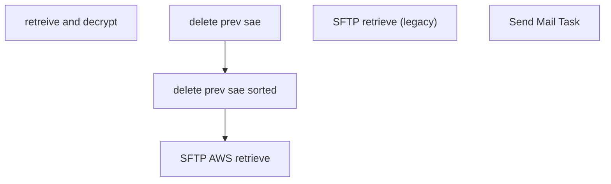

# SSIS Package: concurETL_download

**Project:** concurETL_download  
**Folder:** HR  
**Server:** STL-SSIS-P-01  

## Connection Managers

| Name | Type | Server | Catalog | Connection (sanitized) |
|---|---|---|---|---|
| ASNCorrections | FLATFILE |  |  |  |
| CRM | ADO.NET:SQL | stl-crmdb-p-01 |  | Data Source=stl-crmdb-p-01; Integrated Security=SSPI; Connect Timeout=30 |
| Dynamics AX Connection Manager | DynamicsAX |  |  |  |
| ESPStaging | OLEDB | stl-sql-p-04 | ESPStaging | Data Source=stl-sql-p-04; Initial Catalog=ESPStaging; Provider=SQLNCLI11.1; Integrated Security=SSPI; Auto Translate=False |
| Flat File Connection Manager | FLATFILE |  |  |  |
| Flat File Connection Manager 1 | FLATFILE |  |  |  |
| IntegrationStaging | OLEDB | STL-SSIS-T-01 | IntegrationStaging | Data Source=STL-SSIS-T-01; Initial Catalog=IntegrationStaging; Provider=SQLNCLI11.1; Integrated Security=SSPI; Auto Translate=False |
| ProductInventory | FLATFILE |  |  |  |
| SMTP | SMTP |  |  |  |
| STL-SSIS-P-01.IntegrationStaging | OLEDB | STL-SSIS-P-01 | IntegrationStaging | Data Source=STL-SSIS-P-01; Initial Catalog=IntegrationStaging; Provider=SQLNCLI11.1; Integrated Security=SSPI; Auto Translate=False |
| SendLog | FLATFILE |  |  |  |
| SendLogPIPE.csv | FILE |  |  |  |
| papamart.DWStaging | OLEDB | papamart | DWStaging | Data Source=papamart; Initial Catalog=DWStaging; Provider=SQLNCLI11.1; Integrated Security=SSPI; Auto Translate=False |
| tcp:eco-bab-test.database.windows.net,1433.ecobabtest.USER | ADO.NET:System.Data.SqlClient.SqlConnection, System.Data, Version=4.0.0.0, Culture=neutral, PublicKeyToken=b77a5c561934e089 | tcp:eco-bab-test.database.windows.net,1433 | ecobabtest | Data Source=tcp:eco-bab-test.database.windows.net,1433; Initial Catalog=ecobabtest; Application Name=SSIS-Package-{F23BEDAE-3A60-422C-AC1D-B5E87741A56F}tcp:eco-bab-test.database.windows.net,1433.ecobabtest.USER |

## Control Flow Tasks

| Task | Type |
|---|---|
| concurETL_download | Package |
| retreive and decrypt | SEQUENCE |
| delete prev sae | FileSystemTask |
| delete prev sae sorted | FileSystemTask |
| SFTP AWS retrieve | ExecuteSQLTask |
| SFTP retrieve (legacy) | ExecuteSQLTask |
| Send Mail Task | SendMailTask |

## Control Flow Outline

```text
- Send Mail Task [SendMailTask]
- retreive and decrypt [SEQUENCE]
  - SFTP AWS retrieve [ExecuteSQLTask]
  - SFTP retrieve (legacy) [ExecuteSQLTask]
  - delete prev sae [FileSystemTask]
  - delete prev sae sorted [FileSystemTask]
```

## Architecture Diagram



## Variables

| Namespace | Name | Expression-bound |
|---|---|---|
| System | Propagate | No |
| User | DateTimeStamp | Yes |
| User | EndDate | Yes |
| User | EndDateAsDATE | Yes |
| User | GetDate | Yes |
| User | GetDateAsDATE | Yes |
| User | StartDate | Yes |
| User | StartDateAsDATE | Yes |
| User | varIntegrationServerPath | Yes |
| User | varIntegrationServerPath2 | Yes |

### Expression-bound variable values

#### User::DateTimeStamp

**Expression:**

```sql
(DT_WSTR,4)DATEPART("yyyy",GetDate()) 
+ (DT_WSTR,4)DATEPART("mm",GetDate()) 
+ (DT_WSTR,4)DATEPART("dd",GetDate()) 
+ (DT_WSTR,4)DATEPART("hh",GetDate()) 
+ (DT_WSTR,4)DATEPART("mi",GetDate()) 
+ (DT_WSTR,4)DATEPART("ss",GetDate()) 
+ (DT_WSTR,4)DATEPART("ms",GetDate())
```

**Evaluated value:**

```sql
20221031145452267
```

#### User::EndDate

**Expression:**

```sql
dateadd("dd", @[$Package::DaysToInclude], @[User::StartDate])
```

**Evaluated value:**

```sql
10/31/2022
```

#### User::EndDateAsDATE

**Expression:**

```sql
(DT_WSTR, 4) datepart("year", @[User::EndDate])  + "-" +
right("0"+ (DT_WSTR, 2) datepart("mm", @[User::EndDate]),2)  + "-" +
right("0" +(DT_WSTR, 2) datepart("dd",  @[User::EndDate]),2)
```

**Evaluated value:**

```sql
2022-10-31
```

#### User::GetDate

**Expression:**

```sql
(DT_DATE)DATEDIFF("Day", (DT_DATE) 0, GETDATE())
```

**Evaluated value:**

```sql
10/31/2022
```

#### User::GetDateAsDATE

**Expression:**

```sql
(DT_WSTR, 4) datepart("year", @[User::GetDate])  + "-" +
right("0"+ (DT_WSTR, 2) datepart("mm", @[User::GetDate]),2)  + "-" +
right("0" +(DT_WSTR, 2) datepart("dd",  @[User::GetDate]),2)
```

**Evaluated value:**

```sql
2022-10-31
```

#### User::StartDate

**Expression:**

```sql
dateadd("dd", -@[$Package::DaysToGoBack] , @[User::GetDate] )
```

**Evaluated value:**

```sql
10/30/2022
```

#### User::StartDateAsDATE

**Expression:**

```sql
(DT_WSTR, 4) datepart("year", @[User::StartDate])  + "-" +
right("0"+ (DT_WSTR, 2) datepart("mm", @[User::StartDate]),2)  + "-" +
right("0" +(DT_WSTR, 2) datepart("dd",  @[User::StartDate]),2)
```

**Evaluated value:**

```sql
2022-10-30
```

#### User::varIntegrationServerPath

**Expression:**

```sql
"\\\\stl-ssis-p-01\\IntegrationStaging\\concur\\sae.txt"
```

**Evaluated value:**

```sql
\\stl-ssis-p-01\IntegrationStaging\concur\sae.txt
```

#### User::varIntegrationServerPath2

**Expression:**

```sql
"\\\\stl-ssis-p-01\\IntegrationStaging\\concur\\sae_sorted.txt"
```

**Evaluated value:**

```sql
\\stl-ssis-p-01\IntegrationStaging\concur\sae_sorted.txt
```

## Execute SQL Tasks

### SFTP AWS retrieve

**Path:** `Package\retreive and decrypt\SFTP AWS retrieve`  
**Connection:** STL-SSIS-P-01.IntegrationStaging (STL-SSIS-P-01/IntegrationStaging)  

```sql
declare 
 @winSCP varchar(1000),
 @script varchar(1000),
 @log varchar(1000),
 @FTP varchar(4000),
 @Log_query varchar(1000),
 @Log_filename varchar(100),
 @Log_file_location varchar(100),
 @Log_bcp varchar(1000),
 @body varchar(4000)
select
 @winSCP = '"\\stl-ssis-p-01\C$\Program Files (x86)\WinSCP\WinSCP.exe"',
 @script = ' /script=\\stl-ssis-p-01\IntegrationStaging\concur\SFTP_SSH\concur_SSH_SFTP_AWS.txt',
 @log = ' /log=\\stl-ssis-p-01\IntegrationStaging\concur\SFTP_SSH\DownloadAWS.log',
 @FTP = (@winSCP + @script + @log)
   
   
exec master..xp_cmdshell @FTP
```

### SFTP retrieve (legacy)

**Path:** `Package\retreive and decrypt\SFTP retrieve (legacy)`  
**Connection:** STL-SSIS-P-01.IntegrationStaging (STL-SSIS-P-01/IntegrationStaging)  

```sql
declare 
 @winSCP varchar(1000),
 @script varchar(1000),
 @log varchar(1000),
 @FTP varchar(4000),
 @Log_query varchar(1000),
 @Log_filename varchar(100),
 @Log_file_location varchar(100),
 @Log_bcp varchar(1000),
 @body varchar(4000)
select
 @winSCP = '"\\stl-ssis-p-01\C$\Program Files (x86)\WinSCP\WinSCP.exe"',
 @script = ' /script=\\stl-ssis-p-01\IntegrationStaging\concur\SFTP_SSH\concur_SSH_SFTP.txt',
 @log = ' /log=\\stl-ssis-p-01\IntegrationStaging\concur\SFTP_SSH\Download.log',
 @FTP = (@winSCP + @script + @log)
   
   
exec master..xp_cmdshell @FTP
```

## Data Flow: Sources

_None detected._

## Data Flow: Destinations

_None detected._
