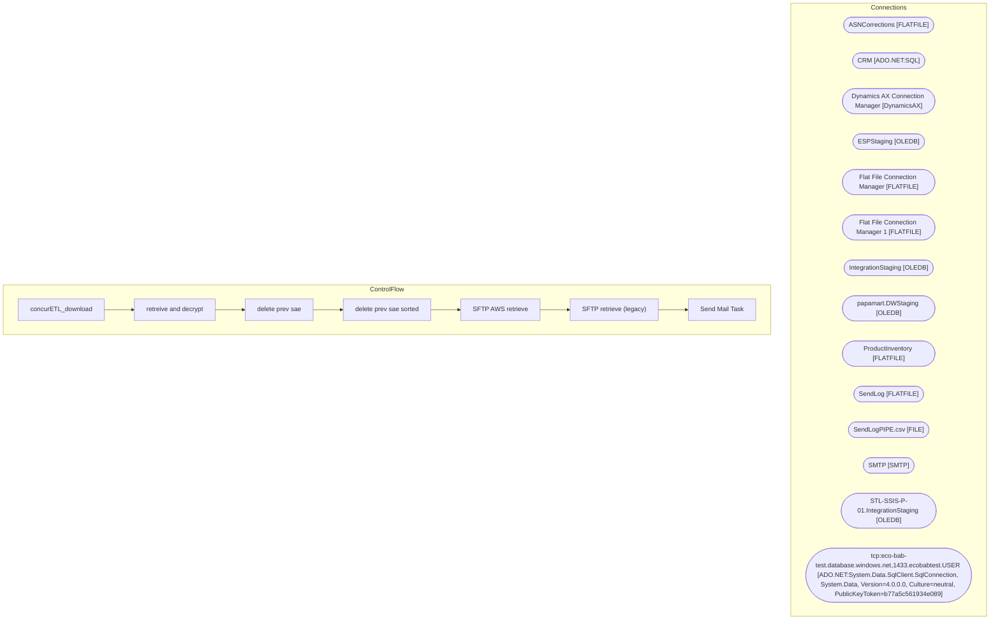

# SSIS Package: concurETL_download

**Project:** concurETL_download  
**Folder:** HR  
**Server:** STL-SSIS-P-01  

## Architecture Diagram

## Connection Managers

| Name | Type |
|---|---|
| ASNCorrections | FLATFILE |
| CRM | ADO.NET:SQL |
| Dynamics AX Connection Manager | DynamicsAX |
| ESPStaging | OLEDB |
| Flat File Connection Manager | FLATFILE |
| Flat File Connection Manager 1 | FLATFILE |
| IntegrationStaging | OLEDB |
| papamart.DWStaging | OLEDB |
| ProductInventory | FLATFILE |
| SendLog | FLATFILE |
| SendLogPIPE.csv | FILE |
| SMTP | SMTP |
| STL-SSIS-P-01.IntegrationStaging | OLEDB |
| tcp:eco-bab-test.database.windows.net,1433.ecobabtest.USER | ADO.NET:System.Data.SqlClient.SqlConnection, System.Data, Version=4.0.0.0, Culture=neutral, PublicKeyToken=b77a5c561934e089 |

## Control Flow Tasks

| Task | Type |
|---|---|
| concurETL_download | Microsoft.Package |
| retreive and decrypt | STOCK:SEQUENCE |
| delete prev sae | Microsoft.FileSystemTask |
| delete prev sae sorted | Microsoft.FileSystemTask |
| SFTP AWS retrieve | Microsoft.ExecuteSQLTask |
| SFTP retrieve (legacy) | Microsoft.ExecuteSQLTask |
| Send Mail Task | Microsoft.SendMailTask |

## Data Flow: Sources

_None detected._

## Data Flow: Destinations

_None detected._

