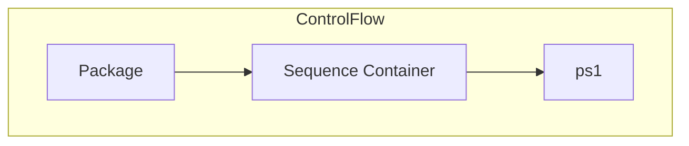

# SSIS Package: Package

**Project:** gpgTest  
**Folder:** HR  
**Server:** STL-SSIS-P-01  

## Architecture Diagram

## Connection Managers

_None detected._

## Control Flow Tasks

| Task | Type |
|---|---|
| Package | Microsoft.Package |
| Sequence Container | STOCK:SEQUENCE |
| ps1 | Microsoft.ExecuteProcess |

## Data Flow: Sources

_None detected._

## Data Flow: Destinations

_None detected._

