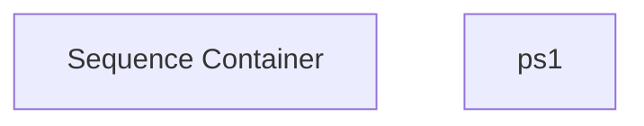

# SSIS Package: Package

**Project:** gpgTest  
**Folder:** HR  
**Server:** STL-SSIS-P-01  

## Connection Managers

_None detected._

## Control Flow Tasks

| Task | Type |
|---|---|
| Package | Package |
| Sequence Container | SEQUENCE |
| ps1 | ExecuteProcess |

## Control Flow Outline

```text
- Sequence Container [SEQUENCE]
  - ps1 [ExecuteProcess]
```

## Architecture Diagram



## Variables

_None detected._

## Execute SQL Tasks

_None detected._

## Data Flow: Sources

_None detected._

## Data Flow: Destinations

_None detected._
