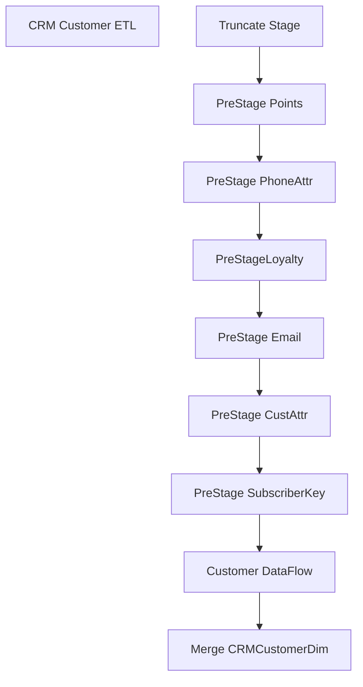

# SSIS Package: CustomerExtractToDW

**Project:** CustomerExtractToDW  
**Folder:** Loyalty  
**Server:** STL-SSIS-P-01  

## Connection Managers

| Name | Type | Server | Catalog | Connection (sanitized) |
|---|---|---|---|---|
| CRM | OLEDB | stl-crmdb-p-01 | crm | Data Source=stl-crmdb-p-01; Initial Catalog=crm; Provider=SQLNCLI11.1; Integrated Security=SSPI; Auto Translate=False |
| DW | OLEDB | papamarttest | dw | Data Source=papamarttest; Initial Catalog=dw; Provider=SQLNCLI11.1; Integrated Security=SSPI; Auto Translate=False |
| DWStaging | OLEDB | papamarttest | DWStaging | Data Source=papamarttest; Initial Catalog=DWStaging; Provider=SQLNCLI11.1; Integrated Security=SSPI; Auto Translate=False |
| SMTP Connection Manager | SMTP |  |  |  |

## Control Flow Tasks

| Task | Type |
|---|---|
| CustomerTransactionETL | Package |
| CRM Customer ETL | SEQUENCE |
| Customer DataFlow | Pipeline |
| Merge CRMCustomerDim | ExecuteSQLTask |
| PreStage CustAttr | ExecuteSQLTask |
| PreStage Email | ExecuteSQLTask |
| PreStage PhoneAttr | ExecuteSQLTask |
| PreStage Points | ExecuteSQLTask |
| PreStage SubscriberKey | ExecuteSQLTask |
| PreStageLoyalty | ExecuteSQLTask |
| Truncate Stage | ExecuteSQLTask |

## Control Flow Outline

```text
- CRM Customer ETL [SEQUENCE]
  - Customer DataFlow [Pipeline]
  - Merge CRMCustomerDim [ExecuteSQLTask]
  - PreStage CustAttr [ExecuteSQLTask]
  - PreStage Email [ExecuteSQLTask]
  - PreStage PhoneAttr [ExecuteSQLTask]
  - PreStage Points [ExecuteSQLTask]
  - PreStage SubscriberKey [ExecuteSQLTask]
  - PreStageLoyalty [ExecuteSQLTask]
  - Truncate Stage [ExecuteSQLTask]
```

## Architecture Diagram



## Variables

| Namespace | Name | Expression-bound |
|---|---|---|
| User | BatchRunDate | No |
| User | CRMTransactionsTemp | No |
| User | Count_CRMTransactionFactMergeInsert | No |
| User | Count_CRMTransactionFactMergeUpdate | No |
| User | Count_CRMTransactionFactStage | No |
| User | Count_CustomerDimMergeInsert | No |
| User | Count_CustomerDimMergeUpdate | No |
| User | Count_CustomerDimStage | No |
| User | Count_NameMeTransactionFactMergeInsert | No |
| User | Count_NameMeTransactionFactMergeUpdate | No |
| User | Count_NameMeTransactionFactStage | No |
| User | CustFile | No |
| User | DeleteCount | No |
| User | DisableEventHandlerPostExecute | No |
| User | EndDate | Yes |
| User | ErrorCount | No |
| User | ErrorEmailActive | No |
| User | ErrorEmailMsg | No |
| User | ErrorEmailMsgAdditional | No |
| User | ErrorEmailMsgFooter | No |
| User | ErrorEmailMsgHeader | Yes |
| User | ErrorEmailMsgLog | No |
| User | ErrorEmailMsgLogQuery | Yes |
| User | ErrorEmailMsgValidation | No |
| User | ErrorEmailRecipientList | No |
| User | ErrorEmailSubject | Yes |
| User | GetDate | Yes |
| User | InsertCount | No |
| User | LogID | No |
| User | ParentLogID | No |
| User | RowCount | No |
| User | SQL_NameMeAnimalIDLookup | Yes |
| User | SQL_NameMeTransLookup | Yes |
| User | SQL_ValidationLog | Yes |
| User | SQL_vwDW_CRMTransactionFact | Yes |
| User | SQL_vwDW_CustomerDim | Yes |
| User | SQL_vwDW_CustomerDimWIP | Yes |
| User | SQL_vwDW_NameMeTransactionFact | Yes |
| User | StartDate | Yes |
| User | UnprocessedCount | No |
| User | UpdateCount | No |
| User | ValidationStatus_CRMCustomerDimMerge | No |
| User | ValidationStatus_CRMTransactionFactMerge | No |
| User | ValidationStatus_NameMeTransactionFactMerge | No |

### Expression-bound variable values

#### User::EndDate

**Expression:**

```sql
dateadd("dd", @[$Package::DaysToInclude], @[User::StartDate])
```

**Evaluated value:**

```sql
4/13/2023
```

#### User::ErrorEmailMsgHeader

**Expression:**

```sql
"Machine:  " + @[System::MachineName] + " Package:  " + @[System::PackageName] + " Date:   " + (DT_STR, 30, 1252)  GETDATE() + " LogID:  " + (DT_STR, 30, 1252)@[User::ParentLogID]
```

**Evaluated value:**

```sql
Machine:  STL-BIDEV-D-03 Package:  CustomerTransactionETL Date:   2023-04-13 09:09:16.202000000 LogID:  435135
```

#### User::ErrorEmailMsgLogQuery

**Expression:**

```sql
"
select 'Source: ' + source + ' Error: ' + message as Message 
from ssistemplates.dbo.sysssislog with (nolock) 
where executionid = '" +  @[System::ExecutionInstanceGUID] + "' and event = 'OnError'"
```

**Evaluated value:**

```sql

select 'Source: ' + source + ' Error: ' + message as Message 
from ssistemplates.dbo.sysssislog with (nolock) 
where executionid = '{3E4AA144-8C70-47ED-B66D-79F9929FED55}' and event = 'OnError'
```

#### User::ErrorEmailSubject

**Expression:**

```sql
"Error: " + @[System::PackageName] + " On " + @[System::MachineName] 
```

**Evaluated value:**

```sql
Error: CustomerTransactionETL On STL-BIDEV-D-03
```

#### User::GetDate

**Expression:**

```sql
(DT_DATE)DATEDIFF("Day", (DT_DATE) 0, GETDATE())
```

**Evaluated value:**

```sql
4/13/2023
```

#### User::SQL_NameMeAnimalIDLookup

**Expression:**

```sql
"
select transaction_id, animal_id from POSAnimalID WITH (nolock) where TransactionDate between  '" + (DT_STR, 10, 1252)@[User::StartDate] + "' and '" + (DT_STR, 10, 1252)@[User::EndDate] + "'"
```

**Evaluated value:**

```sql

select transaction_id, animal_id from POSAnimalID WITH (nolock) where TransactionDate between  '4/12/2023' and '4/13/2023'
```

#### User::SQL_NameMeTransLookup

**Expression:**

```sql
"
select 
max(ID) as ID
from tblcustomerrecipient with (nolock)
where dRStartTime > '1/1/2003'
and pull_storeid <> 0
and dREndTime between '" + (DT_STR, 10, 1252)@[User::StartDate] + "' and '" + (DT_STR, 10, 1252)@[User::EndDate] +
"' group by Pull_StoreID, sRBarCodeNumber, dREndTime
"
```

**Evaluated value:**

```sql

select 
max(ID) as ID
from tblcustomerrecipient with (nolock)
where dRStartTime > '1/1/2003'
and pull_storeid <> 0
and dREndTime between '4/12/2023' and '4/13/2023' group by Pull_StoreID, sRBarCodeNumber, dREndTime

```

#### User::SQL_ValidationLog

**Expression:**

```sql
"exec spCustomerTransactionETLLog '" + 
(DT_STR, 25, 1252) @[System::StartTime] + "'"
+
", " +
(DT_STR, 25, 1252) @[User::Count_CustomerDimStage] + ","  +
(DT_STR, 25, 1252) @[User::Count_CustomerDimMergeInsert] + ","  +
(DT_STR, 25, 1252) @[User::Count_CustomerDimMergeUpdate] + ","  +
(DT_STR, 25, 1252) @[User::Count_CRMTransactionFactStage] + ","  +
(DT_STR, 25, 1252) @[User::Count_CRMTransactionFactMergeInsert] + ","  +
(DT_STR, 25, 1252) @[User::Count_CRMTransactionFactMergeUpdate] + ","  +
(DT_STR, 25, 1252) @[User::Count_NameMeTransactionFactStage] + ","  +
(DT_STR, 25, 1252) @[User::Count_NameMeTransactionFactMergeInsert] + ","  +
(DT_STR, 25, 1252) @[User::Count_NameMeTransactionFactMergeUpdate] + ","  +
 (DT_STR, 25, 1252)  @[User::LogID]  + ","
 +  (DT_STR, 25, 1252) @[User::ValidationStatus_CRMCustomerDimMerge] + "," +  (DT_STR, 25, 1252) @[User::ValidationStatus_CRMTransactionFactMerge] + "," +  (DT_STR, 25, 1252) @[User::ValidationStatus_NameMeTransactionFactMerge] + ""
```

**Evaluated value:**

```sql
exec spCustomerTransactionETLLog '4/13/2023 9:09:15 AM', 0,0,0,0,0,0,0,0,0,1,0,0,0
```

#### User::SQL_vwDW_CRMTransactionFact

**Expression:**

```sql
"SELECT 
CRMTransactionID,
StoreNo,
TransactionDate,
TransactionPostedDate,
CRMTransactionType,
POSTransactionNumber,
POSRegisterNumber,
CustomerNumber,
PointsEarned, TransactionIDTF
 FROM vwDW_CRMTransactionFactPreStage 
WHERE
 TransactionPostedDate between '" + (DT_STR, 10, 1252)@[User::StartDate] + "' and '" + (DT_STR, 10, 1252)@[User::EndDate] + "'"
```

**Evaluated value:**

```sql
SELECT 
CRMTransactionID,
StoreNo,
TransactionDate,
TransactionPostedDate,
CRMTransactionType,
POSTransactionNumber,
POSRegisterNumber,
CustomerNumber,
PointsEarned, TransactionIDTF
 FROM vwDW_CRMTransactionFactPreStage 
WHERE
 TransactionPostedDate between '4/12/2023' and '4/13/2023'
```

#### User::SQL_vwDW_CustomerDim

**Expression:**

```sql
"SELECT
 
CustomerID,
 
CustomerNumber,
 
MembershipDate,
 
Gender,
 
BirthDate,
	 
LanguageCode,
 
 CRMUpdateDate,
 
StoreNo, 
CountryCode,
 
PostalCode,
 
PointsEligible,
 
MembershipType, Emailable, SubscriberKey, DirectMailOptIn, HasPhoneNumber  
FROM vwDW_CustomerDim WHERE 
cast(MembershipDate as date)  between '" + (DT_STR, 10, 1252)@[User::StartDate] + "' and '" + (DT_STR, 10, 1252)@[User::EndDate] +"' 

or cast(CRMUpdateDate as date)  between '" + (DT_STR, 10, 1252)@[User::StartDate] + "' and '" + (DT_STR, 10, 1252)@[User::EndDate] + "'"
```

**Evaluated value:**

```sql
SELECT
 
CustomerID,
 
CustomerNumber,
 
MembershipDate,
 
Gender,
 
BirthDate,
	 
LanguageCode,
 
 CRMUpdateDate,
 
StoreNo, 
CountryCode,
 
PostalCode,
 
PointsEligible,
 
MembershipType, Emailable, SubscriberKey, DirectMailOptIn, HasPhoneNumber  
FROM vwDW_CustomerDim WHERE 
cast(MembershipDate as date)  between '4/12/2023' and '4/13/2023' 

or cast(CRMUpdateDate as date)  between '4/12/2023' and '4/13/2023'
```

#### User::SQL_vwDW_CustomerDimWIP

**Expression:**

```sql
"SELECT 
	d.CustomerID,
	d.CustomerNumber,
	d.MembershipDate,
	d.Gender,
	d.BirthDate,
	d.LanguageCode,
	d.CreateDate,
	d.CRMUpdateDate,
	d.StoreNo,
	d.CountryCode,
	d.PostalCode,
	d.PointsEligible,
	d.MembershipType,
	d.MembershipPlan,
 d.Emailable,
	d.SubscriberKey,
	d.DirectMailOptIn,
	d.HasPhoneNumber,
	d.telephone_no,
	d.locale,
	d.text_opt_in_flag,
	d.EmailOptInDate,
	d.EmailAddress,
	d.ClubStatus,
	d.CurrentRewardPoints,
	d.LifetimeTotalPointsEarned,
	d.SignUpSource,
	d.address_1,
	d.address_2,
	d.address_3,
	d.address_4,
	d.hasOnlineAccount,
	/*case 
		when d.ClubStatus = 'active' and 
		d.MembershipType in ('BASI','SFS','CLUB','PREF') 
			then 1 
		else 0 
	end as isBonusClubMember*/
	d.PointsEligible as isBonusClubMember,
	d.first_name,
	d.last_name
FROM vwDW_CustomerDimWIP d
 WHERE cast(MembershipDate as date)  between cast('" + (DT_STR, 10, 1252)@[User::StartDate] + "' as date) and cast('" + (DT_STR, 10, 1252)@[User::EndDate] +"' as date) 
or cast(CRMUpdateDate as date)  between cast('" + (DT_STR, 10, 1252)@[User::StartDate] + "' as date) and cast('" + (DT_STR, 10, 1252)@[User::EndDate] + "' as date) 
or exists (select p.CustomerNumber from tmpPointsEarned p where p.CustomerNumber=d.CustomerNumber and isUpdatedRecently=1)"
```

**Evaluated value:**

```sql
SELECT 
	d.CustomerID,
	d.CustomerNumber,
	d.MembershipDate,
	d.Gender,
	d.BirthDate,
	d.LanguageCode,
	d.CreateDate,
	d.CRMUpdateDate,
	d.StoreNo,
	d.CountryCode,
	d.PostalCode,
	d.PointsEligible,
	d.MembershipType,
	d.MembershipPlan,
 d.Emailable,
	d.SubscriberKey,
	d.DirectMailOptIn,
	d.HasPhoneNumber,
	d.telephone_no,
	d.locale,
	d.text_opt_in_flag,
	d.EmailOptInDate,
	d.EmailAddress,
	d.ClubStatus,
	d.CurrentRewardPoints,
	d.LifetimeTotalPointsEarned,
	d.SignUpSource,
	d.address_1,
	d.address_2,
	d.address_3,
	d.address_4,
	d.hasOnlineAccount,
	/*case 
		when d.ClubStatus = 'active' and 
		d.MembershipType in ('BASI','SFS','CLUB','PREF') 
			then 1 
		else 0 
	end as isBonusClubMember*/
	d.PointsEligible as isBonusClubMember,
	d.first_name,
	d.last_name
FROM vwDW_CustomerDimWIP d
 WHERE cast(MembershipDate as date)  between cast('4/12/2023' as date) and cast('4/13/2023' as date) 
or cast(CRMUpdateDate as date)  between cast('4/12/2023' as date) and cast('4/13/2023' as date) 
or exists (select p.CustomerNumber from tmpPointsEarned p where p.CustomerNumber=d.CustomerNumber and isUpdatedRecently=1)
```

#### User::SQL_vwDW_NameMeTransactionFact

**Expression:**

```sql
"SELECT
	Pull_StoreID,
	LocationCode, SKULookUp,
	NameMeTransactionNumber,
	AnimalBarcode,
	AnimalName,
	AnimalBirthDate,
	TransactionStartDate,
	TransactionEndDate,
	Gift,
	FirstVisit,
	RecipBirthDate
,TransactionSource, Gender FROM vwDW_NameMeTransactionFact
WHERE 
cast(TransactionStartDate as date)  between '" + (DT_STR, 10, 1252)@[User::StartDate] + "' and '" + (DT_STR, 10, 1252)@[User::EndDate] + "'"
```

**Evaluated value:**

```sql
SELECT
	Pull_StoreID,
	LocationCode, SKULookUp,
	NameMeTransactionNumber,
	AnimalBarcode,
	AnimalName,
	AnimalBirthDate,
	TransactionStartDate,
	TransactionEndDate,
	Gift,
	FirstVisit,
	RecipBirthDate
,TransactionSource, Gender FROM vwDW_NameMeTransactionFact
WHERE 
cast(TransactionStartDate as date)  between '4/12/2023' and '4/13/2023'
```

#### User::StartDate

**Expression:**

```sql
dateadd("dd", -@[$Package::DaysToGoBack] , @[User::GetDate] )
```

**Evaluated value:**

```sql
4/12/2023
```

## Execute SQL Tasks

### Merge CRMCustomerDim

**Path:** `Package\CRM Customer ETL\Merge CRMCustomerDim`  
**Connection:** DWStaging (papamarttest/DWStaging)  

```sql
exec spCRMCustomerDimMerge
```

### PreStage CustAttr

**Path:** `Package\CRM Customer ETL\PreStage CustAttr`  
**Connection:** CRM (stl-crmdb-p-01/crm)  

```sql
IF (Object_ID('crm..tmpCustomerAttr') IS NOT NULL) DROP TABLE tmpCustomerAttr
select 
	customer_id,
	attribute_grouping_code,
	attribute_code,
	attribute_value
into tmpCustomerAttr
from customer_attribute ca2 with (nolock) 
where attribute_grouping_code='GDPR' 
	and attribute_code='OPTIN' 
	and attribute_value=1
```

### PreStage Email

**Path:** `Package\CRM Customer ETL\PreStage Email`  
**Connection:** CRM (stl-crmdb-p-01/crm)  

```sql
IF (Object_ID('crm..tmpEml') IS NOT NULL) DROP TABLE tmpEml
select 
	c.customer_id,
	sum(
				case when 
					isnull(e.email_address, 'X') like '%@%.%'
					and isnull(e.email_indicator, 2) in (0,9)
					and isnull(ed.email_opt_in_flag, 2) in (0,1)
				then 1
				else 0
			end
			) as Emailable,
	ed.email_opt_in_date as email_opt_in_date,
	lower(e.email_address) as email_address,
	e.email_indicator,
	ed.email_opt_in_flag,
	e.create_store_no
into tmpEml
from 
		customer c with (nolock)
join customer_division cd with (nolock) 
	ON c.customer_id = cd.customer_id 
	and cd.division_id = 89
left join email e with (nolock) 
	ON c.customer_id = e.customer_id --and e.email_type_code = 'EML'
	and cd.primary_email_id = e.email_id
left join email_division ed  with (nolock) 
	ON c.customer_id = ed.customer_id 
	AND e.email_id = ed.email_id
group by 
	c.customer_id,
	ed.email_opt_in_date,
	lower(e.email_address),
	e.email_indicator,
	ed.email_opt_in_flag,
	e.create_store_no
```

### PreStage PhoneAttr

**Path:** `Package\CRM Customer ETL\PreStage PhoneAttr`  
**Connection:** CRM (stl-crmdb-p-01/crm)  

```sql
IF (Object_ID('crm..tmpPhoneAttr') IS NOT NULL) DROP TABLE tmpPhoneAttr;
with
LastCell as 
	(
		select 
			customer_id, 
			max(phone_id) as 'maxPhoneId' 
		from phone with (nolock)
		where phone_type_code = 'MOBI'
		group by customer_id
	)
select 
	c.customer_id,
	p.telephone_no, 
	case 
		when p.country_code = 'USA' then 'en-us'
		when  p.country_code = 'CAN' then 'ca'
		when  p.country_code = 'GBR' then 'en-gb'
		else null 
	end as 'locale',
	case 
		when pd.text_opt_in_flag = 1 
			then 1 
		else 0 
	end as 'text_opt_in_flag'
into tmpPhoneAttr
from customer c with (nolock)
join lastCell on c.customer_id = lastCell.customer_id
join phone p with (nolock) on c.customer_id = p.customer_id  and p.phone_id = lastCell.maxPhoneId 
join phone_division pd with (nolock) on c.customer_id = pd.customer_id and pd.phone_id = lastCell.maxPhoneId 
```

### PreStage Points

**Path:** `Package\CRM Customer ETL\PreStage Points`  
**Connection:** CRM (stl-crmdb-p-01/crm)  

> ⚠️ `SqlStatementSource` is overridden at runtime by a property expression (shown below); the static SQL may not be what executes.

**Static SqlStatementSource:**

```sql
IF (Object_ID('crm..tmpPointsEarned') IS NOT NULL) DROP TABLE tmpPointsEarned;
with
LifetimeTotal as
	(
		select
			rh1.customer_id,
			sum(rh1.points_posted) LifetimeTotalPointsEarned,
			case
				when cast(max(rh1.transaction_date) as date) >= getdate()-2
				or cast(max(rh1.date_points_posted) as date) >= getdate()-2
				then 1
				else 0
			end as isUpdatedRecently
		from reward_header rh1 with (nolock)
		join reward_reason rr with (nolock) 
		on rh1.reward_reason_id = rr.reward_reason_id 
		and rr.reward_category in ('S','A')
		group by
			rh1.customer_id
	),
CurrentPoints as
	(
		select
			rh2.customer_id,
			sum(rh2.points_available) CurrentPointsBalance,
			case 
				when cast(max(rh2.transaction_date) as date) >= getdate()-2		
				or cast(max(rh2.date_points_posted) as date) >= getdate()-2
				then 1
				else 0
			end as isUpdatedRecently
		from reward_header rh2 with (nolock)
		group by 
			rh2.customer_id
	)
select
	c.customer_no as CustomerNumber,
	isnull(lt.LifetimeTotalPointsEarned,0) LifetimeTotalPointsEarned,
	isnull(cp.CurrentPointsBalance,0) CurrentPointsBalance,
	isnull(lt.isUpdatedRecently,0) + isnull(cp.isUpdatedRecently,0) as isUpdatedRecently
into tmpPointsEarned
from customer c with (nolock)
left join LifetimeTotal lt on c.customer_id=lt.customer_id
left join CurrentPoints cp on c.customer_id=cp.customer_id


/*IF (Object_ID('crm..tmpPointsEarned') IS NOT NULL) DROP TABLE tmpPointsEarned
select 
	c.Customer_no as CustomerNumber,
	SUM(rh1.points_posted) LifetimeTotalPointsEarned,
	sum(rh2.points_available) CurrentPointsBalance,
	case 
		when cast(max(rh1.transaction_date) as date) >= getdate()-1
		or cast(max(rh1.date_points_posted) as date) >= getdate()-1
		or cast(max(rh2.transaction_date) as date) >= getdate()-1		
		or cast(max(rh2.date_points_posted) as date) >= getdate()-1
		then 1
		else 0
	end as isUpdatedRecently
into tmpPointsEarned
from reward_header rh1 with (nolock)
join reward_reason rr with (nolock) 
	on rh1.reward_reason_id = rr.reward_reason_id 
	and rr.reward_category='S'
join customer c with (nolock) on rh1.customer_id=c.customer_id
join reward_header rh2 with (nolock) on rh2.customer_id=c.customer_id
group by 
	c.Customer_no*/
```

**Property expression (runtime override):**

```sql
"IF (Object_ID('crm..tmpPointsEarned') IS NOT NULL) DROP TABLE tmpPointsEarned;
with
LifetimeTotal as
	(
		select
			rh1.customer_id,
			sum(rh1.points_posted) LifetimeTotalPointsEarned,
			case
				when cast(max(rh1.transaction_date) as date) >= getdate()-2
				or cast(max(rh1.date_points_posted) as date) >= getdate()-2
				then 1
				else 0
			end as isUpdatedRecently
		from reward_header rh1 with (nolock)
		join reward_reason rr with (nolock) 
		on rh1.reward_reason_id = rr.reward_reason_id 
		and rr.reward_category in ('S','A')
		group by
			rh1.customer_id
	),
CurrentPoints as
	(
		select
			rh2.customer_id,
			sum(rh2.points_available) CurrentPointsBalance,
			case 
				when cast(max(rh2.transaction_date) as date) >= getdate()-2		
				or cast(max(rh2.date_points_posted) as date) >= getdate()-2
				then 1
				else 0
			end as isUpdatedRecently
		from reward_header rh2 with (nolock)
		group by 
			rh2.customer_id
	)
select
	c.customer_no as CustomerNumber,
	isnull(lt.LifetimeTotalPointsEarned,0) LifetimeTotalPointsEarned,
	isnull(cp.CurrentPointsBalance,0) CurrentPointsBalance,
	isnull(lt.isUpdatedRecently,0) + isnull(cp.isUpdatedRecently,0) as isUpdatedRecently
into tmpPointsEarned
from customer c with (nolock)
left join LifetimeTotal lt on c.customer_id=lt.customer_id
left join CurrentPoints cp on c.customer_id=cp.customer_id


/*IF (Object_ID('crm..tmpPointsEarned') IS NOT NULL) DROP TABLE tmpPointsEarned
select 
	c.Customer_no as CustomerNumber,
	SUM(rh1.points_posted) LifetimeTotalPointsEarned,
	sum(rh2.points_available) CurrentPointsBalance,
	case 
		when cast(max(rh1.transaction_date) as date) >= getdate()-" + (DT_WSTR, 10) @[$Package::DaysToGoBack] + "
		or cast(max(rh1.date_points_posted) as date) >= getdate()-" + (DT_WSTR, 10) @[$Package::DaysToGoBack] + "
		or cast(max(rh2.transaction_date) as date) >= getdate()-" + (DT_WSTR, 10) @[$Package::DaysToGoBack] + "		
		or cast(max(rh2.date_points_posted) as date) >= getdate()-" + (DT_WSTR, 10) @[$Package::DaysToGoBack] + "
		then 1
		else 0
	end as isUpdatedRecently
into tmpPointsEarned
from reward_header rh1 with (nolock)
join reward_reason rr with (nolock) 
	on rh1.reward_reason_id = rr.reward_reason_id 
	and rr.reward_category='S'
join customer c with (nolock) on rh1.customer_id=c.customer_id
join reward_header rh2 with (nolock) on rh2.customer_id=c.customer_id
group by 
	c.Customer_no*/"
```

### PreStage SubscriberKey

**Path:** `Package\CRM Customer ETL\PreStage SubscriberKey`  
**Connection:** CRM (stl-crmdb-p-01/crm)  

```sql
IF (Object_ID('crm..tmpCustomerSubscriberKey') IS NOT NULL) DROP TABLE tmpCustomerSubscriberKey
select CustomerID, subscriber_key
into tmpCustomerSubscriberKey
from vwDW_CustomerSubscriberKey
```

### PreStageLoyalty

**Path:** `Package\CRM Customer ETL\PreStageLoyalty`  
**Connection:** CRM (stl-crmdb-p-01/crm)  

```sql
IF (Object_ID('tempdb..#emp') IS NOT NULL) DROP TABLE #emp
select c.customer_id 
into #emp
from customer c
join email e with (nolock) on c.customer_id=e.customer_id
where 1=1
and (e.email_address like '%@buildabear.%' or c.title like '%emp%')
group by c.customer_id

--members of bonus club -- no termination date
IF (Object_ID('tempdb..#BC') IS NOT NULL) DROP TABLE #BC
select 
	customer_id,
	join_date,
	plan_name,
	membership_type_code
into #BC
from vwDWLoyaltyPlansLookup
where loyalty_plan_id=1 
and termination_date is null
group by 
	customer_id,
	join_date,
	plan_name,
	membership_type_code

--members of heritage - non points earning
IF (Object_ID('tempdb..#htg') IS NOT NULL) DROP TABLE #htg
select 
	customer_id,
	join_date,
	plan_name,
	membership_type_code
into #htg
from vwDWLoyaltyPlansLookup
where loyalty_plan_id=2 --plan_name=heritage..
and termination_date is null
group by 
	customer_id,
	join_date,
	plan_name,
	membership_type_code


---members of bonus club or heritage, both without termination dates... derives their club as that with more recent join date
--IF (Object_ID('tempdb..tmpLoyalty') IS NOT NULL) DROP TABLE tmpLoyalty
IF (Object_ID('crm..tmpLoyalty') IS NOT NULL) DROP TABLE tmpLoyalty
select 
	c.customer_no,
	c.customer_id,
	case 
		when  emp.customer_id is not null then 'Heritage Non Points Earning Loyalty Plan'
		
		when (bc.customer_id is not null and htg.customer_id is null) --in BC, not in HTG
			then bc.plan_name
		when (htg.customer_id is not null and bc.customer_id is null) --in HTG, not in BC
			then htg.plan_name
		when (bc.customer_id is not null and htg.customer_id is not null) --in both
			then case 
					when bc.join_date>isnull(htg.join_date, '1900-12-01') 
						then bc.plan_name
					else htg.plan_name
				end
	end as MembershipPlan,

	case 
		when emp.customer_id is not null then 'EMP'
		
		when (bc.customer_id is not null and htg.customer_id is null) --in BC, not in HTG
			then bc.membership_type_code
		when (htg.customer_id is not null and bc.customer_id is null) --in HTG, not in BC
			then htg.membership_type_code
		when (bc.customer_id is not null and htg.customer_id is not null) --in both
			then case 
					when bc.join_date>isnull(htg.join_date, '1900-12-01') 
						then bc.membership_type_code
					else htg.membership_type_code
				end
	end as MembershipType,

	case 
		when (bc.customer_id is not null and htg.customer_id is null) --in BC, not in HTG
			then bc.join_date
		when (htg.customer_id is not null and bc.customer_id is null) --in HTG, not in BC
			then htg.join_date
		when (bc.customer_id is not null and htg.customer_id is not null) --in both
			then case 
					when bc.join_date>isnull(htg.join_date, '1900-12-01') 
						then bc.join_date
					else htg.join_date
				end
	end as MembershipDate,

	case 
		when emp.customer_id is not null then '0'
		
		when (bc.customer_id is not null and htg.customer_id is null) and emp.customer_id is null --in BC, not in HTG
			then '1'
		when (htg.customer_id is not null and bc.customer_id is null) --in HTG, not in BC
			then '0'
		when (bc.customer_id is not null and htg.customer_id is not null) --in both
			then case 
					when bc.join_date>isnull(htg.join_date, '1900-12-01') 
						and emp.customer_id is null --is therefore not an employee
						then '1'
					else '0'
				end 
		else '0'
	end as PointsEligible
into tmpLoyalty
from customer c with (nolock)
left join #bc bc on c.customer_id=bc.customer_id
left join #htg htg on c.customer_id=htg.customer_id
left join #emp emp on c.customer_id=emp.customer_id


/*
IF (Object_ID('tempdb..#emp') IS NOT NULL) DROP TABLE #emp
select e.customer_id 
into #emp
from email e with (nolock)
where e.email_address like '%@buildabear.%'
group by customer_id


IF (Object_ID('tempdb..#x') IS NOT NULL) DROP TABLE #x
select 
	clp.customer_id,
	clp.join_date MembershipDate,
	clp.current_membership_type_code MembershipType, 
	c.title as EmployeeTitle, 
	sum(
		case 
			when isnull(clp.loyalty_plan_id,0) = 1 
				then 1 
			else 0 
		end 
		) as LoyaltyType
into #x
from customer c with (nolock)
left join customer_loyalty_plan clp with (nolock) 
	on c.customer_id = clp.customer_id
	and clp.termination_date IS NULL 
group by 
	clp.customer_id,
	clp.join_date,
	clp.current_membership_type_code,
	c.title


IF (Object_ID('tempdb..#xx') IS NOT NULL) DROP TABLE #xx
select 
	x.customer_id,
	sum(
		case 
			when isnull(LOWER(c.title), 'X') NOT LIKE '%emp%' and e.customer_id is null
				then x.LoyaltyType 
			else 0 
		end 
	) as PointsEligible
into #xx
from customer c with (Nolock)
join #x x on c.customer_id=x.customer_id
left join #emp e on c.customer_id=e.customer_id
group by x.customer_id

IF (Object_ID('crm..tmpLoyalty') IS NOT NULL) DROP TABLE tmpLoyalty
select
	xx.customer_id,
	x.MembershipDate,
	x.MembershipType,
	xx.PointsEligible
into tmpLoyalty
from #xx xx
left join #x x 
	on xx.customer_id=x.customer_id
	and xx.PointsEligible = x.LoyaltyType
*/

/*
IF (Object_ID('tempdb..#x') IS NOT NULL) DROP TABLE #x
select 
	clp.customer_id,
	clp.join_date MembershipDate,
	clp.current_membership_type_code MembershipType, 
	c.title EmployeeTitle, 
	sum(
		case 
			when isnull(clp.loyalty_plan_id,0) = 1 
				then 1 
			else 0 
		end 
		) as LoyaltyType
into #x
from customer c with (nolock)
left join customer_loyalty_plan clp with (nolock) 
	on c.customer_id = clp.customer_id
	and clp.termination_date IS NULL 
group by 
	clp.customer_id,
	clp.join_date,
	clp.current_membership_type_code,
	c.title 

IF (Object_ID('tempdb..#xx') IS NOT NULL) DROP TABLE #xx
select 
	x.customer_id,
	sum(
		case 
			when isnull(LOWER(c.title), 'X') NOT LIKE '%emp%' 
				then x.LoyaltyType 
			else 0 
		end 
	) as PointsEligible
into #xx
from customer c with (Nolock)
join #x x on c.customer_id=x.customer_id
group by x.customer_id

IF (Object_ID('crm..tmpLoyalty') IS NOT NULL) DROP TABLE tmpLoyalty
select
	x.customer_id,
	x.MembershipDate,
	x.MembershipType,
	xx.PointsEligible
into tmpLoyalty
from #xx xx
left join #x x 
	on xx.customer_id=x.customer_id
	and xx.PointsEligible = x.LoyaltyType

*/
/*

IF (Object_ID('crm..tmpLoyalty') IS NOT NULL) DROP TABLE tmpLoyalty
select 
	clp.customer_id,
	clp.join_date MembershipDate,
	clp.current_membership_type_code MembershipType, 
	c.title EmployeeTitle, 
	sum(
		case 
			when isnull(clp.loyalty_plan_id,0) = 1 
				then 1 
			else 0 
		end 
		) as LoyaltyType
into tmpLoyalty
from customer c with (nolock)
left join customer_loyalty_plan clp with (nolock) 
	on c.customer_id = clp.customer_id
	and clp.termination_date IS NULL 
group by 
	clp.customer_id,
	clp.join_date,
	clp.current_membership_type_code,
	c.title 

*/
```

### Truncate Stage

**Path:** `Package\CRM Customer ETL\Truncate Stage`  
**Connection:** DWStaging (papamarttest/DWStaging)  

```sql
TRUNCATE TABLE CRMCustomerDimStage 
```

## Data Flow: Sources

| Component | Source Object | Type | Data Flow Task | Connection | SQL Kind |
|---|---|---|---|---|---|
| vwDW_CustomerDim |  | OLEDBSource | Customer DataFlow | CRM |  |

## Data Flow: Destinations

| Component | Target Table | Type | Data Flow Task | Connection | SQL Kind |
|---|---|---|---|---|---|
| CRMCustomerDimStage |  | OLEDBDestination | Customer DataFlow | DWStaging |  |
