# SSIS Package: CustomerExtractToDW

**Project:** CustomerExtractToDW  
**Folder:** Loyalty  
**Server:** STL-SSIS-P-01  

## Architecture Diagram

```mermaid
flowchart TD
    subgraph Connections
        CRM_conn(["CRM [OLEDB]"])
        DW_conn(["DW [OLEDB]"])
        DWStaging_conn(["DWStaging [OLEDB]"])
        SMTP_Connection_Manager_conn(["SMTP Connection Manager [SMTP]"])
    end
    subgraph ControlFlow
        CustomerTransactionETL_task["CustomerTransactionETL"]
        CRM_Customer_ETL_task["CRM Customer ETL"]
        CustomerTransactionETL_task --> CRM_Customer_ETL_task
        Customer_DataFlow_task["Customer DataFlow"]
        CRM_Customer_ETL_task --> Customer_DataFlow_task
        Merge_CRMCustomerDim_task["Merge CRMCustomerDim"]
        Customer_DataFlow_task --> Merge_CRMCustomerDim_task
        PreStage_CustAttr_task["PreStage CustAttr"]
        Merge_CRMCustomerDim_task --> PreStage_CustAttr_task
        PreStage_Email_task["PreStage Email"]
        PreStage_CustAttr_task --> PreStage_Email_task
        PreStage_PhoneAttr_task["PreStage PhoneAttr"]
        PreStage_Email_task --> PreStage_PhoneAttr_task
        PreStage_Points_task["PreStage Points"]
        PreStage_PhoneAttr_task --> PreStage_Points_task
        PreStage_SubscriberKey_task["PreStage SubscriberKey"]
        PreStage_Points_task --> PreStage_SubscriberKey_task
        PreStageLoyalty_task["PreStageLoyalty"]
        PreStage_SubscriberKey_task --> PreStageLoyalty_task
        Truncate_Stage_task["Truncate Stage"]
        PreStageLoyalty_task --> Truncate_Stage_task
    end
```

## Connection Managers

| Name | Type |
|---|---|
| CRM | OLEDB |
| DW | OLEDB |
| DWStaging | OLEDB |
| SMTP Connection Manager | SMTP |

## Control Flow Tasks

| Task | Type |
|---|---|
| CustomerTransactionETL | Microsoft.Package |
| CRM Customer ETL | STOCK:SEQUENCE |
| Customer DataFlow | Microsoft.Pipeline |
| Merge CRMCustomerDim | Microsoft.ExecuteSQLTask |
| PreStage CustAttr | Microsoft.ExecuteSQLTask |
| PreStage Email | Microsoft.ExecuteSQLTask |
| PreStage PhoneAttr | Microsoft.ExecuteSQLTask |
| PreStage Points | Microsoft.ExecuteSQLTask |
| PreStage SubscriberKey | Microsoft.ExecuteSQLTask |
| PreStageLoyalty | Microsoft.ExecuteSQLTask |
| Truncate Stage | Microsoft.ExecuteSQLTask |

## Data Flow: Sources

| Component | SQL Preview |
|---|---|
|  | select store_key, store_id from store_dim  where store_id >0 |

## Data Flow: Destinations

| Component | Destination |
|---|---|
|  | [CRMCustomerDimStage] |

