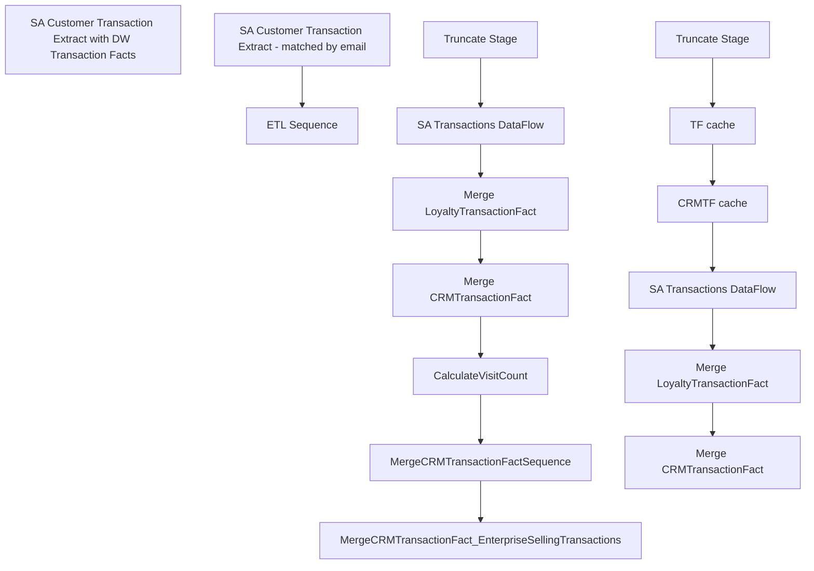

# SSIS Package: LoyaltyTransactionETL

**Project:** LoyaltyTransactionETL  
**Folder:** Loyalty  
**Server:** STL-SSIS-P-01  

## Connection Managers

| Name | Type | Server | Catalog | Connection (sanitized) |
|---|---|---|---|---|
| DW | OLEDB | papamart | dw | Data Source=papamart; Initial Catalog=dw; Provider=SQLNCLI11.1; Integrated Security=SSPI; Auto Translate=False |
| DWStaging | OLEDB | papamart | DWStaging | Data Source=papamart; Initial Catalog=DWStaging; Provider=SQLNCLI11.1; Integrated Security=SSPI; Auto Translate=False |
| SMTP Connection Manager | SMTP |  |  |  |
| auditworks | OLEDB | BEDROCKDB01 | auditworks | Data Source=BEDROCKDB01; Initial Catalog=auditworks; Provider=SQLNCLI11.1; Integrated Security=SSPI; Auto Translate=False |
| ctfLookup | CACHE |  |  |  |
| tfLookup | CACHE |  |  |  |

## Control Flow Tasks

| Task | Type |
|---|---|
| LoyaltyTransactionETL | Package |
| ETL Sequence | SEQUENCE |
| SA Customer Transaction Extract with DW Transaction Facts | SEQUENCE |
| CalculateVisitCount | ExecuteSQLTask |
| Merge CRMTransactionFact | ExecuteSQLTask |
| Merge LoyaltyTransactionFact | ExecuteSQLTask |
| MergeCRMTransactionFactSequence | ExecuteSQLTask |
| MergeCRMTransactionFact_EnterpriseSellingTransactions | ExecuteSQLTask |
| SA Transactions DataFlow | Pipeline |
| Truncate Stage | ExecuteSQLTask |
| SA Customer Transaction Extract - matched by email | SEQUENCE |
| CRMTF cache | Pipeline |
| Merge CRMTransactionFact | ExecuteSQLTask |
| Merge LoyaltyTransactionFact | ExecuteSQLTask |
| SA Transactions DataFlow | Pipeline |
| TF cache | Pipeline |
| Truncate Stage | ExecuteSQLTask |

## Control Flow Outline

```text
- ETL Sequence [SEQUENCE]
  - SA Customer Transaction Extract with DW Transaction Facts [SEQUENCE]
    - CalculateVisitCount [ExecuteSQLTask]
    - Merge CRMTransactionFact [ExecuteSQLTask]
    - Merge LoyaltyTransactionFact [ExecuteSQLTask]
    - MergeCRMTransactionFactSequence [ExecuteSQLTask]
    - MergeCRMTransactionFact_EnterpriseSellingTransactions [ExecuteSQLTask]
    - SA Transactions DataFlow [Pipeline]
    - Truncate Stage [ExecuteSQLTask]
- SA Customer Transaction Extract - matched by email [SEQUENCE]
  - CRMTF cache [Pipeline]
  - Merge CRMTransactionFact [ExecuteSQLTask]
  - Merge LoyaltyTransactionFact [ExecuteSQLTask]
  - SA Transactions DataFlow [Pipeline]
  - TF cache [Pipeline]
  - Truncate Stage [ExecuteSQLTask]
```

## Architecture Diagram



## Variables

| Namespace | Name | Expression-bound |
|---|---|---|
| User | BatchRunDate | No |
| User | CustFile | No |
| User | DeleteCount | No |
| User | DisableEventHandlerPostExecute | No |
| User | EndDate | Yes |
| User | ErrorCount | No |
| User | ErrorEmailActive | No |
| User | ErrorEmailMsg | No |
| User | ErrorEmailMsgAdditional | No |
| User | ErrorEmailMsgFooter | No |
| User | ErrorEmailMsgHeader | Yes |
| User | ErrorEmailMsgLog | No |
| User | ErrorEmailMsgLogQuery | Yes |
| User | ErrorEmailMsgValidation | No |
| User | ErrorEmailRecipientList | No |
| User | ErrorEmailSubject | Yes |
| User | GetDate | Yes |
| User | LogID | No |
| User | ParentLogID | No |
| User | RowCount | No |
| User | StartDate | Yes |
| User | UnprocessedCount | No |
| User | UpdateCount | No |

### Expression-bound variable values

#### User::EndDate

**Expression:**

```sql
dateadd("dd", @[$Package::DaysToInclude], @[User::StartDate])
```

**Evaluated value:**

```sql
11/26/2025
```

#### User::ErrorEmailMsgHeader

**Expression:**

```sql
"Machine:  " + @[System::MachineName] + " Package:  " + @[System::PackageName] + " Date:   " + (DT_STR, 30, 1252)  GETDATE() + " LogID:  " + (DT_STR, 30, 1252)@[User::ParentLogID]
```

**Evaluated value:**

```sql
Machine:  STL-BIDEV-D-05 Package:  LoyaltyTransactionETL Date:   2025-11-26 11:57:10.808000000 LogID:  435135
```

#### User::ErrorEmailMsgLogQuery

**Expression:**

```sql
"
select 'Source: ' + source + ' Error: ' + message as Message 
from ssistemplates.dbo.sysssislog with (nolock) 
where executionid = '" +  @[System::ExecutionInstanceGUID] + "' and event = 'OnError'"
```

**Evaluated value:**

```sql

select 'Source: ' + source + ' Error: ' + message as Message 
from ssistemplates.dbo.sysssislog with (nolock) 
where executionid = '{C26C5A3C-65D3-49A6-A7DF-1EE91A1BD536}' and event = 'OnError'
```

#### User::ErrorEmailSubject

**Expression:**

```sql
"Error: " + @[System::PackageName] + " On " + @[System::MachineName] 
```

**Evaluated value:**

```sql
Error: LoyaltyTransactionETL On STL-BIDEV-D-05
```

#### User::GetDate

**Expression:**

```sql
(DT_DATE)DATEDIFF("Day", (DT_DATE) 0, GETDATE())
```

**Evaluated value:**

```sql
11/26/2025
```

#### User::StartDate

**Expression:**

```sql
dateadd("dd", -@[$Package::DaysToGoBack] , @[User::GetDate] )
```

**Evaluated value:**

```sql
11/26/2025
```

## Execute SQL Tasks

### CalculateVisitCount

**Path:** `Package\ETL Sequence\SA Customer Transaction Extract with DW Transaction Facts\CalculateVisitCount`  
**Connection:** DW (papamart/dw)  

```sql
exec spCRMTransactionFactCalculateVisitCount

```

### Merge CRMTransactionFact

**Path:** `Package\ETL Sequence\SA Customer Transaction Extract with DW Transaction Facts\Merge CRMTransactionFact`  
**Connection:** DW (papamart/dw)  

```sql
exec spMergeCRMTransactionFactFromLoyaltyTransactionFact
```

### Merge LoyaltyTransactionFact

**Path:** `Package\ETL Sequence\SA Customer Transaction Extract with DW Transaction Facts\Merge LoyaltyTransactionFact`  
**Connection:** DWStaging (papamart/DWStaging)  

```sql
exec spMergeLoyaltyTransactionFact
```

### MergeCRMTransactionFactSequence

**Path:** `Package\ETL Sequence\SA Customer Transaction Extract with DW Transaction Facts\MergeCRMTransactionFactSequence`  
**Connection:** DW (papamart/dw)  

```sql
exec spMergeCRMTransactionFactSequence

```

### MergeCRMTransactionFact_EnterpriseSellingTransactions

**Path:** `Package\ETL Sequence\SA Customer Transaction Extract with DW Transaction Facts\MergeCRMTransactionFact_EnterpriseSellingTransactions`  
**Connection:** DW (papamart/dw)  

```sql
exec spMergeCRMTransactionFact_EnterpriseSellingTransactions 
```

### Truncate Stage

**Path:** `Package\ETL Sequence\SA Customer Transaction Extract with DW Transaction Facts\Truncate Stage`  
**Connection:** DWStaging (papamart/DWStaging)  

```sql
TRUNCATE TABLE LoyaltyTransactionFactStage

```

### Merge CRMTransactionFact

**Path:** `Package\SA Customer Transaction Extract - matched by email\Merge CRMTransactionFact`  
**Connection:** DW (papamart/dw)  

```sql
exec spMergeCRMTransactionFactFromLoyaltyTransactionFact
```

### Merge LoyaltyTransactionFact

**Path:** `Package\SA Customer Transaction Extract - matched by email\Merge LoyaltyTransactionFact`  
**Connection:** DWStaging (papamart/DWStaging)  

```sql
exec spMergeLoyaltyTransactionFact
```

### Truncate Stage

**Path:** `Package\SA Customer Transaction Extract - matched by email\Truncate Stage`  
**Connection:** DWStaging (papamart/DWStaging)  

```sql
TRUNCATE TABLE LoyaltyTransactionFactStage

```

## Data Flow: Sources

| Component | Source Object | Type | Data Flow Task | Connection | SQL Kind |
|---|---|---|---|---|---|
| vwPOSLoyaltyTransactionFact |  | OLEDBSource | SA Transactions DataFlow | auditworks | SqlCommand |
| OLE DB Source |  | OLEDBSource | CRMTF cache | DW | SqlCommand |
| vwPOSLoyaltyTransactionFactByEmail |  | OLEDBSource | SA Transactions DataFlow | auditworks | SqlCommand |
| OLE DB Source |  | OLEDBSource | TF cache | DW | SqlCommand |

#### vwPOSLoyaltyTransactionFact — SqlCommand

```sql
select 
	CustomerNumber collate SQL_Latin1_General_CP1_CI_AS as CustomerNumber,
	SATransactionID,
	LoyaltyTransactionType,
	matchedByEMail
from vwPOSLoyaltyTransactionExtract
--where SATransactionID=489382859
```

#### OLE DB Source — SqlCommand

```sql
select TransactionID, CRMTransactionType
from CRMTransactionFact
where cast(TransactionDate as date) >= cast(getdate()-45 as date)  
group by TransactionID, CRMTransactionType
```

#### vwPOSLoyaltyTransactionFactByEmail — SqlCommand

```sql
with
Trans as
	(
		select 
			cast(max(c.customer_no) as varchar(20)) as customer_no,
			c.transaction_id
		from customer c with (nolock) 
		--join sv_customer_role cr with (nolock) on c.customer_role=cr.customer_role
		where 1=1
		and c.customer_role in (1,4) 
		and c.customer_no is not null
		and c.customer_no<>'0'
		group by 
			c.transaction_id
/*
		UNION
		select 
			cast(max(c.customer_no) as varchar(20)) as customer_no,
			c.av_transaction_id
		from av_customer c with (nolock)
		--join sv_customer_role cr with (nolock) on c.customer_role=cr.customer_role
		where 1=1
		and c.customer_role in (1,4)
		and c.customer_no is not null
		and c.customer_no<>'0'
		and datepart(yyyy, transaction_date) = 2022
		group by 
			c.av_transaction_id
*/
	),
Tranz as
	(
		select 
			t.customer_no,
			t.transaction_id
			--c.email_address 
		from Trans t
		join customer c 
			on t.transaction_id=c.transaction_id
			and t.customer_no=c.customer_no
			and c.customer_role in (1,4) 
			and c.customer_no is not null
			and c.customer_no<>'0'
		join transaction_header th on t.transaction_id=th.transaction_id
		where th.store_no=521--jumpmind pos stores only--eventually this will be all stores
		group by 
			t.customer_no,
			t.transaction_id
			--c.email_address
	),
FirstTran as
	(
		select 
			customer_no, 
			min(transaction_id) FirstTran
		from Tranz
		group by customer_no
	)
select
	t.customer_no as CustomerNumber,
	--t.email_address,
	cast(t.transaction_id as int) as SATransactionID,
	case 
		when ft.customer_no is not null 
			then 'New'
		 else 'Repeat'
	end	as LoyaltyTransactionType
from Tranz t
left join FirstTran ft 
	on t.transaction_id=ft.FirstTran
	and t.customer_no=ft.customer_no
group by 
	t.customer_no,
	cast(t.transaction_id as int),
	case 
		when ft.customer_no is not null 
			then 'New'
		 else 'Repeat'
	end
```

#### OLE DB Source — SqlCommand

```sql
select
	tf.transaction_id,
	tf.store_key as StoreKey,
	cast(dd.actual_date as date) as TransactionDate,
	tf.date_key as DateKey,
	tf.register_no as POSRegisterNumber,
	tf.transaction_no as POSTransactionNumber,
	tf.GAAP_sales_amount as GaapSales,
	tf.Gaap_units as GaapUnits 
                ,tf2.isWebGift
from TransactionFactsDynamics tf with (nolock)
join date_dim dd on tf.date_key=dd.date_key
join store_dim sd on tf.store_key=sd.store_key
left join Transaction_Facts tf2 on tf.transaction_id = tf2.transaction_id
where cast(dd.actual_date as date) >= cast(getdate()-45 as date)
```

## Data Flow: Destinations

| Component | Target Table | Type | Data Flow Task | Connection | SQL Kind |
|---|---|---|---|---|---|
| LoyaltyTransactionFactStage |  | OLEDBDestination | SA Transactions DataFlow | DWStaging |  |
| LoyaltyTransactionFactStage |  | OLEDBDestination | SA Transactions DataFlow | DWStaging |  |
