# SSIS Package: LoyaltyTransactionETLAv

**Project:** LoyaltyTransactionETLAv  
**Folder:** Loyalty  
**Server:** STL-SSIS-P-01  

## Architecture Diagram

```mermaid
flowchart TD
    subgraph Connections
        auditworks_conn(["auditworks [OLEDB]"])
        ctfLookup_conn(["ctfLookup [CACHE]"])
        DW_conn(["DW [OLEDB]"])
        DWStaging_conn(["DWStaging [OLEDB]"])
        SMTP_Connection_Manager_conn(["SMTP Connection Manager [SMTP]"])
        tfLookup_conn(["tfLookup [CACHE]"])
    end
    subgraph ControlFlow
        LoyaltyTransactionETLAv_task["LoyaltyTransactionETLAv"]
        ETL_Sequence_task["ETL Sequence"]
        LoyaltyTransactionETLAv_task --> ETL_Sequence_task
        SA_Customer_Transaction_Extract_with_DW_Transaction_Facts_task["SA Customer Transaction Extract with DW Transaction Facts"]
        ETL_Sequence_task --> SA_Customer_Transaction_Extract_with_DW_Transaction_Facts_task
        CalculateVisitCount_task["CalculateVisitCount"]
        SA_Customer_Transaction_Extract_with_DW_Transaction_Facts_task --> CalculateVisitCount_task
        Merge_CRMTransactionFact_task["Merge CRMTransactionFact"]
        CalculateVisitCount_task --> Merge_CRMTransactionFact_task
        Merge_LoyaltyTransactionFact_task["Merge LoyaltyTransactionFact"]
        Merge_CRMTransactionFact_task --> Merge_LoyaltyTransactionFact_task
        MergeCRMTransactionFactSequence_task["MergeCRMTransactionFactSequence"]
        Merge_LoyaltyTransactionFact_task --> MergeCRMTransactionFactSequence_task
        MergeCRMTransactionFact_EnterpriseSellingTransactions_task["MergeCRMTransactionFact_EnterpriseSellingTransactions"]
        MergeCRMTransactionFactSequence_task --> MergeCRMTransactionFact_EnterpriseSellingTransactions_task
        SA_Transactions_DataFlow_task["SA Transactions DataFlow"]
        MergeCRMTransactionFact_EnterpriseSellingTransactions_task --> SA_Transactions_DataFlow_task
        Truncate_Stage_task["Truncate Stage"]
        SA_Transactions_DataFlow_task --> Truncate_Stage_task
        SA_Customer_Transaction_Extract___matched_by_email_task["SA Customer Transaction Extract - matched by email"]
        Truncate_Stage_task --> SA_Customer_Transaction_Extract___matched_by_email_task
        CRMTF_cache_task["CRMTF cache"]
        SA_Customer_Transaction_Extract___matched_by_email_task --> CRMTF_cache_task
        Merge_CRMTransactionFact_task["Merge CRMTransactionFact"]
        CRMTF_cache_task --> Merge_CRMTransactionFact_task
        Merge_LoyaltyTransactionFact_task["Merge LoyaltyTransactionFact"]
        Merge_CRMTransactionFact_task --> Merge_LoyaltyTransactionFact_task
        SA_Transactions_DataFlow_task["SA Transactions DataFlow"]
        Merge_LoyaltyTransactionFact_task --> SA_Transactions_DataFlow_task
        TF_cache_task["TF cache"]
        SA_Transactions_DataFlow_task --> TF_cache_task
        Truncate_Stage_task["Truncate Stage"]
        TF_cache_task --> Truncate_Stage_task
        SA_Transactions_DataFlow_1_task["SA Transactions DataFlow 1"]
        Truncate_Stage_task --> SA_Transactions_DataFlow_1_task
    end
```

## Connection Managers

| Name | Type |
|---|---|
| auditworks | OLEDB |
| ctfLookup | CACHE |
| DW | OLEDB |
| DWStaging | OLEDB |
| SMTP Connection Manager | SMTP |
| tfLookup | CACHE |

## Control Flow Tasks

| Task | Type |
|---|---|
| LoyaltyTransactionETLAv | Microsoft.Package |
| ETL Sequence | STOCK:SEQUENCE |
| SA Customer Transaction Extract with DW Transaction Facts | STOCK:SEQUENCE |
| CalculateVisitCount | Microsoft.ExecuteSQLTask |
| Merge CRMTransactionFact | Microsoft.ExecuteSQLTask |
| Merge LoyaltyTransactionFact | Microsoft.ExecuteSQLTask |
| MergeCRMTransactionFactSequence | Microsoft.ExecuteSQLTask |
| MergeCRMTransactionFact_EnterpriseSellingTransactions | Microsoft.ExecuteSQLTask |
| SA Transactions DataFlow | Microsoft.Pipeline |
| Truncate Stage | Microsoft.ExecuteSQLTask |
| SA Customer Transaction Extract - matched by email | STOCK:SEQUENCE |
| CRMTF cache | Microsoft.Pipeline |
| Merge CRMTransactionFact | Microsoft.ExecuteSQLTask |
| Merge LoyaltyTransactionFact | Microsoft.ExecuteSQLTask |
| SA Transactions DataFlow | Microsoft.Pipeline |
| TF cache | Microsoft.Pipeline |
| Truncate Stage | Microsoft.ExecuteSQLTask |
| SA Transactions DataFlow 1 | Microsoft.Pipeline |

## Data Flow: Sources

| Component | SQL Preview |
|---|---|
|  | select CustomerNumber  from CRMCustomerDim with (nolock) |
|  | select TransactionID, CRMTransactionType from CRMTransactionFact group by TransactionID, CRMTransactionType |
|  | --lookup dw - only matches pass select 	tf.transaction_id, 	tf.store_key as StoreKey, 	cast(dd.actual_date as date) as TransactionDate, 	tf.date_key as DateKey, 	tf.register_no as POSRegisterNumber, 	tf.transaction_no as POSTransactionNumber, 	tf.GAAP_sales_amount as GaapSales, 	tf.Gaap_units as GaapUnits  from TransactionFactsDynamics tf with (nolock) join date_dim dd on tf.date_key=dd.date_key j |
|  | select  	CustomerNumber collate SQL_Latin1_General_CP1_CI_AS as CustomerNumber, 	SATransactionID, 	LoyaltyTransactionType, 	matchedByEMail from vwPOSLoyaltyTransactionExtract --where SATransactionID=489382859 |
|  | select TransactionID, CRMTransactionType from CRMTransactionFact where cast(TransactionDate as date) >= cast(getdate()-45 as date)   group by TransactionID, CRMTransactionType |
|  | select 	tf.transaction_id, 	tf.store_key as StoreKey, 	cast(dd.actual_date as date) as TransactionDate, 	tf.date_key as DateKey, 	tf.register_no as POSRegisterNumber, 	tf.transaction_no as POSTransactionNumber, 	tf.GAAP_sales_amount as GaapSales, 	tf.Gaap_units as GaapUnits  from TransactionFactsDynamics tf with (nolock) join date_dim dd on tf.date_key=dd.date_key join store_dim sd on tf.store_key |
|  | with Trans as 	( 		select  			cast(max(c.customer_no) as varchar(20)) as customer_no, 			c.transaction_id 		from customer c with (nolock)  		--join sv_customer_role cr with (nolock) on c.customer_role=cr.customer_role 		where 1=1 		and c.customer_role in (1,4)  		and c.customer_no is not null 		and c.customer_no<>'0' 		group by  			c.transaction_id /* 		UNION 		select  			cast(max(c.customer_no) a |
|  | select 	tf.transaction_id, 	tf.store_key as StoreKey, 	cast(dd.actual_date as date) as TransactionDate, 	tf.date_key as DateKey, 	tf.register_no as POSRegisterNumber, 	tf.transaction_no as POSTransactionNumber, 	tf.GAAP_sales_amount as GaapSales, 	tf.Gaap_units as GaapUnits  from TransactionFactsDynamics tf with (nolock) join date_dim dd on tf.date_key=dd.date_key join store_dim sd on tf.store_key |
|  | select CustomerNumber  from CRMCustomerDim with (nolock) |
|  | select TransactionID, CRMTransactionType from CRMTransactionFact  where TransactionDate  > '03/20/2024' group by TransactionID, CRMTransactionType |
|  | --lookup dw - only matches pass select 	tf.transaction_id, 	tf.store_key as StoreKey, 	cast(dd.actual_date as date) as TransactionDate, 	tf.date_key as DateKey, 	tf.register_no as POSRegisterNumber, 	tf.transaction_no as POSTransactionNumber, 	tf.GAAP_sales_amount as GaapSales, 	tf.Gaap_units as GaapUnits  from TransactionFactsDynamics tf with (nolock) join date_dim dd on tf.date_key=dd.date_key j |
|  | select  	CustomerNumber collate SQL_Latin1_General_CP1_CI_AS as CustomerNumber, 	SATransactionID, 	LoyaltyTransactionType, 	matchedByEMail from vwPOSLoyaltyTransactionExtract --where SATransactionID=489382859 |

## Data Flow: Destinations

| Component | Destination |
|---|---|
|  | [dbo].[LoyaltyTransactionFactStage] |
|  | [dbo].[vwPOSLoyaltyTransactionExtractAv] |
|  | [dbo].[LoyaltyTransactionFactStage] |
|  | [dbo].[vwPOSLoyaltyTransactionExtractByEmailAV] |
|  | [dbo].[LoyaltyTransactionFactStage] |
|  | [dbo].[vwPOSLoyaltyTransactionExtractAv] |

