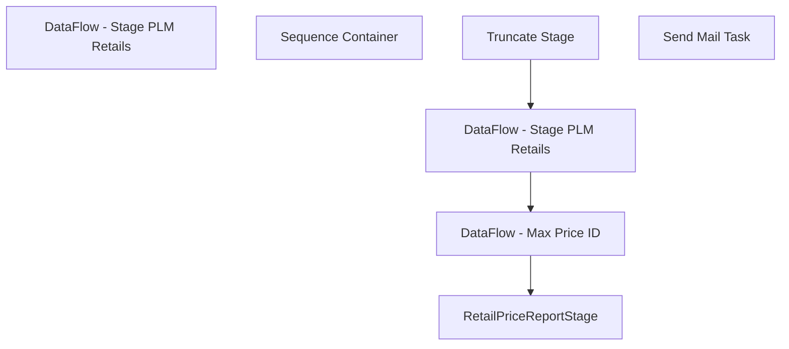

# SSIS Package: RetailPriceReportStage

**Project:** RetailPriceReportStage  
**Folder:** Merch  
**Server:** STL-SSIS-P-01  

## Connection Managers

| Name | Type | Server | Catalog | Connection (sanitized) |
|---|---|---|---|---|
| ME_01 | OLEDB | bedrockdb02 | me_01 | Data Source=bedrockdb02; Initial Catalog=me_01; Provider=SQLNCLI11.1; Integrated Security=SSPI; Auto Translate=False |
| PLM | OLEDB | plmdb01 | ProductLifecycleManagement | Data Source=plmdb01; Initial Catalog=ProductLifecycleManagement; Provider=SQLNCLI11.1; Integrated Security=SSPI; Auto Translate=False |
| SMTP | SMTP |  |  |  |

## Control Flow Tasks

| Task | Type |
|---|---|
| RetailPriceReportStage | Package |
| DataFlow - Stage PLM Retails | Pipeline |
| Sequence Container | SEQUENCE |
| DataFlow - Max Price ID | Pipeline |
| DataFlow - Stage PLM Retails | Pipeline |
| RetailPriceReportStage | Pipeline |
| Truncate Stage | ExecuteSQLTask |
| Send Mail Task | SendMailTask |

## Control Flow Outline

```text
- Send Mail Task [SendMailTask]
- DataFlow - Stage PLM Retails [Pipeline]
- Sequence Container [SEQUENCE]
  - DataFlow - Max Price ID [Pipeline]
  - DataFlow - Stage PLM Retails [Pipeline]
  - RetailPriceReportStage [Pipeline]
  - Truncate Stage [ExecuteSQLTask]
```

## Architecture Diagram



## Variables

| Namespace | Name | Expression-bound |
|---|---|---|
| System | Propagate | No |
| User | DateTimeStamp | Yes |
| User | EndDate | Yes |
| User | EndDateAsDATE | Yes |
| User | GetDate | Yes |
| User | GetDateAsDATE | Yes |
| User | StartDate | Yes |
| User | StartDateAsDATE | Yes |

### Expression-bound variable values

#### User::DateTimeStamp

**Expression:**

```sql
(DT_WSTR,4)DATEPART("yyyy",GetDate()) 
+ (DT_WSTR,4)DATEPART("mm",GetDate()) 
+ (DT_WSTR,4)DATEPART("dd",GetDate()) 
+ (DT_WSTR,4)DATEPART("hh",GetDate()) 
+ (DT_WSTR,4)DATEPART("mi",GetDate()) 
+ (DT_WSTR,4)DATEPART("ss",GetDate()) 
+ (DT_WSTR,4)DATEPART("ms",GetDate())
```

**Evaluated value:**

```sql
2020103011725177
```

#### User::EndDate

**Expression:**

```sql
dateadd("dd", @[$Package::DaysToInclude], @[User::StartDate])
```

**Evaluated value:**

```sql
10/30/2020
```

#### User::EndDateAsDATE

**Expression:**

```sql
(DT_WSTR, 4) datepart("year", @[User::EndDate])  + "-" + 
(DT_WSTR, 2) datepart("mm", @[User::EndDate])  + "-" + 
(DT_WSTR, 2) datepart("dd",  @[User::EndDate])
```

**Evaluated value:**

```sql
2020-10-30
```

#### User::GetDate

**Expression:**

```sql
(DT_DATE)DATEDIFF("Day", (DT_DATE) 0, GETDATE())
```

**Evaluated value:**

```sql
10/30/2020
```

#### User::GetDateAsDATE

**Expression:**

```sql
(DT_WSTR, 4) datepart("year", @[User::GetDate])  + "-" + 
(DT_WSTR, 2) datepart("mm", @[User::GetDate])  + "-" + 
(DT_WSTR, 2) datepart("dd",  @[User::GetDate])
```

**Evaluated value:**

```sql
2020-10-30
```

#### User::StartDate

**Expression:**

```sql
dateadd("dd", -@[$Package::DaysToGoBack] , @[User::GetDate] )
```

**Evaluated value:**

```sql
10/29/2020
```

#### User::StartDateAsDATE

**Expression:**

```sql
(DT_WSTR, 4) datepart("year", @[User::StartDate])  + "-" + 
(DT_WSTR, 2) datepart("mm", @[User::StartDate])  + "-" + 
(DT_WSTR, 2) datepart("dd",  @[User::StartDate])
```

**Evaluated value:**

```sql
2020-10-29
```

## Execute SQL Tasks

### Truncate Stage

**Path:** `Package\Sequence Container\Truncate Stage`  
**Connection:** ME_01 (bedrockdb02/me_01)  

```sql
TRUNCATE TABLE PLMRetailsStage
TRUNCATE TABLE MerchMaxPriceIDStage
TRUNCATE TABLE RetailPriceReportDataStage
```

## Data Flow: Sources

| Component | Source Object | Type | Data Flow Task | Connection | SQL Kind |
|---|---|---|---|---|---|
| PLM Retails |  | OLEDBSource | DataFlow - Stage PLM Retails | PLM | SqlCommand |
| MaxPriceID |  | OLEDBSource | DataFlow - Max Price ID | ME_01 | SqlCommand |
| PLM Retails |  | OLEDBSource | DataFlow - Stage PLM Retails | PLM | SqlCommand |
| Retail Price Report SQL |  | OLEDBSource | RetailPriceReportStage | ME_01 | SqlCommand |

#### PLM Retails — SqlCommand

```sql
SELECT cast(ap.babUSSKU as varchar(6)) AS 'SKU',
		   ap.babUSRetail AS 'Retail', 
		   'US' AS PriceType,
		   ap._ExportedDate_ AS 'Last Export'
		FROM archive.products ap
		INNER JOIN
		(SELECT babUSSKU, MAX(_ExportedDate_) AS ed
		FROM archive.products
		GROUP BY babUSSKU) gap
		ON ap.babUSSKU = gap.babUSSKU
		AND ap._ExportedDate_ = gap.ED
		union
		SELECT cast(ap.BABDinoSKU as varchar(6)) AS 'SKU',
		   ap.babUSRetail AS 'US Retail', 
		   'HOME' AS PriceType,
		   ap._ExportedDate_ AS 'Last Export'
		FROM archive.products ap
		INNER JOIN
		(SELECT babUSSKU, MAX(_ExportedDate_) AS ed
		FROM archive.products
		GROUP BY babUSSKU) gap
		ON ap.babUSSKU = gap.babUSSKU
		AND ap._ExportedDate_ = gap.ED
		union
		SELECT cast(ap.babCANSKU as varchar(6))AS 'SKU',
		   ap.babCANRetail AS 'Retail', 
		   'CA' AS PriceType,
		   ap._ExportedDate_ AS 'Last Export'
		FROM archive.products ap
		INNER JOIN
		(SELECT babUSSKU, MAX(_ExportedDate_) AS ed
		FROM archive.products
		GROUP BY babUSSKU) gap
		ON ap.babUSSKU = gap.babUSSKU
		AND ap._ExportedDate_ = gap.ED
		union
		SELECT cast(ap.babukSKU as varchar(6)) AS 'SKU',
		   ap.babUKRetail AS 'Retail', 
		   'UK' AS PriceType,
		   ap._ExportedDate_ AS 'Last Export'
		FROM archive.products ap
		INNER JOIN
		(SELECT babUSSKU, MAX(_ExportedDate_) AS ed
		FROM archive.products
		GROUP BY babUSSKU) gap
		ON ap.babUSSKU = gap.babUSSKU
		AND ap._ExportedDate_ = gap.ED
		union
		SELECT cast(ap.babukSKU as varchar(6)) AS 'SKU',
		   ap.babIRERetail AS 'Retail', 
		   'IE' AS PriceType,
		   ap._ExportedDate_ AS 'Last Export'
		FROM archive.products ap
		INNER JOIN
		(SELECT babUSSKU, MAX(_ExportedDate_) AS ed
		FROM archive.products
		GROUP BY babUSSKU) gap
		ON ap.babUSSKU = gap.babUSSKU
		AND ap._ExportedDate_ = gap.ED
		union
		SELECT cast(ap.babukSKU as varchar(6)) AS 'SKU',
		   ap.babKrona AS 'Retail', 
		   'DK' AS PriceType,
		   ap._ExportedDate_ AS 'Last Export'
		FROM archive.products ap
		INNER JOIN
		(SELECT babUSSKU, MAX(_ExportedDate_) AS ed
		FROM archive.products
		GROUP BY babUSSKU) gap
		ON ap.babUSSKU = gap.babUSSKU
		AND ap._ExportedDate_ = gap.ED
		where left(babukSKU,1) = '4' and ISNULL(ap.babKrona,'0') <> '0'
		union
		SELECT cast('8' + right(ap.babukSKU,5) as varchar(6)) AS 'SKU',
		   ap.babRMB AS 'Retail', 
		   'CN' AS PriceType,
		   ap._ExportedDate_ AS 'Last Export'
		FROM archive.products ap
		INNER JOIN
		(SELECT babUSSKU, MAX(_ExportedDate_) AS ed
		FROM archive.products
		GROUP BY babUSSKU) gap
		ON ap.babUSSKU = gap.babUSSKU
		AND ap._ExportedDate_ = gap.ED
		where left(babukSKU,1) = '4' and ISNULL(ap.babRMB,'0') <> '0'
```

#### MaxPriceID — SqlCommand

```sql
select 
			cast(s.style_code as varchar(6)) as style_code,
			s.short_desc,  
			ip.jurisdiction_id, 
			max(ib_price_id) as ib_price_id 
		  from dbo.style s (NOLOCK)  
		  join ib_price ip (NOLOCK) on s.style_id = ip.style_id  
		  join style_group sg (NOLOCK) on s.style_id = sg.style_id 
		  join hierarchy_group hg (NOLOCK) on sg.hierarchy_group_id = hg.hierarchy_group_id 
		  where 
			left(ISNULL(hg.hierarchy_group_code,'X'),1) = 'W' 
			and cast(convert(varchar, getdate(),101)as datetime) 
				between cast(convert(varchar, ip.start_date ,101)as datetime) 
				  and isnull(cast(convert(varchar, ip.end_date ,101)as datetime), cast(convert(varchar, getdate() ,101)as datetime)) 
			and ip.cancel_promo_flag <> 1 and ip.location_id is null 
		  group by s.style_code,s.short_desc,ip.jurisdiction_id
```

#### PLM Retails — SqlCommand

```sql
with 
MaxExportDate as
	(
		SELECT 
			babUSSKU, 
			MAX(_ExportedDate_) AS ed
		FROM archive.products
		GROUP BY babUSSKU
	),
US as
	(
		SELECT 
			cast(ap.babUSSKU as varchar(6)) AS 'SKU',
			ap.babUSRetail AS 'Retail', 
			'US' AS PriceType,
			ap._ExportedDate_ AS 'Last Export'
		FROM archive.products ap
		INNER JOIN MaxExportDate gap
			ON ap.babUSSKU = gap.babUSSKU
			AND ap._ExportedDate_ = gap.ED
		where ap.babUSSKU is not null
		union
		SELECT 
			cast(ap.babUSSACSKU as varchar(6)) AS 'SKU',
			ap.babUSRetail AS 'Retail', 
			'US' AS PriceType,
			ap._ExportedDate_ AS 'Last Export'
		FROM archive.products ap
		INNER JOIN MaxExportDate gap
			ON ap.babUSSKU = gap.babUSSKU
			AND ap._ExportedDate_ = gap.ED
		where ap.babUSSACSKU is not null
		UNION
		SELECT 
			cast(ap.babUSSNCSKU as varchar(6)) AS 'SKU',
			ap.babUSRetail AS 'Retail', 
			'US' AS PriceType,
			ap._ExportedDate_ AS 'Last Export'
		FROM archive.products ap
		INNER JOIN MaxExportDate gap
			ON ap.babUSSKU = gap.babUSSKU
			AND ap._ExportedDate_ = gap.ED
		where ap.babUSSNCSKU is not null
	),
CN as
	(
		SELECT 
			cast(ap.babCANSKU as varchar(6))AS 'SKU',
			ap.babCANRetail AS 'Retail', 
			'CA' AS PriceType,
			ap._ExportedDate_ AS 'Last Export'
		FROM archive.products ap
		INNER JOIN MaxExportDate gap
			ON ap.babUSSKU = gap.babUSSKU
			AND ap._ExportedDate_ = gap.ED
		where ap.babCANSKU is not null
	),
UK as
	(
		SELECT 
			cast(ap.babukSKU as varchar(6)) AS 'SKU',
			ap.babUKRetail AS 'Retail', 
			'UK' AS PriceType,
			ap._ExportedDate_ AS 'Last Export'
		FROM archive.products ap
		INNER JOIN MaxExportDate gap
			ON ap.babUSSKU = gap.babUSSKU
			AND ap._ExportedDate_ = gap.ED
		where ap.babukSKU is not null
		union
		SELECT 
			cast(ap.babUKSACSKU as varchar(6)) AS 'SKU',
			ap.babUKRetail AS 'Retail', 
			'UK' AS PriceType,
			ap._ExportedDate_ AS 'Last Export'
		FROM archive.products ap
		INNER JOIN MaxExportDate gap
			ON ap.babUSSKU = gap.babUSSKU
			AND ap._ExportedDate_ = gap.ED
		where ap.babUKSACSKU is not null
		union
		SELECT 
			cast(ap.babUKSNCSKU as varchar(6)) AS 'SKU',
			ap.babUKRetail AS 'Retail', 
			'UK' AS PriceType,
			ap._ExportedDate_ AS 'Last Export'
		FROM archive.products ap
		INNER JOIN MaxExportDate gap
			ON ap.babUSSKU = gap.babUSSKU
			AND ap._ExportedDate_ = gap.ED
		where ap.babUKSNCSKU is not null
	),
IeDk as
	(
		SELECT 
			cast(ap.babukSKU as varchar(6)) AS 'SKU',
			ap.babIRERetail AS 'Retail', 
			'IE' AS PriceType,
			ap._ExportedDate_ AS 'Last Export'
		FROM archive.products ap
		INNER JOIN MaxExportDate gap
			ON ap.babUSSKU = gap.babUSSKU
			AND ap._ExportedDate_ = gap.ED
		where ap.babukSKU is not null
		union
		SELECT 
			cast(ap.babukSKU as varchar(6)) AS 'SKU',
			ap.babKrona AS 'Retail', 
			'DK' AS PriceType,
			ap._ExportedDate_ AS 'Last Export'
		FROM archive.products ap
		INNER JOIN MaxExportDate gap
			ON ap.babUSSKU = gap.babUSSKU
			AND ap._ExportedDate_ = gap.ED
		where 
			left(babukSKU,1) = '4' 
			and ISNULL(ap.babKrona,'0') <> '0'
			and ap.babukSKU is not null
		union
		SELECT 
			cast('8' + right(ap.babukSKU,5) as varchar(6)) AS 'SKU',
			ap.babRMB AS 'Retail', 
			'CN' AS PriceType,
			ap._ExportedDate_ AS 'Last Export'
		FROM archive.products ap
		INNER JOIN MaxExportDate gap
			ON ap.babUSSKU = gap.babUSSKU
			AND ap._ExportedDate_ = gap.ED
		where 
			left(babukSKU,1) = '4' 
			and ISNULL(ap.babRMB,'0') <> '0'
			and ap.babukSKU is not null
	)
select * from US
union
select * from CN
union
select * from UK
union
select * from IeDk
```

#### Retail Price Report SQL — SqlCommand

```sql
select   --data will return multiple rows until join enforced in the lookup to MerchMaxPriceIDStage
	j.jurisdiction_code,
	cast(s.style_code as varchar(6)) as style_code,
	s.short_desc, 
	ecp.custom_property_value,  
	case 
		when ip.end_date is null  
			then null  
		else ip.document_number 
	end as document_number,   
	case 
		when ip.end_date is null   
			then null  
		else ip.start_date  
	end as start_date,  
	ip.end_date,   
	case 
		when end_date is null   
			then null  
		else ip.selling_retail_price  
	end as selling_retail_price,   
	sr.current_selling_retail,  
	sr.original_selling_retail, 
	sv.current_cost, 
	plm.Retail, 
	hg.hierarchy_group_code as hGroup
from ib_price ip (NOLOCK) 
join style s (NOLOCK) on ip.style_id = s.style_id
join style_group sg (NOLOCK) on s.style_id = sg.style_id 
join hierarchy_group hg (NOLOCK) on sg.hierarchy_group_id = hg.hierarchy_group_id 
join jurisdiction j (NOLOCK) on ip.jurisdiction_id = j.jurisdiction_id  
join style_retail sr (NOLOCK) on s.style_id = sr.style_id and j.jurisdiction_id = sr.jurisdiction_id
join style_vendor sv (nolock) on s.style_id = sv.style_id 
join MerchMaxPriceIDStage kmip on ip.ib_price_id = kmip.ib_price_id
left outer join entity_custom_property ecp on s.style_id = ecp.parent_id and ecp.custom_property_id = 60 
left join PLMRetailsStage plm on (jurisdiction_code = PriceType and s.Style_Code = plm.StyleCode)
where  sv.primary_vendor_flag = 1  --and j.jurisdiction_code = 'Home' 
and left(s.style_code,1) + cast(j.jurisdiction_ID as char(1)) in ('01','21','31','13','42','45','47','88')
```

## Data Flow: Destinations

| Component | Target Table | Type | Data Flow Task | Connection | SQL Kind |
|---|---|---|---|---|---|
| PLMRetailsStage |  | OLEDBDestination | DataFlow - Stage PLM Retails | ME_01 |  |
| MerchMaxPriceIDStage |  | OLEDBDestination | DataFlow - Max Price ID | ME_01 |  |
| PLMRetailsStage |  | OLEDBDestination | DataFlow - Stage PLM Retails | ME_01 |  |
| RetailPriceReportDataStage |  | OLEDBDestination | RetailPriceReportStage | ME_01 |  |
