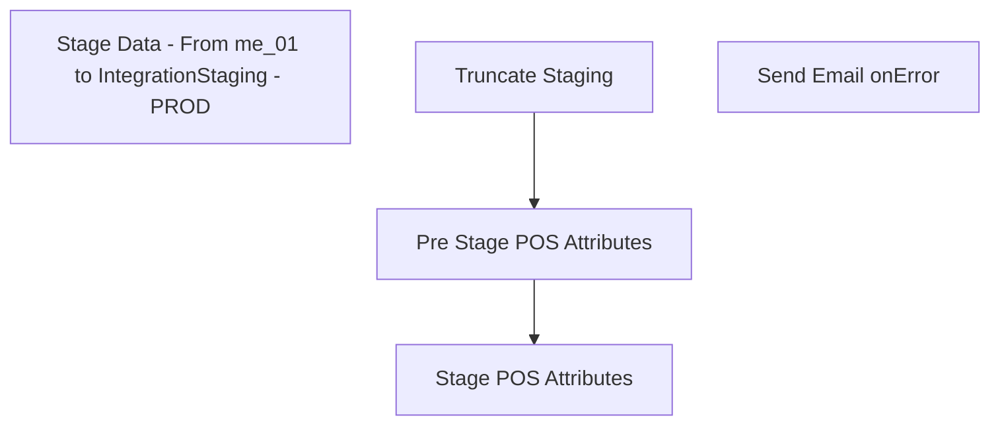

# SSIS Package: PBIProductDataExtract

**Project:** PBIProductDataExtract  
**Folder:** POS  
**Server:** STL-SSIS-P-01  

## Connection Managers

| Name | Type | Server | Catalog | Connection (sanitized) |
|---|---|---|---|---|
| IntegrationStaging | OLEDB | stl-ssis-p-01 | IntegrationStaging | Data Source=stl-ssis-p-01; Initial Catalog=IntegrationStaging; Provider=SQLNCLI11.1; Integrated Security=SSPI; Auto Translate=False |
| SMTP_EMAIL | SMTP |  |  |  |
| auditworks | OLEDB | bedrockdb01 | auditworks | Data Source=bedrockdb01; Initial Catalog=auditworks; Provider=SQLNCLI11.1; Integrated Security=SSPI; Auto Translate=False |
| me_01 | OLEDB | bedrockdb02 | me_01 | Data Source=bedrockdb02; Initial Catalog=me_01; Provider=SQLNCLI11.1; Integrated Security=SSPI; Auto Translate=False |

## Control Flow Tasks

| Task | Type |
|---|---|
| PBIProductDataExtract | Package |
| Stage Data - From me_01 to IntegrationStaging - PROD | SEQUENCE |
| Pre Stage POS Attributes | ExecuteSQLTask |
| Stage POS Attributes | Pipeline |
| Truncate Staging | ExecuteSQLTask |
| Send Email onError | SendMailTask |

## Control Flow Outline

```text
- Send Email onError [SendMailTask]
- Stage Data - From me_01 to IntegrationStaging - PROD [SEQUENCE]
  - Pre Stage POS Attributes [ExecuteSQLTask]
  - Stage POS Attributes [Pipeline]
  - Truncate Staging [ExecuteSQLTask]
```

## Architecture Diagram



## Variables

| Namespace | Name | Expression-bound |
|---|---|---|
| System | Propagate | No |
| User | AltImageTagsFileName | No |
| User | AltImageTagsFileRename | Yes |
| User | ChildParentFilenameForLoop | No |
| User | DateString | Yes |

### Expression-bound variable values

#### User::AltImageTagsFileRename

**Expression:**

```sql
"\\\\stl-ssis-p-01\\IntegrationStaging\\WEB\\MasterDataXtras\\AltImageTagsArchive\\AltImageTags" +  @[User::DateString] + ".csv"
```

**Evaluated value:**

```sql
\\stl-ssis-p-01\IntegrationStaging\WEB\MasterDataXtras\AltImageTagsArchive\AltImageTags2024065144829977.csv
```

#### User::DateString

**Expression:**

```sql
(DT_STR, 4, 1252) DATEPART("yy" , GETDATE()) + RIGHT("0" + (DT_STR, 2, 1252) DATEPART("mm" , GETDATE()), 2) + (DT_STR, 2, 1252) DATEPART("dd" , GETDATE()) + (DT_STR, 2, 1252) DATEPART("hh" , GETDATE()) + (DT_STR, 2, 1252) DATEPART("mi" , GETDATE())+ (DT_STR, 2, 1252) DATEPART("ss" , GETDATE()) +  (DT_STR, 3, 1252) DATEPART("ms" , GETDATE())
```

**Evaluated value:**

```sql
2024065144829980
```

## Execute SQL Tasks

### Pre Stage POS Attributes

**Path:** `Package\Stage Data - From me_01 to IntegrationStaging - PROD\Pre Stage POS Attributes`  
**Connection:** me_01 (bedrockdb02/me_01)  

```sql
exec spPBISelectProductCatalogMasterAttributes 
```

### Truncate Staging

**Path:** `Package\Stage Data - From me_01 to IntegrationStaging - PROD\Truncate Staging`  
**Connection:** IntegrationStaging (stl-ssis-p-01/IntegrationStaging)  

```sql
TRUNCATE TABLE POS.PBIProductCatalogMasterAttributesStage

```

## Data Flow: Sources

| Component | Source Object | Type | Data Flow Task | Connection | SQL Kind |
|---|---|---|---|---|---|
| vwPBIProductCatalogWithHierarchyStage |  | OLEDBSource | Stage POS Attributes | me_01 |  |

## Data Flow: Destinations

| Component | Target Table | Type | Data Flow Task | Connection | SQL Kind |
|---|---|---|---|---|---|
| PBIProductCatalogMasterAttributesStage |  | OLEDBDestination | Stage POS Attributes | IntegrationStaging |  |
