# SSIS Package: POS_ProductDataExtract

**Project:** POS_ProductDataExtract  
**Folder:** POS  
**Server:** STL-SSIS-P-01  

## Connection Managers

| Name | Type | Server | Catalog | Connection (sanitized) |
|---|---|---|---|---|
| IntegrationStaging | OLEDB | stl-ssis-p-01 | IntegrationStaging | Data Source=stl-ssis-p-01; Initial Catalog=IntegrationStaging; Provider=SQLNCLI11.1; Integrated Security=SSPI; Auto Translate=False |
| ProductsForPromotions CSV | FLATFILE |  |  |  |
| SMTP_EMAIL | SMTP |  |  |  |
| auditworks | OLEDB | bedrockdb01 | auditworks | Data Source=bedrockdb01; Initial Catalog=auditworks; Provider=SQLNCLI11.1; Integrated Security=SSPI; Auto Translate=False |
| me_01 | OLEDB | bedrockdb02 | me_01 | Data Source=bedrockdb02; Initial Catalog=me_01; Provider=SQLNCLI11.1; Integrated Security=SSPI; Auto Translate=False |

## Control Flow Tasks

| Task | Type |
|---|---|
| POS_ProductDataExtract | Package |
| Sequence Container | SEQUENCE |
| SeqCont - Load Tax Item Groups Ref Table from Auditworks | SEQUENCE |
| Stage Tax Ref Table | Pipeline |
| Truncate Stage | ExecuteSQLTask |
| Stage Data - From me_01 to IntegrationStaging - DEV | SEQUENCE |
| Pre Stage POS Attributes | ExecuteSQLTask |
| Stage POS Attributes | Pipeline |
| Truncate Staging | ExecuteSQLTask |
| Stage Data - From me_01 to IntegrationStaging - PROD | SEQUENCE |
| Merge POS ProductCatalogMasterAttributesStage | ExecuteSQLTask |
| Products CSV | Pipeline |
| Send Mail Task | SendMailTask |
| spPOSSelectProductCatalogMasterAttributes | ExecuteSQLTask |
| spPosStagePOSProductCatalogWithHierarchyStage | ExecuteSQLTask |
| Stage POS Attributes | Pipeline |
| Truncate Staging | ExecuteSQLTask |
| Send Email onError | SendMailTask |

## Control Flow Outline

```text
- Send Email onError [SendMailTask]
- Sequence Container [SEQUENCE]
  - SeqCont - Load Tax Item Groups Ref Table from Auditworks [SEQUENCE]
    - Stage Tax Ref Table [Pipeline]
    - Truncate Stage [ExecuteSQLTask]
  - Stage Data - From me_01 to IntegrationStaging - DEV [SEQUENCE]
    - Pre Stage POS Attributes [ExecuteSQLTask]
    - Stage POS Attributes [Pipeline]
    - Truncate Staging [ExecuteSQLTask]
  - Stage Data - From me_01 to IntegrationStaging - PROD [SEQUENCE]
    - Merge POS ProductCatalogMasterAttributesStage [ExecuteSQLTask]
    - Products CSV [Pipeline]
    - Send Mail Task [SendMailTask]
    - Stage POS Attributes [Pipeline]
    - Truncate Staging [ExecuteSQLTask]
    - spPOSSelectProductCatalogMasterAttributes [ExecuteSQLTask]
    - spPosStagePOSProductCatalogWithHierarchyStage [ExecuteSQLTask]
```

## Architecture Diagram

```mermaid
flowchart TD
    n_Package_Sequence_Container["Sequence Container"]
    n_Package_Sequence_Container_SeqCont___Load_Tax_Item_Groups_Ref_Table_from_Auditworks["SeqCont - Load Tax Item Groups Ref Table from Auditworks"]
    n_Package_Sequence_Container_SeqCont___Load_Tax_Item_Groups_Ref_Table_from_Auditworks_Stage_Tax_Ref_Table["Stage Tax Ref Table"]
    n_Package_Sequence_Container_SeqCont___Load_Tax_Item_Groups_Ref_Table_from_Auditworks_Truncate_Stage["Truncate Stage"]
    n_Package_Sequence_Container_Stage_Data___From_me_01_to_IntegrationStaging___DEV["Stage Data - From me_01 to IntegrationStaging - DEV"]
    n_Package_Sequence_Container_Stage_Data___From_me_01_to_IntegrationStaging___DEV_Pre_Stage_POS_Attributes["Pre Stage POS Attributes"]
    n_Package_Sequence_Container_Stage_Data___From_me_01_to_IntegrationStaging___DEV_Stage_POS_Attributes["Stage POS Attributes"]
    n_Package_Sequence_Container_Stage_Data___From_me_01_to_IntegrationStaging___DEV_Truncate_Staging["Truncate Staging"]
    n_Package_Sequence_Container_Stage_Data___From_me_01_to_IntegrationStaging___PROD["Stage Data - From me_01 to IntegrationStaging - PROD"]
    n_Package_Sequence_Container_Stage_Data___From_me_01_to_IntegrationStaging___PROD_Merge_POS_ProductCatalogMasterAttributesStage["Merge POS ProductCatalogMasterAttributesStage"]
    n_Package_Sequence_Container_Stage_Data___From_me_01_to_IntegrationStaging___PROD_Products_CSV["Products CSV"]
    n_Package_Sequence_Container_Stage_Data___From_me_01_to_IntegrationStaging___PROD_Send_Mail_Task["Send Mail Task"]
    n_Package_Sequence_Container_Stage_Data___From_me_01_to_IntegrationStaging___PROD_spPOSSelectProductCatalogMasterAttributes["spPOSSelectProductCatalogMasterAttributes"]
    n_Package_Sequence_Container_Stage_Data___From_me_01_to_IntegrationStaging___PROD_spPosStagePOSProductCatalogWithHierarchyStage["spPosStagePOSProductCatalogWithHierarchyStage"]
    n_Package_Sequence_Container_Stage_Data___From_me_01_to_IntegrationStaging___PROD_Stage_POS_Attributes["Stage POS Attributes"]
    n_Package_Sequence_Container_Stage_Data___From_me_01_to_IntegrationStaging___PROD_Truncate_Staging["Truncate Staging"]
    n_Package_EventHandlers_OnError__Send_Email_onError["Send Email onError"]
    n_Package_Sequence_Container_SeqCont___Load_Tax_Item_Groups_Ref_Table_from_Auditworks_Truncate_Stage --> n_Package_Sequence_Container_SeqCont___Load_Tax_Item_Groups_Ref_Table_from_Auditworks_Stage_Tax_Ref_Table
    n_Package_Sequence_Container_Stage_Data___From_me_01_to_IntegrationStaging___DEV_Pre_Stage_POS_Attributes --> n_Package_Sequence_Container_Stage_Data___From_me_01_to_IntegrationStaging___DEV_Stage_POS_Attributes
    n_Package_Sequence_Container_Stage_Data___From_me_01_to_IntegrationStaging___DEV_Truncate_Staging --> n_Package_Sequence_Container_Stage_Data___From_me_01_to_IntegrationStaging___DEV_Pre_Stage_POS_Attributes
    n_Package_Sequence_Container_Stage_Data___From_me_01_to_IntegrationStaging___PROD_spPOSSelectProductCatalogMasterAttributes --> n_Package_Sequence_Container_Stage_Data___From_me_01_to_IntegrationStaging___PROD_spPosStagePOSProductCatalogWithHierarchyStage
    n_Package_Sequence_Container_Stage_Data___From_me_01_to_IntegrationStaging___PROD_Stage_POS_Attributes --> n_Package_Sequence_Container_Stage_Data___From_me_01_to_IntegrationStaging___PROD_Merge_POS_ProductCatalogMasterAttributesStage
    n_Package_Sequence_Container_Stage_Data___From_me_01_to_IntegrationStaging___PROD_Truncate_Staging --> n_Package_Sequence_Container_Stage_Data___From_me_01_to_IntegrationStaging___PROD_spPOSSelectProductCatalogMasterAttributes
    n_Package_Sequence_Container_Stage_Data___From_me_01_to_IntegrationStaging___PROD_Merge_POS_ProductCatalogMasterAttributesStage --> n_Package_Sequence_Container_Stage_Data___From_me_01_to_IntegrationStaging___PROD_Products_CSV
    n_Package_Sequence_Container_Stage_Data___From_me_01_to_IntegrationStaging___PROD_Products_CSV --> n_Package_Sequence_Container_Stage_Data___From_me_01_to_IntegrationStaging___PROD_Send_Mail_Task
    n_Package_Sequence_Container_Stage_Data___From_me_01_to_IntegrationStaging___PROD_spPosStagePOSProductCatalogWithHierarchyStage --> n_Package_Sequence_Container_Stage_Data___From_me_01_to_IntegrationStaging___PROD_Stage_POS_Attributes
    n_Package_Sequence_Container_SeqCont___Load_Tax_Item_Groups_Ref_Table_from_Auditworks --> n_Package_Sequence_Container_Stage_Data___From_me_01_to_IntegrationStaging___DEV
    n_Package_Sequence_Container_SeqCont___Load_Tax_Item_Groups_Ref_Table_from_Auditworks --> n_Package_Sequence_Container_Stage_Data___From_me_01_to_IntegrationStaging___PROD
```



## Variables

| Namespace | Name | Expression-bound |
|---|---|---|
| System | Propagate | No |
| User | AltImageTagsFileName | No |
| User | AltImageTagsFileRename | Yes |
| User | ChildParentFilenameForLoop | No |
| User | DateString | Yes |

### Expression-bound variable values

#### User::AltImageTagsFileRename

**Expression:**

```sql
"\\\\stl-ssis-p-01\\IntegrationStaging\\WEB\\MasterDataXtras\\AltImageTagsArchive\\AltImageTags" +  @[User::DateString] + ".csv"
```

**Evaluated value:**

```sql
\\stl-ssis-p-01\IntegrationStaging\WEB\MasterDataXtras\AltImageTagsArchive\AltImageTags20250626161936953.csv
```

#### User::DateString

**Expression:**

```sql
(DT_STR, 4, 1252) DATEPART("yy" , GETDATE()) + RIGHT("0" + (DT_STR, 2, 1252) DATEPART("mm" , GETDATE()), 2) + (DT_STR, 2, 1252) DATEPART("dd" , GETDATE()) + (DT_STR, 2, 1252) DATEPART("hh" , GETDATE()) + (DT_STR, 2, 1252) DATEPART("mi" , GETDATE())+ (DT_STR, 2, 1252) DATEPART("ss" , GETDATE()) +  (DT_STR, 3, 1252) DATEPART("ms" , GETDATE())
```

**Evaluated value:**

```sql
20250626161936953
```

## Execute SQL Tasks

### Truncate Stage

**Path:** `Package\Sequence Container\SeqCont - Load Tax Item Groups Ref Table from Auditworks\Truncate Stage`  
**Connection:** me_01 (bedrockdb02/me_01)  

```sql
TRUNCATE TABLE POSAwTaxGroupReferenceStage
```

### Pre Stage POS Attributes

**Path:** `Package\Sequence Container\Stage Data - From me_01 to IntegrationStaging - DEV\Pre Stage POS Attributes`  
**Connection:** me_01 (bedrockdb02/me_01)  

```sql
exec spPOSSelectProductCatalogMasterAttributes 
```

### Truncate Staging

**Path:** `Package\Sequence Container\Stage Data - From me_01 to IntegrationStaging - DEV\Truncate Staging`  
**Connection:** IntegrationStaging (stl-ssis-p-01/IntegrationStaging)  

```sql
TRUNCATE TABLE POS.ProductCatalogMasterAttributesStage

```

### Merge POS ProductCatalogMasterAttributesStage

**Path:** `Package\Sequence Container\Stage Data - From me_01 to IntegrationStaging - PROD\Merge POS ProductCatalogMasterAttributesStage`  
**Connection:** IntegrationStaging (stl-ssis-p-01/IntegrationStaging)  

```sql
exec pos.spMergeProductCatalogMasterAttributesStage
```

### Truncate Staging

**Path:** `Package\Sequence Container\Stage Data - From me_01 to IntegrationStaging - PROD\Truncate Staging`  
**Connection:** IntegrationStaging (stl-ssis-p-01/IntegrationStaging)  

```sql
TRUNCATE TABLE POS.ProductCatalogMasterAttributesPreStage

```

### spPOSSelectProductCatalogMasterAttributes

**Path:** `Package\Sequence Container\Stage Data - From me_01 to IntegrationStaging - PROD\spPOSSelectProductCatalogMasterAttributes`  
**Connection:** me_01 (bedrockdb02/me_01)  

```sql
exec spPOSSelectProductCatalogMasterAttributes 
```

### spPosStagePOSProductCatalogWithHierarchyStage

**Path:** `Package\Sequence Container\Stage Data - From me_01 to IntegrationStaging - PROD\spPosStagePOSProductCatalogWithHierarchyStage`  
**Connection:** me_01 (bedrockdb02/me_01)  

```sql
-- Added this on Jun 26 2025 
-- Replacing View Source Further Downstream that was taking over an hour to query 

exec [dbo].[spPosStagePOSProductCatalogWithHierarchyStage]
```

## Data Flow: Sources

| Component | Source Object | Type | Data Flow Task | Connection | SQL Kind |
|---|---|---|---|---|---|
| OLE DB Source - AW - Tax Info |  | OLEDBSource | Stage Tax Ref Table | auditworks | SqlCommand |
| vwPOSProductCatalogWithHierarchyStage |  | OLEDBSource | Stage POS Attributes | me_01 | SqlCommand |
| ProductCatalogMasterAttributesStage |  | OLEDBSource | Products CSV | IntegrationStaging | SqlCommand |
| me01 - tmpPOSProductCatalogWithHierarchyStage |  | OLEDBSource | Stage POS Attributes | me_01 |  |

#### OLE DB Source - AW - Tax Info — SqlCommand

```sql
select
	upc.style_code,
	upc.style_short_description,
	c.class_description,
	tig.tax_item_group_description,
	tig.tax_item_group_id
--into #StyleTaxItemGroup
from upc_sa upc with (nolock) --these are views
join sku_sa sku with (nolock) --these are views
	on upc.upc_lookup_division=sku.upc_lookup_division
	and upc.upc_no=sku.upc_no
join class_sa c with (nolock) --these are views
	on upc.class_code=c.class_code
	and upc.upc_lookup_division=c.upc_lookup_division
join tax_item_group tig with (nolock) on isnull(c.tax_item_group_id,10)=tig.tax_item_group_id
join tax_item ti with (nolock)  
	on upc.upc_lookup_division=ti.upc_lookup_division
	and upc.style_reference_id = ti.style_reference_id
	and sku.sku=ti.sku_id
where left(upc.style_code,1) in ('0','1','2','3','4','5','6') -- might need to open this ?
group by
	upc.style_code,
	upc.style_short_description,
	c.class_description,
	tig.tax_item_group_description,
	tig.tax_item_group_id
```

#### vwPOSProductCatalogWithHierarchyStage — SqlCommand

```sql
select 
	ph.StyleCode as ProductNumber,
	case 
		when left(ph.StyleCode,1) in ('0','2','3') then 'US'
		when left(ph.StyleCode,1) in ('4','5','6') then 'UK'
		when Left(ph.StyleCode,1) = '1' then 'CA'
	end as ProductCountry,
	p.UPC,	
	--ph.short_desc as ProductDescription,
	p.AccessoryType,	
	p.AnimalSoldSeparately,	
	p.AsthmaFriendly,	
	p.ColorCode,	
	p.LicensedCollection,	
	p.BirthCertificateRequired,	
	p.BodyType,	
	p.Bottoms,	
	p.Boy,	
	p.CommodityCode,	
	--p.DepartmentSortOrder,	
	p.DisplayOnAmazon,	
	p.EyeColor,	
	p.WebExclusive,	
	p.Girl,	
	p.Neutral,	
	p.Outfits,	
	p.GiftBoxType,	
	p.KeyStory,	
	p.ManufacturerCountry,	
	p.MerchInDate,	
	p.Mini,	
	p.Music,	
	p.NoInternationalShipping,	
	p.SAC,	
	p.SNC,	
	p.ProductSellingGeography,	
	p.QuantityRestriction,	
	p.RefundEligible,	
	p.Seasonal,	
	p.ThirdPartySiteEligible,	
	p.ShippingClass,	
	p.Stuffable,	
	p.Tops,	
	p.WarningLabel,	
	p.AccessoryEligible,	
	p.SkinType,	
	p.FriendHeight,	
	p.FriendWeight,	
	p.SoundEligible,	
	p.MSTAT,	
	p.EmbroideryProductList,	
	p.ProductCanBeEmbroidered,	
	p.ProductMustBeEmbroidered,	
	p.Purses,		
	p.CategoryTree,	
	--p.SendData,	
	p.LICEN,	
	p.sportsTeam,	
	p.occasion,	
	p.OccasionCode,	
	p.StoreFrontEligible,	
	p.OnOrderFlag,	
	p.InventoryBuffer,	
	--p.Inventory,	
	--p.OnlineFlag,	
	--p.SearchableFlag,	
	--p.SearchableIfUnavailableFlag,	
	--p.IsFirstTransmit,	
	p.giftCardType,	
	p.PackageOption,	
	--p.isCPS,	
	p.Web,	
	--p.WebBuf,	
	p.BRF,	
	p.Inline,	
	p.AvailB,	
	--p.WebInStock,	
	--p.StoreInStock,	
	--p.OnOrder,

	ph.Department,
	ph.Class,
	ph.SubClass,

	ph.DepartmentCode,
	ph.ClassCode,
	ph.SubClassCode,
	cast(ph.StyleCode as varchar(6)) as StyleCode,

	ph.DepartmentHierarchyGroupID,
	ph.ClassHierarchyGroupID,
	ph.SubClassHierarchyGroupID,

	ph.ClassParentGroupID,
	ph.SubClassParentGroupID,
	ph.StyleParentGroupID,

	--Added for PIM,  including in case needed
	p.BaseID,	
	p.Shoes,	
	p.Sound,	
	p.fourLeggedAnimal,	
	p.merchOutDate,	
	p.MLBTeams,	
	p.NBATeams,
	p.NFLTeams,	
	p.NHLTeams,	
	p.UKFootball,
	p.isEndlessAisleEligible,
	p.isTaxExempt, --= check the tax data set to verify the relationship to style.... join on tax item group to department... styles that are not included are assumed tax exempt.. will this be gift cards?
	p.isCouponEligible, --= no known way to exclude items from using coupon
	p.isEmployeeDiscountEligible, -- = currently manually communicated - should be based on not being a donation or gift card?
	P.isLoyaltyRewardsDiscountEligible, 
	p.isReturnEligible, --= yes for all - - SellingStatus what equals sale or return
	p.ItemDescription, --Added to Basket
	p.ProductDescription, --Item Inquiry
	p.ItemName, --View Details 
	p.isCashierEnterQty,
	p.isCashierEntersPrice,
	case when p.ItemType = 'Donation'
			then 1
		else p.isQtyRestricted
	end as isQtyRestricted,
	p.SellingStatus,
	p.ItemType
from vwPOSProductHierarchy ph
join POSProductCatalogMasterAttributes p on ph.StyleCode=p.BABWProductID
join vwPOSItemsExportEligible e on e.Style_Code=ph.StyleCode -- Added on 5/1/2023 as related to JIRA BIB544 -- Waiting for review\approval from Dan T to unremark out
where left(ph.StyleCode,1) in ('0','1','2','3','4','5','6')
```

#### ProductCatalogMasterAttributesStage — SqlCommand

```sql
select distinct 
	StyleCode	
	,ItemName	
	,ProductCountry	
	,ItemType	
	,BaseID	
	,KeyStory	
	,Chain	
	,Division	
	,Department	
	,Class	
	,SubClass	
	,ChainCode	
	,DivisionCode	
	,DepartmentCode	
	,ClassCode	
	,SubClassCode	
	,AccessoryType	
	,AnimalSoldSeparately	
	,AsthmaFriendly	
	,LicensedCollection	
	,BirthCertificateRequired	
	,BodyType	
	,Bottoms	
	,Boy	
	,DisplayOnAmazon	
	,WebExclusive	
	,Girl	
	,Neutral	
	,Outfits	
	,Mini	
	,Music	
	,NoInternationalShipping	
	,SAC	
	,SNC	
	,Seasonal	
	,ThirdPartySiteEligible	
	,ShippingClass	
	,Stuffable	
	,Tops	
	,WarningLabel	
	,AccessoryEligible	
	,SkinType	
	,FriendHeight	
	,FriendWeight	
	,SoundEligible	
	,MSTAT	
	,EmbroideryProductList	
	,ProductCanBeEmbroidered	
	,ProductMustBeEmbroidered	
	,Purses	
	,LICEN	
	,sportsTeam	
	,occasion	
	,giftCardType	
	,OccasionCode	
	,PackageOption	
	,Web	
	,BRF	
	,Inline	
	,Shoes	
	,Sound	
	,fourLeggedAnimal	
	,MLBTeams	
	,NBATeams	
	,NFLTeams	
	,NHLTeams	
	,UKFootball	
	,isEndlessAisleEligible	
	,isCouponEligible	
	,isEmployeeDiscountEligible	
	,StoreFrontEligible	
	,isWebEligible	
	,OMSTAT	
	,WMSTAT	
	,ONOTE	
	,isBundleSKU	
	,Outlet
from pos.ProductCatalogMasterAttributesStage
where Department not like '%fee%'
order by BaseID, stylecode
```

## Data Flow: Destinations

| Component | Target Table | Type | Data Flow Task | Connection | SQL Kind |
|---|---|---|---|---|---|
| OLE DB Destination - me_01 - POSAwTaxGroupReferenceStage |  | OLEDBDestination | Stage Tax Ref Table | me_01 |  |
| ProductCatalogMasterAttributesStage |  | OLEDBDestination | Stage POS Attributes | IntegrationStaging |  |
| ProductsForPromotions |  | FlatFileDestination | Products CSV | ProductsForPromotions CSV |  |
| ProductCatalogMasterAttributesPreStage |  | OLEDBDestination | Stage POS Attributes | IntegrationStaging |  |
