# SSIS Package: POS_ProductDataHardLaunchItems

**Project:** POS_ProductDataHardLaunchItems  
**Folder:** POS  
**Server:** STL-SSIS-P-01  

## Architecture Diagram

```mermaid
flowchart TD
    subgraph Connections
        IntegrationStaging_conn(["IntegrationStaging [OLEDB]"])
        me_01_conn(["me_01 [OLEDB]"])
        ProcessingHardLaunchItemsCSV_conn(["ProcessingHardLaunchItemsCSV [FLATFILE]"])
        SMTP_conn(["SMTP [SMTP]"])
    end
    subgraph ControlFlow
        POS_ProductDataHardLaunchItems_task["POS_ProductDataHardLaunchItems"]
        SeqCont___Process_Hard_Launch_Living_File_task["SeqCont - Process Hard Launch Living File"]
        POS_ProductDataHardLaunchItems_task --> SeqCont___Process_Hard_Launch_Living_File_task
        Execute_SQL_Task___spMergePOSProductHardLaunchItems_task["Execute SQL Task - spMergePOSProductHardLaunchItems"]
        SeqCont___Process_Hard_Launch_Living_File_task --> Execute_SQL_Task___spMergePOSProductHardLaunchItems_task
        Execute_SQL_Task___Truncate_Stage_task["Execute SQL Task - Truncate Stage"]
        Execute_SQL_Task___spMergePOSProductHardLaunchItems_task --> Execute_SQL_Task___Truncate_Stage_task
        FEL___Copy_and_Process_File_task["FEL - Copy and Process File"]
        Execute_SQL_Task___Truncate_Stage_task --> FEL___Copy_and_Process_File_task
        Copy_File_task["Copy File"]
        FEL___Copy_and_Process_File_task --> Copy_File_task
        Data_Flow_Task___Stage_task["Data Flow Task - Stage"]
        Copy_File_task --> Data_Flow_Task___Stage_task
        Send_Mail_Task_task["Send Mail Task"]
        Data_Flow_Task___Stage_task --> Send_Mail_Task_task
    end
```

## Connection Managers

| Name | Type |
|---|---|
| IntegrationStaging | OLEDB |
| me_01 | OLEDB |
| ProcessingHardLaunchItemsCSV | FLATFILE |
| SMTP | SMTP |

## Control Flow Tasks

| Task | Type |
|---|---|
| POS_ProductDataHardLaunchItems | Microsoft.Package |
| SeqCont - Process Hard Launch Living File | STOCK:SEQUENCE |
| Execute SQL Task - spMergePOSProductHardLaunchItems | Microsoft.ExecuteSQLTask |
| Execute SQL Task - Truncate Stage | Microsoft.ExecuteSQLTask |
| FEL - Copy and Process File | STOCK:FOREACHLOOP |
| Copy File | Microsoft.FileSystemTask |
| Data Flow Task - Stage | Microsoft.Pipeline |
| Send Mail Task | Microsoft.SendMailTask |

## Data Flow: Sources

_None detected._

## Data Flow: Destinations

| Component | Destination |
|---|---|
|  | [dbo].[POSProductHardLaunchItemsStage] |

