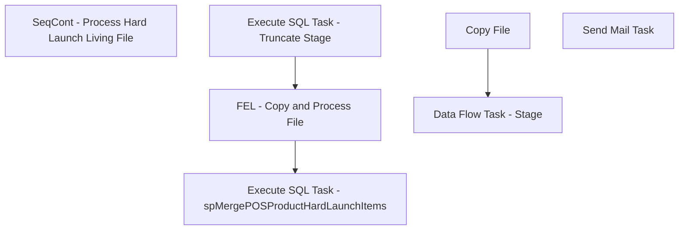

# SSIS Package: POS_ProductDataHardLaunchItems

**Project:** POS_ProductDataHardLaunchItems  
**Folder:** POS  
**Server:** STL-SSIS-P-01  

## Connection Managers

| Name | Type | Server | Catalog | Connection (sanitized) |
|---|---|---|---|---|
| IntegrationStaging | OLEDB | stl-ssis-p-01 | IntegrationStaging | Data Source=stl-ssis-p-01; Initial Catalog=IntegrationStaging; Provider=SQLNCLI11.1; Integrated Security=SSPI; Auto Translate=False |
| ProcessingHardLaunchItemsCSV | FLATFILE |  |  |  |
| SMTP | SMTP |  |  |  |
| me_01 | OLEDB | BEDROCKDB02 | me_01 | Data Source=BEDROCKDB02; Initial Catalog=me_01; Provider=SQLNCLI11.1; Integrated Security=SSPI; Auto Translate=False |

## Control Flow Tasks

| Task | Type |
|---|---|
| POS_ProductDataHardLaunchItems | Package |
| SeqCont - Process Hard Launch Living File | SEQUENCE |
| Execute SQL Task - spMergePOSProductHardLaunchItems | ExecuteSQLTask |
| Execute SQL Task - Truncate Stage | ExecuteSQLTask |
| FEL - Copy and Process File | FOREACHLOOP |
| Copy File | FileSystemTask |
| Data Flow Task - Stage | Pipeline |
| Send Mail Task | SendMailTask |

## Control Flow Outline

```text
- Send Mail Task [SendMailTask]
- SeqCont - Process Hard Launch Living File [SEQUENCE]
  - Execute SQL Task - Truncate Stage [ExecuteSQLTask]
  - Execute SQL Task - spMergePOSProductHardLaunchItems [ExecuteSQLTask]
  - FEL - Copy and Process File [FOREACHLOOP]
    - Copy File [FileSystemTask]
    - Data Flow Task - Stage [Pipeline]
```

## Architecture Diagram



## Variables

| Namespace | Name | Expression-bound |
|---|---|---|
| System | Propagate | No |
| User | DateTimeStamp | Yes |
| User | EndDate | Yes |
| User | EndDateAsDATE | Yes |
| User | FEL_FoundFileName | No |
| User | FileCopyDestination | Yes |
| User | GetDate | Yes |
| User | GetDateAsDATE | Yes |
| User | StartDate | Yes |
| User | StartDateAsDATE | Yes |

### Expression-bound variable values

#### User::DateTimeStamp

**Expression:**

```sql
(DT_WSTR,4)DATEPART("yyyy",GetDate()) 
+ (DT_WSTR,4)DATEPART("mm",GetDate()) 
+ (DT_WSTR,4)DATEPART("dd",GetDate()) 
+ (DT_WSTR,4)DATEPART("hh",GetDate()) 
+ (DT_WSTR,4)DATEPART("mi",GetDate()) 
+ (DT_WSTR,4)DATEPART("ss",GetDate()) 
+ (DT_WSTR,4)DATEPART("ms",GetDate())
```

**Evaluated value:**

```sql
2023612151923163
```

#### User::EndDate

**Expression:**

```sql
dateadd("dd", @[$Package::DaysToInclude], @[User::StartDate])
```

**Evaluated value:**

```sql
6/12/2023
```

#### User::EndDateAsDATE

**Expression:**

```sql
(DT_WSTR, 4) datepart("year", @[User::EndDate])  + "-" +
right("0"+ (DT_WSTR, 2) datepart("mm", @[User::EndDate]),2)  + "-" +
right("0" +(DT_WSTR, 2) datepart("dd",  @[User::EndDate]),2)
```

**Evaluated value:**

```sql
2023-06-12
```

#### User::FileCopyDestination

**Expression:**

```sql
"\\\\"+ @[$Package::IntegrationStaging_ServerName]+ @[$Package::FileDirectory]+"Processing"+"\\"
```

**Evaluated value:**

```sql
\\stl-ssis-p-01\IntegrationStaging\POS\HardLaunchItems\Processing\
```

#### User::GetDate

**Expression:**

```sql
(DT_DATE)DATEDIFF("Day", (DT_DATE) 0, GETDATE())
```

**Evaluated value:**

```sql
6/12/2023
```

#### User::GetDateAsDATE

**Expression:**

```sql
(DT_WSTR, 4) datepart("year", @[User::GetDate])  + "-" +
right("0"+ (DT_WSTR, 2) datepart("mm", @[User::GetDate]),2)  + "-" +
right("0" +(DT_WSTR, 2) datepart("dd",  @[User::GetDate]),2)
```

**Evaluated value:**

```sql
2023-06-12
```

#### User::StartDate

**Expression:**

```sql
dateadd("dd", -@[$Package::DaysToGoBack] , @[User::GetDate] )
```

**Evaluated value:**

```sql
6/11/2023
```

#### User::StartDateAsDATE

**Expression:**

```sql
(DT_WSTR, 4) datepart("year", @[User::StartDate])  + "-" +
right("0"+ (DT_WSTR, 2) datepart("mm", @[User::StartDate]),2)  + "-" +
right("0" +(DT_WSTR, 2) datepart("dd",  @[User::StartDate]),2)
```

**Evaluated value:**

```sql
2023-06-11
```

## Execute SQL Tasks

### Execute SQL Task - Truncate Stage

**Path:** `Package\SeqCont - Process Hard Launch Living File\Execute SQL Task - Truncate Stage`  
**Connection:** me_01 (BEDROCKDB02/me_01)  

```sql
truncate table POSProductHardLaunchItemsStage
```

### Execute SQL Task - spMergePOSProductHardLaunchItems

**Path:** `Package\SeqCont - Process Hard Launch Living File\Execute SQL Task - spMergePOSProductHardLaunchItems`  
**Connection:** me_01 (BEDROCKDB02/me_01)  

```sql
exec spMergePOSProductHardLaunchItems
```

## Data Flow: Sources

| Component | Source Object | Type | Data Flow Task | Connection | SQL Kind |
|---|---|---|---|---|---|
| Flat File Source - ProcessingHardLaunchItemsCsv |  | FlatFileSource | Data Flow Task - Stage | ProcessingHardLaunchItemsCSV |  |

## Data Flow: Destinations

| Component | Target Table | Type | Data Flow Task | Connection | SQL Kind |
|---|---|---|---|---|---|
| OLE DB Destination - me_01 - POSProductHardLaunchItemsStage |  | OLEDBDestination | Data Flow Task - Stage | me_01 |  |
