# SSIS Package: POS_ProductImageURLs

**Project:** POS_ProductImageURLs  
**Folder:** POS  
**Server:** STL-SSIS-P-01  

## Architecture Diagram

```mermaid
flowchart TD
    subgraph Connections
        IntegrationStaging_conn(["IntegrationStaging [OLEDB]"])
        PIM_NamesDescriptionTXT_conn(["PIM_NamesDescriptionTXT [FLATFILE]"])
        PIM_NamesTXT_conn(["PIM_NamesTXT [FLATFILE]"])
        POS_ProductNameImageName_TXT_conn(["POS_ProductNameImageName_TXT [FLATFILE]"])
        SMTP_conn(["SMTP [SMTP]"])
        URLS_CSV_conn(["URLS_CSV [FLATFILE]"])
    end
    subgraph ControlFlow
        POS_ProductImageURLs_task["POS_ProductImageURLs"]
        ImageURL_Loop___Original___task["ImageURL Loop - Original -"]
        POS_ProductImageURLs_task --> ImageURL_Loop___Original___task
        ArchiveFile_task["ArchiveFile"]
        ImageURL_Loop___Original___task --> ArchiveFile_task
        DeDupe_task["DeDupe"]
        ArchiveFile_task --> DeDupe_task
        ImageURL_Load_task["ImageURL Load"]
        DeDupe_task --> ImageURL_Load_task
        ImageURLStage_task["ImageURLStage"]
        ImageURL_Load_task --> ImageURLStage_task
        Truncate_Stage_task["Truncate Stage"]
        ImageURLStage_task --> Truncate_Stage_task
        NamesDescriptions_task["NamesDescriptions"]
        Truncate_Stage_task --> NamesDescriptions_task
        ArchiveFile_task["ArchiveFile"]
        NamesDescriptions_task --> ArchiveFile_task
        Data_Flow_Task_task["Data Flow Task"]
        ArchiveFile_task --> Data_Flow_Task_task
        Truncate_Stage_task["Truncate Stage"]
        Data_Flow_Task_task --> Truncate_Stage_task
        ProductNameDescriptionImageName_task["ProductNameDescriptionImageName"]
        Truncate_Stage_task --> ProductNameDescriptionImageName_task
        Archive_File_task["Archive File"]
        ProductNameDescriptionImageName_task --> Archive_File_task
        Data_Flow_Task_task["Data Flow Task"]
        Archive_File_task --> Data_Flow_Task_task
        Merge_ProductImageURL_task["Merge ProductImageURL"]
        Data_Flow_Task_task --> Merge_ProductImageURL_task
        Merge_ProductNameDescription_task["Merge ProductNameDescription"]
        Merge_ProductImageURL_task --> Merge_ProductNameDescription_task
        Truncate_Stage_task["Truncate Stage"]
        Merge_ProductNameDescription_task --> Truncate_Stage_task
        Send_Mail_Task_task["Send Mail Task"]
        Truncate_Stage_task --> Send_Mail_Task_task
    end
```

## Connection Managers

| Name | Type |
|---|---|
| IntegrationStaging | OLEDB |
| PIM_NamesDescriptionTXT | FLATFILE |
| PIM_NamesTXT | FLATFILE |
| POS_ProductNameImageName_TXT | FLATFILE |
| SMTP | SMTP |
| URLS_CSV | FLATFILE |

## Control Flow Tasks

| Task | Type |
|---|---|
| POS_ProductImageURLs | Microsoft.Package |
| ImageURL Loop - Original - | STOCK:FOREACHLOOP |
| ArchiveFile | Microsoft.FileSystemTask |
| DeDupe | Microsoft.ExecuteSQLTask |
| ImageURL Load | Microsoft.Pipeline |
| ImageURLStage | Microsoft.Pipeline |
| Truncate Stage | Microsoft.ExecuteSQLTask |
| NamesDescriptions | STOCK:FOREACHLOOP |
| ArchiveFile | Microsoft.FileSystemTask |
| Data Flow Task | Microsoft.Pipeline |
| Truncate Stage | Microsoft.ExecuteSQLTask |
| ProductNameDescriptionImageName | STOCK:FOREACHLOOP |
| Archive File | Microsoft.FileSystemTask |
| Data Flow Task | Microsoft.Pipeline |
| Merge ProductImageURL | Microsoft.ExecuteSQLTask |
| Merge ProductNameDescription | Microsoft.ExecuteSQLTask |
| Truncate Stage | Microsoft.ExecuteSQLTask |
| Send Mail Task | Microsoft.SendMailTask |

## Data Flow: Sources

| Component | SQL Preview |
|---|---|
|  | select  	cast(right(concat(cast('000000' as varchar), cast(s.ItemNumber as varchar)),6) as varchar(6)) as ItemNumber, 	s.ImageURL, 	case  		when s.ImageURL like '%al%' 			or s.ImageURL like '%atl%' 			then 0 		else 1 	end as isPrimary from POS.ProductImageURLStage s group by  	s.ItemNumber, 	s.ImageURL, 	case  		when s.ImageURL like '%al%' 			or s.ImageURL like '%atl%' 			then 0 		else 1 	end |

## Data Flow: Destinations

| Component | Destination |
|---|---|
|  | [POS].[ProductImageURL] |
|  | [POS].[ProductImageURLStage] |
|  | [POS].[ProductNameDescriptionStage] |
|  | [POS].[ProductNameDescriptionImageNameStage] |

