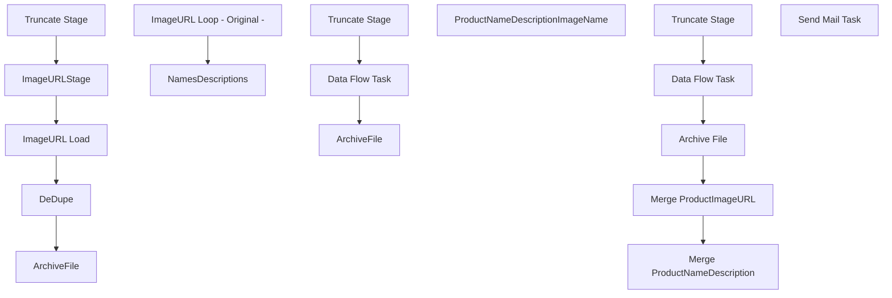

# SSIS Package: POS_ProductImageURLs

**Project:** POS_ProductImageURLs  
**Folder:** POS  
**Server:** STL-SSIS-P-01  

## Connection Managers

| Name | Type | Server | Catalog | Connection (sanitized) |
|---|---|---|---|---|
| IntegrationStaging | OLEDB | STL-SSIS-P-01 | IntegrationStaging | Data Source=STL-SSIS-P-01; Initial Catalog=IntegrationStaging; Provider=SQLNCLI11.1; Integrated Security=SSPI; Auto Translate=False |
| PIM_NamesDescriptionTXT | FLATFILE |  |  |  |
| PIM_NamesTXT | FLATFILE |  |  |  |
| POS_ProductNameImageName_TXT | FLATFILE |  |  |  |
| SMTP | SMTP |  |  |  |
| URLS_CSV | FLATFILE |  |  |  |

## Control Flow Tasks

| Task | Type |
|---|---|
| POS_ProductImageURLs | Package |
| ImageURL Loop - Original - | FOREACHLOOP |
| ArchiveFile | FileSystemTask |
| DeDupe | ExecuteSQLTask |
| ImageURL Load | Pipeline |
| ImageURLStage | Pipeline |
| Truncate Stage | ExecuteSQLTask |
| NamesDescriptions | FOREACHLOOP |
| ArchiveFile | FileSystemTask |
| Data Flow Task | Pipeline |
| Truncate Stage | ExecuteSQLTask |
| ProductNameDescriptionImageName | FOREACHLOOP |
| Archive File | FileSystemTask |
| Data Flow Task | Pipeline |
| Merge ProductImageURL | ExecuteSQLTask |
| Merge ProductNameDescription | ExecuteSQLTask |
| Truncate Stage | ExecuteSQLTask |
| Send Mail Task | SendMailTask |

## Control Flow Outline

```text
- Send Mail Task [SendMailTask]
- ImageURL Loop - Original - [FOREACHLOOP]
  - ArchiveFile [FileSystemTask]
  - DeDupe [ExecuteSQLTask]
  - ImageURL Load [Pipeline]
  - ImageURLStage [Pipeline]
  - Truncate Stage [ExecuteSQLTask]
- NamesDescriptions [FOREACHLOOP]
  - ArchiveFile [FileSystemTask]
  - Data Flow Task [Pipeline]
  - Truncate Stage [ExecuteSQLTask]
- ProductNameDescriptionImageName [FOREACHLOOP]
  - Archive File [FileSystemTask]
  - Data Flow Task [Pipeline]
  - Merge ProductImageURL [ExecuteSQLTask]
  - Merge ProductNameDescription [ExecuteSQLTask]
  - Truncate Stage [ExecuteSQLTask]
```

## Architecture Diagram



## Variables

| Namespace | Name | Expression-bound |
|---|---|---|
| System | Propagate | No |
| User | CustomerNote | No |
| User | CustomerNoteFileName | No |
| User | CustomerNoteProcessGroup | No |
| User | CustomerNumber | No |
| User | DateTimeStamp | Yes |
| User | EndDate | Yes |
| User | EndDateAsDATE | Yes |
| User | GetDate | Yes |
| User | GetDateAsDATE | Yes |
| User | PIM_NamesForLoop | No |
| User | ProductCatalogArchiveFilePath | Yes |
| User | ProductCatalogFileNameforLoop | No |
| User | ProductNameDescriptionImageNameForLoop | No |
| User | ProductionImageFileArchivePath | Yes |
| User | ProductionImagePathFileNameforLoop | No |
| User | StartDate | Yes |
| User | StartDateAsDATE | Yes |
| User | StoreInventoryZipForLoop | No |
| User | ZipExecutionPath | No |
| User | ZipPath | No |
| User | ZipUnzipPath | No |

### Expression-bound variable values

#### User::DateTimeStamp

**Expression:**

```sql
(DT_WSTR,4)DATEPART("yyyy",GetDate()) 
+ (DT_WSTR,4)DATEPART("mm",GetDate()) 
+ (DT_WSTR,4)DATEPART("dd",GetDate()) 
+ (DT_WSTR,4)DATEPART("hh",GetDate()) 
+ (DT_WSTR,4)DATEPART("mi",GetDate()) 
+ (DT_WSTR,4)DATEPART("ss",GetDate()) 
+ (DT_WSTR,4)DATEPART("ms",GetDate())
```

**Evaluated value:**

```sql
20231012102553447
```

#### User::EndDate

**Expression:**

```sql
dateadd("dd", @[$Package::DaysToInclude], @[User::StartDate])
```

**Evaluated value:**

```sql
10/12/2023
```

#### User::EndDateAsDATE

**Expression:**

```sql
(DT_WSTR, 4) datepart("year", @[User::EndDate])  + "-" +
right("0"+ (DT_WSTR, 2) datepart("mm", @[User::EndDate]),2)  + "-" +
right("0" +(DT_WSTR, 2) datepart("dd",  @[User::EndDate]),2)
```

**Evaluated value:**

```sql
2023-10-12
```

#### User::GetDate

**Expression:**

```sql
(DT_DATE)DATEDIFF("Day", (DT_DATE) 0, GETDATE())
```

**Evaluated value:**

```sql
10/12/2023
```

#### User::GetDateAsDATE

**Expression:**

```sql
(DT_WSTR, 4) datepart("year", @[User::GetDate])  + "-" +
right("0"+ (DT_WSTR, 2) datepart("mm", @[User::GetDate]),2)  + "-" +
right("0" +(DT_WSTR, 2) datepart("dd",  @[User::GetDate]),2)
```

**Evaluated value:**

```sql
2023-10-12
```

#### User::ProductCatalogArchiveFilePath

**Expression:**

```sql
@[$Package::ProductionImagePathFileStage] + "Archive\\"
```

**Evaluated value:**

```sql
\\stl-sftp-p-01\ecommerce\to-bab\from-SFCC\ImagePathExport\Archive\
```

#### User::ProductionImageFileArchivePath

**Expression:**

```sql
@[$Package::PIM_ProductionImagePathFileStage] + "Archive\\"
```

**Evaluated value:**

```sql
\\stl-sftp-p-01\ecommerce\to-bab\from-SFCC\ImagePathExport\Archive\
```

#### User::StartDate

**Expression:**

```sql
dateadd("dd", -@[$Package::DaysToGoBack] , @[User::GetDate] )
```

**Evaluated value:**

```sql
10/11/2023
```

#### User::StartDateAsDATE

**Expression:**

```sql
(DT_WSTR, 4) datepart("year", @[User::StartDate])  + "-" +
right("0"+ (DT_WSTR, 2) datepart("mm", @[User::StartDate]),2)  + "-" +
right("0" +(DT_WSTR, 2) datepart("dd",  @[User::StartDate]),2)
```

**Evaluated value:**

```sql
2023-10-11
```

## Execute SQL Tasks

### DeDupe

**Path:** `Package\ImageURL Loop - Original -\DeDupe`  
**Connection:** IntegrationStaging (STL-SSIS-P-01/IntegrationStaging)  

```sql


with
Dupes as
 (
  select 
   ItemNumber
  from pos.ProductImageURL
  where isPrimary=1
  group by 
   ItemNumber
  having count(*) >1
 )
delete i 
from pos.ProductImageURL i
join Dupes d 
 on i.ItemNumber=d.ItemNumber
 and i.isPrimary=1

```

### Truncate Stage

**Path:** `Package\ImageURL Loop - Original -\Truncate Stage`  
**Connection:** IntegrationStaging (STL-SSIS-P-01/IntegrationStaging)  

```sql
truncate table POS.ProductImageURLStage
truncate table POS.ProductImageURL
```

### Truncate Stage

**Path:** `Package\NamesDescriptions\Truncate Stage`  
**Connection:** IntegrationStaging (STL-SSIS-P-01/IntegrationStaging)  

```sql
truncate table POS.ProductNameDescriptionStage
```

### Merge ProductImageURL

**Path:** `Package\ProductNameDescriptionImageName\Merge ProductImageURL`  
**Connection:** IntegrationStaging (STL-SSIS-P-01/IntegrationStaging)  

```sql
exec POS.spMergeProductImageURL
```

### Merge ProductNameDescription

**Path:** `Package\ProductNameDescriptionImageName\Merge ProductNameDescription`  
**Connection:** IntegrationStaging (STL-SSIS-P-01/IntegrationStaging)  

```sql
exec POS.spMergeProductNameDescription
```

### Truncate Stage

**Path:** `Package\ProductNameDescriptionImageName\Truncate Stage`  
**Connection:** IntegrationStaging (STL-SSIS-P-01/IntegrationStaging)  

```sql
truncate table POS.ProductNameDescriptionImageNameStage

```

## Data Flow: Sources

| Component | Source Object | Type | Data Flow Task | Connection | SQL Kind |
|---|---|---|---|---|---|
| ImageURLStage |  | OLEDBSource | ImageURL Load | IntegrationStaging | SqlCommand |
| Flat File Source |  | FlatFileSource | ImageURLStage | URLS_CSV |  |
| Flat File Source |  | FlatFileSource | Data Flow Task | PIM_NamesDescriptionTXT |  |
| Flat File Source |  | FlatFileSource | Data Flow Task | POS_ProductNameImageName_TXT |  |

#### ImageURLStage — SqlCommand

```sql
select 
	cast(right(concat(cast('000000' as varchar), cast(s.ItemNumber as varchar)),6) as varchar(6)) as ItemNumber,
	s.ImageURL,
	case 
		when s.ImageURL like '%al%'
			or s.ImageURL like '%atl%'
			then 0
		else 1
	end as isPrimary
from POS.ProductImageURLStage s
group by 
	s.ItemNumber,
	s.ImageURL,
	case 
		when s.ImageURL like '%al%'
			or s.ImageURL like '%atl%'
			then 0
		else 1
	end
```

## Data Flow: Destinations

| Component | Target Table | Type | Data Flow Task | Connection | SQL Kind |
|---|---|---|---|---|---|
| POS_ProductImageURL |  | OLEDBDestination | ImageURL Load | IntegrationStaging |  |
| POS_ProductImageURL |  | OLEDBDestination | ImageURLStage | IntegrationStaging |  |
| POS ProductNameDescriptionStage |  | OLEDBDestination | Data Flow Task | IntegrationStaging |  |
| ProductNameDescriptionImageNameStage |  | OLEDBDestination | Data Flow Task | IntegrationStaging |  |
