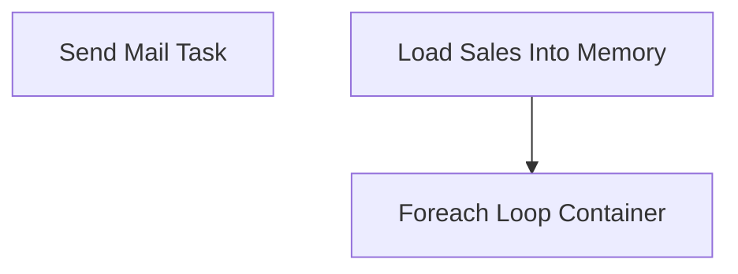

# SSIS Package: POS_SalesEmail

**Project:** POS_SalesEmail  
**Folder:** POS  
**Server:** STL-SSIS-P-01  

## Connection Managers

| Name | Type | Server | Catalog | Connection (sanitized) |
|---|---|---|---|---|
| DW | OLEDB | papamart | dw | Data Source=papamart; Initial Catalog=dw; Provider=SQLNCLI11.1; Integrated Security=SSPI; Auto Translate=False |
| SMTP Connection Manager | SMTP |  |  |  |

## Control Flow Tasks

| Task | Type |
|---|---|
| POS_SalesEmail | Package |
| Foreach Loop Container | FOREACHLOOP |
| Send Mail Task | SendMailTask |
| Load Sales Into Memory | ExecuteSQLTask |

## Control Flow Outline

```text
- Foreach Loop Container [FOREACHLOOP]
  - Send Mail Task [SendMailTask]
- Load Sales Into Memory [ExecuteSQLTask]
```

## Architecture Diagram



## Variables

| Namespace | Name | Expression-bound |
|---|---|---|
| User | EmailAddress | No |
| User | LastTransactionHour | No |
| User | LocationCode | No |
| User | LocationName | No |
| User | NetSales | No |
| User | SaleData | No |
| User | TransactionDate | No |
| User | WTDSales | No |

## Execute SQL Tasks

### Load Sales Into Memory

**Path:** `Package\Load Sales Into Memory`  
**Connection:** DW (papamart/dw)  

```sql
with
Sales as
	(
		select 
			cast(transactionDateTime as date) TransactionDate,
			location_code as LocationCode,
			location_name as LocationName,
			max(datepart(hh, transactionDateTime)) LastTransactionHour,
			sum(net_sales) NetSales
		from vwPOSJumpMindFlashGaapSales
		where datediff(dd, TransactionDateTime, getdate())=0
		and rtl_trn_type_code='SALE'
		and location_code not in ('0013','2013')
		group by 
			cast(transactionDateTime as date),
			location_code,
			location_name
	),
WTD as
	(
		select 
			location_code as LocationCode,
			sum(net_sales) WTDNetSales
		from vwPOSJumpMindFlashGaapSales
		where datediff(wk, TransactionDateTime, getdate())=0
		and rtl_trn_type_code='SALE'
		and location_code not in ('0013','2013')
		group by 
			location_code
	)
select
	cast(s.TransactionDate as varchar) as TransactionDate,
 	cast(s.LocationCode as varchar) as LocationCode,
	cast(s.LocationName as varchar) as LocationName, 
	cast(Concat(case 
			when s.LastTransactionHour >12 
				then s.LastTransactionHour -12
					else s.LastTransactionHour end ,case when s.LastTransactionHour <12 then 'AM' else 'PM' end)  as varchar) as  LastTransactionHour,
	cast(concat('$',s.NetSales)  as varchar) as NetSales,
	cast(case 
		when s.LocationCode like '0%' 
			then 'store' + right(s.LocationCode, 3) + '@buildabear.com'
		else 'store' + s.LocationCode + '@buildabear.com'
	end  as varchar) as StoreEmailAddress,
	cast(concat('$',WTD.WTDNetSales)  as varchar) as WTDNetSales
from Sales s
join WTD on s.LocationCode=WTD.LocationCode
```

## Data Flow: Sources

_None detected._

## Data Flow: Destinations

_None detected._
