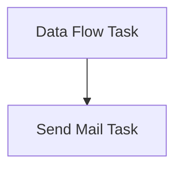

# SSIS Package: PromotionLocationsToSalesforceCore

**Project:** PromotionLocationsToSalesforceCore  
**Folder:** POS  
**Server:** STL-SSIS-P-01  

## Connection Managers

| Name | Type | Server | Catalog | Connection (sanitized) |
|---|---|---|---|---|
| IntegrationStaging | OLEDB | STL-SSIS-P-01 | IntegrationStaging | Data Source=STL-SSIS-P-01; Initial Catalog=IntegrationStaging; Provider=SQLNCLI11.1; Integrated Security=SSPI; Auto Translate=False |
| LocationsCSV | FLATFILE |  |  |  |
| SMTP_EMAIL | SMTP |  |  |  |

## Control Flow Tasks

| Task | Type |
|---|---|
| PromotionLocationsToSalesforceCore | Package |
| Data Flow Task | Pipeline |
| Send Mail Task | SendMailTask |

## Control Flow Outline

```text
- Data Flow Task [Pipeline]
- Send Mail Task [SendMailTask]
```

## Architecture Diagram



## Variables

_None detected._

## Execute SQL Tasks

_None detected._

## Data Flow: Sources

| Component | Source Object | Type | Data Flow Task | Connection | SQL Kind |
|---|---|---|---|---|---|
| Web_LocationsStage |  | OLEDBSource | Data Flow Task | IntegrationStaging | SqlCommand |

#### Web_LocationsStage — SqlCommand

```sql
select 
	Code as LocationCode,
	case 
		when Code >=2000 
			then Code
		else concat(cast('1' as varchar), right(Code,3))
	end as LocationNumber,
	LocationName,
	LocationType,
	Country 
from web.LocationStage
```

## Data Flow: Destinations

| Component | Target Table | Type | Data Flow Task | Connection | SQL Kind |
|---|---|---|---|---|---|
| LocationsCSV |  | FlatFileDestination | Data Flow Task | LocationsCSV |  |
