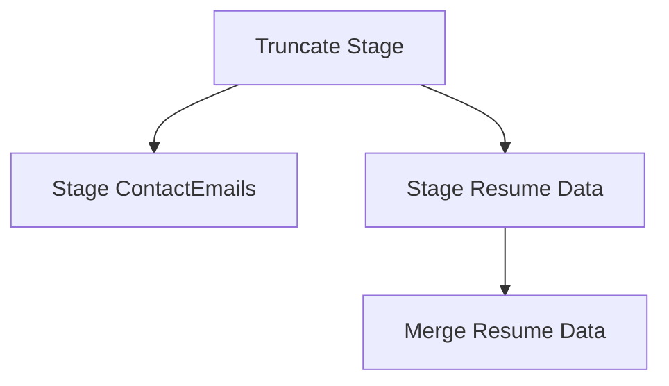

# SSIS Package: ResumesETL

**Project:** ResumesETL  
**Folder:** Papamart  
**Server:** STL-SSIS-P-01  

## Connection Managers

| Name | Type | Server | Catalog | Connection (sanitized) |
|---|---|---|---|---|
| BABWMstrData | OLEDB | kodiak | BABWMstrData | Data Source=kodiak; Initial Catalog=BABWMstrData; Provider=SQLNCLI11.1; Integrated Security=SSPI; Auto Translate=False |
| DWStaging | OLEDB | papamart | DWStaging | Data Source=papamart; Initial Catalog=DWStaging; Provider=SQLNCLI11.1; Integrated Security=SSPI; Auto Translate=False |
| Locations | OLEDB | bearwebdb | Locations | Data Source=bearwebdb; Initial Catalog=Locations; Provider=SQLNCLI10.1; Integrated Security=SSPI; Application Name=SSIS-Package-{4BF04F40-5259-4F56-BFDA-7943ED391A82}bearwebdb.Locations; Auto Translate=False |

## Control Flow Tasks

| Task | Type |
|---|---|
| ResumesETL | Package |
| Merge Resume Data | ExecuteSQLTask |
| Stage ContactEmails | Pipeline |
| Stage Resume Data | Pipeline |
| Truncate Stage | ExecuteSQLTask |

## Control Flow Outline

```text
- Merge Resume Data [ExecuteSQLTask]
- Stage ContactEmails [Pipeline]
- Stage Resume Data [Pipeline]
- Truncate Stage [ExecuteSQLTask]
```

## Architecture Diagram



## Variables

| Namespace | Name | Expression-bound |
|---|---|---|
| User | EndDate | Yes |
| User | GetDate | Yes |
| User | SQL_ResumesQuery | Yes |
| User | StartDate | Yes |

### Expression-bound variable values

#### User::EndDate

**Expression:**

```sql
dateadd("dd", @[$Package::DaysToInclude], @[User::StartDate])
```

**Evaluated value:**

```sql
8/15/2018
```

#### User::GetDate

**Expression:**

```sql
(DT_DATE)DATEDIFF("Day", (DT_DATE) 0, GETDATE())
```

**Evaluated value:**

```sql
8/15/2018
```

#### User::SQL_ResumesQuery

**Expression:**

```sql
"select * 
from vwResumes 

where DateSaved between '"+ (DT_STR, 52, 1252)@[User::StartDate]+ "' and '" + (DT_STR, 52, 1252)@[User::EndDate] +"'"
```

**Evaluated value:**

```sql
select * 
from vwResumes 

where DateSaved between '8/15/2017' and '8/15/2018'
```

#### User::StartDate

**Expression:**

```sql
dateadd("dd", -@[$Package::DaysToGoBack] , @[User::GetDate] )
```

**Evaluated value:**

```sql
8/15/2017
```

## Execute SQL Tasks

### Merge Resume Data

**Path:** `Package\Merge Resume Data`  
**Connection:** DWStaging (papamart/DWStaging)  

```sql
exec spMergeResumes
```

### Truncate Stage

**Path:** `Package\Truncate Stage`  
**Connection:** DWStaging (papamart/DWStaging)  

```sql
TRUNCATE TABLE ResumeStage 
TRUNCATE TABLE ContactEmailStage
```

## Data Flow: Sources

| Component | Source Object | Type | Data Flow Task | Connection | SQL Kind |
|---|---|---|---|---|---|
| ContactEmails |  | OLEDBSource | Stage ContactEmails | BABWMstrData |  |
| Resume Data |  | OLEDBSource | Stage Resume Data | Locations |  |

## Data Flow: Destinations

| Component | Target Table | Type | Data Flow Task | Connection | SQL Kind |
|---|---|---|---|---|---|
| ContactEmailStage |  | OLEDBDestination | Stage ContactEmails | DWStaging |  |
| ResumeStaging |  | OLEDBDestination | Stage Resume Data | DWStaging |  |
