# SSIS Package: SQLBackupsJobHistory

**Project:** SQLBackupsJobHistory  
**Folder:** Projects  
**Server:** STL-SSIS-P-01  

## Architecture Diagram

```mermaid
flowchart TD
    subgraph Connections
        Azure_conn(["Azure [MSOLAP100]"])
        IntegrationStaging_conn(["IntegrationStaging [OLEDB]"])
        MSDB_conn(["MSDB [OLEDB]"])
        stl_ssis_p_01_conn(["stl-ssis-p-01 [ADO.NET:SQL]"])
    end
    subgraph ControlFlow
        SQLBackupsJobHistory_task["SQLBackupsJobHistory"]
        SEQ___JobHistory_task["SEQ - JobHistory"]
        SQLBackupsJobHistory_task --> SEQ___JobHistory_task
        Analysis_Services_Processing_Task_task["Analysis Services Processing Task"]
        SEQ___JobHistory_task --> Analysis_Services_Processing_Task_task
        Foreach_Loop_Container_task["Foreach Loop Container"]
        Analysis_Services_Processing_Task_task --> Foreach_Loop_Container_task
        DataFlow___Get_BackupSet_History_task["DataFlow - Get BackupSet History"]
        Foreach_Loop_Container_task --> DataFlow___Get_BackupSet_History_task
        DataFlow___Get_Job_History_task["DataFlow - Get Job History"]
        DataFlow___Get_BackupSet_History_task --> DataFlow___Get_Job_History_task
        Log_BackupSet_Capture_Failure_task["Log BackupSet Capture Failure"]
        DataFlow___Get_Job_History_task --> Log_BackupSet_Capture_Failure_task
        Log_Job_Capture_Failure_task["Log Job Capture Failure"]
        Log_BackupSet_Capture_Failure_task --> Log_Job_Capture_Failure_task
        Load_Server_Names_task["Load Server Names"]
        Log_Job_Capture_Failure_task --> Load_Server_Names_task
        Merge_Sequence_task["Merge Sequence"]
        Load_Server_Names_task --> Merge_Sequence_task
        Merge_SQLBackupsJobHistory_task["Merge SQLBackupsJobHistory"]
        Merge_Sequence_task --> Merge_SQLBackupsJobHistory_task
        Merge_SQLBackupsMostRecentDates_task["Merge SQLBackupsMostRecentDates"]
        Merge_SQLBackupsJobHistory_task --> Merge_SQLBackupsMostRecentDates_task
        Send_Email_at_Noon_task["Send Email at Noon"]
        Merge_SQLBackupsMostRecentDates_task --> Send_Email_at_Noon_task
        Truncate_Stage_task["Truncate Stage"]
        Send_Email_at_Noon_task --> Truncate_Stage_task
    end
```

## Connection Managers

| Name | Type |
|---|---|
| Azure | MSOLAP100 |
| IntegrationStaging | OLEDB |
| MSDB | OLEDB |
| stl-ssis-p-01 | ADO.NET:SQL |

## Control Flow Tasks

| Task | Type |
|---|---|
| SQLBackupsJobHistory | Microsoft.Package |
| SEQ - JobHistory | STOCK:SEQUENCE |
| Analysis Services Processing Task | Microsoft.DTSProcessingTask |
| Foreach Loop Container | STOCK:FOREACHLOOP |
| DataFlow - Get BackupSet History | Microsoft.Pipeline |
| DataFlow - Get Job History | Microsoft.Pipeline |
| Log BackupSet Capture Failure | Microsoft.ExecuteSQLTask |
| Log Job Capture Failure | Microsoft.ExecuteSQLTask |
| Load Server Names | Microsoft.ExecuteSQLTask |
| Merge Sequence | STOCK:SEQUENCE |
| Merge SQLBackupsJobHistory | Microsoft.ExecuteSQLTask |
| Merge SQLBackupsMostRecentDates | Microsoft.ExecuteSQLTask |
| Send Email at Noon | Microsoft.ExecuteSQLTask |
| Truncate Stage | Microsoft.ExecuteSQLTask |

## Data Flow: Sources

_None detected._

## Data Flow: Destinations

| Component | Destination |
|---|---|
|  | [SQLBackupsMostRecentDatesStage] |
|  | [dbo].[SQLBackupsJobHistoryStage] |

