# SSIS Package: SQLServerAccountCleanup

**Project:** SQLServerAccountCleanup  
**Folder:** Projects  
**Server:** STL-SSIS-P-01  

## Architecture Diagram

```mermaid
flowchart TD
    subgraph Connections
        Cache_Connection_Manager_conn(["Cache Connection Manager [CACHE]"])
        Cache_Connection_Manager_After_Drops_conn(["Cache Connection Manager After Drops [CACHE]"])
        DW_conn(["DW [OLEDB]"])
        DWStaging_conn(["DWStaging [OLEDB]"])
        IntegrationStaging_conn(["IntegrationStaging [OLEDB]"])
        InvalidSQLUsersReport_conn(["InvalidSQLUsersReport [FLATFILE]"])
        MASTER_conn(["MASTER [OLEDB]"])
        MASTERCleanse_conn(["MASTERCleanse [OLEDB]"])
        SMTP_conn(["SMTP [SMTP]"])
    end
    subgraph ControlFlow
        SQLServerAccountCleanup_task["SQLServerAccountCleanup"]
        Seq_Container___Automate_Clean_Up_of_Accounts_task["Seq Container - Automate Clean Up of Accounts"]
        SQLServerAccountCleanup_task --> Seq_Container___Automate_Clean_Up_of_Accounts_task
        Archive_Purged_Account_Information_task["Archive Purged Account Information"]
        Seq_Container___Automate_Clean_Up_of_Accounts_task --> Archive_Purged_Account_Information_task
        Execute_SQL_Task___Capture_Error_Rows_task["Execute SQL Task - Capture Error Rows"]
        Archive_Purged_Account_Information_task --> Execute_SQL_Task___Capture_Error_Rows_task
        Foreach_Loop_Container_task["Foreach Loop Container"]
        Execute_SQL_Task___Capture_Error_Rows_task --> Foreach_Loop_Container_task
        Drop_Login_Fail_Log_task["Drop Login Fail Log"]
        Foreach_Loop_Container_task --> Drop_Login_Fail_Log_task
        Drop_User_Fail_Log_task["Drop User Fail Log"]
        Drop_Login_Fail_Log_task --> Drop_User_Fail_Log_task
        Exec_Drop_Login_Command_task["Exec Drop Login Command"]
        Drop_User_Fail_Log_task --> Exec_Drop_Login_Command_task
        Exec_Drop_User_Command_task["Exec Drop User Command"]
        Exec_Drop_Login_Command_task --> Exec_Drop_User_Command_task
        Get_SQL_Drop_Login_Command_task["Get SQL Drop Login Command"]
        Exec_Drop_User_Command_task --> Get_SQL_Drop_Login_Command_task
        Get_SQL_Drop_User_Command_task["Get SQL Drop User Command"]
        Get_SQL_Drop_Login_Command_task --> Get_SQL_Drop_User_Command_task
        Load_Target_Server_Names_to_be_Cleansed_task["Load Target Server Names to be Cleansed"]
        Get_SQL_Drop_User_Command_task --> Load_Target_Server_Names_to_be_Cleansed_task
        Send_HTML_Formatted_email_task["Send HTML Formatted email"]
        Load_Target_Server_Names_to_be_Cleansed_task --> Send_HTML_Formatted_email_task
        Seq_Container___Capture_Deleted_and_Disabled_AD_Accounts_task["Seq Container - Capture Deleted and Disabled AD Accounts"]
        Send_HTML_Formatted_email_task --> Seq_Container___Capture_Deleted_and_Disabled_AD_Accounts_task
        Data_Flow_Task___Load_to_Reporting_Table_task["Data Flow Task - Load to Reporting Table"]
        Seq_Container___Capture_Deleted_and_Disabled_AD_Accounts_task --> Data_Flow_Task___Load_to_Reporting_Table_task
        Truncate_Table_Reporting_SQLServerUserAccountCleanup_task["Truncate Table Reporting SQLServerUserAccountCleanup"]
        Data_Flow_Task___Load_to_Reporting_Table_task --> Truncate_Table_Reporting_SQLServerUserAccountCleanup_task
        Seq_Container___Capture_Deleted_and_Disabled_AD_Accounts__After_Attempted_Cleanup_task["Seq Container - Capture Deleted and Disabled AD Accounts  After Attempted Cleanup"]
        Truncate_Table_Reporting_SQLServerUserAccountCleanup_task --> Seq_Container___Capture_Deleted_and_Disabled_AD_Accounts__After_Attempted_Cleanup_task
        Data_Flow_Task___Load_to_Reporting_Table_task["Data Flow Task - Load to Reporting Table"]
        Seq_Container___Capture_Deleted_and_Disabled_AD_Accounts__After_Attempted_Cleanup_task --> Data_Flow_Task___Load_to_Reporting_Table_task
        Truncate_Table_Reporting_SQLServerUserAccountCleanup_task["Truncate Table Reporting SQLServerUserAccountCleanup"]
        Data_Flow_Task___Load_to_Reporting_Table_task --> Truncate_Table_Reporting_SQLServerUserAccountCleanup_task
        Seq_Container___Capture_Users_on_target_servers_task["Seq Container - Capture Users on target servers"]
        Truncate_Table_Reporting_SQLServerUserAccountCleanup_task --> Seq_Container___Capture_Users_on_target_servers_task
        Foreach_Loop_Container_task["Foreach Loop Container"]
        Seq_Container___Capture_Users_on_target_servers_task --> Foreach_Loop_Container_task
        Data_Flow_Task___Load_To_SQLServerUsersAccounts_task["Data Flow Task - Load To SQLServerUsersAccounts"]
        Foreach_Loop_Container_task --> Data_Flow_Task___Load_To_SQLServerUsersAccounts_task
        Execute_SQL_Task___Load_Logins_on_Each_Server_task["Execute SQL Task - Load Logins on Each Server"]
        Data_Flow_Task___Load_To_SQLServerUsersAccounts_task --> Execute_SQL_Task___Load_Logins_on_Each_Server_task
        Execute_SQL_Task___Load_Users_On_Each_DB_task["Execute SQL Task - Load Users On Each DB"]
        Execute_SQL_Task___Load_Logins_on_Each_Server_task --> Execute_SQL_Task___Load_Users_On_Each_DB_task
        Load_Target_Server_Names_task["Load Target Server Names"]
        Execute_SQL_Task___Load_Users_On_Each_DB_task --> Load_Target_Server_Names_task
        Truncate_Table_SQLServerUsersAccounts_task["Truncate Table SQLServerUsersAccounts"]
        Load_Target_Server_Names_task --> Truncate_Table_SQLServerUsersAccounts_task
        Seq_Container___Capture_Users_on_Target_Servers___After_Attempted_Cleanup_task["Seq Container - Capture Users on Target Servers - After Attempted Cleanup"]
        Truncate_Table_SQLServerUsersAccounts_task --> Seq_Container___Capture_Users_on_Target_Servers___After_Attempted_Cleanup_task
        Foreach_Loop_Container_task["Foreach Loop Container"]
        Seq_Container___Capture_Users_on_Target_Servers___After_Attempted_Cleanup_task --> Foreach_Loop_Container_task
        Data_Flow_Task___Load_To_SQLServerUsersAccounts_task["Data Flow Task - Load To SQLServerUsersAccounts"]
        Foreach_Loop_Container_task --> Data_Flow_Task___Load_To_SQLServerUsersAccounts_task
        Execute_SQL_Task___Load_Logins_on_Each_Server_task["Execute SQL Task - Load Logins on Each Server"]
        Data_Flow_Task___Load_To_SQLServerUsersAccounts_task --> Execute_SQL_Task___Load_Logins_on_Each_Server_task
        Execute_SQL_Task___Load_Users_On_Each_DB_task["Execute SQL Task - Load Users On Each DB"]
        Execute_SQL_Task___Load_Logins_on_Each_Server_task --> Execute_SQL_Task___Load_Users_On_Each_DB_task
        Load_Target_Server_Names_task["Load Target Server Names"]
        Execute_SQL_Task___Load_Users_On_Each_DB_task --> Load_Target_Server_Names_task
        Truncate_Table_SQLServerUsersAccounts_task["Truncate Table SQLServerUsersAccounts"]
        Load_Target_Server_Names_task --> Truncate_Table_SQLServerUsersAccounts_task
        Seq_Container___Create_Attachment_and_Email_task["Seq Container - Create Attachment and Email"]
        Truncate_Table_SQLServerUsersAccounts_task --> Seq_Container___Create_Attachment_and_Email_task
        Generate_Report_task["Generate Report"]
        Seq_Container___Create_Attachment_and_Email_task --> Generate_Report_task
        Send_Mail_Task_task["Send Mail Task"]
        Generate_Report_task --> Send_Mail_Task_task
        Send_Mail_Task___With_Report_task["Send Mail Task - With Report"]
        Send_Mail_Task_task --> Send_Mail_Task___With_Report_task
        SQL_Task___Get_Count_of_Cleanup_Records_task["SQL Task - Get Count of Cleanup Records"]
        Send_Mail_Task___With_Report_task --> SQL_Task___Get_Count_of_Cleanup_Records_task
        Seq_Container___Testing_Only___Add_Bogus_Users_task["Seq Container - Testing Only - Add Bogus Users"]
        SQL_Task___Get_Count_of_Cleanup_Records_task --> Seq_Container___Testing_Only___Add_Bogus_Users_task
        Add_Drop_Commands_task["Add Drop Commands"]
        Seq_Container___Testing_Only___Add_Bogus_Users_task --> Add_Drop_Commands_task
        Delete_Duplicates_task["Delete Duplicates"]
        Add_Drop_Commands_task --> Delete_Duplicates_task
        Insert_Users_task["Insert Users"]
        Delete_Duplicates_task --> Insert_Users_task
        Testing_Try_Catch_and_Logging_task["Testing Try Catch and Logging"]
        Insert_Users_task --> Testing_Try_Catch_and_Logging_task
        Foreach_Loop_Container_task["Foreach Loop Container"]
        Testing_Try_Catch_and_Logging_task --> Foreach_Loop_Container_task
        Execute_SQL_Task___Drop_user_you_know_doesnt_exist_task["Execute SQL Task - Drop user you know doesnt exist"]
        Foreach_Loop_Container_task --> Execute_SQL_Task___Drop_user_you_know_doesnt_exist_task
        Execute_SQL_Task___Fail_Log_task["Execute SQL Task - Fail Log"]
        Execute_SQL_Task___Drop_user_you_know_doesnt_exist_task --> Execute_SQL_Task___Fail_Log_task
        Load_Target_Server_Names_to_be_Cleansed_task["Load Target Server Names to be Cleansed"]
        Execute_SQL_Task___Fail_Log_task --> Load_Target_Server_Names_to_be_Cleansed_task
        Send_Mail_Task_task["Send Mail Task"]
        Load_Target_Server_Names_to_be_Cleansed_task --> Send_Mail_Task_task
    end
```

## Connection Managers

| Name | Type |
|---|---|
| Cache Connection Manager | CACHE |
| Cache Connection Manager After Drops | CACHE |
| DW | OLEDB |
| DWStaging | OLEDB |
| IntegrationStaging | OLEDB |
| InvalidSQLUsersReport | FLATFILE |
| MASTER | OLEDB |
| MASTERCleanse | OLEDB |
| SMTP | SMTP |

## Control Flow Tasks

| Task | Type |
|---|---|
| SQLServerAccountCleanup | Microsoft.Package |
| Seq Container - Automate Clean Up of Accounts | STOCK:SEQUENCE |
| Archive Purged Account Information | Microsoft.Pipeline |
| Execute SQL Task - Capture Error Rows | Microsoft.ExecuteSQLTask |
| Foreach Loop Container | STOCK:FOREACHLOOP |
| Drop Login Fail Log | Microsoft.ExecuteSQLTask |
| Drop User Fail Log | Microsoft.ExecuteSQLTask |
| Exec Drop Login Command | Microsoft.ExecuteSQLTask |
| Exec Drop User Command | Microsoft.ExecuteSQLTask |
| Get SQL Drop Login Command | Microsoft.ExecuteSQLTask |
| Get SQL Drop User Command | Microsoft.ExecuteSQLTask |
| Load Target Server Names to be Cleansed | Microsoft.ExecuteSQLTask |
| Send HTML Formatted email | Microsoft.ExecuteSQLTask |
| Seq Container - Capture Deleted and Disabled AD Accounts | STOCK:SEQUENCE |
| Data Flow Task - Load to Reporting Table | Microsoft.Pipeline |
| Truncate Table Reporting SQLServerUserAccountCleanup | Microsoft.ExecuteSQLTask |
| Seq Container - Capture Deleted and Disabled AD Accounts  After Attempted Cleanup | STOCK:SEQUENCE |
| Data Flow Task - Load to Reporting Table | Microsoft.Pipeline |
| Truncate Table Reporting SQLServerUserAccountCleanup | Microsoft.ExecuteSQLTask |
| Seq Container - Capture Users on target servers | STOCK:SEQUENCE |
| Foreach Loop Container | STOCK:FOREACHLOOP |
| Data Flow Task - Load To SQLServerUsersAccounts | Microsoft.Pipeline |
| Execute SQL Task - Load Logins on Each Server | Microsoft.ExecuteSQLTask |
| Execute SQL Task - Load Users On Each DB | Microsoft.ExecuteSQLTask |
| Load Target Server Names | Microsoft.ExecuteSQLTask |
| Truncate Table SQLServerUsersAccounts | Microsoft.ExecuteSQLTask |
| Seq Container - Capture Users on Target Servers - After Attempted Cleanup | STOCK:SEQUENCE |
| Foreach Loop Container | STOCK:FOREACHLOOP |
| Data Flow Task - Load To SQLServerUsersAccounts | Microsoft.Pipeline |
| Execute SQL Task - Load Logins on Each Server | Microsoft.ExecuteSQLTask |
| Execute SQL Task - Load Users On Each DB | Microsoft.ExecuteSQLTask |
| Load Target Server Names | Microsoft.ExecuteSQLTask |
| Truncate Table SQLServerUsersAccounts | Microsoft.ExecuteSQLTask |
| Seq Container - Create Attachment and Email | STOCK:SEQUENCE |
| Generate Report | Microsoft.Pipeline |
| Send Mail Task | Microsoft.SendMailTask |
| Send Mail Task - With Report | Microsoft.SendMailTask |
| SQL Task - Get Count of Cleanup Records | Microsoft.ExecuteSQLTask |
| Seq Container - Testing Only - Add Bogus Users | STOCK:SEQUENCE |
| Add Drop Commands | Microsoft.Pipeline |
| Delete Duplicates | Microsoft.ExecuteSQLTask |
| Insert Users | Microsoft.ExecuteSQLTask |
| Testing Try Catch and Logging | STOCK:SEQUENCE |
| Foreach Loop Container | STOCK:FOREACHLOOP |
| Execute SQL Task - Drop user you know doesnt exist | Microsoft.ExecuteSQLTask |
| Execute SQL Task - Fail Log | Microsoft.ExecuteSQLTask |
| Load Target Server Names to be Cleansed | Microsoft.ExecuteSQLTask |
| Send Mail Task | Microsoft.SendMailTask |

## Data Flow: Sources

| Component | SQL Preview |
|---|---|
|  | select ServerName,  DatabaseName,  DatabaseUserName,  SecurableObjectName,  SecurablePermissionName,  SecurableStatus,  SchemaName,  SchemaOwner,  ADUser,  EmployeeADGroup,  SecurityGroupName,  Reason,  DropUserCommand,  DropLoginCommand,  getdate() as InsertDate from reporting.SQLServerUserAccountCleanup where Reason = 'DeletedAccount' |
|  | select 'BAB\'+Upper([Name]) as ADGroupNameJoinField from papamart.[DWStaging].dbo.[ADattributesGroup] where IsSecurityGroup = 'True' order by 1 |
|  | select 'BAB\'+ upper(SamAccountName) as [ADUser],  EmployeeADGroup from papamart.dw.dbo.ADattributesMerged where  isnumeric(SamAccountName) = 0 order by 1 |
|  | select ServerName,  DatabaseName,  DatabaseUserName, upper(DatabaseUserName) as DatabaseUserNameJoinField,  SecurableObjectName ,   SecurablePermissionName ,   SecurableStatus ,  SchemaName ,  SchemaOwner  from [SQLServerUsersAccounts] S  --where isnull(Role,'') <> 'db_owner' Where left(s.DatabaseUserName,4) = 'bab\'  and right(s.DatabaseUserName,1) <> '$'  order by 1 , 3 |
|  | select 'BAB\'+Upper([Name]) as ADGroupNameJoinField from papamart.[DWStaging].dbo.[ADattributesGroup] where IsSecurityGroup = 'True' order by 1 |
|  | select 'BAB\'+ upper(SamAccountName) as [ADUser],  EmployeeADGroup from papamart.dw.dbo.ADattributesMerged where  isnumeric(SamAccountName) = 0 order by 1 |
|  | select ServerName,  DatabaseName,  DatabaseUserName, upper(DatabaseUserName) as DatabaseUserNameJoinField,  SecurableObjectName ,   SecurablePermissionName ,   SecurableStatus ,  SchemaName ,  SchemaOwner  from [SQLServerUsersAccounts] S  --where isnull(Role,'') <> 'db_owner' Where left(s.DatabaseUserName,4) = 'bab\'  and right(s.DatabaseUserName,1) <> '$'  order by 1 , 3 |
|  | select ServerName, DatabaseName, DatabaseUserName, ADUser, EmployeeADGroup, SecurityGroupName, Reason  from Reporting.SQLServerUserAccountCleanup (nolock)  group by ServerName, DatabaseName, DatabaseUserName, ADUser, EmployeeADGroup, SecurityGroupName, Reason |
|  | select* from reporting.SQLServerUserAccountCleanup where DatabaseUserName in ('BAB\DocHoliday$','BAB\PatrickMahomes','BAB\KurtLoder','BAB\QuentinTarantino$','BAB\JoeRogan','BAB\Zuby') order by 1 |

## Data Flow: Destinations

| Component | Destination |
|---|---|
|  | [Reporting].[SQLServerUserAccountCleanupArchive] |
|  | [Reporting].[SQLServerUserAccountCleanup] |
|  | [Reporting].[SQLServerUserAccountCleanup] |
|  | [dbo].[SQLServerUsersAccounts] |
|  | [dbo].[DatabaseUsers] |
|  | [dbo].[SQLServerUsersAccounts] |
|  | [dbo].[DatabaseUsers] |
|  | [Reporting].[SQLServerUserAccountCleanup] |

