# SSIS Package: SQLServerServiceCheck

**Project:** SQLServerServiceCheck  
**Folder:** Projects  
**Server:** STL-SSIS-P-01  

## Architecture Diagram

```mermaid
flowchart TD
    subgraph Connections
        IntegrationStaging_conn(["IntegrationStaging [OLEDB]"])
        master_conn(["master [OLEDB]"])
        master___NowOnline_conn(["master - NowOnline [OLEDB]"])
        master___PostRestart_conn(["master - PostRestart [OLEDB]"])
        master___SQL_Agent_conn(["master - SQL Agent [OLEDB]"])
        SMTP_conn(["SMTP [SMTP]"])
    end
    subgraph ControlFlow
        SQLServerServiceCheck_task["SQLServerServiceCheck"]
        Offline_Row_Count_Check_task["Offline Row Count Check"]
        SQLServerServiceCheck_task --> Offline_Row_Count_Check_task
        Sequence_Container____Start_SQL_Agent_Service_on_Eligible_Servers_task["Sequence Container  - Start SQL Agent Service on Eligible Servers"]
        Offline_Row_Count_Check_task --> Sequence_Container____Start_SQL_Agent_Service_on_Eligible_Servers_task
        Execute_SQL_Task___Load_Target_Server_Names_Sql_Agent_After_Start_Attempt_task["Execute SQL Task - Load Target Server Names Sql Agent After Start Attempt"]
        Sequence_Container____Start_SQL_Agent_Service_on_Eligible_Servers_task --> Execute_SQL_Task___Load_Target_Server_Names_Sql_Agent_After_Start_Attempt_task
        Execute_SQL_Task___Load_Target_Server_Names_Sql_Agent_Start_task["Execute SQL Task - Load Target Server Names Sql Agent Start"]
        Execute_SQL_Task___Load_Target_Server_Names_Sql_Agent_After_Start_Attempt_task --> Execute_SQL_Task___Load_Target_Server_Names_Sql_Agent_Start_task
        FEL___Check_SQL_Agent_Status_task["FEL - Check SQL Agent Status"]
        Execute_SQL_Task___Load_Target_Server_Names_Sql_Agent_Start_task --> FEL___Check_SQL_Agent_Status_task
        Data_Flow_Task___Load_SQL_Agent_Status_task["Data Flow Task - Load SQL Agent Status"]
        FEL___Check_SQL_Agent_Status_task --> Data_Flow_Task___Load_SQL_Agent_Status_task
        Execute_SQL_Task___Query_Target_Server_for_SQL_Agent_Status_task["Execute SQL Task - Query Target Server for SQL Agent Status"]
        Data_Flow_Task___Load_SQL_Agent_Status_task --> Execute_SQL_Task___Query_Target_Server_for_SQL_Agent_Status_task
        FEL___Start_SQL_Agent_Service_task["FEL - Start SQL Agent Service"]
        Execute_SQL_Task___Query_Target_Server_for_SQL_Agent_Status_task --> FEL___Start_SQL_Agent_Service_task
        Execute_Process_Task___Start_Sql_Agent_Svc_task["Execute Process Task - Start Sql Agent Svc"]
        FEL___Start_SQL_Agent_Service_task --> Execute_Process_Task___Start_Sql_Agent_Svc_task
        Execute_SQL_Task___Wait_X_Seconds_task["Execute SQL Task - Wait X Seconds"]
        Execute_Process_Task___Start_Sql_Agent_Svc_task --> Execute_SQL_Task___Wait_X_Seconds_task
        Sequence_Container____Validate_Service_Is_Now_Running_and_Load_SQL_Agent_Start_Eligibility_task["Sequence Container  - Validate Service Is Now Running and Load SQL Agent Start Eligibility"]
        Execute_SQL_Task___Wait_X_Seconds_task --> Sequence_Container____Validate_Service_Is_Now_Running_and_Load_SQL_Agent_Start_Eligibility_task
        Execute_SQL_Task___Wait_for_10_Seconds___Testing_Only_task["Execute SQL Task - Wait for 10 Seconds - Testing Only"]
        Sequence_Container____Validate_Service_Is_Now_Running_and_Load_SQL_Agent_Start_Eligibility_task --> Execute_SQL_Task___Wait_for_10_Seconds___Testing_Only_task
        Sequence_Container___Get_Server_Status_Post_Restart_task["Sequence Container - Get Server Status Post Restart"]
        Execute_SQL_Task___Wait_for_10_Seconds___Testing_Only_task --> Sequence_Container___Get_Server_Status_Post_Restart_task
        Execute_SQL_Task____Load_Target_Server_Names_task["Execute SQL Task  - Load Target Server Names"]
        Sequence_Container___Get_Server_Status_Post_Restart_task --> Execute_SQL_Task____Load_Target_Server_Names_task
        Execute_SQL_Task___Trucate_Stage_task["Execute SQL Task - Trucate Stage"]
        Execute_SQL_Task____Load_Target_Server_Names_task --> Execute_SQL_Task___Trucate_Stage_task
        FEL___Query_Target_Server___Post_Restart_task["FEL - Query Target Server - Post Restart"]
        Execute_SQL_Task___Trucate_Stage_task --> FEL___Query_Target_Server___Post_Restart_task
        Data_Flow_Task___Reload_SqlServerStatusCheck_task["Data Flow Task - Reload SqlServerStatusCheck"]
        FEL___Query_Target_Server___Post_Restart_task --> Data_Flow_Task___Reload_SqlServerStatusCheck_task
        Execute_SQL_Task___Query_Target_Server_task["Execute SQL Task - Query Target Server"]
        Data_Flow_Task___Reload_SqlServerStatusCheck_task --> Execute_SQL_Task___Query_Target_Server_task
        Sequence_Container___Load_SQL_Agent_Start_Eligibility_task["Sequence Container - Load SQL Agent Start Eligibility"]
        Execute_SQL_Task___Query_Target_Server_task --> Sequence_Container___Load_SQL_Agent_Start_Eligibility_task
        Data_Flow_Task___Load_Curr_Status_task["Data Flow Task - Load Curr Status"]
        Sequence_Container___Load_SQL_Agent_Start_Eligibility_task --> Data_Flow_Task___Load_Curr_Status_task
        Execute_SQL_Task___Load_Servers_Now_Online_task["Execute SQL Task - Load Servers Now Online"]
        Data_Flow_Task___Load_Curr_Status_task --> Execute_SQL_Task___Load_Servers_Now_Online_task
        FEL___Load_SQL_Agent_Start_Eligibility_task["FEL - Load SQL Agent Start Eligibility"]
        Execute_SQL_Task___Load_Servers_Now_Online_task --> FEL___Load_SQL_Agent_Start_Eligibility_task
        Data_Flow_Task___Load_SQL_Agent_Elig_Status_task["Data Flow Task - Load SQL Agent Elig Status"]
        FEL___Load_SQL_Agent_Start_Eligibility_task --> Data_Flow_Task___Load_SQL_Agent_Elig_Status_task
        Execute_SQL_Task___Query_Target_Server_for_SQL_Agent_Elig_task["Execute SQL Task - Query Target Server for SQL Agent Elig"]
        Data_Flow_Task___Load_SQL_Agent_Elig_Status_task --> Execute_SQL_Task___Query_Target_Server_for_SQL_Agent_Elig_task
        Sequence_Container___Get_Server_Status_task["Sequence Container - Get Server Status"]
        Execute_SQL_Task___Query_Target_Server_for_SQL_Agent_Elig_task --> Sequence_Container___Get_Server_Status_task
        Data_Flow_Task___Load_Target_Server_Control_Table_task["Data Flow Task - Load Target Server Control Table"]
        Sequence_Container___Get_Server_Status_task --> Data_Flow_Task___Load_Target_Server_Control_Table_task
        Execute_SQL_Task____Load_Target_Server_Names_task["Execute SQL Task  - Load Target Server Names"]
        Data_Flow_Task___Load_Target_Server_Control_Table_task --> Execute_SQL_Task____Load_Target_Server_Names_task
        Execute_SQL_Task___Truncate_Stage_task["Execute SQL Task - Truncate Stage"]
        Execute_SQL_Task____Load_Target_Server_Names_task --> Execute_SQL_Task___Truncate_Stage_task
        FEL___Query_Target_Server_task["FEL - Query Target Server"]
        Execute_SQL_Task___Truncate_Stage_task --> FEL___Query_Target_Server_task
        Data_Flow_Task___Load_SqlServerStatusCheck_task["Data Flow Task - Load SqlServerStatusCheck"]
        FEL___Query_Target_Server_task --> Data_Flow_Task___Load_SqlServerStatusCheck_task
        Execute_SQL_Task___Query_Target_Server_task["Execute SQL Task - Query Target Server"]
        Data_Flow_Task___Load_SqlServerStatusCheck_task --> Execute_SQL_Task___Query_Target_Server_task
        Sequence_Container___Send_Emails_task["Sequence Container - Send Emails"]
        Execute_SQL_Task___Query_Target_Server_task --> Sequence_Container___Send_Emails_task
        Check_Hour___Only_Send_at_6__12__18_Hours_task["Check Hour - Only Send at 6, 12, 18 Hours"]
        Sequence_Container___Send_Emails_task --> Check_Hour___Only_Send_at_6__12__18_Hours_task
        Offline_Row_Count_Check_After_Restart_task["Offline Row Count Check After Restart"]
        Check_Hour___Only_Send_at_6__12__18_Hours_task --> Offline_Row_Count_Check_After_Restart_task
        Online_Row_Count__Check_After_Restart_task["Online Row Count  Check After Restart"]
        Offline_Row_Count_Check_After_Restart_task --> Online_Row_Count__Check_After_Restart_task
        Sequence_Container___Send_Email_Action_Taken_task["Sequence Container - Send Email Action Taken"]
        Online_Row_Count__Check_After_Restart_task --> Sequence_Container___Send_Email_Action_Taken_task
        Execute_SQL_Task___SEnd_No_Problem_Email_task["Execute SQL Task - SEnd No Problem Email"]
        Sequence_Container___Send_Email_Action_Taken_task --> Execute_SQL_Task___SEnd_No_Problem_Email_task
        Sequence_Container___Send_Email_No_Action_task["Sequence Container - Send Email No Action"]
        Execute_SQL_Task___SEnd_No_Problem_Email_task --> Sequence_Container___Send_Email_No_Action_task
        Execute_SQL_Task___Send_No_Problem_Email_task["Execute SQL Task - Send No Problem Email"]
        Sequence_Container___Send_Email_No_Action_task --> Execute_SQL_Task___Send_No_Problem_Email_task
        Sequence_Container___Send_Problem_Email_task["Sequence Container - Send Problem Email"]
        Execute_SQL_Task___Send_No_Problem_Email_task --> Sequence_Container___Send_Problem_Email_task
        Execute_SQL_Task___Send_Problem_Email_task["Execute SQL Task - Send Problem Email"]
        Sequence_Container___Send_Problem_Email_task --> Execute_SQL_Task___Send_Problem_Email_task
        Sequence_Container___Start_SQL_on_Server_task["Sequence Container - Start SQL on Server"]
        Execute_SQL_Task___Send_Problem_Email_task --> Sequence_Container___Start_SQL_on_Server_task
        Data_Flow_Task___Load_Server_Status_to_Reporting_Table_task["Data Flow Task - Load Server Status to Reporting Table"]
        Sequence_Container___Start_SQL_on_Server_task --> Data_Flow_Task___Load_Server_Status_to_Reporting_Table_task
        Execute_SQL_Task___Load_Offline_Server_Names_task["Execute SQL Task - Load Offline Server Names"]
        Data_Flow_Task___Load_Server_Status_to_Reporting_Table_task --> Execute_SQL_Task___Load_Offline_Server_Names_task
        Execute_SQL_Task___Truncate_Reporting_Table_task["Execute SQL Task - Truncate Reporting Table"]
        Execute_SQL_Task___Load_Offline_Server_Names_task --> Execute_SQL_Task___Truncate_Reporting_Table_task
        Foreach_Loop_Container___Issue_Start_Command_task["Foreach Loop Container - Issue Start Command"]
        Execute_SQL_Task___Truncate_Reporting_Table_task --> Foreach_Loop_Container___Issue_Start_Command_task
        Execute_Process_Task___Start_SQL_Agent_Service_task["Execute Process Task - Start SQL Agent Service"]
        Foreach_Loop_Container___Issue_Start_Command_task --> Execute_Process_Task___Start_SQL_Agent_Service_task
        Execute_Process_Task___Start_SQL_Server_Service_task["Execute Process Task - Start SQL Server Service"]
        Execute_Process_Task___Start_SQL_Agent_Service_task --> Execute_Process_Task___Start_SQL_Server_Service_task
        Execute_Process_Task___Stop_SQL_Agent_Service_task["Execute Process Task - Stop SQL Agent Service"]
        Execute_Process_Task___Start_SQL_Server_Service_task --> Execute_Process_Task___Stop_SQL_Agent_Service_task
        Execute_Process_Task___Stop_SQL_Server_Service_task["Execute Process Task - Stop SQL Server Service"]
        Execute_Process_Task___Stop_SQL_Agent_Service_task --> Execute_Process_Task___Stop_SQL_Server_Service_task
        Execute_SQL_Task___Wait_for_10_Seconds____1_task["Execute SQL Task - Wait for 10 Seconds  - 1"]
        Execute_Process_Task___Stop_SQL_Server_Service_task --> Execute_SQL_Task___Wait_for_10_Seconds____1_task
        Execute_SQL_Task___Wait_for_10_Seconds___2_task["Execute SQL Task - Wait for 10 Seconds - 2"]
        Execute_SQL_Task___Wait_for_10_Seconds____1_task --> Execute_SQL_Task___Wait_for_10_Seconds___2_task
        Execute_SQL_Task___Wait_for_10_Seconds___3_task["Execute SQL Task - Wait for 10 Seconds - 3"]
        Execute_SQL_Task___Wait_for_10_Seconds___2_task --> Execute_SQL_Task___Wait_for_10_Seconds___3_task
        Send_Mail_Task_task["Send Mail Task"]
        Execute_SQL_Task___Wait_for_10_Seconds___3_task --> Send_Mail_Task_task
    end
```

## Connection Managers

| Name | Type |
|---|---|
| IntegrationStaging | OLEDB |
| master | OLEDB |
| master - NowOnline | OLEDB |
| master - PostRestart | OLEDB |
| master - SQL Agent | OLEDB |
| SMTP | SMTP |

## Control Flow Tasks

| Task | Type |
|---|---|
| SQLServerServiceCheck | Microsoft.Package |
| Offline Row Count Check | Microsoft.ExecuteSQLTask |
| Sequence Container  - Start SQL Agent Service on Eligible Servers | STOCK:SEQUENCE |
| Execute SQL Task - Load Target Server Names Sql Agent After Start Attempt | Microsoft.ExecuteSQLTask |
| Execute SQL Task - Load Target Server Names Sql Agent Start | Microsoft.ExecuteSQLTask |
| FEL - Check SQL Agent Status | STOCK:FOREACHLOOP |
| Data Flow Task - Load SQL Agent Status | Microsoft.Pipeline |
| Execute SQL Task - Query Target Server for SQL Agent Status | Microsoft.ExecuteSQLTask |
| FEL - Start SQL Agent Service | STOCK:FOREACHLOOP |
| Execute Process Task - Start Sql Agent Svc | Microsoft.ExecuteProcess |
| Execute SQL Task - Wait X Seconds | Microsoft.ExecuteSQLTask |
| Sequence Container  - Validate Service Is Now Running and Load SQL Agent Start Eligibility | STOCK:SEQUENCE |
| Execute SQL Task - Wait for 10 Seconds - Testing Only | Microsoft.ExecuteSQLTask |
| Sequence Container - Get Server Status Post Restart | STOCK:SEQUENCE |
| Execute SQL Task  - Load Target Server Names | Microsoft.ExecuteSQLTask |
| Execute SQL Task - Trucate Stage | Microsoft.ExecuteSQLTask |
| FEL - Query Target Server - Post Restart | STOCK:FOREACHLOOP |
| Data Flow Task - Reload SqlServerStatusCheck | Microsoft.Pipeline |
| Execute SQL Task - Query Target Server | Microsoft.ExecuteSQLTask |
| Sequence Container - Load SQL Agent Start Eligibility | STOCK:SEQUENCE |
| Data Flow Task - Load Curr Status | Microsoft.Pipeline |
| Execute SQL Task - Load Servers Now Online | Microsoft.ExecuteSQLTask |
| FEL - Load SQL Agent Start Eligibility | STOCK:FOREACHLOOP |
| Data Flow Task - Load SQL Agent Elig Status | Microsoft.Pipeline |
| Execute SQL Task - Query Target Server for SQL Agent Elig | Microsoft.ExecuteSQLTask |
| Sequence Container - Get Server Status | STOCK:SEQUENCE |
| Data Flow Task - Load Target Server Control Table | Microsoft.Pipeline |
| Execute SQL Task  - Load Target Server Names | Microsoft.ExecuteSQLTask |
| Execute SQL Task - Truncate Stage | Microsoft.ExecuteSQLTask |
| FEL - Query Target Server | STOCK:FOREACHLOOP |
| Data Flow Task - Load SqlServerStatusCheck | Microsoft.Pipeline |
| Execute SQL Task - Query Target Server | Microsoft.ExecuteSQLTask |
| Sequence Container - Send Emails | STOCK:SEQUENCE |
| Check Hour - Only Send at 6, 12, 18 Hours | Microsoft.ExecuteSQLTask |
| Offline Row Count Check After Restart | Microsoft.ExecuteSQLTask |
| Online Row Count  Check After Restart | Microsoft.ExecuteSQLTask |
| Sequence Container - Send Email Action Taken | STOCK:SEQUENCE |
| Execute SQL Task - SEnd No Problem Email | Microsoft.ExecuteSQLTask |
| Sequence Container - Send Email No Action | STOCK:SEQUENCE |
| Execute SQL Task - Send No Problem Email | Microsoft.ExecuteSQLTask |
| Sequence Container - Send Problem Email | STOCK:SEQUENCE |
| Execute SQL Task - Send Problem Email | Microsoft.ExecuteSQLTask |
| Sequence Container - Start SQL on Server | STOCK:SEQUENCE |
| Data Flow Task - Load Server Status to Reporting Table | Microsoft.Pipeline |
| Execute SQL Task - Load Offline Server Names | Microsoft.ExecuteSQLTask |
| Execute SQL Task - Truncate Reporting Table | Microsoft.ExecuteSQLTask |
| Foreach Loop Container - Issue Start Command | STOCK:FOREACHLOOP |
| Execute Process Task - Start SQL Agent Service | Microsoft.ExecuteProcess |
| Execute Process Task - Start SQL Server Service | Microsoft.ExecuteProcess |
| Execute Process Task - Stop SQL Agent Service | Microsoft.ExecuteProcess |
| Execute Process Task - Stop SQL Server Service | Microsoft.ExecuteProcess |
| Execute SQL Task - Wait for 10 Seconds  - 1 | Microsoft.ExecuteSQLTask |
| Execute SQL Task - Wait for 10 Seconds - 2 | Microsoft.ExecuteSQLTask |
| Execute SQL Task - Wait for 10 Seconds - 3 | Microsoft.ExecuteSQLTask |
| Send Mail Task | Microsoft.SendMailTask |

## Data Flow: Sources

| Component | SQL Preview |
|---|---|
|  | update [Reporting].[SqlServerStatusCheck] set SQLServerAgentStatus = ?  where ServerName = ?  |
|  | select getdate() as DateCapture |
|  | select getdate() as DateCapture |
|  | select ServerName,  SQLServerStatus from [dbo].[SqlServerStatusCheck]  --where SQLServerStatus = 'Online' |
|  | update [Reporting].[SqlServerStatusCheck] set SQLServerStatusAfterStartAttempt = ?  where ServerName = ?  |
|  | select ServerName,  SQLServerStatus from [Reporting].[SqlServerStatusCheck] |
|  | update [Reporting].[SqlServerStatusCheck] set SQLServerAgentStartEligible = ?  where ServerName = ?  |
|  | select getdate() as DateCapture |
|  | select cast (	'stl-sql-p-02'	 as nvarchar)	as ServerName 	, cast ('Yes' as nvarchar) as ServiceStartEligible	UNION  select cast (	'stl-sql-p-03'	 as nvarchar)	as ServerName 	, cast ('Yes' as nvarchar) as ServiceStartEligible	UNION  select cast (	'papamart'	 as nvarchar)	as ServerName 	, cast ('No' as nvarchar) as ServiceStartEligible	UNION select cast (	'stl-ssis-p-01'	 as nvarchar)	as ServerName  |
|  | select getdate() as DateCapture |
|  | select sc.ServerName,  sc.SQLServerStatus,  scc.ServiceStartEligible from [dbo].[SqlServerStatusCheck] sc left join SqlServerStatusCheckControl scc on sc.ServerName=scc.Servername --where SQLServerStatus = 'Offline' |

## Data Flow: Destinations

| Component | Destination |
|---|---|
|  | [dbo].[SqlServerStatusCheck] |
|  | [dbo].[SqlServerStatusCheckControl] |
|  | [dbo].[SqlServerStatusCheck] |
|  | [Reporting].[SqlServerStatusCheck] |

