# SSIS Package: AuditworkstoAvalaraSalesTaxFileExport

**Project:** AuditworkstoAvalaraSalesTaxFileExport  
**Folder:** SSIS  
**Server:** STL-SSIS-P-01  

## Architecture Diagram

```mermaid
flowchart TD
    subgraph Connections
        auditworks_conn(["auditworks [OLEDB]"])
        AVALARA_EXPORT_CAN_conn(["AVALARA_EXPORT_CAN [FLATFILE]"])
        AVALARA_EXPORT_USA_conn(["AVALARA_EXPORT_USA [FLATFILE]"])
        BearData_conn(["BearData [OLEDB]"])
        SMTP_conn(["SMTP [SMTP]"])
    end
    subgraph ControlFlow
        AuditworkstoAvalaraSalesTaxFileExport_task["AuditworkstoAvalaraSalesTaxFileExport"]
        Execute_SQL_Task___Start_Job_Check_task["Execute SQL Task - Start Job Check"]
        AuditworkstoAvalaraSalesTaxFileExport_task --> Execute_SQL_Task___Start_Job_Check_task
        SeqCont___Build_Tax_Tables_task["SeqCont - Build Tax Tables"]
        Execute_SQL_Task___Start_Job_Check_task --> SeqCont___Build_Tax_Tables_task
        Execute_SQL_Task___Truncate_Staging_Tables_task["Execute SQL Task - Truncate Staging Tables"]
        SeqCont___Build_Tax_Tables_task --> Execute_SQL_Task___Truncate_Staging_Tables_task
        SeqCont___Load_Tax_Tables_task["SeqCont - Load Tax Tables"]
        Execute_SQL_Task___Truncate_Staging_Tables_task --> SeqCont___Load_Tax_Tables_task
        Data_Flow_Task___Build_Detail_Tables_task["Data Flow Task - Build Detail Tables"]
        SeqCont___Load_Tax_Tables_task --> Data_Flow_Task___Build_Detail_Tables_task
        Data_Flow_Task___Build_Detail_Tables_1_task["Data Flow Task - Build Detail Tables 1"]
        Data_Flow_Task___Build_Detail_Tables_task --> Data_Flow_Task___Build_Detail_Tables_1_task
        Data_Flow_Task___Build_Final_Table_task["Data Flow Task - Build Final Table"]
        Data_Flow_Task___Build_Detail_Tables_1_task --> Data_Flow_Task___Build_Final_Table_task
        Data_Flow_Task___Build_Reference_Tables_task["Data Flow Task - Build Reference Tables"]
        Data_Flow_Task___Build_Final_Table_task --> Data_Flow_Task___Build_Reference_Tables_task
        Data_Flow_Task___Build_Tax_Summary_Results_Table_task["Data Flow Task - Build Tax Summary Results Table"]
        Data_Flow_Task___Build_Reference_Tables_task --> Data_Flow_Task___Build_Tax_Summary_Results_Table_task
        SeqCont___Generate_Files_and_Update_Export_Table_task["SeqCont - Generate Files and Update Export Table"]
        Data_Flow_Task___Build_Tax_Summary_Results_Table_task --> SeqCont___Generate_Files_and_Update_Export_Table_task
        FEL___Archive_Old_Files_task["FEL - Archive Old Files"]
        SeqCont___Generate_Files_and_Update_Export_Table_task --> FEL___Archive_Old_Files_task
        File_System_Task___Archive_Old_Files_task["File System Task - Archive Old Files"]
        FEL___Archive_Old_Files_task --> File_System_Task___Archive_Old_Files_task
        SeqCont___Manage_Export_Table_task["SeqCont - Manage Export Table"]
        File_System_Task___Archive_Old_Files_task --> SeqCont___Manage_Export_Table_task
        Clear_IsCurrent_Flag_task["Clear IsCurrent Flag"]
        SeqCont___Manage_Export_Table_task --> Clear_IsCurrent_Flag_task
        Data_Flow_Task___Insert_Current_Run_into_Export_Table_task["Data Flow Task - Insert Current Run into Export Table"]
        Clear_IsCurrent_Flag_task --> Data_Flow_Task___Insert_Current_Run_into_Export_Table_task
        FEL___Capture_Created_FileNames_task["FEL - Capture Created FileNames"]
        Data_Flow_Task___Insert_Current_Run_into_Export_Table_task --> FEL___Capture_Created_FileNames_task
        Data_Flow_Task_task["Data Flow Task"]
        FEL___Capture_Created_FileNames_task --> Data_Flow_Task_task
        Sequence_Container_task["Sequence Container"]
        Data_Flow_Task_task --> Sequence_Container_task
        Data_Flow_Task___Generate_CAN_File_task["Data Flow Task - Generate CAN File"]
        Sequence_Container_task --> Data_Flow_Task___Generate_CAN_File_task
        Data_Flow_Task___Generate_USA_File_task["Data Flow Task - Generate USA File"]
        Data_Flow_Task___Generate_CAN_File_task --> Data_Flow_Task___Generate_USA_File_task
        SeqCont___Send_Emails_task["SeqCont - Send Emails"]
        Data_Flow_Task___Generate_USA_File_task --> SeqCont___Send_Emails_task
        Execute_SQL_Task___Send_Email___Manual_and_Testing_task["Execute SQL Task - Send Email - Manual and Testing"]
        SeqCont___Send_Emails_task --> Execute_SQL_Task___Send_Email___Manual_and_Testing_task
        Execute_SQL_Task___Send_Email___Prod_task["Execute SQL Task - Send Email - Prod"]
        Execute_SQL_Task___Send_Email___Manual_and_Testing_task --> Execute_SQL_Task___Send_Email___Prod_task
        SeqCont___Truncate_Tables_and_Check_For_Closed_Period_task["SeqCont - Truncate Tables and Check For Closed Period"]
        Execute_SQL_Task___Send_Email___Prod_task --> SeqCont___Truncate_Tables_and_Check_For_Closed_Period_task
        SeqCont___Load_Start_Job_Check_Table_task["SeqCont - Load Start Job Check Table"]
        SeqCont___Truncate_Tables_and_Check_For_Closed_Period_task --> SeqCont___Load_Start_Job_Check_Table_task
        Data_Flow_Task___Load_Start_job_Check_Table_task["Data Flow Task - Load Start job Check Table"]
        SeqCont___Load_Start_Job_Check_Table_task --> Data_Flow_Task___Load_Start_job_Check_Table_task
        Data_Flow_Task___Load_Start_job_Check_Table__Manual_task["Data Flow Task - Load Start job Check Table  Manual"]
        Data_Flow_Task___Load_Start_job_Check_Table_task --> Data_Flow_Task___Load_Start_job_Check_Table__Manual_task
        Truncate_Table___tmpStartJobCheck_task["Truncate Table - tmpStartJobCheck"]
        Data_Flow_Task___Load_Start_job_Check_Table__Manual_task --> Truncate_Table___tmpStartJobCheck_task
        Send_Mail_Task_task["Send Mail Task"]
        Truncate_Table___tmpStartJobCheck_task --> Send_Mail_Task_task
    end
```

## Connection Managers

| Name | Type |
|---|---|
| auditworks | OLEDB |
| AVALARA_EXPORT_CAN | FLATFILE |
| AVALARA_EXPORT_USA | FLATFILE |
| BearData | OLEDB |
| SMTP | SMTP |

## Control Flow Tasks

| Task | Type |
|---|---|
| AuditworkstoAvalaraSalesTaxFileExport | Microsoft.Package |
| Execute SQL Task - Start Job Check | Microsoft.ExecuteSQLTask |
| SeqCont - Build Tax Tables | STOCK:SEQUENCE |
| Execute SQL Task - Truncate Staging Tables | Microsoft.ExecuteSQLTask |
| SeqCont - Load Tax Tables | STOCK:SEQUENCE |
| Data Flow Task - Build Detail Tables | Microsoft.Pipeline |
| Data Flow Task - Build Detail Tables 1 | Microsoft.Pipeline |
| Data Flow Task - Build Final Table | Microsoft.Pipeline |
| Data Flow Task - Build Reference Tables | Microsoft.Pipeline |
| Data Flow Task - Build Tax Summary Results Table | Microsoft.Pipeline |
| SeqCont - Generate Files and Update Export Table | STOCK:SEQUENCE |
| FEL - Archive Old Files | STOCK:FOREACHLOOP |
| File System Task - Archive Old Files | Microsoft.FileSystemTask |
| SeqCont - Manage Export Table | STOCK:SEQUENCE |
| Clear IsCurrent Flag | Microsoft.ExecuteSQLTask |
| Data Flow Task - Insert Current Run into Export Table | Microsoft.Pipeline |
| FEL - Capture Created FileNames | STOCK:FOREACHLOOP |
| Data Flow Task | Microsoft.Pipeline |
| Sequence Container | STOCK:SEQUENCE |
| Data Flow Task - Generate CAN File | Microsoft.Pipeline |
| Data Flow Task - Generate USA File | Microsoft.Pipeline |
| SeqCont - Send Emails | STOCK:SEQUENCE |
| Execute SQL Task - Send Email - Manual and Testing | Microsoft.ExecuteSQLTask |
| Execute SQL Task - Send Email - Prod | Microsoft.ExecuteSQLTask |
| SeqCont - Truncate Tables and Check For Closed Period | STOCK:SEQUENCE |
| SeqCont - Load Start Job Check Table | STOCK:SEQUENCE |
| Data Flow Task - Load Start job Check Table | Microsoft.Pipeline |
| Data Flow Task - Load Start job Check Table  Manual | Microsoft.Pipeline |
| Truncate Table - tmpStartJobCheck | Microsoft.ExecuteSQLTask |
| Send Mail Task | Microsoft.SendMailTask |

## Data Flow: Sources

| Component | SQL Preview |
|---|---|
|  | --#################################### -- Build Send Sale Taxable Sales Detail --####################################  declare  @TransactionStartDate DATE,  @TransactionEndDate DATE  SET @TransactionStartDate = (select cast(STRT_DATE_TIME as date) AS STRT_DATE_TIME from tmpStartJobCheck) SET @TransactionEndDate = (select cast(END_DATE_TIME as date) as END_DATE_TIME from tmpStartJobCheck) ;   --Dro |
|  | --#################################### -- Build Tax Exempt Sales Detail --####################################  declare  @TransactionStartDate DATE,  @TransactionEndDate DATE  SET @TransactionStartDate = (select cast(STRT_DATE_TIME as date) AS STRT_DATE_TIME from tmpStartJobCheck) SET @TransactionEndDate = (select cast(END_DATE_TIME as date) as END_DATE_TIME from tmpStartJobCheck) ;  --Drop and Cr |
|  | --#################################### -- Build Taxable Sales Detail --####################################  declare  @TransactionStartDate DATE,  @TransactionEndDate DATE  SET @TransactionStartDate = (select cast(STRT_DATE_TIME as date) AS STRT_DATE_TIME from tmpStartJobCheck) SET @TransactionEndDate = (select cast(END_DATE_TIME as date) as END_DATE_TIME from tmpStartJobCheck)  --Drop and Create  |
|  | --#################################### -- Build ES Sale Taxable Sales Detail --####################################  declare  @TransactionStartDate DATE,  @TransactionEndDate DATE  SET @TransactionStartDate = (select cast(STRT_DATE_TIME as date) AS STRT_DATE_TIME from tmpStartJobCheck) SET @TransactionEndDate = (select cast(END_DATE_TIME as date) as END_DATE_TIME from tmpStartJobCheck) ;   --Drop  |
|  | --#################################### -- Build Send Sale Taxable Sales Detail --####################################  declare  @TransactionStartDate DATE,  @TransactionEndDate DATE  SET @TransactionStartDate = (select cast(STRT_DATE_TIME as date) AS STRT_DATE_TIME from tmpStartJobCheck) SET @TransactionEndDate = (select cast(END_DATE_TIME as date) as END_DATE_TIME from tmpStartJobCheck) ;   --Dro |
|  | --#################################### -- Build Tax Exempt Sales Detail --####################################  declare  @TransactionStartDate DATE,  @TransactionEndDate DATE  SET @TransactionStartDate = (select cast(STRT_DATE_TIME as date) AS STRT_DATE_TIME from tmpStartJobCheck) SET @TransactionEndDate = (select cast(END_DATE_TIME as date) as END_DATE_TIME from tmpStartJobCheck) ;  --Drop and Cr |
|  | --#################################### -- Build Taxable Sales Detail --####################################  declare  @TransactionStartDate DATE,  @TransactionEndDate DATE  SET @TransactionStartDate = (select cast(STRT_DATE_TIME as date) AS STRT_DATE_TIME from tmpStartJobCheck) SET @TransactionEndDate = (select cast(END_DATE_TIME as date) as END_DATE_TIME from tmpStartJobCheck)  --Drop and Create  |
|  | with TaxLineCounts as ( SELECT Ref2 AS transaction_id 	,line_id 	,COUNT(line_id) AS line_count --INTO ##TaxLineCounts FROM tmpTaxDetailResults GROUP BY Ref2,line_id  )  SELECT tdr.CustomerCode 	,tdr.DocCode 	,tdr.transaction_date 	,tdr.CompanyCode 	,tdr.TaxCode 	,tdr.TaxDate 	,CASE WHEN tlc.line_count > 1 THEN CONVERT(DECIMAL(10,2),tdr.Amount/tlc.line_count) 		ELSE CONVERT(DECIMAL(10,2),tdr.Amount |
|  | DECLARE @StartDate DATE, @EndDate DATE --SELECT @StartDate = '2022-05-29', @EndDate = '2022-07-02';  SET @StartDate = (select cast(STRT_DATE_TIME as date) AS STRT_DATE_TIME from tmpStartJobCheck) SET @EndDate = (select cast(END_DATE_TIME as date) as END_DATE_TIME from tmpStartJobCheck) ;  WITH ListDates(AllDates) AS (    SELECT @StartDate AS DATE     UNION ALL     SELECT DATEADD(DAY,1,AllDates)    |
|  | with TaxStoreData as ( SELECT oc.ORG_CHN_NUM 	,oc.TAX_JRSDCTN_CODE 	,CASE WHEN ga.ADRS_LINE_2 IS NULL THEN ga.ADRS_LINE_1 ELSE ga.ADRS_LINE_1 + ' ' + ga.ADRS_LINE_2 		END AS StrAddress 	,ga.CITY AS StrCity 	,ga.TRTRY_CODE AS StrRegion -- state 	,CASE WHEN ga.CNTRY_CODE_ISO3 = 'USA' THEN CONVERT(VARCHAR(5),ga.POST_CODE) 		ELSE CONVERT(VARCHAR(10),ga.POST_CODE) 			END AS StrPostalCode 	,ga.CNTRY_COD |
|  | SELECT oc.ORG_CHN_NUM 	,oc.TAX_JRSDCTN_CODE 	,CASE WHEN ga.ADRS_LINE_2 IS NULL THEN ga.ADRS_LINE_1 ELSE ga.ADRS_LINE_1 + ' ' + ga.ADRS_LINE_2 		END AS StrAddress 	,ga.CITY AS StrCity 	,ga.TRTRY_CODE AS StrRegion -- state 	,CASE WHEN ga.CNTRY_CODE_ISO3 = 'USA' THEN CONVERT(VARCHAR(5),ga.POST_CODE) 		ELSE CONVERT(VARCHAR(10),ga.POST_CODE) 			END AS StrPostalCode 	,ga.CNTRY_CODE_ISO3 AS StrCountry 	, |
|  | SELECT tax_item_group_id 	,CASE WHEN tax_item_group_id = 10 THEN 'NT' 		WHEN tax_item_group_id = 20 THEN 'T' 		WHEN tax_item_group_id = 21 THEN 'PC040500' 		WHEN tax_item_group_id = 22 THEN 'T' 		WHEN tax_item_group_id = 41 THEN 'PF050073' 		WHEN tax_item_group_id = 41 THEN 'PF050073' --		WHEN tax_item_group_id = CANDY THEN 'PF050300' 		ELSE tax_item_group_description 			END AS 'TaxCode'  FROM aud |
|  | select	case when snumber < 2000 			then snumber + 1000 		else snumber 		end as store_no,  		address1 as address,  		city as city  from store |
|  | declare  @FirstCalendarDate DATE,  @LastCalendarDate DATE  SET @FirstCalendarDate = (select FirstDayOfCalendarMonth from tmpDatesCalendar) SET @LastCalendarDate = (select LastDayofCalendarMonth from tmpDatesCalendar) ; SELECT	'1' AS ProcessCode 		,tsd.DocCode 		,'1' AS DocType  --<< 4 = Return invoice 		--,CASE WHEN tsd.transaction_date < DATEADD(MONTH, DATEDIFF(MONTH, -1, @TransactionEndDate)-1,  |
|  | with PeriodLookup  as ( 	select  	fiscal_year,  	fiscal_quarter,  	fiscal_period, 	CONVERT(varchar(10),MIN(actual_date),121) AS MinDate, 	CONVERT(varchar(10),MAX(actual_date),121) AS MaxDate  	from PAPAMART.DW.DBO. date_dim --(nolock)  	where fiscal_year is not null  	--and fiscal_year = '2022' 	group by fiscal_year, fiscal_quarter, fiscal_period  )  select  cast(p.fiscal_year as varchar)+cast(p.f |
|  | update AvalaraExportControl set USAFileNameOutput = ? where IsCurrent = 1 |
|  | update AvalaraExportControl set CANFileNameOutput = ? where IsCurrent = 1  |
|  | select getdate() as Date |
|  | select ProcessCode,  DocCode,  DocType,  cast(DocDate as char (10)) as DocDate,  CompanyCode,  CustomerCode,  EntityUseCode,  [LineNo],  TaxCode,  TaxDate,  ItemCode,  [Description],  Qty,  Amount,  Discount,  Ref1,  Ref2,  ExemptionNo,  RevAcct,  DestAddress,  DestCity,  DestRegion,  DestPostalCode,  DestCountry,  OrigAddress,  OrigCity,  OrigRegion,  OrigPostalCode,  OrigCountry,  LocationCode,  |
|  | select ProcessCode,  DocCode,  DocType,  cast(DocDate as char (10)) as DocDate,  CompanyCode,  CustomerCode,  EntityUseCode,  [LineNo],  TaxCode,  TaxDate,  ItemCode,  [Description],  Qty,  Amount,  Discount,  Ref1,  Ref2,  ExemptionNo,  RevAcct,  DestAddress,  DestCity,  DestRegion,  DestPostalCode,  DestCountry,  OrigAddress,  OrigCity,  OrigRegion,  OrigPostalCode,  OrigCountry,  LocationCode,  |
|  | SELECT CONVERT(VARCHAR(10), clp.STRT_DATE_TIME, 121) AS STRT_DATE_TIME 	,CONVERT(VARCHAR(10), DATEADD(DAY,-1,clp.END_DATE_TIME), 121) AS END_DATE_TIME --INTO ##StartJobCheck1 FROM CLNDR_PRD clp JOIN CRDM_PRMTRS cp ON clp.CLNDR_ID = cp.PRMTR_VAL_BIN WHERE clp.CLNDR_PRD_NAME LIKE 'Period%' AND clp.STRT_DATE_TIME < (SELECT DATEADD(DAY,-1,clp.STRT_DATE_TIME)  		FROM CLNDR_PRD clp 		JOIN CRDM_PRMTRS cp |
|  | --select '2023-12-31' as STRT_DATE_TIME,  '2024-02-03' as END_DATE_TIME --select '2024-02-04' as STRT_DATE_TIME,  '2024-03-02' as END_DATE_TIME --select '2024-03-03' as STRT_DATE_TIME,  '2024-04-06' as END_DATE_TIME --select '2024-04-07' as STRT_DATE_TIME,  '2024-05-04' as END_DATE_TIME --select '2024-05-05' as STRT_DATE_TIME,  '2024-06-01' as END_DATE_TIME --select '2024-07-07' as STRT_DATE_TIME, |

## Data Flow: Destinations

| Component | Destination |
|---|---|
|  | [dbo].[tmpTaxDetailResults] |
|  | [dbo].[tmpTaxDetailResults] |
|  | [dbo].[tmpTaxDetailResultsFinal] |
|  | [dbo].[tmpDatesCalendar] |
|  | [dbo].[tmpTaxCodes] |
|  | [dbo].[tmpTaxCountryList] |
|  | [dbo].[tmpTaxStoreAddress] |
|  | [dbo].[tmpTaxStoreData] |
|  | [dbo].[tmpTaxSummaryResults] |
|  | [dbo].[AvalaraExportControl] |
|  | [dbo].[tmpStartJobCheck] |
|  | [dbo].[tmpStartJobCheck] |

