# SSIS Package: AuditworkstoAvalaraSalesTaxFileExport

**Project:** AuditworkstoAvalaraSalesTaxFileExport  
**Folder:** SSIS  
**Server:** STL-SSIS-P-01  

## Connection Managers

| Name | Type | Server | Catalog | Connection (sanitized) |
|---|---|---|---|---|
| AVALARA_EXPORT_CAN | FLATFILE |  |  |  |
| AVALARA_EXPORT_USA | FLATFILE |  |  |  |
| BearData | OLEDB | KODIAK | BearData | Data Source=KODIAK; Initial Catalog=BearData; Provider=SQLNCLI11.1; Integrated Security=SSPI; Auto Translate=False |
| SMTP | SMTP |  |  |  |
| auditworks | OLEDB | bedrockdb01 | auditworks | Data Source=bedrockdb01; Initial Catalog=auditworks; Provider=SQLNCLI11.1; Integrated Security=SSPI; Auto Translate=False |

## Control Flow Tasks

| Task | Type |
|---|---|
| AuditworkstoAvalaraSalesTaxFileExport | Package |
| Execute SQL Task - Start Job Check | ExecuteSQLTask |
| SeqCont - Build Tax Tables | SEQUENCE |
| Execute SQL Task - Truncate Staging Tables | ExecuteSQLTask |
| SeqCont - Load Tax Tables | SEQUENCE |
| Data Flow Task - Build Detail Tables | Pipeline |
| Data Flow Task - Build Detail Tables 1 | Pipeline |
| Data Flow Task - Build Final Table | Pipeline |
| Data Flow Task - Build Reference Tables | Pipeline |
| Data Flow Task - Build Tax Summary Results Table | Pipeline |
| SeqCont - Generate Files and Update Export Table | SEQUENCE |
| FEL - Archive Old Files | FOREACHLOOP |
| File System Task - Archive Old Files | FileSystemTask |
| SeqCont - Manage Export Table | SEQUENCE |
| Clear IsCurrent Flag | ExecuteSQLTask |
| Data Flow Task - Insert Current Run into Export Table | Pipeline |
| FEL - Capture Created FileNames | FOREACHLOOP |
| Data Flow Task | Pipeline |
| Sequence Container | SEQUENCE |
| Data Flow Task - Generate CAN File | Pipeline |
| Data Flow Task - Generate USA File | Pipeline |
| SeqCont - Send Emails | SEQUENCE |
| Execute SQL Task - Send Email - Manual and Testing | ExecuteSQLTask |
| Execute SQL Task - Send Email - Prod | ExecuteSQLTask |
| SeqCont - Truncate Tables and Check For Closed Period | SEQUENCE |
| SeqCont - Load Start Job Check Table | SEQUENCE |
| Data Flow Task - Load Start job Check Table | Pipeline |
| Data Flow Task - Load Start job Check Table  Manual | Pipeline |
| Truncate Table - tmpStartJobCheck | ExecuteSQLTask |
| Send Mail Task | SendMailTask |

## Control Flow Outline

```text
- Send Mail Task [SendMailTask]
- Execute SQL Task - Start Job Check [ExecuteSQLTask]
- SeqCont - Build Tax Tables [SEQUENCE]
  - Execute SQL Task - Truncate Staging Tables [ExecuteSQLTask]
  - SeqCont - Load Tax Tables [SEQUENCE]
    - Data Flow Task - Build Detail Tables [Pipeline]
    - Data Flow Task - Build Detail Tables 1 [Pipeline]
    - Data Flow Task - Build Final Table [Pipeline]
    - Data Flow Task - Build Reference Tables [Pipeline]
    - Data Flow Task - Build Tax Summary Results Table [Pipeline]
- SeqCont - Generate Files and Update Export Table [SEQUENCE]
  - FEL - Archive Old Files [FOREACHLOOP]
    - File System Task - Archive Old Files [FileSystemTask]
  - SeqCont - Manage Export Table [SEQUENCE]
    - Clear IsCurrent Flag [ExecuteSQLTask]
    - Data Flow Task - Insert Current Run into Export Table [Pipeline]
    - FEL - Capture Created FileNames [FOREACHLOOP]
      - Data Flow Task [Pipeline]
  - Sequence Container [SEQUENCE]
    - Data Flow Task - Generate CAN File [Pipeline]
    - Data Flow Task - Generate USA File [Pipeline]
- SeqCont - Send Emails [SEQUENCE]
  - Execute SQL Task - Send Email - Manual and Testing [ExecuteSQLTask]
  - Execute SQL Task - Send Email - Prod [ExecuteSQLTask]
- SeqCont - Truncate Tables and Check For Closed Period [SEQUENCE]
  - SeqCont - Load Start Job Check Table [SEQUENCE]
    - Data Flow Task - Load Start job Check Table [Pipeline]
    - Data Flow Task - Load Start job Check Table  Manual [Pipeline]
  - Truncate Table - tmpStartJobCheck [ExecuteSQLTask]
```

## Architecture Diagram

```mermaid
flowchart TD
    n_Package_Execute_SQL_Task___Start_Job_Check["Execute SQL Task - Start Job Check"]
    n_Package_SeqCont___Build_Tax_Tables["SeqCont - Build Tax Tables"]
    n_Package_SeqCont___Build_Tax_Tables_Execute_SQL_Task___Truncate_Staging_Tables["Execute SQL Task - Truncate Staging Tables"]
    n_Package_SeqCont___Build_Tax_Tables_SeqCont___Load_Tax_Tables["SeqCont - Load Tax Tables"]
    n_Package_SeqCont___Build_Tax_Tables_SeqCont___Load_Tax_Tables_Data_Flow_Task___Build_Detail_Tables["Data Flow Task - Build Detail Tables"]
    n_Package_SeqCont___Build_Tax_Tables_SeqCont___Load_Tax_Tables_Data_Flow_Task___Build_Detail_Tables_1["Data Flow Task - Build Detail Tables 1"]
    n_Package_SeqCont___Build_Tax_Tables_SeqCont___Load_Tax_Tables_Data_Flow_Task___Build_Final_Table["Data Flow Task - Build Final Table"]
    n_Package_SeqCont___Build_Tax_Tables_SeqCont___Load_Tax_Tables_Data_Flow_Task___Build_Reference_Tables["Data Flow Task - Build Reference Tables"]
    n_Package_SeqCont___Build_Tax_Tables_SeqCont___Load_Tax_Tables_Data_Flow_Task___Build_Tax_Summary_Results_Table["Data Flow Task - Build Tax Summary Results Table"]
    n_Package_SeqCont___Generate_Files_and_Update_Export_Table["SeqCont - Generate Files and Update Export Table"]
    n_Package_SeqCont___Generate_Files_and_Update_Export_Table_FEL___Archive_Old_Files["FEL - Archive Old Files"]
    n_Package_SeqCont___Generate_Files_and_Update_Export_Table_FEL___Archive_Old_Files_File_System_Task___Archive_Old_Files["File System Task - Archive Old Files"]
    n_Package_SeqCont___Generate_Files_and_Update_Export_Table_SeqCont___Manage_Export_Table["SeqCont - Manage Export Table"]
    n_Package_SeqCont___Generate_Files_and_Update_Export_Table_SeqCont___Manage_Export_Table_Clear_IsCurrent_Flag["Clear IsCurrent Flag"]
    n_Package_SeqCont___Generate_Files_and_Update_Export_Table_SeqCont___Manage_Export_Table_Data_Flow_Task___Insert_Current_Run_into_Export_Table["Data Flow Task - Insert Current Run into Export Table"]
    n_Package_SeqCont___Generate_Files_and_Update_Export_Table_SeqCont___Manage_Export_Table_FEL___Capture_Created_FileNames["FEL - Capture Created FileNames"]
    n_Package_SeqCont___Generate_Files_and_Update_Export_Table_SeqCont___Manage_Export_Table_FEL___Capture_Created_FileNames_Data_Flow_Task["Data Flow Task"]
    n_Package_SeqCont___Generate_Files_and_Update_Export_Table_Sequence_Container["Sequence Container"]
    n_Package_SeqCont___Generate_Files_and_Update_Export_Table_Sequence_Container_Data_Flow_Task___Generate_CAN_File["Data Flow Task - Generate CAN File"]
    n_Package_SeqCont___Generate_Files_and_Update_Export_Table_Sequence_Container_Data_Flow_Task___Generate_USA_File["Data Flow Task - Generate USA File"]
    n_Package_SeqCont___Send_Emails["SeqCont - Send Emails"]
    n_Package_SeqCont___Send_Emails_Execute_SQL_Task___Send_Email___Manual_and_Testing["Execute SQL Task - Send Email - Manual and Testing"]
    n_Package_SeqCont___Send_Emails_Execute_SQL_Task___Send_Email___Prod["Execute SQL Task - Send Email - Prod"]
    n_Package_SeqCont___Truncate_Tables_and_Check_For_Closed_Period["SeqCont - Truncate Tables and Check For Closed Period"]
    n_Package_SeqCont___Truncate_Tables_and_Check_For_Closed_Period_SeqCont___Load_Start_Job_Check_Table["SeqCont - Load Start Job Check Table"]
    n_Package_SeqCont___Truncate_Tables_and_Check_For_Closed_Period_SeqCont___Load_Start_Job_Check_Table_Data_Flow_Task___Load_Start_job_Check_Table["Data Flow Task - Load Start job Check Table"]
    n_Package_SeqCont___Truncate_Tables_and_Check_For_Closed_Period_SeqCont___Load_Start_Job_Check_Table_Data_Flow_Task___Load_Start_job_Check_Table__Manual["Data Flow Task - Load Start job Check Table  Manual"]
    n_Package_SeqCont___Truncate_Tables_and_Check_For_Closed_Period_Truncate_Table___tmpStartJobCheck["Truncate Table - tmpStartJobCheck"]
    n_Package_EventHandlers_OnError__Send_Mail_Task["Send Mail Task"]
    n_Package_SeqCont___Build_Tax_Tables_SeqCont___Load_Tax_Tables_Data_Flow_Task___Build_Reference_Tables --> n_Package_SeqCont___Build_Tax_Tables_SeqCont___Load_Tax_Tables_Data_Flow_Task___Build_Detail_Tables
    n_Package_SeqCont___Build_Tax_Tables_SeqCont___Load_Tax_Tables_Data_Flow_Task___Build_Detail_Tables --> n_Package_SeqCont___Build_Tax_Tables_SeqCont___Load_Tax_Tables_Data_Flow_Task___Build_Final_Table
    n_Package_SeqCont___Build_Tax_Tables_SeqCont___Load_Tax_Tables_Data_Flow_Task___Build_Final_Table --> n_Package_SeqCont___Build_Tax_Tables_SeqCont___Load_Tax_Tables_Data_Flow_Task___Build_Tax_Summary_Results_Table
    n_Package_SeqCont___Build_Tax_Tables_Execute_SQL_Task___Truncate_Staging_Tables --> n_Package_SeqCont___Build_Tax_Tables_SeqCont___Load_Tax_Tables
    n_Package_SeqCont___Generate_Files_and_Update_Export_Table_SeqCont___Manage_Export_Table_Clear_IsCurrent_Flag --> n_Package_SeqCont___Generate_Files_and_Update_Export_Table_SeqCont___Manage_Export_Table_Data_Flow_Task___Insert_Current_Run_into_Export_Table
    n_Package_SeqCont___Generate_Files_and_Update_Export_Table_SeqCont___Manage_Export_Table_Data_Flow_Task___Insert_Current_Run_into_Export_Table --> n_Package_SeqCont___Generate_Files_and_Update_Export_Table_SeqCont___Manage_Export_Table_FEL___Capture_Created_FileNames
    n_Package_SeqCont___Generate_Files_and_Update_Export_Table_Sequence_Container_Data_Flow_Task___Generate_USA_File --> n_Package_SeqCont___Generate_Files_and_Update_Export_Table_Sequence_Container_Data_Flow_Task___Generate_CAN_File
    n_Package_SeqCont___Generate_Files_and_Update_Export_Table_Sequence_Container --> n_Package_SeqCont___Generate_Files_and_Update_Export_Table_SeqCont___Manage_Export_Table
    n_Package_SeqCont___Generate_Files_and_Update_Export_Table_FEL___Archive_Old_Files --> n_Package_SeqCont___Generate_Files_and_Update_Export_Table_Sequence_Container
    n_Package_SeqCont___Truncate_Tables_and_Check_For_Closed_Period_Truncate_Table___tmpStartJobCheck --> n_Package_SeqCont___Truncate_Tables_and_Check_For_Closed_Period_SeqCont___Load_Start_Job_Check_Table
    n_Package_SeqCont___Build_Tax_Tables --> n_Package_SeqCont___Generate_Files_and_Update_Export_Table
    n_Package_SeqCont___Truncate_Tables_and_Check_For_Closed_Period --> n_Package_Execute_SQL_Task___Start_Job_Check
    n_Package_Execute_SQL_Task___Start_Job_Check --> n_Package_SeqCont___Build_Tax_Tables
    n_Package_SeqCont___Generate_Files_and_Update_Export_Table --> n_Package_SeqCont___Send_Emails
```



## Variables

| Namespace | Name | Expression-bound |
|---|---|---|
| System | Propagate | No |
| User | ArchiveFileDest | No |
| User | ArchiveFileName | No |
| User | CANFileConnectrionString | No |
| User | CANFileFullString | Yes |
| User | DateTimeStamp | Yes |
| User | EndDate | Yes |
| User | EndDateAsDATE | Yes |
| User | GetDate | Yes |
| User | GetDateAsDATE | Yes |
| User | NewFileName | No |
| User | StartDate | Yes |
| User | StartDateAsDATE | Yes |
| User | StartRowsCheck | No |
| User | USAFileConnectionString | No |
| User | USAFileFullString | Yes |

### Expression-bound variable values

#### User::CANFileFullString

**Expression:**

```sql
@[User::CANFileConnectrionString]+ @[User::DateTimeStamp]+".csv"
```

**Evaluated value:**

```sql
\\ShareBear1\Shared\Accounting\Avalara\AVALARA_EXPORT_CAN_202549114535860.csv
```

#### User::DateTimeStamp

**Expression:**

```sql
(DT_WSTR,4)DATEPART("yyyy",GetDate()) 
+ (DT_WSTR,4)DATEPART("mm",GetDate()) 
+ (DT_WSTR,4)DATEPART("dd",GetDate()) 
+ (DT_WSTR,4)DATEPART("hh",GetDate()) 
+ (DT_WSTR,4)DATEPART("mi",GetDate()) 
+ (DT_WSTR,4)DATEPART("ss",GetDate()) 
+ (DT_WSTR,4)DATEPART("ms",GetDate())
```

**Evaluated value:**

```sql
202549114535860
```

#### User::EndDate

**Expression:**

```sql
dateadd("dd", @[$Package::DaysToInclude], @[User::StartDate])
```

**Evaluated value:**

```sql
4/9/2025
```

#### User::EndDateAsDATE

**Expression:**

```sql
(DT_WSTR, 4) datepart("year", @[User::EndDate])  + "-" +
right("0"+ (DT_WSTR, 2) datepart("mm", @[User::EndDate]),2)  + "-" +
right("0" +(DT_WSTR, 2) datepart("dd",  @[User::EndDate]),2)
```

**Evaluated value:**

```sql
2025-04-09
```

#### User::GetDate

**Expression:**

```sql
(DT_DATE)DATEDIFF("Day", (DT_DATE) 0, GETDATE())
```

**Evaluated value:**

```sql
4/9/2025
```

#### User::GetDateAsDATE

**Expression:**

```sql
(DT_WSTR, 4) datepart("year", @[User::GetDate])  + "-" +
right("0"+ (DT_WSTR, 2) datepart("mm", @[User::GetDate]),2)  + "-" +
right("0" +(DT_WSTR, 2) datepart("dd",  @[User::GetDate]),2)
```

**Evaluated value:**

```sql
2025-04-09
```

#### User::StartDate

**Expression:**

```sql
dateadd("dd", -@[$Package::DaysToGoBack] , @[User::GetDate] )
```

**Evaluated value:**

```sql
4/8/2025
```

#### User::StartDateAsDATE

**Expression:**

```sql
(DT_WSTR, 4) datepart("year", @[User::StartDate])  + "-" +
right("0"+ (DT_WSTR, 2) datepart("mm", @[User::StartDate]),2)  + "-" +
right("0" +(DT_WSTR, 2) datepart("dd",  @[User::StartDate]),2)
```

**Evaluated value:**

```sql
2025-04-08
```

#### User::USAFileFullString

**Expression:**

```sql
@[User::USAFileConnectionString]+@[User::DateTimeStamp]+".csv"
```

**Evaluated value:**

```sql
\\ShareBear1\Shared\Accounting\Avalara\AVALARA_EXPORT_USA_202549114535863.csv
```

## Execute SQL Tasks

### Execute SQL Task - Start Job Check

**Path:** `Package\Execute SQL Task - Start Job Check`  
**Connection:** auditworks (bedrockdb01/auditworks)  

```sql
-- select count (*) as StartRows  from  [tmpStartJobCheck]

 with PeriodLookup  as
(
	select 
	fiscal_year, 
	fiscal_quarter, 
	fiscal_period,
	CONVERT(varchar(10),MIN(actual_date),121) AS MinDate,
	CONVERT(varchar(10),MAX(actual_date),121) AS MaxDate 
	from PAPAMART.DW.DBO. date_dim --(nolock) 
	where fiscal_year is not null 
	group by fiscal_year, fiscal_quarter, fiscal_period

), 

FiscalYearPeriodCTE as (

 
 select cast(p.fiscal_year as varchar)+cast(p.fiscal_period as varchar) as FiscalYearPeriodCheck
 from  [tmpStartJobCheck]  t
 join PeriodLookup p on t.STRT_DATE_TIME=p.MinDate and t.END_DATE_TIME=p.MaxDate
) 

 select  count (*) as StartRows
 from FiscalYearPeriodCTE 
 where FiscalYearPeriodCheck not in
 (
	 select distinct FiscalYearPeriod
	 from [AvalaraExportControl]
 )
 
 

 

```

### Execute SQL Task - Truncate Staging Tables

**Path:** `Package\SeqCont - Build Tax Tables\Execute SQL Task - Truncate Staging Tables`  
**Connection:** auditworks (bedrockdb01/auditworks)  

```sql
truncate table tmpTaxStoreData
truncate table tmpTaxStoreAddress
truncate table tmpTaxCountryList
truncate table tmpTaxCodes
truncate table tmpTaxDetailResults
truncate table tmpTaxDetailResultsFinal
truncate table tmpTaxSummaryResults
truncate table tmpCurrentRunFileNames
truncate table tmpDatesCalendar
```

### Clear IsCurrent Flag

**Path:** `Package\SeqCont - Generate Files and Update Export Table\SeqCont - Manage Export Table\Clear IsCurrent Flag`  
**Connection:** auditworks (bedrockdb01/auditworks)  

```sql
update AvalaraExportControl
set IsCurrent = null 
where IsCurrent is not null 

```

### Execute SQL Task - Send Email - Manual and Testing

**Path:** `Package\SeqCont - Send Emails\Execute SQL Task - Send Email - Manual and Testing`  
**Connection:** auditworks (bedrockdb01/auditworks)  

```sql
set nocount  on

IF (Object_ID('tempdb..##filecheck') IS NOT NULL) DROP TABLE ##filecheck
CREATE TABLE ##filecheck (dirtext VARCHAR(50))

Insert Into ##filecheck
select USAFileNameOutput as DirText
from AvalaraExportControl
where IsCurrent = 1 
union 
select CANFileNameOutput as DirText
from AvalaraExportControl
where IsCurrent = 1 

DECLARE @AvalaraFilePath VARCHAR(90)
DECLARE @TransactionStartDate DATE
DECLARE @TransactionEndDate DATE
DECLARE @ChkFileCount VARCHAR(5)

DECLARE @Recipients VARCHAR(4000)
DECLARE @Copy_Recipients VARCHAR(4000)
DECLARE @Subject VARCHAR(80)
DECLARE @Query VARCHAR(8000)
DECLARE @Text NVARCHAR(MAX)
DECLARE @EmailAttachment VARCHAR(100)
;


SET @TransactionStartDate = (select cast(STRT_DATE_TIME as date) AS STRT_DATE_TIME from tmpStartJobCheck)
SET @TransactionEndDate = (select cast(END_DATE_TIME as date) as END_DATE_TIME from tmpStartJobCheck)
SET @AvalaraFilePath = '\\ShareBear1\Shared\Accounting\Avalara' 
SET @ChkFileCount = 
				(
				select 
					case 
					when USAFileNameOutput is not null and  CANFileNameOutput is not null 
						then 2 
					when USAFileNameOutput is null and CANFileNameOutput is not null
						then 1 
					when USAFileNameOutput is not null and CANFileNameOutput is null 
						then 1 
					else null 
				 end as FileCount 
				from AvalaraExportControl
				where IsCurrent = 1 
				)

--SET @Recipients = 'taxadmin@buildabear.com'
SET @Recipients = 'TimC@buildabear.com'
--SET @Copy_Recipients = 'SAAdmin@buildabear.com;BIadmin@buildabear.com'


SET @Text = 
		'<font face =arial size = 2>' +
		'Avalara Sales Tax export file has been created for import to Avalara. <br>' +
		'Transaction date range... <br>' +
		'From: ' + CONVERT(VARCHAR(10),@TransactionStartDate) + '<br>' +
		'To: ' + CONVERT(VARCHAR(10),@TransactionEndDate) + ' <br>' +
		'<br>' +
		'(' + @ChkFileCount + ') AVALARA_EXPORT_*_'+'.csv files found in ' + @AvalaraFilePath + '. <br>' +
		'<br>' +
		'<table border="1">' + 
		'<font face =arial size = 2>' +
		'<tr bgcolor=#D5D5F7><th>Avalara Sales Tax export file name</th></tr>' +
		CAST ( ( 
				SELECT [td/@align]='left',
						td = dirtext, ''
				FROM ##filecheck
				FOR xml path ('tr'), type
		) AS NVARCHAR(MAX) ) +
		'</table>' +
		'<br>' +
		'<font face =arial size = 1 color="#C0C0C0">' +
		'<br><br><br><br>' 

SET @Subject = 'Avalara Sales Tax export file created'
	EXEC msdb.dbo.sp_send_dbmail  
	@profile_name = 'SAAdmin',
	@recipients = @Recipients,
	@copy_recipients = @Copy_Recipients,
	@subject=@Subject, 
	@body = @Text,
	@body_format = 'HTML'

```

### Execute SQL Task - Send Email - Prod

**Path:** `Package\SeqCont - Send Emails\Execute SQL Task - Send Email - Prod`  
**Connection:** auditworks (bedrockdb01/auditworks)  

```sql
set nocount  on

IF (Object_ID('tempdb..##filecheck') IS NOT NULL) DROP TABLE ##filecheck
CREATE TABLE ##filecheck (dirtext VARCHAR(50))

Insert Into ##filecheck
select USAFileNameOutput as DirText
from AvalaraExportControl
where IsCurrent = 1 
union 
select CANFileNameOutput as DirText
from AvalaraExportControl
where IsCurrent = 1 

DECLARE @AvalaraFilePath VARCHAR(90)
DECLARE @TransactionStartDate DATE
DECLARE @TransactionEndDate DATE
DECLARE @ChkFileCount VARCHAR(5)

DECLARE @Recipients VARCHAR(4000)
DECLARE @Copy_Recipients VARCHAR(4000)
DECLARE @Subject VARCHAR(80)
DECLARE @Query VARCHAR(8000)
DECLARE @Text NVARCHAR(MAX)
DECLARE @EmailAttachment VARCHAR(100)
;


SET @TransactionStartDate = (select cast(STRT_DATE_TIME as date) AS STRT_DATE_TIME from tmpStartJobCheck)
SET @TransactionEndDate = (select cast(END_DATE_TIME as date) as END_DATE_TIME from tmpStartJobCheck)
SET @AvalaraFilePath = '\\ShareBear1\Shared\Accounting\Avalara' 
SET @ChkFileCount = 
				(
				select 
					case 
					when USAFileNameOutput is not null and  CANFileNameOutput is not null 
						then 2 
					when USAFileNameOutput is null and CANFileNameOutput is not null
						then 1 
					when USAFileNameOutput is not null and CANFileNameOutput is null 
						then 1 
					else null 
				 end as FileCount 
				from AvalaraExportControl
				where IsCurrent = 1 
				)

SET @Recipients = 'taxadmin@buildabear.com'
--SET @Recipients = 'TimC@buildabear.com'
SET @Copy_Recipients = 'SAAdmin@buildabear.com;BIadmin@buildabear.com'


SET @Text = 
		'<font face =arial size = 2>' +
		'Avalara Sales Tax export file has been created for import to Avalara. <br>' +
		'Transaction date range... <br>' +
		'From: ' + CONVERT(VARCHAR(10),@TransactionStartDate) + '<br>' +
		'To: ' + CONVERT(VARCHAR(10),@TransactionEndDate) + ' <br>' +
		'<br>' +
		'(' + @ChkFileCount + ') AVALARA_EXPORT_*_'+'.csv files found in ' + @AvalaraFilePath + '. <br>' +
		'<br>' +
		'<table border="1">' + 
		'<font face =arial size = 2>' +
		'<tr bgcolor=#D5D5F7><th>Avalara Sales Tax export file name</th></tr>' +
		CAST ( ( 
				SELECT [td/@align]='left',
						td = dirtext, ''
				FROM ##filecheck
				FOR xml path ('tr'), type
		) AS NVARCHAR(MAX) ) +
		'</table>' +
		'<br>' +
		'<font face =arial size = 1 color="#C0C0C0">' +
		'<br><br><br><br>' 

SET @Subject = 'Avalara Sales Tax export file created'
	EXEC msdb.dbo.sp_send_dbmail  
	@profile_name = 'SAAdmin',
	@recipients = @Recipients,
	@copy_recipients = @Copy_Recipients,
	@subject=@Subject, 
	@body = @Text,
	@body_format = 'HTML'

```

### Truncate Table - tmpStartJobCheck

**Path:** `Package\SeqCont - Truncate Tables and Check For Closed Period\Truncate Table - tmpStartJobCheck`  
**Connection:** auditworks (bedrockdb01/auditworks)  

```sql
truncate table tmpStartJobCheck
```

## Data Flow: Sources

| Component | Source Object | Type | Data Flow Task | Connection | SQL Kind |
|---|---|---|---|---|---|
| OLE DB Source - AW - Send Sale Taxable Sales Detail |  | OLEDBSource | Data Flow Task - Build Detail Tables | auditworks | SqlCommand |
| OLE DB Source - AW - Tax Exempt Sales Detail |  | OLEDBSource | Data Flow Task - Build Detail Tables | auditworks | SqlCommand |
| OLE DB Source - AW - Taxable Sales Detail |  | OLEDBSource | Data Flow Task - Build Detail Tables | auditworks | SqlCommand |
| OLE DB Source - AW - ES Sale Taxable Sales Detail |  | OLEDBSource | Data Flow Task - Build Detail Tables 1 | auditworks | SqlCommand |
| OLE DB Source - AW - Send Sale Taxable Sales Detail |  | OLEDBSource | Data Flow Task - Build Detail Tables 1 | auditworks | SqlCommand |
| OLE DB Source - AW - Tax Exempt Sales Detail |  | OLEDBSource | Data Flow Task - Build Detail Tables 1 | auditworks | SqlCommand |
| OLE DB Source - AW - Taxable Sales Detail |  | OLEDBSource | Data Flow Task - Build Detail Tables 1 | auditworks | SqlCommand |
| OLE DB Source - AW - tmpTaxDetailResults |  | OLEDBSource | Data Flow Task - Build Final Table | auditworks | SqlCommand |
| OLE DB Source - AW |  | OLEDBSource | Data Flow Task - Build Reference Tables | auditworks | SqlCommand |
| OLE DB Source - AW - Country Info |  | OLEDBSource | Data Flow Task - Build Reference Tables | auditworks | SqlCommand |
| OLE DB Source - AW - Store Data |  | OLEDBSource | Data Flow Task - Build Reference Tables | auditworks | SqlCommand |
| OLE DB Source - AW - Tax Item Groups |  | OLEDBSource | Data Flow Task - Build Reference Tables | auditworks | SqlCommand |
| OLE DB Source - BearData - Store address |  | OLEDBSource | Data Flow Task - Build Reference Tables | BearData | SqlCommand |
| OLE DB Source - AW - tmpTaxDetailResultsFinal |  | OLEDBSource | Data Flow Task - Build Tax Summary Results Table | auditworks | SqlCommand |
| OLE DB Source - AW and DW |  | OLEDBSource | Data Flow Task - Insert Current Run into Export Table | auditworks | SqlCommand |
| OLE DB Source |  | OLEDBSource | Data Flow Task | auditworks | SqlCommand |
| OLE DB Source - AW - tmpTaxSummaryResults |  | OLEDBSource | Data Flow Task - Generate CAN File | auditworks | SqlCommand |
| OLE DB Source - AW - tmpTaxSummaryResults |  | OLEDBSource | Data Flow Task - Generate USA File | auditworks | SqlCommand |
| OLE DB Source - aw - calender periods |  | OLEDBSource | Data Flow Task - Load Start job Check Table | auditworks | SqlCommand |
| OLE DB Source - manual |  | OLEDBSource | Data Flow Task - Load Start job Check Table  Manual | auditworks | SqlCommand |

#### OLE DB Source - AW - Send Sale Taxable Sales Detail — SqlCommand

```sql
--####################################
-- Build Send Sale Taxable Sales Detail
--####################################

declare 
@TransactionStartDate DATE, 
@TransactionEndDate DATE

SET @TransactionStartDate = (select cast(STRT_DATE_TIME as date) AS STRT_DATE_TIME from tmpStartJobCheck)
SET @TransactionEndDate = (select cast(END_DATE_TIME as date) as END_DATE_TIME from tmpStartJobCheck)
;


--Drop and Create Temp Table
--I do this because SSIS will fail if the table is dropped after the previous run because it cannot find the table metadata 
DROP TABLE TaxSendSaleSalesDetail
CREATE TABLE [dbo].[TaxSendSaleSalesDetail](
	[CustomerCode] [int] NULL,
	[DocCode] [varchar](12) NULL,
	[transaction_date] [char](30) NULL,
	[CompanyCode] [varchar](6) NULL,
	[TaxCode] [nvarchar](50) NULL,
	[TaxDate] [char](30) NULL,
	[Amount] [numeric](32, 4) NULL,
	[Ref1] [nchar](5) NULL,
	[Ref2] [dbo].[tran_id_datatype] NOT NULL,
	[line_id] [numeric](5, 0) NOT NULL,
	[CurrencyCode] [nvarchar](3) NULL,
	[TotalTax] [numeric](20, 4) NULL,
	[DestAddress] [nvarchar](40) NULL,
	[DestCity] [nvarchar](40) NULL,
	[DestRegion] [nvarchar](2) NULL,
	[DestPostalCode] [nvarchar](20) NULL,
	[DestCountry] [nvarchar](40) NULL,
	[OrigRegion] [nvarchar](3) NULL,
	[OrigPostalCode] [varchar](10) NULL
)

Insert INTO	TaxSendSaleSalesDetail
SELECT	CASE WHEN LEN(th.store_no) < 4 THEN '1' + RIGHT('000' + CAST(th.store_no AS VARCHAR(4)),3)
			ELSE th.store_no
				END AS CustomerCode
		,CASE WHEN len(th.store_no) < 4 THEN '1' + RIGHT('000' + CAST(th.store_no AS VARCHAR(4)),3) + CAST(CONVERT(CHAR,th.transaction_date,112) AS VARCHAR(8))
			WHEN len(th.store_no) = 4 THEN CAST(CONVERT(CHAR,th.store_no,4) AS VARCHAR(4)) + CAST(CONVERT(CHAR,th.transaction_date,112) AS VARCHAR(8))
				END AS DocCode
		,CONVERT(CHAR,th.transaction_date,101) AS transaction_date
		,CASE WHEN sd.StrCountry = 'USA' THEN 'BAB'
			WHEN sd.StrCountry = 'CAN' THEN 'BABCAN'
				END AS CompanyCode
--		,tc.TaxCode AS TaxCode
		,isnull(tc.TaxCode,'T') AS TaxCode
		,CONVERT(CHAR,td.originating_date,101) AS TaxDate
		,CASE WHEN tl.db_cr_none = -1 THEN ABS(td.taxable_amount * tl.db_cr_none * tl.voiding_reversal_flag)
			ELSE (td.taxable_amount * tl.db_cr_none * tl.voiding_reversal_flag)*(-1)
				END AS Amount
		,td.tax_jurisdiction AS Ref1
		,th.av_transaction_id AS Ref2
		,tl.line_id
		,sd.DFLT_CRNCY_CODE AS CurrencyCode  --<< Need to get for Canada stores
--		,'' AS ExchangeRate  --<< Need to get for Canada stores
		,CASE WHEN tl.db_cr_none = -1 THEN ABS(td.tax_amount_expected)
			ELSE (td.tax_amount_expected)*(-1)
				END AS TotalTax
		,cs.address_1 AS DestAddress  --<< Store's address unless enterprise selling
		,cs.city AS DestCity
		,CASE WHEN UPPER(cs.state) = 'ALABAMA' THEN 'AL'
			WHEN UPPER(cs.state) = 'ALASKA' THEN 'AK'
			WHEN UPPER(cs.state) = 'ARIZONA' THEN 'AZ'
			WHEN UPPER(cs.state) = 'ARKANSAS' THEN 'AR'
			WHEN UPPER(cs.state) = 'CALIFORNIA' THEN 'CA'
			WHEN UPPER(cs.state) = 'COLORADO' THEN 'CO'
			WHEN UPPER(cs.state) = 'CONNECTICUT' THEN 'CT'
			WHEN UPPER(cs.state) = 'DELAWARE' THEN 'DE'
			WHEN UPPER(cs.state) = 'FLORIDA' THEN 'FL'
			WHEN UPPER(cs.state) = 'GEORGIA' THEN 'GA'
			WHEN UPPER(cs.state) = 'HAWAII' THEN 'HI'
			WHEN UPPER(cs.state) = 'IDAHO' THEN 'ID'
			WHEN UPPER(cs.state) = 'ILLINOIS' THEN 'IL'
			WHEN UPPER(cs.state) = 'INDIANA' THEN 'IN'
			WHEN UPPER(cs.state) = 'IOWA' THEN 'IA'
			WHEN UPPER(cs.state) = 'KANSAS' THEN 'KS'
			WHEN UPPER(cs.state) = 'KENTUCKY' THEN 'KY'
			WHEN UPPER(cs.state) = 'LOUISIANA' THEN 'LA'
			WHEN UPPER(cs.state) = 'MAINE' THEN 'ME'
			WHEN UPPER(cs.state) = 'MARYLAND' THEN 'MD'
			WHEN UPPER(cs.state) = 'MASSACHUSETTS' THEN 'MA'
			WHEN UPPER(cs.state) = 'MICHIGAN' THEN 'MI'
			WHEN UPPER(cs.state) = 'MINNESOTA' THEN 'MN'
			WHEN UPPER(cs.state) = 'MISSISSIPPI' THEN 'MS'
			WHEN UPPER(cs.state) = 'MISSOURI' THEN 'MO'
			WHEN UPPER(cs.state) = 'MONTANA' THEN 'MT'
			WHEN UPPER(cs.state) = 'NEBRASKA' THEN 'NE'
			WHEN UPPER(cs.state) = 'NEVADA' THEN 'NV'
			WHEN UPPER(cs.state) = 'NEW HAMPSHIRE' THEN 'NH'
			WHEN UPPER(cs.state) = 'NEW JERSEY' THEN 'NJ'
			WHEN UPPER(cs.state) = 'NEW MEXICO' THEN 'NM'
			WHEN UPPER(cs.state) = 'NEW YORK' THEN 'NY'
			WHEN UPPER(cs.state) = 'NORTH CAROLINA' THEN 'NC'
			WHEN UPPER(cs.state) = 'NORTH DAKOTA' THEN 'ND'
			WHEN UPPER(cs.state) = 'OHIO' THEN 'OH'
			WHEN UPPER(cs.state) = 'OKLAHOMA' THEN 'OK'
			WHEN UPPER(cs.state) = 'OREGON' THEN 'OR'
			WHEN UPPER(cs.state) = 'PENNSYLVANIA' THEN 'PA'
			WHEN UPPER(cs.state) = 'RHODE ISLAND' THEN 'RI'
			WHEN UPPER(cs.state) = 'SOUTH CAROLINA' THEN 'SC'
			WHEN UPPER(cs.state) = 'SOUTH DAKOTA' THEN 'SD'
			WHEN UPPER(cs.state) = 'TENNESSEE' THEN 'TN'
			WHEN UPPER(cs.state) = 'TEXAS' THEN 'TX'
			WHEN UPPER(cs.state) = 'UTAH' THEN 'UT'
			WHEN UPPER(cs.state) = 'VERMONT' THEN 'VT'
			WHEN UPPER(cs.state) = 'VIRGINIA' THEN 'VA'
			WHEN UPPER(cs.state) = 'WASHINGTON' THEN 'WA'
			WHEN UPPER(cs.state) = 'WEST VIRGINIA' THEN 'WV'
			WHEN UPPER(cs.state) = 'WISCONSIN' THEN 'WI'
			WHEN UPPER(cs.state) = 'WYOMING' THEN 'WY'
			ELSE LEFT(cs.state,2)
			END AS DestRegion  --<< State
		,CASE WHEN cs.post_code LIKE '_____-____' THEN LEFT(cs.post_code,5)
			ELSE cs.post_code
				END AS DestPostalCode
		,CASE WHEN cs.country IS NULL THEN ''
			ELSE cs.country
				END AS DestCountry
		,sd.StrRegion AS OrigRegion  --<< State
		,sd.StrPostalCode AS OrigPostalCode
FROM 	auditworks.dbo.av_transaction_header th WITH (NOLOCK)
JOIN	auditworks.dbo.av_transaction_line tl WITH (NOLOCK) ON th.av_transaction_id=tl.av_transaction_id 
--JOIN	auditworks.dbo.av_merchandise_detail smd WITH (NOLOCK) ON th.av_transaction_id = smd.av_transaction_id AND tl.line_id = smd.line_id --Removed in November 2024 to Resolve Vertex vs Dynamics Variances 
LEFT JOIN	auditworks.dbo.av_tax_detail td WITH (NOLOCK) ON th.av_transaction_id = td.av_transaction_id AND tl.line_id = td.line_id
JOIN	auditworks.dbo.sv_av_customer cs WITH (NOLOCK) ON cs.transaction_id = th.av_transaction_id
JOIN	tmpTaxStoreData sd WITH (NOLOCK) ON th.store_no = sd.ORG_CHN_NUM
LEFT JOIN	tmpTaxCodes tc WITH (NOLOCK) ON tc.tax_item_group_id = td.tax_item_group_id
WHERE	sd.StrCountry IN ('CAN','USA')
AND		th.store_no BETWEEN 1 AND 3100
AND		th.transaction_void_flag = 0   
AND		tl.line_void_flag = 0
AND		td.tax_category = 1
--AND		td.tax_level NOT IN (4,10,15) --Removed in November 2024 to Resolve Vertex vs Dynamics Variances 
AND		tl.interface_rejection_flag = 0
AND		(cs.customer_role = 2 AND cs.line_id = 0)
AND		th.sa_rejection_flag = 0
AND		th.store_no NOT IN (13)
AND		th.transaction_date BETWEEN @TransactionStartDate AND @TransactionEndDate
--AND		th.register_no not in (52, 53, 56, 57)  -- 52 = Web Reg 2 (default sales), 53 = Web Reg 3 (PayPal), 56 = Web Reg 6 (Amazon), 57 = Web 7 (refunds/returns) --Removed in November 2024 to Resolve Vertex vs Dynamics Variances 


;
with Summary1 as (

SELECT DISTINCT *
FROM TaxSendSaleSalesDetail
WHERE Amount + TotalTax != 0

) 

select 
cast(CustomerCode as  int ) as 'CustomerCode' ,
cast(DocCode as  varchar (50) ) as 'DocCode' ,
cast(transaction_date as  varchar (50) ) as 'transaction_date' ,
cast(CompanyCode as  varchar (50) ) as 'CompanyCode' ,
cast(TaxCode as  varchar (50) ) as 'TaxCode' ,
cast(TaxDate as  varchar (50) ) as 'TaxDate' ,
cast(Amount as  numeric(32,4) ) as 'Amount' ,
cast(Ref1 as  varchar (50) ) as 'Ref1' ,
cast(Ref2 as  int ) as 'Ref2' ,
cast(line_id as  int ) as 'line_id' ,
cast(CurrencyCode as  varchar (50) ) as 'CurrencyCode' ,
cast(TotalTax as  numeric(32,4) ) as 'TotalTax' ,
cast(DestAddress as  varchar(150) ) as 'DestAddress' ,
cast(DestCity as  varchar(50) ) as 'DestCity' ,
cast(DestRegion as  varchar(50) ) as 'DestRegion' ,
cast(DestPostalCode as  varchar(50) ) as 'DestPostalCode' ,
cast(DestCountry as  varchar(50) ) as 'DestCountry' ,
cast(OrigRegion as  varchar(50) ) as 'OrigRegion' ,
cast(OrigPostalCode as  varchar(50) ) as 'OrigPostalCode' 
from Summary1
```

#### OLE DB Source - AW - Tax Exempt Sales Detail — SqlCommand

```sql
--####################################
-- Build Tax Exempt Sales Detail
--####################################

declare 
@TransactionStartDate DATE, 
@TransactionEndDate DATE

SET @TransactionStartDate = (select cast(STRT_DATE_TIME as date) AS STRT_DATE_TIME from tmpStartJobCheck)
SET @TransactionEndDate = (select cast(END_DATE_TIME as date) as END_DATE_TIME from tmpStartJobCheck)
;

--Drop and Create Temp Table
--I do this because SSIS will fail if the table is dropped after the previous run because it cannot find the table metadata 
DROP TABLE TaxExemptSalesDetail
CREATE TABLE [dbo].[TaxExemptSalesDetail](
	[CustomerCode] [int] NULL,
	[DocCode] [varchar](12) NULL,
	[transaction_date] [char](30) NULL,
	[CompanyCode] [varchar](6) NULL,
	[TaxCode] [varchar](2) NOT NULL,
	[TaxDate] [char](30) NULL,
	[Amount] [numeric](32, 4) NULL,
	[Ref1] [nchar](5) NULL,
	[Ref2] [dbo].[tran_id_datatype] NOT NULL,
	[line_id] [numeric](5, 0) NOT NULL,
	[CurrencyCode] [nvarchar](3) NULL,
	[TotalTax] [numeric](20, 4) NULL,
	[DestAddress] [nvarchar](101) NULL,
	[DestCity] [nvarchar](50) NULL,
	[DestRegion] [nvarchar](3) NULL,
	[DestPostalCode] [varchar](10) NULL,
	[DestCountry] [nvarchar](3) NULL,
	[OrigRegion] [nvarchar](3) NULL,
	[OrigPostalCode] [varchar](10) NULL
) 

Insert into TaxExemptSalesDetail
SELECT	CASE WHEN LEN(th.store_no) < 4 THEN '1' + RIGHT('000' + CAST(th.store_no AS VARCHAR(4)),3)
			ELSE th.store_no
				END AS CustomerCode
		,CASE WHEN len(th.store_no) < 4 THEN '1' + RIGHT('000' + CAST(th.store_no AS VARCHAR(4)),3) + CAST(CONVERT(CHAR,th.transaction_date,112) AS VARCHAR(8))
			WHEN len(th.store_no) = 4 THEN CAST(CONVERT(CHAR,th.store_no,4) AS VARCHAR(4)) + CAST(CONVERT(CHAR,th.transaction_date,112) AS VARCHAR(8))
				END AS DocCode
		,CONVERT(CHAR,th.transaction_date,101) AS transaction_date
		,CASE WHEN sd.StrCountry = 'USA' THEN 'BAB'
			WHEN sd.StrCountry = 'CAN' THEN 'BABCAN'
				END AS CompanyCode
		,'NT' AS TaxCode
		,CONVERT(CHAR,td.originating_date,101) AS TaxDate
		,CASE WHEN tl.db_cr_none = -1 THEN ABS(td.nontaxable_amount * tl.db_cr_none * tl.voiding_reversal_flag)
			ELSE (td.nontaxable_amount * tl.db_cr_none * tl.voiding_reversal_flag)*(-1)
				END AS Amount
		,td.tax_jurisdiction AS Ref1
		,th.av_transaction_id AS Ref2
		,tl.line_id
		,sd.DFLT_CRNCY_CODE AS CurrencyCode  --<< Need to get for Canada stores
--		,'' AS ExchangeRate  --<< Need to get for Canada stores
		,CASE WHEN tl.db_cr_none = -1 THEN ABS(td.tax_amount_expected)
			ELSE (td.tax_amount_expected)*(-1)
				END AS TotalTax
		,sd.StrAddress AS DestAddress  --<< Store's address unless enterprise selling
		,sd.StrCity AS DestCity
		,sd.StrRegion AS DestRegion  --<< State
		,sd.StrPostalCode AS DestPostalCode
		,sd.StrCountry AS DestCountry
		,sd.StrRegion AS OrigRegion  --<< State
		,sd.StrPostalCode AS OrigPostalCode
FROM 	auditworks.dbo.av_transaction_header th WITH (NOLOCK)
JOIN	auditworks.dbo.av_transaction_line tl WITH (NOLOCK) ON th.av_transaction_id=tl.av_transaction_id
LEFT JOIN	auditworks.dbo.av_tax_detail td WITH (NOLOCK) ON th.av_transaction_id = td.av_transaction_id AND tl.line_id = td.line_id
JOIN	tmpTaxStoreData sd WITH (NOLOCK) ON th.store_no = sd.ORG_CHN_NUM
WHERE	sd.StrCountry IN ('CAN','USA')
AND		th.store_no BETWEEN 1 AND 3100
AND		th.transaction_void_flag = 0   
AND		tl.line_void_flag = 0
AND		(td.tax_category = 3 OR td.tax_rate_code = 4)
AND		td.nontaxable_amount > 0
--AND		td.tax_level NOT IN (4,10,15) --Removed in November 2024 to Resolve Vertex vs Dynamics Variances 
--AND		(tl.line_object IN (101,292) OR td.tax_category = 3)
AND		tl.interface_rejection_flag = 0
AND		th.sa_rejection_flag = 0
AND		th.store_no NOT IN (13)
AND		th.transaction_date BETWEEN @TransactionStartDate AND @TransactionEndDate
AND		th.register_no not in (52, 53, 56, 57)  -- 52 = Web Reg 2 (default sales), 53 = Web Reg 3 (PayPal), 56 = Web Reg 6 (Amazon), 57 = Web 7 (refunds/returns)


;
with 

Summary1 as (
SELECT DISTINCT *
FROM TaxExemptSalesDetail
WHERE Amount + TotalTax != 0

) 

select 
cast(CustomerCode as  int ) as 'CustomerCode' ,
cast(DocCode as  varchar (50) ) as 'DocCode' ,
cast(transaction_date as  varchar (50) ) as 'transaction_date' ,
cast(CompanyCode as  varchar (50) ) as 'CompanyCode' ,
cast(TaxCode as  varchar (50) ) as 'TaxCode' ,
cast(TaxDate as  varchar (50) ) as 'TaxDate' ,
cast(Amount as  numeric(32,4) ) as 'Amount' ,
cast(Ref1 as  varchar (50) ) as 'Ref1' ,
cast(Ref2 as  int ) as 'Ref2' ,
cast(line_id as  int ) as 'line_id' ,
cast(CurrencyCode as  varchar (50) ) as 'CurrencyCode' ,
cast(TotalTax as  numeric(32,4) ) as 'TotalTax' ,
cast(DestAddress as  varchar(150) ) as 'DestAddress' ,
cast(DestCity as  varchar(50) ) as 'DestCity' ,
cast(DestRegion as  varchar(50) ) as 'DestRegion' ,
cast(DestPostalCode as  varchar(50) ) as 'DestPostalCode' ,
cast(DestCountry as  varchar(50) ) as 'DestCountry' ,
cast(OrigRegion as  varchar(50) ) as 'OrigRegion' ,
cast(OrigPostalCode as  varchar(50) ) as 'OrigPostalCode' 
from Summary1
```

#### OLE DB Source - AW - Taxable Sales Detail — SqlCommand

```sql
--####################################
-- Build Taxable Sales Detail
--####################################

declare 
@TransactionStartDate DATE, 
@TransactionEndDate DATE

SET @TransactionStartDate = (select cast(STRT_DATE_TIME as date) AS STRT_DATE_TIME from tmpStartJobCheck)
SET @TransactionEndDate = (select cast(END_DATE_TIME as date) as END_DATE_TIME from tmpStartJobCheck)

--Drop and Create Temp Table
--I do this because SSIS will fail if the table is dropped after the previous run because it cannot find the table metadata 
DROP TABLE TaxSalesDetail
CREATE TABLE [dbo].[TaxSalesDetail](
	[CustomerCode] [int] NULL,
	[DocCode] [varchar](12) NULL,
	[transaction_date] [char](30) NULL,
	[CompanyCode] [varchar](6) NULL,
	[TaxCode] [nvarchar](50) NULL,
	[TaxDate] [char](30) NULL,
	[Amount] [numeric](32, 4) NULL,
	[Ref1] [nchar](5) NULL,
	[Ref2] [dbo].[tran_id_datatype] NOT NULL,
	[line_id] [numeric](5, 0) NOT NULL,
	[CurrencyCode] [nvarchar](3) NULL,
	[TotalTax] [numeric](20, 4) NULL,
	[DestAddress] [nvarchar](101) NULL,
	[DestCity] [nvarchar](50) NULL,
	[DestRegion] [nvarchar](3) NULL,
	[DestPostalCode] [varchar](10) NULL,
	[DestCountry] [nvarchar](3) NULL,
	[OrigRegion] [nvarchar](3) NULL,
	[OrigPostalCode] [varchar](10) NULL
)


Insert INTO TaxSalesDetail
SELECT	CASE WHEN LEN(th.store_no) < 4 THEN '1' + RIGHT('000' + CAST(th.store_no AS VARCHAR(4)),3)
			ELSE th.store_no
				END AS CustomerCode
		,CASE WHEN len(th.store_no) < 4 THEN '1' + RIGHT('000' + CAST(th.store_no AS VARCHAR(4)),3) + CAST(CONVERT(CHAR,th.transaction_date,112) AS VARCHAR(8))
			WHEN len(th.store_no) = 4 THEN CAST(CONVERT(CHAR,th.store_no,4) AS VARCHAR(4)) + CAST(CONVERT(CHAR,th.transaction_date,112) AS VARCHAR(8))
				END AS DocCode
		,CONVERT(CHAR,th.transaction_date,101) AS transaction_date
		,CASE WHEN sd.StrCountry = 'USA' THEN 'BAB'
			WHEN sd.StrCountry = 'CAN' THEN 'BABCAN'
				END AS CompanyCode
--		,tc.TaxCode AS TaxCode
		,isnull(tc.TaxCode,'T') AS TaxCode
		,CONVERT(CHAR,td.originating_date,101) AS TaxDate
		,CASE WHEN tl.db_cr_none = -1 THEN ABS(td.taxable_amount * tl.db_cr_none * tl.voiding_reversal_flag)
			ELSE (td.taxable_amount * tl.db_cr_none * tl.voiding_reversal_flag)*(-1)
				END AS Amount
		,td.tax_jurisdiction AS Ref1
		,th.av_transaction_id AS Ref2
		,tl.line_id
		,sd.DFLT_CRNCY_CODE AS CurrencyCode  --<< Need to get for Canada stores
--		,'' AS ExchangeRate  --<< Need to get for Canada stores
		,CASE WHEN tl.db_cr_none = -1 THEN ABS(td.tax_amount_expected)
			ELSE (td.tax_amount_expected)*(-1)
				END AS TotalTax
		,sd.StrAddress AS DestAddress  --<< Store's address unless enterprise selling
		,sd.StrCity AS DestCity
		,sd.StrRegion AS DestRegion  --<< State
		,sd.StrPostalCode AS DestPostalCode
		,sd.StrCountry AS DestCountry
		,sd.StrRegion AS OrigRegion  --<< Stat
		,sd.StrPostalCode AS OrigPostalCode
FROM 	auditworks.dbo.av_transaction_header th WITH (NOLOCK)
JOIN	auditworks.dbo.av_transaction_line tl WITH (NOLOCK) ON th.av_transaction_id=tl.av_transaction_id 
JOIN	auditworks.dbo.av_merchandise_detail smd WITH (NOLOCK) ON th.av_transaction_id = smd.av_transaction_id AND tl.line_id = smd.line_id
LEFT JOIN	auditworks.dbo.av_tax_detail td WITH (NOLOCK) ON th.av_transaction_id = td.av_transaction_id AND tl.line_id = td.line_id
JOIN	tmpTaxStoreData sd WITH (NOLOCK) ON th.store_no = sd.ORG_CHN_NUM
LEFT JOIN	tmpTaxCodes tc WITH (NOLOCK) ON tc.tax_item_group_id = td.tax_item_group_id
WHERE	sd.StrCountry IN ('CAN','USA')
AND		th.store_no BETWEEN 1 AND 3100
AND		th.transaction_void_flag = 0   
AND		tl.line_void_flag = 0 
AND		tl.line_object IN (100)
AND		tl.interface_rejection_flag = 0 
AND		th.sa_rejection_flag = 0
AND		th.store_no NOT IN (13)
AND		td.tax_category NOT IN (1,3)
--AND		td.tax_level NOT IN (4,10,15) --Removed in November 2024 to Resolve Vertex vs Dynamics Variances 
AND		th.transaction_date BETWEEN @TransactionStartDate AND @TransactionEndDate
AND		th.register_no not in (52, 53, 56, 57)  -- 52 = Web Reg 2 (default sales), 53 = Web Reg 3 (PayPal), 56 = Web Reg 6 (Amazon), 57 = Web 7 (refunds/returns)
--) , 

;
with 
Summary1 as (
SELECT DISTINCT *
FROM TaxSalesDetail
WHERE Amount + TotalTax != 0
) 

select 
cast(CustomerCode as  int ) as 'CustomerCode' ,
cast(DocCode as  varchar (50) ) as 'DocCode' ,
cast(transaction_date as  varchar (50) ) as 'transaction_date' ,
cast(CompanyCode as  varchar (50) ) as 'CompanyCode' ,
cast(TaxCode as  varchar (50) ) as 'TaxCode' ,
cast(TaxDate as  varchar (50) ) as 'TaxDate' ,
cast(Amount as  numeric(32,4) ) as 'Amount' ,
cast(Ref1 as  varchar (50) ) as 'Ref1' ,
cast(Ref2 as  int ) as 'Ref2' ,
cast(line_id as  int ) as 'line_id' ,
cast(CurrencyCode as  varchar (50) ) as 'CurrencyCode' ,
cast(TotalTax as  numeric(32,4) ) as 'TotalTax' ,
cast(DestAddress as  varchar(150) ) as 'DestAddress' ,
cast(DestCity as  varchar(50) ) as 'DestCity' ,
cast(DestRegion as  varchar(50) ) as 'DestRegion' ,
cast(DestPostalCode as  varchar(50) ) as 'DestPostalCode' ,
cast(DestCountry as  varchar(50) ) as 'DestCountry' ,
cast(OrigRegion as  varchar(50) ) as 'OrigRegion' ,
cast(OrigPostalCode as  varchar(50) ) as 'OrigPostalCode'
from Summary1
```

#### OLE DB Source - AW - ES Sale Taxable Sales Detail — SqlCommand

```sql
--####################################
-- Build ES Sale Taxable Sales Detail
--####################################

declare 
@TransactionStartDate DATE, 
@TransactionEndDate DATE

SET @TransactionStartDate = (select cast(STRT_DATE_TIME as date) AS STRT_DATE_TIME from tmpStartJobCheck)
SET @TransactionEndDate = (select cast(END_DATE_TIME as date) as END_DATE_TIME from tmpStartJobCheck)
;


--Drop and Create Temp Table
--I do this because SSIS will fail if the table is dropped after the previous run because it cannot find the table metadata 
DROP TABLE TaxESSalesDetail
CREATE TABLE [dbo].[TaxESSalesDetail](
	[CustomerCode] [int] NULL,
	[DocCode] [varchar](12) NULL,
	[transaction_date] [char](30) NULL,
	[CompanyCode] [varchar](6) NULL,
	[TaxCode] [nvarchar](50) NULL,
	[TaxDate] [char](30) NULL,
	[Amount] [numeric](32, 4) NULL,
	[Ref1] [nchar](5) NULL,
	[Ref2] [dbo].[tran_id_datatype] NOT NULL,
	[line_id] [numeric](5, 0) NOT NULL,
	[CurrencyCode] [nvarchar](3) NULL,
	[TotalTax] [numeric](20, 4) NULL,
	[DestAddress] [nvarchar](100) NULL,
	[DestCity] [nvarchar](60) NULL,
	[DestRegion] [nvarchar](2) NULL,
	[DestPostalCode] [nvarchar](15) NULL,
	[DestCountry] [nvarchar](3) NULL,
	[OrigRegion] [nvarchar](3) NULL,
	[OrigPostalCode] [varchar](10) NULL
)

Insert INTO	TaxESSalesDetail
SELECT	CASE WHEN LEN(th.store_no) < 4 THEN '1' + RIGHT('000' + CAST(th.store_no AS VARCHAR(4)),3)
			ELSE th.store_no
				END AS CustomerCode
		,CASE WHEN len(th.store_no) < 4 THEN '1' + RIGHT('000' + CAST(th.store_no AS VARCHAR(4)),3) + CAST(CONVERT(CHAR,th.transaction_date,112) AS VARCHAR(8))
			WHEN len(th.store_no) = 4 THEN CAST(CONVERT(CHAR,th.store_no,4) AS VARCHAR(4)) + CAST(CONVERT(CHAR,th.transaction_date,112) AS VARCHAR(8))
				END AS DocCode
		,CONVERT(CHAR,th.transaction_date,101) AS transaction_date
		,CASE WHEN sd.StrCountry = 'USA' THEN 'BAB'
			WHEN sd.StrCountry = 'CAN' THEN 'BABCAN'
				END AS CompanyCode
		,tc.TaxCode AS TaxCode
		,CONVERT(CHAR,td.originating_date,101) AS TaxDate
		,CASE WHEN tl.db_cr_none = -1 THEN ABS(td.taxable_amount * tl.db_cr_none * tl.voiding_reversal_flag)
			ELSE (td.taxable_amount * tl.db_cr_none * tl.voiding_reversal_flag)*(-1)
				END AS Amount
		,td.tax_jurisdiction AS Ref1
		,th.av_transaction_id AS Ref2
		,tl.line_id
		,sd.DFLT_CRNCY_CODE AS CurrencyCode  --<< Need to get for Canada stores
--		,'' AS ExchangeRate  --<< Need to get for Canada stores
		,CASE WHEN tl.db_cr_none = -1 THEN ABS(td.tax_amount_expected)
			ELSE (td.tax_amount_expected)*(-1)
				END AS TotalTax
		,cs.address1 AS DestAddress  --<< Store's address unless enterprise selling
		,cs.city AS DestCity
		,CASE WHEN UPPER(cs.state) = 'ALABAMA' THEN 'AL'
			WHEN UPPER(cs.state) = 'ALASKA' THEN 'AK'
			WHEN UPPER(cs.state) = 'ARIZONA' THEN 'AZ'
			WHEN UPPER(cs.state) = 'ARKANSAS' THEN 'AR'
			WHEN UPPER(cs.state) = 'CALIFORNIA' THEN 'CA'
			WHEN UPPER(cs.state) = 'COLORADO' THEN 'CO'
			WHEN UPPER(cs.state) = 'CONNECTICUT' THEN 'CT'
			WHEN UPPER(cs.state) = 'DELAWARE' THEN 'DE'
			WHEN UPPER(cs.state) = 'FLORIDA' THEN 'FL'
			WHEN UPPER(cs.state) = 'GEORGIA' THEN 'GA'
			WHEN UPPER(cs.state) = 'HAWAII' THEN 'HI'
			WHEN UPPER(cs.state) = 'IDAHO' THEN 'ID'
			WHEN UPPER(cs.state) = 'ILLINOIS' THEN 'IL'
			WHEN UPPER(cs.state) = 'INDIANA' THEN 'IN'
			WHEN UPPER(cs.state) = 'IOWA' THEN 'IA'
			WHEN UPPER(cs.state) = 'KANSAS' THEN 'KS'
			WHEN UPPER(cs.state) = 'KENTUCKY' THEN 'KY'
			WHEN UPPER(cs.state) = 'LOUISIANA' THEN 'LA'
			WHEN UPPER(cs.state) = 'MAINE' THEN 'ME'
			WHEN UPPER(cs.state) = 'MARYLAND' THEN 'MD'
			WHEN UPPER(cs.state) = 'MASSACHUSETTS' THEN 'MA'
			WHEN UPPER(cs.state) = 'MICHIGAN' THEN 'MI'
			WHEN UPPER(cs.state) = 'MINNESOTA' THEN 'MN'
			WHEN UPPER(cs.state) = 'MISSISSIPPI' THEN 'MS'
			WHEN UPPER(cs.state) = 'MISSOURI' THEN 'MO'
			WHEN UPPER(cs.state) = 'MONTANA' THEN 'MT'
			WHEN UPPER(cs.state) = 'NEBRASKA' THEN 'NE'
			WHEN UPPER(cs.state) = 'NEVADA' THEN 'NV'
			WHEN UPPER(cs.state) = 'NEW HAMPSHIRE' THEN 'NH'
			WHEN UPPER(cs.state) = 'NEW JERSEY' THEN 'NJ'
			WHEN UPPER(cs.state) = 'NEW MEXICO' THEN 'NM'
			WHEN UPPER(cs.state) = 'NEW YORK' THEN 'NY'
			WHEN UPPER(cs.state) = 'NORTH CAROLINA' THEN 'NC'
			WHEN UPPER(cs.state) = 'NORTH DAKOTA' THEN 'ND'
			WHEN UPPER(cs.state) = 'OHIO' THEN 'OH'
			WHEN UPPER(cs.state) = 'OKLAHOMA' THEN 'OK'
			WHEN UPPER(cs.state) = 'OREGON' THEN 'OR'
			WHEN UPPER(cs.state) = 'PENNSYLVANIA' THEN 'PA'
			WHEN UPPER(cs.state) = 'RHODE ISLAND' THEN 'RI'
			WHEN UPPER(cs.state) = 'SOUTH CAROLINA' THEN 'SC'
			WHEN UPPER(cs.state) = 'SOUTH DAKOTA' THEN 'SD'
			WHEN UPPER(cs.state) = 'TENNESSEE' THEN 'TN'
			WHEN UPPER(cs.state) = 'TEXAS' THEN 'TX'
			WHEN UPPER(cs.state) = 'UTAH' THEN 'UT'
			WHEN UPPER(cs.state) = 'VERMONT' THEN 'VT'
			WHEN UPPER(cs.state) = 'VIRGINIA' THEN 'VA'
			WHEN UPPER(cs.state) = 'WASHINGTON' THEN 'WA'
			WHEN UPPER(cs.state) = 'WEST VIRGINIA' THEN 'WV'
			WHEN UPPER(cs.state) = 'WISCONSIN' THEN 'WI'
			WHEN UPPER(cs.state) = 'WYOMING' THEN 'WY'
			ELSE LEFT(cs.state,2)
			END AS DestRegion  --<< State
		,CASE WHEN cs.postal_code LIKE '_____-____' THEN LEFT(cs.postal_code,5)
			ELSE cs.postal_code
				END AS DestPostalCode
		,CASE WHEN cs.country IS NULL THEN ''
			ELSE cs.country
				END AS DestCountry
		,sd.StrRegion AS OrigRegion  --<< State
		,sd.StrPostalCode AS OrigPostalCode

FROM 	auditworks.dbo.av_transaction_header th WITH (NOLOCK)
JOIN	auditworks.dbo.av_transaction_line tl WITH (NOLOCK) ON th.av_transaction_id=tl.av_transaction_id 
JOIN	auditworks.dbo.av_merchandise_detail smd WITH (NOLOCK) ON th.av_transaction_id = smd.av_transaction_id AND tl.line_id = smd.line_id
LEFT JOIN	auditworks.dbo.av_tax_detail td WITH (NOLOCK) ON th.av_transaction_id = td.av_transaction_id AND tl.line_id = td.line_id
JOIN	BEDROCKDB02.esell.esell.customer cs WITH (NOLOCK) ON CONVERT(VARCHAR(20),cs.order_id)COLLATE SQL_Latin1_General_CP1_CI_AS = CONVERT(VARCHAR(20),'U' + tl.reference_no)
JOIN	tmpTaxStoreData sd WITH (NOLOCK) ON th.store_no = sd.ORG_CHN_NUM
JOIN	tmpTaxCodes tc WITH (NOLOCK) ON tc.tax_item_group_id = td.tax_item_group_id
WHERE	sd.StrCountry IN ('CAN','USA')
AND		th.store_no BETWEEN 1 AND 3100
AND		th.transaction_void_flag = 0   
AND		tl.line_void_flag = 0 
--AND		tl.line_object IN (106)
AND		td.tax_category = 1
AND		td.tax_level NOT IN (4,10,15)
AND		tl.interface_rejection_flag = 0
AND		cs.cust_type = 'FULFILL-0'
AND		th.sa_rejection_flag = 0
AND		th.store_no NOT IN (13,990)
AND		th.transaction_date BETWEEN @TransactionStartDate AND @TransactionEndDate
AND		th.register_no not in (52, 53, 56, 57)  -- 52 = Web Reg 2 (default sales), 53 = Web Reg 3 (PayPal), 56 = Web Reg 6 (Amazon), 57 = Web 7 (refunds/returns)

; with 

Summary1 as 
(

	SELECT DISTINCT *
	FROM TaxESSalesDetail
	WHERE Amount + TotalTax != 0

)

select 
cast(CustomerCode as  int ) as 'CustomerCode' ,
cast(DocCode as  varchar (50) ) as 'DocCode' ,
cast(transaction_date as  varchar (50) ) as 'transaction_date' ,
cast(CompanyCode as  varchar (50) ) as 'CompanyCode' ,
cast(TaxCode as  varchar (50) ) as 'TaxCode' ,
cast(TaxDate as  varchar (50) ) as 'TaxDate' ,
cast(Amount as  numeric(32,4) ) as 'Amount' ,
cast(Ref1 as  varchar (50) ) as 'Ref1' ,
cast(Ref2 as  int ) as 'Ref2' ,
cast(line_id as  int ) as 'line_id' ,
cast(CurrencyCode as  varchar (50) ) as 'CurrencyCode' ,
cast(TotalTax as  numeric(32,4) ) as 'TotalTax' ,
cast(DestAddress as  varchar(150) ) as 'DestAddress' ,
cast(DestCity as  varchar(50) ) as 'DestCity' ,
cast(DestRegion as  varchar(50) ) as 'DestRegion' ,
cast(DestPostalCode as  varchar(50) ) as 'DestPostalCode' ,
cast(DestCountry as  varchar(50) ) as 'DestCountry' ,
cast(OrigRegion as  varchar(50) ) as 'OrigRegion' ,
cast(OrigPostalCode as  varchar(50) ) as 'OrigPostalCode' 
from Summary1
```

#### OLE DB Source - AW - Send Sale Taxable Sales Detail — SqlCommand

```sql
--####################################
-- Build Send Sale Taxable Sales Detail
--####################################

declare 
@TransactionStartDate DATE, 
@TransactionEndDate DATE

SET @TransactionStartDate = (select cast(STRT_DATE_TIME as date) AS STRT_DATE_TIME from tmpStartJobCheck)
SET @TransactionEndDate = (select cast(END_DATE_TIME as date) as END_DATE_TIME from tmpStartJobCheck)
;


--Drop and Create Temp Table
--I do this because SSIS will fail if the table is dropped after the previous run because it cannot find the table metadata 
DROP TABLE TaxSendSaleSalesDetail
CREATE TABLE [dbo].[TaxSendSaleSalesDetail](
	[CustomerCode] [int] NULL,
	[DocCode] [varchar](12) NULL,
	[transaction_date] [char](30) NULL,
	[CompanyCode] [varchar](6) NULL,
	[TaxCode] [nvarchar](50) NULL,
	[TaxDate] [char](30) NULL,
	[Amount] [numeric](32, 4) NULL,
	[Ref1] [nchar](5) NULL,
	[Ref2] [dbo].[tran_id_datatype] NOT NULL,
	[line_id] [numeric](5, 0) NOT NULL,
	[CurrencyCode] [nvarchar](3) NULL,
	[TotalTax] [numeric](20, 4) NULL,
	[DestAddress] [nvarchar](40) NULL,
	[DestCity] [nvarchar](40) NULL,
	[DestRegion] [nvarchar](2) NULL,
	[DestPostalCode] [nvarchar](20) NULL,
	[DestCountry] [nvarchar](40) NULL,
	[OrigRegion] [nvarchar](3) NULL,
	[OrigPostalCode] [varchar](10) NULL
)

Insert INTO	TaxSendSaleSalesDetail
SELECT	CASE WHEN LEN(th.store_no) < 4 THEN '1' + RIGHT('000' + CAST(th.store_no AS VARCHAR(4)),3)
			ELSE th.store_no
				END AS CustomerCode
		,CASE WHEN len(th.store_no) < 4 THEN '1' + RIGHT('000' + CAST(th.store_no AS VARCHAR(4)),3) + CAST(CONVERT(CHAR,th.transaction_date,112) AS VARCHAR(8))
			WHEN len(th.store_no) = 4 THEN CAST(CONVERT(CHAR,th.store_no,4) AS VARCHAR(4)) + CAST(CONVERT(CHAR,th.transaction_date,112) AS VARCHAR(8))
				END AS DocCode
		,CONVERT(CHAR,th.transaction_date,101) AS transaction_date
		,CASE WHEN sd.StrCountry = 'USA' THEN 'BAB'
			WHEN sd.StrCountry = 'CAN' THEN 'BABCAN'
				END AS CompanyCode
		,tc.TaxCode AS TaxCode
		,CONVERT(CHAR,td.originating_date,101) AS TaxDate
		,CASE WHEN tl.db_cr_none = -1 THEN ABS(td.taxable_amount * tl.db_cr_none * tl.voiding_reversal_flag)
			ELSE (td.taxable_amount * tl.db_cr_none * tl.voiding_reversal_flag)*(-1)
				END AS Amount
		,td.tax_jurisdiction AS Ref1
		,th.av_transaction_id AS Ref2
		,tl.line_id
		,sd.DFLT_CRNCY_CODE AS CurrencyCode  --<< Need to get for Canada stores
--		,'' AS ExchangeRate  --<< Need to get for Canada stores
		,CASE WHEN tl.db_cr_none = -1 THEN ABS(td.tax_amount_expected)
			ELSE (td.tax_amount_expected)*(-1)
				END AS TotalTax
		,cs.address_1 AS DestAddress  --<< Store's address unless enterprise selling
		,cs.city AS DestCity
		,CASE WHEN UPPER(cs.state) = 'ALABAMA' THEN 'AL'
			WHEN UPPER(cs.state) = 'ALASKA' THEN 'AK'
			WHEN UPPER(cs.state) = 'ARIZONA' THEN 'AZ'
			WHEN UPPER(cs.state) = 'ARKANSAS' THEN 'AR'
			WHEN UPPER(cs.state) = 'CALIFORNIA' THEN 'CA'
			WHEN UPPER(cs.state) = 'COLORADO' THEN 'CO'
			WHEN UPPER(cs.state) = 'CONNECTICUT' THEN 'CT'
			WHEN UPPER(cs.state) = 'DELAWARE' THEN 'DE'
			WHEN UPPER(cs.state) = 'FLORIDA' THEN 'FL'
			WHEN UPPER(cs.state) = 'GEORGIA' THEN 'GA'
			WHEN UPPER(cs.state) = 'HAWAII' THEN 'HI'
			WHEN UPPER(cs.state) = 'IDAHO' THEN 'ID'
			WHEN UPPER(cs.state) = 'ILLINOIS' THEN 'IL'
			WHEN UPPER(cs.state) = 'INDIANA' THEN 'IN'
			WHEN UPPER(cs.state) = 'IOWA' THEN 'IA'
			WHEN UPPER(cs.state) = 'KANSAS' THEN 'KS'
			WHEN UPPER(cs.state) = 'KENTUCKY' THEN 'KY'
			WHEN UPPER(cs.state) = 'LOUISIANA' THEN 'LA'
			WHEN UPPER(cs.state) = 'MAINE' THEN 'ME'
			WHEN UPPER(cs.state) = 'MARYLAND' THEN 'MD'
			WHEN UPPER(cs.state) = 'MASSACHUSETTS' THEN 'MA'
			WHEN UPPER(cs.state) = 'MICHIGAN' THEN 'MI'
			WHEN UPPER(cs.state) = 'MINNESOTA' THEN 'MN'
			WHEN UPPER(cs.state) = 'MISSISSIPPI' THEN 'MS'
			WHEN UPPER(cs.state) = 'MISSOURI' THEN 'MO'
			WHEN UPPER(cs.state) = 'MONTANA' THEN 'MT'
			WHEN UPPER(cs.state) = 'NEBRASKA' THEN 'NE'
			WHEN UPPER(cs.state) = 'NEVADA' THEN 'NV'
			WHEN UPPER(cs.state) = 'NEW HAMPSHIRE' THEN 'NH'
			WHEN UPPER(cs.state) = 'NEW JERSEY' THEN 'NJ'
			WHEN UPPER(cs.state) = 'NEW MEXICO' THEN 'NM'
			WHEN UPPER(cs.state) = 'NEW YORK' THEN 'NY'
			WHEN UPPER(cs.state) = 'NORTH CAROLINA' THEN 'NC'
			WHEN UPPER(cs.state) = 'NORTH DAKOTA' THEN 'ND'
			WHEN UPPER(cs.state) = 'OHIO' THEN 'OH'
			WHEN UPPER(cs.state) = 'OKLAHOMA' THEN 'OK'
			WHEN UPPER(cs.state) = 'OREGON' THEN 'OR'
			WHEN UPPER(cs.state) = 'PENNSYLVANIA' THEN 'PA'
			WHEN UPPER(cs.state) = 'RHODE ISLAND' THEN 'RI'
			WHEN UPPER(cs.state) = 'SOUTH CAROLINA' THEN 'SC'
			WHEN UPPER(cs.state) = 'SOUTH DAKOTA' THEN 'SD'
			WHEN UPPER(cs.state) = 'TENNESSEE' THEN 'TN'
			WHEN UPPER(cs.state) = 'TEXAS' THEN 'TX'
			WHEN UPPER(cs.state) = 'UTAH' THEN 'UT'
			WHEN UPPER(cs.state) = 'VERMONT' THEN 'VT'
			WHEN UPPER(cs.state) = 'VIRGINIA' THEN 'VA'
			WHEN UPPER(cs.state) = 'WASHINGTON' THEN 'WA'
			WHEN UPPER(cs.state) = 'WEST VIRGINIA' THEN 'WV'
			WHEN UPPER(cs.state) = 'WISCONSIN' THEN 'WI'
			WHEN UPPER(cs.state) = 'WYOMING' THEN 'WY'
			ELSE LEFT(cs.state,2)
			END AS DestRegion  --<< State
		,CASE WHEN cs.post_code LIKE '_____-____' THEN LEFT(cs.post_code,5)
			ELSE cs.post_code
				END AS DestPostalCode
		,CASE WHEN cs.country IS NULL THEN ''
			ELSE cs.country
				END AS DestCountry
		,sd.StrRegion AS OrigRegion  --<< State
		,sd.StrPostalCode AS OrigPostalCode
FROM 	auditworks.dbo.av_transaction_header th WITH (NOLOCK)
JOIN	auditworks.dbo.av_transaction_line tl WITH (NOLOCK) ON th.av_transaction_id=tl.av_transaction_id 
JOIN	auditworks.dbo.av_merchandise_detail smd WITH (NOLOCK) ON th.av_transaction_id = smd.av_transaction_id AND tl.line_id = smd.line_id
LEFT JOIN	auditworks.dbo.av_tax_detail td WITH (NOLOCK) ON th.av_transaction_id = td.av_transaction_id AND tl.line_id = td.line_id
JOIN	auditworks.dbo.sv_av_customer cs WITH (NOLOCK) ON cs.transaction_id = th.av_transaction_id
JOIN	tmpTaxStoreData sd WITH (NOLOCK) ON th.store_no = sd.ORG_CHN_NUM
JOIN	tmpTaxCodes tc WITH (NOLOCK) ON tc.tax_item_group_id = td.tax_item_group_id
WHERE	sd.StrCountry IN ('CAN','USA')
AND		th.store_no BETWEEN 1 AND 3100
AND		th.transaction_void_flag = 0   
AND		tl.line_void_flag = 0
AND		td.tax_category = 1
AND		td.tax_level NOT IN (4,10,15)
AND		tl.interface_rejection_flag = 0
AND		(cs.customer_role = 2 AND cs.line_id = 0)
AND		th.sa_rejection_flag = 0
AND		th.store_no NOT IN (13)
AND		th.transaction_date BETWEEN @TransactionStartDate AND @TransactionEndDate
AND		th.register_no not in (52, 53, 56, 57)  -- 52 = Web Reg 2 (default sales), 53 = Web Reg 3 (PayPal), 56 = Web Reg 6 (Amazon), 57 = Web 7 (refunds/returns)


;
with Summary1 as (

SELECT DISTINCT *
FROM TaxSendSaleSalesDetail
WHERE Amount + TotalTax != 0

) 

select 
cast(CustomerCode as  int ) as 'CustomerCode' ,
cast(DocCode as  varchar (50) ) as 'DocCode' ,
cast(transaction_date as  varchar (50) ) as 'transaction_date' ,
cast(CompanyCode as  varchar (50) ) as 'CompanyCode' ,
cast(TaxCode as  varchar (50) ) as 'TaxCode' ,
cast(TaxDate as  varchar (50) ) as 'TaxDate' ,
cast(Amount as  numeric(32,4) ) as 'Amount' ,
cast(Ref1 as  varchar (50) ) as 'Ref1' ,
cast(Ref2 as  int ) as 'Ref2' ,
cast(line_id as  int ) as 'line_id' ,
cast(CurrencyCode as  varchar (50) ) as 'CurrencyCode' ,
cast(TotalTax as  numeric(32,4) ) as 'TotalTax' ,
cast(DestAddress as  varchar(150) ) as 'DestAddress' ,
cast(DestCity as  varchar(50) ) as 'DestCity' ,
cast(DestRegion as  varchar(50) ) as 'DestRegion' ,
cast(DestPostalCode as  varchar(50) ) as 'DestPostalCode' ,
cast(DestCountry as  varchar(50) ) as 'DestCountry' ,
cast(OrigRegion as  varchar(50) ) as 'OrigRegion' ,
cast(OrigPostalCode as  varchar(50) ) as 'OrigPostalCode' 
from Summary1
```

#### OLE DB Source - AW - Tax Exempt Sales Detail — SqlCommand

```sql
--####################################
-- Build Tax Exempt Sales Detail
--####################################

declare 
@TransactionStartDate DATE, 
@TransactionEndDate DATE

SET @TransactionStartDate = (select cast(STRT_DATE_TIME as date) AS STRT_DATE_TIME from tmpStartJobCheck)
SET @TransactionEndDate = (select cast(END_DATE_TIME as date) as END_DATE_TIME from tmpStartJobCheck)
;

--Drop and Create Temp Table
--I do this because SSIS will fail if the table is dropped after the previous run because it cannot find the table metadata 
DROP TABLE TaxExemptSalesDetail
CREATE TABLE [dbo].[TaxExemptSalesDetail](
	[CustomerCode] [int] NULL,
	[DocCode] [varchar](12) NULL,
	[transaction_date] [char](30) NULL,
	[CompanyCode] [varchar](6) NULL,
	[TaxCode] [varchar](2) NOT NULL,
	[TaxDate] [char](30) NULL,
	[Amount] [numeric](32, 4) NULL,
	[Ref1] [nchar](5) NULL,
	[Ref2] [dbo].[tran_id_datatype] NOT NULL,
	[line_id] [numeric](5, 0) NOT NULL,
	[CurrencyCode] [nvarchar](3) NULL,
	[TotalTax] [numeric](20, 4) NULL,
	[DestAddress] [nvarchar](101) NULL,
	[DestCity] [nvarchar](50) NULL,
	[DestRegion] [nvarchar](3) NULL,
	[DestPostalCode] [varchar](10) NULL,
	[DestCountry] [nvarchar](3) NULL,
	[OrigRegion] [nvarchar](3) NULL,
	[OrigPostalCode] [varchar](10) NULL
) 

Insert into TaxExemptSalesDetail
SELECT	CASE WHEN LEN(th.store_no) < 4 THEN '1' + RIGHT('000' + CAST(th.store_no AS VARCHAR(4)),3)
			ELSE th.store_no
				END AS CustomerCode
		,CASE WHEN len(th.store_no) < 4 THEN '1' + RIGHT('000' + CAST(th.store_no AS VARCHAR(4)),3) + CAST(CONVERT(CHAR,th.transaction_date,112) AS VARCHAR(8))
			WHEN len(th.store_no) = 4 THEN CAST(CONVERT(CHAR,th.store_no,4) AS VARCHAR(4)) + CAST(CONVERT(CHAR,th.transaction_date,112) AS VARCHAR(8))
				END AS DocCode
		,CONVERT(CHAR,th.transaction_date,101) AS transaction_date
		,CASE WHEN sd.StrCountry = 'USA' THEN 'BAB'
			WHEN sd.StrCountry = 'CAN' THEN 'BABCAN'
				END AS CompanyCode
		,'NT' AS TaxCode
		,CONVERT(CHAR,td.originating_date,101) AS TaxDate
		,CASE WHEN tl.db_cr_none = -1 THEN ABS(td.nontaxable_amount * tl.db_cr_none * tl.voiding_reversal_flag)
			ELSE (td.nontaxable_amount * tl.db_cr_none * tl.voiding_reversal_flag)*(-1)
				END AS Amount
		,td.tax_jurisdiction AS Ref1
		,th.av_transaction_id AS Ref2
		,tl.line_id
		,sd.DFLT_CRNCY_CODE AS CurrencyCode  --<< Need to get for Canada stores
--		,'' AS ExchangeRate  --<< Need to get for Canada stores
		,CASE WHEN tl.db_cr_none = -1 THEN ABS(td.tax_amount_expected)
			ELSE (td.tax_amount_expected)*(-1)
				END AS TotalTax
		,sd.StrAddress AS DestAddress  --<< Store's address unless enterprise selling
		,sd.StrCity AS DestCity
		,sd.StrRegion AS DestRegion  --<< State
		,sd.StrPostalCode AS DestPostalCode
		,sd.StrCountry AS DestCountry
		,sd.StrRegion AS OrigRegion  --<< State
		,sd.StrPostalCode AS OrigPostalCode
FROM 	auditworks.dbo.av_transaction_header th WITH (NOLOCK)
JOIN	auditworks.dbo.av_transaction_line tl WITH (NOLOCK) ON th.av_transaction_id=tl.av_transaction_id
LEFT JOIN	auditworks.dbo.av_tax_detail td WITH (NOLOCK) ON th.av_transaction_id = td.av_transaction_id AND tl.line_id = td.line_id
JOIN	tmpTaxStoreData sd WITH (NOLOCK) ON th.store_no = sd.ORG_CHN_NUM
WHERE	sd.StrCountry IN ('CAN','USA')
AND		th.store_no BETWEEN 1 AND 3100
AND		th.transaction_void_flag = 0   
AND		tl.line_void_flag = 0
AND		(td.tax_category = 3 OR td.tax_rate_code = 4)
AND		td.nontaxable_amount > 0
AND		td.tax_level NOT IN (4,10,15)
--AND		(tl.line_object IN (101,292) OR td.tax_category = 3)
AND		tl.interface_rejection_flag = 0
AND		th.sa_rejection_flag = 0
AND		th.store_no NOT IN (13)
AND		th.transaction_date BETWEEN @TransactionStartDate AND @TransactionEndDate
AND		th.register_no not in (52, 53, 56, 57)  -- 52 = Web Reg 2 (default sales), 53 = Web Reg 3 (PayPal), 56 = Web Reg 6 (Amazon), 57 = Web 7 (refunds/returns)


;
with 

Summary1 as (
SELECT DISTINCT *
FROM TaxExemptSalesDetail
WHERE Amount + TotalTax != 0

) 

select 
cast(CustomerCode as  int ) as 'CustomerCode' ,
cast(DocCode as  varchar (50) ) as 'DocCode' ,
cast(transaction_date as  varchar (50) ) as 'transaction_date' ,
cast(CompanyCode as  varchar (50) ) as 'CompanyCode' ,
cast(TaxCode as  varchar (50) ) as 'TaxCode' ,
cast(TaxDate as  varchar (50) ) as 'TaxDate' ,
cast(Amount as  numeric(32,4) ) as 'Amount' ,
cast(Ref1 as  varchar (50) ) as 'Ref1' ,
cast(Ref2 as  int ) as 'Ref2' ,
cast(line_id as  int ) as 'line_id' ,
cast(CurrencyCode as  varchar (50) ) as 'CurrencyCode' ,
cast(TotalTax as  numeric(32,4) ) as 'TotalTax' ,
cast(DestAddress as  varchar(150) ) as 'DestAddress' ,
cast(DestCity as  varchar(50) ) as 'DestCity' ,
cast(DestRegion as  varchar(50) ) as 'DestRegion' ,
cast(DestPostalCode as  varchar(50) ) as 'DestPostalCode' ,
cast(DestCountry as  varchar(50) ) as 'DestCountry' ,
cast(OrigRegion as  varchar(50) ) as 'OrigRegion' ,
cast(OrigPostalCode as  varchar(50) ) as 'OrigPostalCode' 
from Summary1
```

#### OLE DB Source - AW - Taxable Sales Detail — SqlCommand

```sql
--####################################
-- Build Taxable Sales Detail
--####################################

declare 
@TransactionStartDate DATE, 
@TransactionEndDate DATE

SET @TransactionStartDate = (select cast(STRT_DATE_TIME as date) AS STRT_DATE_TIME from tmpStartJobCheck)
SET @TransactionEndDate = (select cast(END_DATE_TIME as date) as END_DATE_TIME from tmpStartJobCheck)

--Drop and Create Temp Table
--I do this because SSIS will fail if the table is dropped after the previous run because it cannot find the table metadata 
DROP TABLE TaxSalesDetail
CREATE TABLE [dbo].[TaxSalesDetail](
	[CustomerCode] [int] NULL,
	[DocCode] [varchar](12) NULL,
	[transaction_date] [char](30) NULL,
	[CompanyCode] [varchar](6) NULL,
	[TaxCode] [nvarchar](50) NULL,
	[TaxDate] [char](30) NULL,
	[Amount] [numeric](32, 4) NULL,
	[Ref1] [nchar](5) NULL,
	[Ref2] [dbo].[tran_id_datatype] NOT NULL,
	[line_id] [numeric](5, 0) NOT NULL,
	[CurrencyCode] [nvarchar](3) NULL,
	[TotalTax] [numeric](20, 4) NULL,
	[DestAddress] [nvarchar](101) NULL,
	[DestCity] [nvarchar](50) NULL,
	[DestRegion] [nvarchar](3) NULL,
	[DestPostalCode] [varchar](10) NULL,
	[DestCountry] [nvarchar](3) NULL,
	[OrigRegion] [nvarchar](3) NULL,
	[OrigPostalCode] [varchar](10) NULL
)


Insert INTO TaxSalesDetail
SELECT	CASE WHEN LEN(th.store_no) < 4 THEN '1' + RIGHT('000' + CAST(th.store_no AS VARCHAR(4)),3)
			ELSE th.store_no
				END AS CustomerCode
		,CASE WHEN len(th.store_no) < 4 THEN '1' + RIGHT('000' + CAST(th.store_no AS VARCHAR(4)),3) + CAST(CONVERT(CHAR,th.transaction_date,112) AS VARCHAR(8))
			WHEN len(th.store_no) = 4 THEN CAST(CONVERT(CHAR,th.store_no,4) AS VARCHAR(4)) + CAST(CONVERT(CHAR,th.transaction_date,112) AS VARCHAR(8))
				END AS DocCode
		,CONVERT(CHAR,th.transaction_date,101) AS transaction_date
		,CASE WHEN sd.StrCountry = 'USA' THEN 'BAB'
			WHEN sd.StrCountry = 'CAN' THEN 'BABCAN'
				END AS CompanyCode
		,tc.TaxCode AS TaxCode
		,CONVERT(CHAR,td.originating_date,101) AS TaxDate
		,CASE WHEN tl.db_cr_none = -1 THEN ABS(td.taxable_amount * tl.db_cr_none * tl.voiding_reversal_flag)
			ELSE (td.taxable_amount * tl.db_cr_none * tl.voiding_reversal_flag)*(-1)
				END AS Amount
		,td.tax_jurisdiction AS Ref1
		,th.av_transaction_id AS Ref2
		,tl.line_id
		,sd.DFLT_CRNCY_CODE AS CurrencyCode  --<< Need to get for Canada stores
--		,'' AS ExchangeRate  --<< Need to get for Canada stores
		,CASE WHEN tl.db_cr_none = -1 THEN ABS(td.tax_amount_expected)
			ELSE (td.tax_amount_expected)*(-1)
				END AS TotalTax
		,sd.StrAddress AS DestAddress  --<< Store's address unless enterprise selling
		,sd.StrCity AS DestCity
		,sd.StrRegion AS DestRegion  --<< State
		,sd.StrPostalCode AS DestPostalCode
		,sd.StrCountry AS DestCountry
		,sd.StrRegion AS OrigRegion  --<< Stat
		,sd.StrPostalCode AS OrigPostalCode
FROM 	auditworks.dbo.av_transaction_header th WITH (NOLOCK)
JOIN	auditworks.dbo.av_transaction_line tl WITH (NOLOCK) ON th.av_transaction_id=tl.av_transaction_id 
JOIN	auditworks.dbo.av_merchandise_detail smd WITH (NOLOCK) ON th.av_transaction_id = smd.av_transaction_id AND tl.line_id = smd.line_id
LEFT JOIN	auditworks.dbo.av_tax_detail td WITH (NOLOCK) ON th.av_transaction_id = td.av_transaction_id AND tl.line_id = td.line_id
JOIN	tmpTaxStoreData sd WITH (NOLOCK) ON th.store_no = sd.ORG_CHN_NUM
JOIN	tmpTaxCodes tc WITH (NOLOCK) ON tc.tax_item_group_id = td.tax_item_group_id
WHERE	sd.StrCountry IN ('CAN','USA')
AND		th.store_no BETWEEN 1 AND 3100
AND		th.transaction_void_flag = 0   
AND		tl.line_void_flag = 0 
AND		tl.line_object IN (100)
AND		tl.interface_rejection_flag = 0 
AND		th.sa_rejection_flag = 0
AND		th.store_no NOT IN (13)
AND		td.tax_category NOT IN (1,3)
AND		td.tax_level NOT IN (4,10,15)
AND		th.transaction_date BETWEEN @TransactionStartDate AND @TransactionEndDate
AND		th.register_no not in (52, 53, 56, 57)  -- 52 = Web Reg 2 (default sales), 53 = Web Reg 3 (PayPal), 56 = Web Reg 6 (Amazon), 57 = Web 7 (refunds/returns)
--) , 

;
with 
Summary1 as (
SELECT DISTINCT *
FROM TaxSalesDetail
WHERE Amount + TotalTax != 0
) 

select 
cast(CustomerCode as  int ) as 'CustomerCode' ,
cast(DocCode as  varchar (50) ) as 'DocCode' ,
cast(transaction_date as  varchar (50) ) as 'transaction_date' ,
cast(CompanyCode as  varchar (50) ) as 'CompanyCode' ,
cast(TaxCode as  varchar (50) ) as 'TaxCode' ,
cast(TaxDate as  varchar (50) ) as 'TaxDate' ,
cast(Amount as  numeric(32,4) ) as 'Amount' ,
cast(Ref1 as  varchar (50) ) as 'Ref1' ,
cast(Ref2 as  int ) as 'Ref2' ,
cast(line_id as  int ) as 'line_id' ,
cast(CurrencyCode as  varchar (50) ) as 'CurrencyCode' ,
cast(TotalTax as  numeric(32,4) ) as 'TotalTax' ,
cast(DestAddress as  varchar(150) ) as 'DestAddress' ,
cast(DestCity as  varchar(50) ) as 'DestCity' ,
cast(DestRegion as  varchar(50) ) as 'DestRegion' ,
cast(DestPostalCode as  varchar(50) ) as 'DestPostalCode' ,
cast(DestCountry as  varchar(50) ) as 'DestCountry' ,
cast(OrigRegion as  varchar(50) ) as 'OrigRegion' ,
cast(OrigPostalCode as  varchar(50) ) as 'OrigPostalCode'
from Summary1
```

#### OLE DB Source - AW - tmpTaxDetailResults — SqlCommand

```sql
with TaxLineCounts as (
SELECT Ref2 AS transaction_id
	,line_id
	,COUNT(line_id) AS line_count
--INTO ##TaxLineCounts
FROM tmpTaxDetailResults
GROUP BY Ref2,line_id

) 
SELECT tdr.CustomerCode
	,tdr.DocCode
	,tdr.transaction_date
	,tdr.CompanyCode
	,tdr.TaxCode
	,tdr.TaxDate
	,CASE WHEN tlc.line_count > 1 THEN CONVERT(DECIMAL(10,2),tdr.Amount/tlc.line_count)
		ELSE CONVERT(DECIMAL(10,2),tdr.Amount)
		END AS Amount
	,tdr.Ref1
	,tdr.Ref2
	,tdr.line_id
	,tdr.CurrencyCode
	,tdr.TotalTax
	,tdr.DestAddress
	,tdr.DestCity
	,tdr.DestRegion
	,tdr.DestPostalCode
	,tdr.DestCountry
	,tdr.OrigRegion
	,tdr.OrigPostalCode
--INTO ##TaxDetailResultsFinal
FROM tmpTaxDetailResults tdr WITH(NOLOCK)
JOIN TaxLineCounts tlc WITH(NOLOCK) ON tlc.transaction_id = tdr.Ref2 AND tlc.line_id = tdr.line_id
```

#### OLE DB Source - AW — SqlCommand

```sql
DECLARE @StartDate DATE, @EndDate DATE
--SELECT @StartDate = '2022-05-29', @EndDate = '2022-07-02'; 
SET @StartDate = (select cast(STRT_DATE_TIME as date) AS STRT_DATE_TIME from tmpStartJobCheck)
SET @EndDate = (select cast(END_DATE_TIME as date) as END_DATE_TIME from tmpStartJobCheck)
;

WITH ListDates(AllDates) AS
(    SELECT @StartDate AS DATE
    UNION ALL
    SELECT DATEADD(DAY,1,AllDates)
    FROM ListDates 
    WHERE AllDates < @EndDate
), 

Counts  as (
select distinct datepart(mm,AllDates) as DistinctMonth,
count (*) as CountDays
from ListDates
group by datepart(mm,AllDates) 
) , 

MaxCountRecord as (
select Max(CountDays) as MaxCountDays
from Counts 

), 
PeriodMonth as (

select DistinctMonth
from Counts c
join MaxCountRecord MCR on MCR.MaxCountDays=c.CountDays

) 
select min(AllDates) as FirstDayOfCalendarMonth,
max(AllDates) as LastDayofCalendarMonth
From ListDates ld
where datepart(mm,ld.AllDates) = (select DistinctMonth from PeriodMonth)
```

#### OLE DB Source - AW - Country Info — SqlCommand

```sql
with TaxStoreData as (
SELECT oc.ORG_CHN_NUM
	,oc.TAX_JRSDCTN_CODE
	,CASE WHEN ga.ADRS_LINE_2 IS NULL THEN ga.ADRS_LINE_1 ELSE ga.ADRS_LINE_1 + ' ' + ga.ADRS_LINE_2
		END AS StrAddress
	,ga.CITY AS StrCity
	,ga.TRTRY_CODE AS StrRegion -- state
	,CASE WHEN ga.CNTRY_CODE_ISO3 = 'USA' THEN CONVERT(VARCHAR(5),ga.POST_CODE)
		ELSE CONVERT(VARCHAR(10),ga.POST_CODE)
			END AS StrPostalCode
	,ga.CNTRY_CODE_ISO3 AS StrCountry
	,oc.DFLT_CRNCY_CODE
	,CASE WHEN len(oc.ORG_CHN_NUM) < 4 THEN '1' + RIGHT('000' + CAST(oc.ORG_CHN_NUM AS VARCHAR(4)),3)
			WHEN len(oc.ORG_CHN_NUM) = 4 THEN CAST(CONVERT(CHAR,oc.ORG_CHN_NUM,4) AS VARCHAR(4))
			END AS CustomerCode

FROM	auditworks.dbo.ORG_CHN oc WITH (NOLOCK)
	JOIN	auditworks.dbo.SV_PRMY_ADDRESS spa WITH (NOLOCK) ON oc.PRTY_ID = spa.PRTY_ID
	JOIN	auditworks.dbo.GEOG_ADRS ga WITH (NOLOCK) ON spa.ADRS_ID = ga.ADRS_ID
WHERE oc.ORG_CHN_NUM BETWEEN 1 AND 3100
AND oc.ORG_CHN_TYPE_CODE = 'S' --Changed from >  !='WH' <   to excluded non-stores and in active stores. This was in result to Aaron H reporting duplicates for stores 530, 532 and 533 since Ridemakerz stores are still in the system and the location# are 1530, 1532, 1533.
--AND oc.TAX_JRSDCTN_CODE IS NOT NULL
union 
select 
'9999' as ORG_CHN_NUM, 
NULL as TAX_JRSDCTN_CODE, 
'1954 Innerbelt Business Center Drive' as StrAddress, 
'St Louis' as StrCity, 
'MO' as StrRegion, 
'63114' as StrPostalCode, 
'USA' as StrCountry, 
'USD' as DFLT_CRNCY_CODE, 
'9999' as CustomerCode
)


SELECT ROW_NUMBER() OVER(ORDER BY StrCountry ASC) AS CountryID
	,StrCountry
FROM TaxStoreData
WHERE StrCountry IN ('CAN','USA') --<< Add new countries here
GROUP BY StrCountry
```

#### OLE DB Source - AW - Store Data — SqlCommand

```sql
SELECT oc.ORG_CHN_NUM
	,oc.TAX_JRSDCTN_CODE
	,CASE WHEN ga.ADRS_LINE_2 IS NULL THEN ga.ADRS_LINE_1 ELSE ga.ADRS_LINE_1 + ' ' + ga.ADRS_LINE_2
		END AS StrAddress
	,ga.CITY AS StrCity
	,ga.TRTRY_CODE AS StrRegion -- state
	,CASE WHEN ga.CNTRY_CODE_ISO3 = 'USA' THEN CONVERT(VARCHAR(5),ga.POST_CODE)
		ELSE CONVERT(VARCHAR(10),ga.POST_CODE)
			END AS StrPostalCode
	,ga.CNTRY_CODE_ISO3 AS StrCountry
	,oc.DFLT_CRNCY_CODE
	,CASE WHEN len(oc.ORG_CHN_NUM) < 4 THEN '1' + RIGHT('000' + CAST(oc.ORG_CHN_NUM AS VARCHAR(4)),3)
			WHEN len(oc.ORG_CHN_NUM) = 4 THEN CAST(CONVERT(CHAR,oc.ORG_CHN_NUM,4) AS VARCHAR(4))
			END AS CustomerCode

FROM	auditworks.dbo.ORG_CHN oc WITH (NOLOCK)
	JOIN	auditworks.dbo.SV_PRMY_ADDRESS spa WITH (NOLOCK) ON oc.PRTY_ID = spa.PRTY_ID
	JOIN	auditworks.dbo.GEOG_ADRS ga WITH (NOLOCK) ON spa.ADRS_ID = ga.ADRS_ID
WHERE oc.ORG_CHN_NUM BETWEEN 1 AND 3100
AND oc.ORG_CHN_TYPE_CODE = 'S' --Changed from >  !='WH' <   to excluded non-stores and in active stores. This was in result to Aaron H reporting duplicates for stores 530, 532 and 533 since Ridemakerz stores are still in the system and the location# are 1530, 1532, 1533.
--AND oc.TAX_JRSDCTN_CODE IS NOT NULL
union 
select 
'9999' as ORG_CHN_NUM, 
NULL as TAX_JRSDCTN_CODE, 
'1954 Innerbelt Business Center Drive' as StrAddress, 
'St Louis' as StrCity, 
'MO' as StrRegion, 
'63114' as StrPostalCode, 
'USA' as StrCountry, 
'USD' as DFLT_CRNCY_CODE, 
'9999' as CustomerCode

ORDER BY oc.ORG_CHN_NUM
```

#### OLE DB Source - AW - Tax Item Groups — SqlCommand

```sql
SELECT tax_item_group_id
	,CASE WHEN tax_item_group_id = 10 THEN 'NT'
		WHEN tax_item_group_id = 20 THEN 'T'
		WHEN tax_item_group_id = 21 THEN 'PC040500'
		WHEN tax_item_group_id = 22 THEN 'T'
		WHEN tax_item_group_id = 41 THEN 'PF050073'
		WHEN tax_item_group_id = 41 THEN 'PF050073'
--		WHEN tax_item_group_id = CANDY THEN 'PF050300'
		ELSE tax_item_group_description
			END AS 'TaxCode'

FROM auditworks.dbo.tax_item_group WITH (NOLOCK)
```

#### OLE DB Source - BearData - Store address — SqlCommand

```sql
select	case when snumber < 2000
			then snumber + 1000
		else snumber
		end as store_no, 
		address1 as address, 
		city as city

from store
```

#### OLE DB Source - AW - tmpTaxDetailResultsFinal — SqlCommand

```sql
declare 
@FirstCalendarDate DATE, 
@LastCalendarDate DATE

SET @FirstCalendarDate = (select FirstDayOfCalendarMonth from tmpDatesCalendar)
SET @LastCalendarDate = (select LastDayofCalendarMonth from tmpDatesCalendar)
;
SELECT	'1' AS ProcessCode
		,tsd.DocCode
		,'1' AS DocType  --<< 4 = Return invoice
		--,CASE WHEN tsd.transaction_date < DATEADD(MONTH, DATEDIFF(MONTH, -1, @TransactionEndDate)-1, -1) THEN CONVERT(CHAR,DATEADD(MONTH, DATEDIFF(MONTH, -1, @TransactionEndDate)-1, -1),101)
		--	WHEN tsd.transaction_date < DATEADD(MONTH, DATEDIFF(MONTH, 0, @TransactionStartDate)+1, 0) AND DATEADD(MONTH, DATEDIFF(MONTH, 0, @TransactionStartDate)+1, 0) < DATEADD(MONTH, DATEDIFF(MONTH, -1, @TransactionEndDate)-1, -1) THEN CONVERT(CHAR,DATEADD(MONTH, DATEDIFF(MONTH, 0, @TransactionStartDate)+1, 0),101)
		--	ELSE CONVERT(CHAR,tsd.transaction_date,101)
		--		END AS DocDate
		, case when tsd.transaction_date < @FirstCalendarDate then CONVERT(varchar,@FirstCalendarDate, 101) 
				When tsd.transaction_date >@LastCalendarDate  then CONVERT(varchar,@LastCalendarDate, 101) 
				ELSE CONVERT(CHAR,tsd.transaction_date,101)
				END AS DocDate
		,tsd.CompanyCode
		,CASE WHEN tsd.CustomerCode IN ('1990') THEN '9999'
			ELSE tsd.CustomerCode
				END AS CustomerCode
		,'' AS EntityUseCode
		,ROW_NUMBER() OVER(PARTITION BY DocCode ORDER BY DocCode ASC) AS 'LineNo'
		,tsd.TaxCode AS TaxCode
		,'' AS TaxDate
		,'' AS ItemCode
		,'' AS Description
		,'10' AS Qty
		,SUM(tsd.Amount) AS Amount
		,'' AS Discount
		,'' AS Ref1
		,'' AS Ref2
		,'' AS ExemptionNo
		,'' AS RevAcct
		,tsd.DestAddress  --<< Store's address unless enterprise selling
		,tsd.DestCity
		,CASE WHEN tsd.CustomerCode = '1255' AND (tsd.DestRegion IS NULL OR tsd.DestRegion = '  ') AND tsd.DestPostalCode = '00918' THEN 'PR'
			WHEN tsd.CustomerCode IN ('1990') THEN (SELECT SUBSTRING(tax_jurisdiction,2,2) FROM tax_jurisdiction_post_code WHERE tsd.DestPostalCode BETWEEN from_post_code AND to_post_code)
			ELSE CONVERT(VARCHAR(2),tsd.DestRegion)
				END AS DestRegion  --<< State
		,tsd.DestPostalCode
		,tsd.DestCountry
		,tsa.address AS OrigAddress
		,tsa.city AS OrigCity
		,CASE WHEN tsd.CustomerCode = '1255' AND (tsd.OrigRegion IS NULL OR tsd.OrigRegion = '  ') AND tsd.OrigPostalCode = '00918' THEN 'PR'
			ELSE CONVERT(VARCHAR(2),tsd.OrigRegion)
				END AS OrigRegion  --<< State
		,tsd.OrigPostalCode
		,'' AS OrigCountry
		,CASE WHEN tsd.CustomerCode IN ('1990') THEN '9999'
			ELSE tsd.CustomerCode
				END AS LocationCode
		,'' AS SalesPersonCode
		,'' AS PurchaseOrderNo
		,'' AS CurrencyCode  --<< Need to get for Canada stores
		,'' AS ExchangeRate  --<< Need to get for Canada stores
		,'' AS ExchangeRateEffDate
		,'' AS PaymentDate
		,'' AS TaxIncluded
		,'' AS DestTaxRegion
		,'' AS OrigTaxRegion
		,'' AS Taxable
		,'' AS TaxType
		,SUM(tsd.TotalTax) AS TotalTax
		,'' AS CountryName
		,'' AS CountryCode
		,'' AS CountryRate
		,'' AS CountryTax
		,'' AS StateName
		,'' AS StateCode
		,'' AS StateRate
		,'' AS StateTax
		,'' AS CountyName
		,'' AS CountyCode
		,'' AS CountyRate
		,'' AS CountyTax
		,'' AS CityName
		,'' AS CityCode
		,'' AS CityRate
		,'' AS CityTax
		,'' AS Other1Name
		,'' AS Other1Code
		,'' AS Other1Rate
		,'' AS Other1Tax
		,'' AS Other2Name
		,'' AS Other2Code
		,'' AS Other2Rate
		,'' AS Other2Tax
		,'' AS Other3Name
		,'' AS Other3Code
		,'' AS Other3Rate
		,'' AS Other3Tax
		,'' AS Other4Name
		,'' AS Other4Code
		,'' AS Other4Rate
		,'' AS Other4Tax
		,'' AS ReferenceCode
		,'' AS BuyersVATNo
		,'' AS IsSellerImporterOfRecord
		,'' AS BRBuyerType
		,'' AS BRBuyer_IsExemptOrCannotWH_IRRF
		,'' AS BRBuyer_IsExemptOrCannotWH_PISRF
		,'' AS BRBuyer_IsExemptOrCannotWH_COFINSRF
		,'' AS BRBuyer_IsExemptOrCannotWH_CSLLRF
		,'' AS BRBuyer_IsExempt_PIS
		,'' AS BRBuyer_IsExempt_COFINS
		,'' AS BRBuyer_IsExempt_CSLL
		,'' AS Header_Description
		,'' AS Email
		,cast (tst.StrCountry as varchar (3)) as StrCountry
--INTO	##TaxSummaryResults
FROM 	tmpTaxDetailResultsFinal tsd
join	tmpTaxStoreAddress tsa on tsd.CustomerCode = tsa.store_no
join	tmpTaxStoreData tst on tst.CustomerCode=tsd.CustomerCode

GROUP BY tsd.DocCode
		,tsd.TaxCode
		,tsd.transaction_date
		,tsd.CompanyCode
		,tsd.CustomerCode
		,tsd.DestAddress
		,tsd.DestCity
		,tsd.DestRegion
		,tsd.DestPostalCode
		,tsd.DestCountry
		,tsd.OrigRegion
		,tsd.OrigPostalCode
		,tsa.store_no
		,tsa.address
		,tsa.city
		,tst.StrCountry
ORDER BY tsd.DocCode
		,tsd.transaction_date
		,tsd.TaxCode
```

#### OLE DB Source - AW and DW — SqlCommand

```sql
with PeriodLookup  as
(
	select 
	fiscal_year, 
	fiscal_quarter, 
	fiscal_period,
	CONVERT(varchar(10),MIN(actual_date),121) AS MinDate,
	CONVERT(varchar(10),MAX(actual_date),121) AS MaxDate 
	from PAPAMART.DW.DBO. date_dim --(nolock) 
	where fiscal_year is not null 
	--and fiscal_year = '2022'
	group by fiscal_year, fiscal_quarter, fiscal_period

)

select 
cast(p.fiscal_year as varchar)+cast(p.fiscal_period as varchar) as FiscalYearPeriod, 
t.STRT_DATE_TIME as PeriodStartDate, 
t.END_DATE_TIME as PeriodEnddate,
getdate() as InsertDate
from tmpStartJobCheck t
join PeriodLookup p on t.STRT_DATE_TIME=p.MinDate and t.END_DATE_TIME=p.MaxDate
```

#### OLE DB Source — SqlCommand

```sql
select getdate() as Date
```

#### OLE DB Source - AW - tmpTaxSummaryResults — SqlCommand

```sql
select ProcessCode, 
DocCode, 
DocType, 
cast(DocDate as char (10)) as DocDate, 
CompanyCode, 
CustomerCode, 
EntityUseCode, 
[LineNo], 
TaxCode, 
TaxDate, 
ItemCode, 
[Description], 
Qty, 
Amount, 
Discount, 
Ref1, 
Ref2, 
ExemptionNo, 
RevAcct, 
DestAddress, 
DestCity, 
DestRegion, 
DestPostalCode, 
DestCountry, 
OrigAddress, 
OrigCity, 
OrigRegion, 
OrigPostalCode, 
OrigCountry, 
LocationCode, 
SalesPersonCode, 
PurchaseOrderNo, 
CurrencyCode, 
ExchangeRate, 
ExchangeRateEffDate, 
PaymentDate, 
TaxIncluded, 
DestTaxRegion, 
OrigTaxRegion, 
Taxable, 
TaxType, 
TotalTax, 
CountryName, 
CountryCode, 
CountryRate, 
CountryTax, 
StateName, 
StateCode, 
StateRate, 
StateTax, 
CountyName, 
CountyCode, 
CountyRate, 
CountyTax, 
CityName, 
CityCode, 
CityRate, 
CityTax, 
Other1Name, 
Other1Code, 
Other1Rate, 
Other1Tax, 
Other2Name, 
Other2Code, 
Other2Rate, 
Other2Tax, 
Other3Name, 
Other3Code, 
Other3Rate, 
Other3Tax, 
Other4Name, 
Other4Code, 
Other4Rate, 
Other4Tax, 
ReferenceCode, 
BuyersVATNo, 
IsSellerImporterOfRecord, 
BRBuyerType, 
BRBuyer_IsExemptOrCannotWH_IRRF, 
BRBuyer_IsExemptOrCannotWH_PISRF, 
BRBuyer_IsExemptOrCannotWH_COFINSRF, 
BRBuyer_IsExemptOrCannotWH_CSLLRF, 
BRBuyer_IsExempt_PIS, 
BRBuyer_IsExempt_COFINS, 
BRBuyer_IsExempt_CSLL, 
Header_Description, 
Email
from tmpTaxSummaryResults
where StrCountry = 'CAN'
ORDER BY DocCode, [LineNo]
```

#### OLE DB Source - AW - tmpTaxSummaryResults — SqlCommand

```sql
select ProcessCode, 
DocCode, 
DocType, 
cast(DocDate as char (10)) as DocDate, 
CompanyCode, 
CustomerCode, 
EntityUseCode, 
[LineNo], 
TaxCode, 
TaxDate, 
ItemCode, 
[Description], 
Qty, 
Amount, 
Discount, 
Ref1, 
Ref2, 
ExemptionNo, 
RevAcct, 
DestAddress, 
DestCity, 
DestRegion, 
DestPostalCode, 
DestCountry, 
OrigAddress, 
OrigCity, 
OrigRegion, 
OrigPostalCode, 
OrigCountry, 
LocationCode, 
SalesPersonCode, 
PurchaseOrderNo, 
CurrencyCode, 
ExchangeRate, 
ExchangeRateEffDate, 
PaymentDate, 
TaxIncluded, 
DestTaxRegion, 
OrigTaxRegion, 
Taxable, 
TaxType, 
TotalTax, 
CountryName, 
CountryCode, 
CountryRate, 
CountryTax, 
StateName, 
StateCode, 
StateRate, 
StateTax, 
CountyName, 
CountyCode, 
CountyRate, 
CountyTax, 
CityName, 
CityCode, 
CityRate, 
CityTax, 
Other1Name, 
Other1Code, 
Other1Rate, 
Other1Tax, 
Other2Name, 
Other2Code, 
Other2Rate, 
Other2Tax, 
Other3Name, 
Other3Code, 
Other3Rate, 
Other3Tax, 
Other4Name, 
Other4Code, 
Other4Rate, 
Other4Tax, 
ReferenceCode, 
BuyersVATNo, 
IsSellerImporterOfRecord, 
BRBuyerType, 
BRBuyer_IsExemptOrCannotWH_IRRF, 
BRBuyer_IsExemptOrCannotWH_PISRF, 
BRBuyer_IsExemptOrCannotWH_COFINSRF, 
BRBuyer_IsExemptOrCannotWH_CSLLRF, 
BRBuyer_IsExempt_PIS, 
BRBuyer_IsExempt_COFINS, 
BRBuyer_IsExempt_CSLL, 
Header_Description, 
Email
from tmpTaxSummaryResults
where StrCountry = 'USA'
ORDER BY DocCode, [LineNo]
```

#### OLE DB Source - aw - calender periods — SqlCommand

```sql
SELECT CONVERT(VARCHAR(10), clp.STRT_DATE_TIME, 121) AS STRT_DATE_TIME
	,CONVERT(VARCHAR(10), DATEADD(DAY,-1,clp.END_DATE_TIME), 121) AS END_DATE_TIME
--INTO ##StartJobCheck1
FROM CLNDR_PRD clp
JOIN CRDM_PRMTRS cp ON clp.CLNDR_ID = cp.PRMTR_VAL_BIN
WHERE clp.CLNDR_PRD_NAME LIKE 'Period%'
AND clp.STRT_DATE_TIME < (SELECT DATEADD(DAY,-1,clp.STRT_DATE_TIME) 
		FROM CLNDR_PRD clp
		JOIN CRDM_PRMTRS cp ON clp.CLNDR_ID = cp.PRMTR_VAL_BIN
		WHERE clp.CLNDR_PRD_NAME LIKE 'Period%'
		AND clp.STRT_DATE_TIME < GETDATE()
		AND clp.END_DATE_TIME > GETDATE())
AND clp.END_DATE_TIME > (SELECT DATEADD(DAY,-1,STRT_DATE_TIME) 
		FROM CLNDR_PRD clp
		JOIN CRDM_PRMTRS cp ON clp.CLNDR_ID = cp.PRMTR_VAL_BIN
		WHERE clp.CLNDR_PRD_NAME LIKE 'Period%'
		AND clp.STRT_DATE_TIME < GETDATE()
		AND clp.END_DATE_TIME > GETDATE())
-- Temp Remark out on 1/8/2025
-- Linda Closed the period outside of normal business hours on 1/6/2025
AND (SELECT COUNT(*)
		FROM period_end_status
		WHERE period_end_status = 0
		AND CONVERT(VARCHAR(10), process_end_time, 120) = CONVERT(VARCHAR(10), GETDATE(), 120)) = 1
----End of Temp  Remark out 
AND (SELECT COUNT(*)
		FROM parameter_general
		WHERE period_end_date = (SELECT DATEADD(DAY,-1,STRT_DATE_TIME) 
			FROM CLNDR_PRD clp
			JOIN CRDM_PRMTRS cp ON clp.CLNDR_ID = cp.PRMTR_VAL_BIN
			WHERE clp.CLNDR_PRD_NAME LIKE 'Period%'
			AND STRT_DATE_TIME < GETDATE()
			AND END_DATE_TIME > GETDATE())
		AND dayend_in_progress = 0
		AND period_end_in_progress = 0
		AND period_end_date < (SELECT process_end_time FROM period_end_status)) = 1
```

#### OLE DB Source - manual — SqlCommand

```sql
--select '2023-12-31' as STRT_DATE_TIME,  '2024-02-03' as END_DATE_TIME
--select '2024-02-04' as STRT_DATE_TIME,  '2024-03-02' as END_DATE_TIME
--select '2024-03-03' as STRT_DATE_TIME,  '2024-04-06' as END_DATE_TIME
--select '2024-04-07' as STRT_DATE_TIME,  '2024-05-04' as END_DATE_TIME
--select '2024-05-05' as STRT_DATE_TIME,  '2024-06-01' as END_DATE_TIME
--select '2024-07-07' as STRT_DATE_TIME,  '2024-08-03' as END_DATE_TIME
--select '2024-08-04' as STRT_DATE_TIME,  '2024-08-31' as END_DATE_TIME
--select '2024-09-01' as STRT_DATE_TIME,  '2024-10-05' as END_DATE_TIME
select '2024-10-06' as STRT_DATE_TIME,  '2024-11-02' as END_DATE_TIME
```

## Data Flow: Destinations

| Component | Target Table | Type | Data Flow Task | Connection | SQL Kind |
|---|---|---|---|---|---|
| OLE DB Destination - AW - tmpTaxDetailResults |  | OLEDBDestination | Data Flow Task - Build Detail Tables | auditworks |  |
| OLE DB Destination - AW - tmpTaxDetailResults |  | OLEDBDestination | Data Flow Task - Build Detail Tables 1 | auditworks |  |
| OLE DB Destination - AW tmpTaxDetailResultsFinal |  | OLEDBDestination | Data Flow Task - Build Final Table | auditworks |  |
| OLE DB Destination -  tmpDatesCalendar |  | OLEDBDestination | Data Flow Task - Build Reference Tables | auditworks |  |
| OLE DB Destination - AW - tmpTaxCodes |  | OLEDBDestination | Data Flow Task - Build Reference Tables | auditworks |  |
| OLE DB Destination - AW - tmpTaxCountryList |  | OLEDBDestination | Data Flow Task - Build Reference Tables | auditworks |  |
| OLE DB Destination - AW - tmpTaxStoreAddress |  | OLEDBDestination | Data Flow Task - Build Reference Tables | auditworks |  |
| OLE DB Destination - AW - tmpTaxStoreData |  | OLEDBDestination | Data Flow Task - Build Reference Tables | auditworks |  |
| OLE DB Destination - AW - tmpTaxSummaryResults |  | OLEDBDestination | Data Flow Task - Build Tax Summary Results Table | auditworks |  |
| OLE DB Destination - AW - AvalaraExportControl |  | OLEDBDestination | Data Flow Task - Insert Current Run into Export Table | auditworks |  |
| Flat File Destination - AVALARA_EXPORT_CAN |  | FlatFileDestination | Data Flow Task - Generate CAN File | AVALARA_EXPORT_CAN |  |
| Flat File Destination - AVALARA_EXPORT_USA |  | FlatFileDestination | Data Flow Task - Generate USA File | AVALARA_EXPORT_USA |  |
| OLE DB Destination - aw - tmpStartJobCheck |  | OLEDBDestination | Data Flow Task - Load Start job Check Table | auditworks |  |
| OLE DB Destination |  | OLEDBDestination | Data Flow Task - Load Start job Check Table  Manual | auditworks |  |
