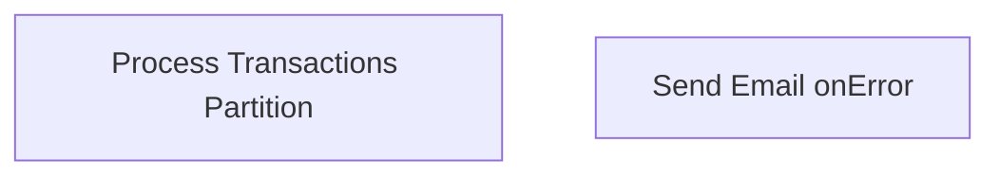

# SSIS Package: ProcessCubeOnDemand

**Project:** CUBE  
**Folder:** SSIS  
**Server:** STL-SSIS-P-01  

## Connection Managers

| Name | Type | Server | Catalog | Connection (sanitized) |
|---|---|---|---|---|
| SMTP_EMAIL | SMTP |  |  |  |
| SQL_LOG | OLEDB | stl-ssis-p-01 | msdb | Data Source=stl-ssis-p-01; Initial Catalog=msdb; Provider=SQLNCLI11.1; Integrated Security=SSPI; Auto Translate=False |
| biapp01.BAB DW | MSOLAP100 | biapp01 | BAB DW | Data Source=biapp01; Initial Catalog=BAB DW; Provider=MSOLAP.8; Integrated Security=SSPI; Impersonation Level=Impersonate |

## Control Flow Tasks

| Task | Type |
|---|---|
| ProcessCubeOnDemand | Package |
| Process Transactions Partition | DTSProcessingTask |
| Send Email onError | SendMailTask |

## Control Flow Outline

```text
- Send Email onError [SendMailTask]
- Process Transactions Partition [DTSProcessingTask]
```

## Architecture Diagram



## Variables

| Namespace | Name | Expression-bound |
|---|---|---|
| System | Propagate | No |
| User | PartitionProcessingCommand | Yes |

### Expression-bound variable values

#### User::PartitionProcessingCommand

**Expression:**

```sql
"<Batch xmlns=\"http://schemas.microsoft.com/analysisservices/2003/engine\">
  <Process xmlns:xsd=\"http://www.w3.org/2001/XMLSchema\" xmlns:xsi=\"http://www.w3.org/2001/XMLSchema-instance\" xmlns:ddl2=\"http://schemas.microsoft.com/analysisservices/2003/engine/2\" xmlns:ddl2_2=\"http://schemas.microsoft.com/analysisservices/2003/engine/2/2\" xmlns:ddl100_100=\"http://schemas.microsoft.com/analysisservices/2008/engine/100/100\" xmlns:ddl200=\"http://schemas.microsoft.com/analysisservices/2010/engine/200\" xmlns:ddl200_200=\"http://schemas.microsoft.com/analysisservices/2010/engine/200/200\" xmlns:ddl300=\"http://schemas.microsoft.com/analysisservices/2011/engine/300\" xmlns:ddl300_300=\"http://schemas.microsoft.com/analysisservices/2011/engine/300/300\" xmlns:ddl400=\"http://schemas.microsoft.com/analysisservices/2012/engine/400\" xmlns:ddl400_400=\"http://schemas.microsoft.com/analysisservices/2012/engine/400/400\" xmlns:ddl500=\"http://schemas.microsoft.com/analysisservices/2013/engine/500\" xmlns:ddl500_500=\"http://schemas.microsoft.com/analysisservices/2013/engine/500/500\">
    <Object>
      <DatabaseID>BAB DW</DatabaseID>
      <CubeID>Papa Mart</CubeID>
      <MeasureGroupID>" + @[$Package::MeasureGroup]  + "</MeasureGroupID>
      <PartitionID>" + @[$Package::PartitionName]  + "</PartitionID>
    </Object>
    <Type>ProcessFull</Type>
    <WriteBackTableCreation>UseExisting</WriteBackTableCreation>
  </Process>
</Batch>"
```

**Evaluated value:**

```sql
<Batch xmlns="http://schemas.microsoft.com/analysisservices/2003/engine">
  <Process xmlns:xsd="http://www.w3.org/2001/XMLSchema" xmlns:xsi="http://www.w3.org/2001/XMLSchema-instance" xmlns:ddl2="http://schemas.microsoft.com/analysisservices/2003/engine/2" xmlns:ddl2_2="http://schemas.microsoft.com/analysisservices/2003/engine/2/2" xmlns:ddl100_100="http://schemas.microsoft.com/analysisservices/2008/engine/100/100" xmlns:ddl200="http://schemas.microsoft.com/analysisservices/2010/engine/200" xmlns:ddl200_200="http://schemas.microsoft.com/analysisservices/2010/engine/200/200" xmlns:ddl300="http://schemas.microsoft.com/analysisservices/2011/engine/300" xmlns:ddl300_300="http://schemas.microsoft.com/analysisservices/2011/engine/300/300" xmlns:ddl400="http://schemas.microsoft.com/analysisservices/2012/engine/400" xmlns:ddl400_400="http://schemas.microsoft.com/analysisservices/2012/engine/400/400" xmlns:ddl500="http://schemas.microsoft.com/analysisservices/2013/engine/500" xmlns:ddl500_500="http://schemas.microsoft.com/analysisservices/2013/engine/500/500">
    <Object>
      <DatabaseID>BAB DW</DatabaseID>
      <CubeID>Papa Mart</CubeID>
      <MeasureGroupID>Vw DW Transactions Cube</MeasureGroupID>
      <PartitionID>Transactions_2018_01</PartitionID>
    </Object>
    <Type>ProcessFull</Type>
    <WriteBackTableCreation>UseExisting</WriteBackTableCreation>
  </Process>
</Batch>
```

## Execute SQL Tasks

_None detected._

## Data Flow: Sources

_None detected._

## Data Flow: Destinations

_None detected._
