# SSIS Package: ProcessNewDeckWebOrders

**Project:** ComHub  
**Folder:** SSIS  
**Server:** STL-SSIS-P-01  

## Architecture Diagram

```mermaid
flowchart TD
    subgraph Connections
        IntegrationStaging_conn(["IntegrationStaging [OLEDB]"])
        SMTP_conn(["SMTP [SMTP]"])
        WebOrderProcessing_conn(["WebOrderProcessing [OLEDB]"])
    end
    subgraph ControlFlow
        ProcessNewDeckWebOrders_task["ProcessNewDeckWebOrders"]
        DFT___Update_POWebOrder_OrderId_task["DFT - Update POWebOrder OrderId"]
        ProcessNewDeckWebOrders_task --> DFT___Update_POWebOrder_OrderId_task
        EXEC_spFTPCommercehubCostcoWebConfirmations_task["EXEC spFTPCommercehubCostcoWebConfirmations"]
        DFT___Update_POWebOrder_OrderId_task --> EXEC_spFTPCommercehubCostcoWebConfirmations_task
        EXEC_spFTPCommercehubCostcoWebFAs_task["EXEC spFTPCommercehubCostcoWebFAs"]
        EXEC_spFTPCommercehubCostcoWebConfirmations_task --> EXEC_spFTPCommercehubCostcoWebFAs_task
        EXEC_spFTPGetCommercehubCostcoPOs_task["EXEC spFTPGetCommercehubCostcoPOs"]
        EXEC_spFTPCommercehubCostcoWebFAs_task --> EXEC_spFTPGetCommercehubCostcoPOs_task
        EXEC_spGenerateCommHubCostcoConfirmations_task["EXEC spGenerateCommHubCostcoConfirmations"]
        EXEC_spFTPGetCommercehubCostcoPOs_task --> EXEC_spGenerateCommHubCostcoConfirmations_task
        EXEC_spGenerateCommHubCostcoFAs_task["EXEC spGenerateCommHubCostcoFAs"]
        EXEC_spGenerateCommHubCostcoConfirmations_task --> EXEC_spGenerateCommHubCostcoFAs_task
        EXEC_spUpdatePOWebOrdersAcknowledged_task["EXEC spUpdatePOWebOrdersAcknowledged"]
        EXEC_spGenerateCommHubCostcoFAs_task --> EXEC_spUpdatePOWebOrdersAcknowledged_task
        EXEC_spUpdatePOWebOrdersFulFilled_task["EXEC spUpdatePOWebOrdersFulFilled"]
        EXEC_spUpdatePOWebOrdersAcknowledged_task --> EXEC_spUpdatePOWebOrdersFulFilled_task
        Execute_Process_Task_1_task["Execute Process Task 1"]
        EXEC_spUpdatePOWebOrdersFulFilled_task --> Execute_Process_Task_1_task
        Send_Mail_Task_task["Send Mail Task"]
        Execute_Process_Task_1_task --> Send_Mail_Task_task
    end
```

## Connection Managers

| Name | Type |
|---|---|
| IntegrationStaging | OLEDB |
| SMTP | SMTP |
| WebOrderProcessing | OLEDB |

## Control Flow Tasks

| Task | Type |
|---|---|
| ProcessNewDeckWebOrders | Microsoft.Package |
| DFT - Update POWebOrder OrderId | Microsoft.Pipeline |
| EXEC spFTPCommercehubCostcoWebConfirmations | Microsoft.ExecuteSQLTask |
| EXEC spFTPCommercehubCostcoWebFAs | Microsoft.ExecuteSQLTask |
| EXEC spFTPGetCommercehubCostcoPOs | Microsoft.ExecuteSQLTask |
| EXEC spGenerateCommHubCostcoConfirmations | Microsoft.ExecuteSQLTask |
| EXEC spGenerateCommHubCostcoFAs | Microsoft.ExecuteSQLTask |
| EXEC spUpdatePOWebOrdersAcknowledged | Microsoft.ExecuteSQLTask |
| EXEC spUpdatePOWebOrdersFulFilled | Microsoft.ExecuteSQLTask |
| Execute Process Task 1 | Microsoft.ExecuteProcess |
| Send Mail Task | Microsoft.SendMailTask |

## Data Flow: Sources

| Component | SQL Preview |
|---|---|
|  | SELECT MAX(OrderId) AS 'OrderId'              ,EnterpriseSellingID FROM WM.Orders WHERE EnterpriseSellingID IS NOT NULL AND OrderDate > DATEADD(MM, -1, OrderDate) GROUP BY EnterpriseSellingID |
|  | UPDATE [WebOrderProcessing].[ComHub].[POWebOrder] SET OrderId = ? WHERE PONumber = ? |
|  | SELECT [POWebOrderId], [PONumber] FROM [WebOrderProcessing].[ComHub].[POWebOrder] WHERE OrderId IS NULL |

## Data Flow: Destinations

_None detected._

