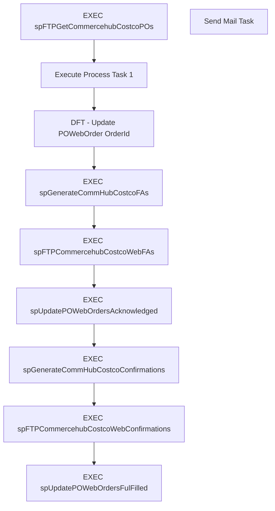

# SSIS Package: ProcessNewDeckWebOrders

**Project:** ComHub  
**Folder:** SSIS  
**Server:** STL-SSIS-P-01  

## Connection Managers

| Name | Type | Server | Catalog | Connection (sanitized) |
|---|---|---|---|---|
| IntegrationStaging | OLEDB | STL-SSIS-t-01 | IntegrationStaging | Data Source=STL-SSIS-t-01; Initial Catalog=IntegrationStaging; Provider=SQLNCLI11.1; Integrated Security=SSPI; Auto Translate=False |
| SMTP | SMTP |  |  |  |
| WebOrderProcessing | OLEDB | stl-sql-t-02 | WebOrderProcessing | Data Source=stl-sql-t-02; Initial Catalog=WebOrderProcessing; Provider=SQLNCLI11.1; Integrated Security=SSPI; Auto Translate=False |

## Control Flow Tasks

| Task | Type |
|---|---|
| ProcessNewDeckWebOrders | Package |
| DFT - Update POWebOrder OrderId | Pipeline |
| EXEC spFTPCommercehubCostcoWebConfirmations | ExecuteSQLTask |
| EXEC spFTPCommercehubCostcoWebFAs | ExecuteSQLTask |
| EXEC spFTPGetCommercehubCostcoPOs | ExecuteSQLTask |
| EXEC spGenerateCommHubCostcoConfirmations | ExecuteSQLTask |
| EXEC spGenerateCommHubCostcoFAs | ExecuteSQLTask |
| EXEC spUpdatePOWebOrdersAcknowledged | ExecuteSQLTask |
| EXEC spUpdatePOWebOrdersFulFilled | ExecuteSQLTask |
| Execute Process Task 1 | ExecuteProcess |
| Send Mail Task | SendMailTask |

## Control Flow Outline

```text
- Send Mail Task [SendMailTask]
- DFT - Update POWebOrder OrderId [Pipeline]
- EXEC spFTPCommercehubCostcoWebConfirmations [ExecuteSQLTask]
- EXEC spFTPCommercehubCostcoWebFAs [ExecuteSQLTask]
- EXEC spFTPGetCommercehubCostcoPOs [ExecuteSQLTask]
- EXEC spGenerateCommHubCostcoConfirmations [ExecuteSQLTask]
- EXEC spGenerateCommHubCostcoFAs [ExecuteSQLTask]
- EXEC spUpdatePOWebOrdersAcknowledged [ExecuteSQLTask]
- EXEC spUpdatePOWebOrdersFulFilled [ExecuteSQLTask]
- Execute Process Task 1 [ExecuteProcess]
```

## Architecture Diagram



## Variables

| Namespace | Name | Expression-bound |
|---|---|---|
| System | Propagate | No |
| User | DateTimeStamp | Yes |
| User | EndDate | Yes |
| User | EndDateAsDATE | Yes |
| User | GetDate | Yes |
| User | GetDateAsDATE | Yes |
| User | StartDate | Yes |
| User | StartDateAsDATE | Yes |

### Expression-bound variable values

#### User::DateTimeStamp

**Expression:**

```sql
(DT_WSTR,4)DATEPART("yyyy",GetDate()) 
+ (DT_WSTR,4)DATEPART("mm",GetDate()) 
+ (DT_WSTR,4)DATEPART("dd",GetDate()) 
+ (DT_WSTR,4)DATEPART("hh",GetDate()) 
+ (DT_WSTR,4)DATEPART("mi",GetDate()) 
+ (DT_WSTR,4)DATEPART("ss",GetDate()) 
+ (DT_WSTR,4)DATEPART("ms",GetDate())
```

**Evaluated value:**

```sql
20201021125735920
```

#### User::EndDate

**Expression:**

```sql
dateadd("dd", @[$Package::DaysToInclude], @[User::StartDate])
```

**Evaluated value:**

```sql
10/21/2020
```

#### User::EndDateAsDATE

**Expression:**

```sql
(DT_WSTR, 4) datepart("year", @[User::EndDate])  + "-" + 
(DT_WSTR, 2) datepart("mm", @[User::EndDate])  + "-" + 
(DT_WSTR, 2) datepart("dd",  @[User::EndDate])
```

**Evaluated value:**

```sql
2020-10-21
```

#### User::GetDate

**Expression:**

```sql
(DT_DATE)DATEDIFF("Day", (DT_DATE) 0, GETDATE())
```

**Evaluated value:**

```sql
10/21/2020
```

#### User::GetDateAsDATE

**Expression:**

```sql
(DT_WSTR, 4) datepart("year", @[User::GetDate])  + "-" + 
(DT_WSTR, 2) datepart("mm", @[User::GetDate])  + "-" + 
(DT_WSTR, 2) datepart("dd",  @[User::GetDate])
```

**Evaluated value:**

```sql
2020-10-21
```

#### User::StartDate

**Expression:**

```sql
dateadd("dd", -@[$Package::DaysToGoBack] , @[User::GetDate] )
```

**Evaluated value:**

```sql
10/20/2020
```

#### User::StartDateAsDATE

**Expression:**

```sql
(DT_WSTR, 4) datepart("year", @[User::StartDate])  + "-" + 
(DT_WSTR, 2) datepart("mm", @[User::StartDate])  + "-" + 
(DT_WSTR, 2) datepart("dd",  @[User::StartDate])
```

**Evaluated value:**

```sql
2020-10-20
```

## Execute SQL Tasks

### EXEC spFTPCommercehubCostcoWebConfirmations

**Path:** `Package\EXEC spFTPCommercehubCostcoWebConfirmations`  
**Connection:** IntegrationStaging (STL-SSIS-t-01/IntegrationStaging)  

```sql
EXEC [ComHub].[spFTPCommercehubCostcoWebConfirmations]
```

### EXEC spFTPCommercehubCostcoWebFAs

**Path:** `Package\EXEC spFTPCommercehubCostcoWebFAs`  
**Connection:** IntegrationStaging (STL-SSIS-t-01/IntegrationStaging)  

```sql
EXEC [ComHub].[spFTPCommercehubCostcoWebFAs]
```

### EXEC spFTPGetCommercehubCostcoPOs

**Path:** `Package\EXEC spFTPGetCommercehubCostcoPOs`  
**Connection:** IntegrationStaging (STL-SSIS-t-01/IntegrationStaging)  

```sql
EXEC [ComHub].[spFTPGetCommercehubCostcoPOs]
```

### EXEC spGenerateCommHubCostcoConfirmations

**Path:** `Package\EXEC spGenerateCommHubCostcoConfirmations`  
**Connection:** WebOrderProcessing (stl-sql-t-02/WebOrderProcessing)  

```sql
EXEC [ComHub].[spGenerateCommHubCostcoConfirmations]
```

### EXEC spGenerateCommHubCostcoFAs

**Path:** `Package\EXEC spGenerateCommHubCostcoFAs`  
**Connection:** WebOrderProcessing (stl-sql-t-02/WebOrderProcessing)  

```sql
EXEC [ComHub].[spGenerateCommHubCostcoFAs]
```

### EXEC spUpdatePOWebOrdersAcknowledged

**Path:** `Package\EXEC spUpdatePOWebOrdersAcknowledged`  
**Connection:** WebOrderProcessing (stl-sql-t-02/WebOrderProcessing)  

```sql
EXEC [ComHub].[spUpdatePOWebOrdersAcknowledged]
```

### EXEC spUpdatePOWebOrdersFulFilled

**Path:** `Package\EXEC spUpdatePOWebOrdersFulFilled`  
**Connection:** WebOrderProcessing (stl-sql-t-02/WebOrderProcessing)  

```sql
EXEC [ComHub].[spUpdatePOWebOrdersFulFilled]
```

## Data Flow: Sources

| Component | Source Object | Type | Data Flow Task | Connection | SQL Kind |
|---|---|---|---|---|---|
| OLE DB Source |  | OLEDBSource | DFT - Update POWebOrder OrderId | WebOrderProcessing | SqlCommand |

#### OLE DB Source — SqlCommand

```sql
SELECT [POWebOrderId], [PONumber]
FROM [WebOrderProcessing].[ComHub].[POWebOrder]
WHERE OrderId IS NULL
```

## Data Flow: Destinations

_None detected._
