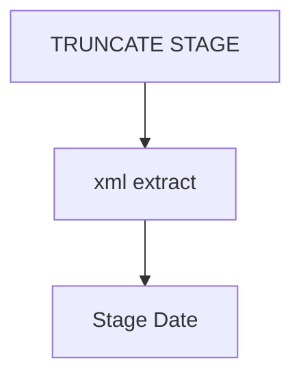

# SSIS Package: CustomerXML

**Project:** CustomerXMLExtract  
**Folder:** SSIS  
**Server:** STL-SSIS-P-01  

## Connection Managers

| Name | Type | Server | Catalog | Connection (sanitized) |
|---|---|---|---|---|
| STL-SSIS-P-01.IntegrationStaging | OLEDB | STL-SSIS-P-01 | IntegrationStaging | Data Source=STL-SSIS-P-01; Initial Catalog=IntegrationStaging; Provider=SQLNCLI11.1; Integrated Security=SSPI; Auto Translate=False |
| papamart.DWStaging | OLEDB | papamart | DWStaging | Data Source=papamart; Initial Catalog=DWStaging; Provider=SQLNCLI11.1; Integrated Security=SSPI; Auto Translate=False |
| papamart.dw | OLEDB | papamart | dw | Data Source=papamart; Initial Catalog=dw; Provider=SQLNCLI11.1; Integrated Security=SSPI; Auto Translate=False |

## Control Flow Tasks

| Task | Type |
|---|---|
| CustomerXML | Package |
| Stage Date | Pipeline |
| TRUNCATE STAGE | ExecuteSQLTask |
| xml extract | Pipeline |

## Control Flow Outline

```text
- Stage Date [Pipeline]
- TRUNCATE STAGE [ExecuteSQLTask]
- xml extract [Pipeline]
```

## Architecture Diagram



## Variables

_None detected._

## Execute SQL Tasks

### TRUNCATE STAGE

**Path:** `Package\TRUNCATE STAGE`  
**Connection:** papamart.dw (papamart/dw)  

```sql
truncate table CustomerXMLExport
truncate table DWStaging.dbo.CustomerXMLExport_ProfileDataStage
truncate table dwstaging.dbo.CustomerXMLExport_AttributeStage1
truncate table dwstaging.dbo.CustomerXMLExport_AttributeStage2
```

## Data Flow: Sources

| Component | Source Object | Type | Data Flow Task | Connection | SQL Kind |
|---|---|---|---|---|---|
| XML Staged Data |  | OLEDBSource | Stage Date | papamart.DWStaging | SqlCommand |

#### XML Staged Data — SqlCommand

```sql
select p.EmailAddress, p.LastLoginTime, a2.text 
from CustomerXMLExport_ProfileDataStage p
join CustomerXMLExport_AttributeStage1 a1 on p.ProfileID = a1.profileID 
join CustomerXMLExport_AttributeStage2 a2 on a1.AttributeID = a2.CustomAttributeID and a2.AttributeID = 'crmCustomerNumber'
```

## Data Flow: Destinations

| Component | Target Table | Type | Data Flow Task | Connection | SQL Kind |
|---|---|---|---|---|---|
| CustomerXMLExport |  | OLEDBDestination | Stage Date | papamart.dw |  |
| CustomerXMLExport_AttributeStage1 |  | OLEDBDestination | xml extract | papamart.DWStaging |  |
| CustomerXMLExport_AttributeStage2 |  | OLEDBDestination | xml extract | papamart.DWStaging |  |
| CustomerXMLExport_ProfileDataStage |  | OLEDBDestination | xml extract | papamart.DWStaging |  |
