# SSIS Package: D365_Avalara

**Project:** D365_Avalara  
**Folder:** SSIS  
**Server:** STL-SSIS-P-01  

## Connection Managers

| Name | Type | Server | Catalog | Connection (sanitized) |
|---|---|---|---|---|
| D3FO dev | DynamicsAX |  |  |  |
| D3FO prod | DynamicsAX |  |  |  |
| IntegrationStaging | OLEDB | stl-ssis-p-01 | IntegrationStaging | Data Source=stl-ssis-p-01; Initial Catalog=IntegrationStaging; Provider=SQLNCLI11.1; Integrated Security=SSPI; Auto Translate=False |
| SMTP | SMTP |  |  |  |
| bvijl | FLATFILE |  |  |  |
| papamart.dw | OLEDB | papamart | dw | Data Source=papamart; Initial Catalog=dw; Provider=SQLNCLI11.1; Integrated Security=SSPI; Auto Translate=False |
| stl-dynsnc-p-01.DBAUtility | OLEDB | stl-dynsnc-p-01 | DBAUtility | Data Source=stl-dynsnc-p-01; Initial Catalog=DBAUtility; Provider=SQLNCLI11.1; Integrated Security=SSPI; Auto Translate=False |
| stl-ssis-p-01.IntegrationStaging | OLEDB | stl-ssis-p-01 | IntegrationStaging | Data Source=stl-ssis-p-01; Initial Catalog=IntegrationStaging; Provider=SQLNCLI11.1; Integrated Security=SSPI; Auto Translate=False |
| tab delimited export file | FLATFILE |  |  |  |
| tax trans | FLATFILE |  |  |  |
| vijl | FLATFILE |  |  |  |

## Control Flow Tasks

| Task | Type |
|---|---|
| D365_Avalara | Package |
| Sequence Container | SEQUENCE |
| copy files to ssis server | SEQUENCE |
| copy bvijl | FileSystemTask |
| copy taxTrans | FileSystemTask |
| D3FO entity import 1 | SEQUENCE |
| BABW VIJL | Pipeline |
| D3FO entity import 2 | SEQUENCE |
| BABW Tax Trans | Pipeline |
| data prep | SEQUENCE |
| fix LF in voucher | ExecuteSQLTask |
| populate mtdVijl stage | ExecuteSQLTask |
| remove LF char | ExecuteSQLTask |
| Sequence Container | SEQUENCE |
| mtdVijl2 | ExecuteSQLTask |
| sequence number create | ExecuteSQLTask |
| sequence number update | ExecuteSQLTask |
| set endDate | ExecuteSQLTask |
| set endDate 1 | ExecuteSQLTask |
| set startDate | ExecuteSQLTask |
| set startDate 1 | ExecuteSQLTask |
| sequence number create | ExecuteSQLTask |
| sequence number update | ExecuteSQLTask |
| update with vendor info | ExecuteSQLTask |
| vendor prep | Pipeline |
| voucher prep | Pipeline |
| email | SendMailTask |
| file creation | SEQUENCE |
| add header | ExecuteProcess |
| add header (orig) | ExecuteProcess |
| archive | FileSystemTask |
| create timestamp file | FileSystemTask |
| export file | Pipeline |
| Foreach Loop Container | FOREACHLOOP |
| File System Task | FileSystemTask |
| set endDate | ExecuteSQLTask |
| set startDate | ExecuteSQLTask |
| get latest file | SEQUENCE |
| Script for bvijl | ScriptTask |
| Script for taxTrans | ScriptTask |
| is first Thursday and first week of period | ExecuteSQLTask |
| Sequence Container 1 1 | SEQUENCE |
| KGWY tax trans | Pipeline |
| Sequence Container 1 1 1 | SEQUENCE |
| KGWY bvijl | Pipeline |
| table prep | SEQUENCE |
| truncate stage | ExecuteSQLTask |
| truncate vendor | ExecuteSQLTask |
| truncate voucher | ExecuteSQLTask |
| variable prep | SEQUENCE |
| set endDate | ExecuteSQLTask |
| set startDate | ExecuteSQLTask |
| Sequence Container 1 | SEQUENCE |
| prod D3FO conn | Pipeline |
| Sequence Container 1 1 | SEQUENCE |
| dev D3FO conn | Pipeline |

## Control Flow Outline

```text
- Sequence Container [SEQUENCE]
- Sequence Container 1 [SEQUENCE]
- Sequence Container 1 1 [SEQUENCE]
  - dev D3FO conn [Pipeline]
  - prod D3FO conn [Pipeline]
  - D3FO entity import 1 [SEQUENCE]
    - BABW VIJL [Pipeline]
  - D3FO entity import 2 [SEQUENCE]
    - BABW Tax Trans [Pipeline]
  - Sequence Container 1 1 [SEQUENCE]
  - Sequence Container 1 1 1 [SEQUENCE]
    - KGWY bvijl [Pipeline]
    - KGWY tax trans [Pipeline]
  - copy files to ssis server [SEQUENCE]
    - copy bvijl [FileSystemTask]
    - copy taxTrans [FileSystemTask]
  - data prep [SEQUENCE]
    - Sequence Container [SEQUENCE]
      - mtdVijl2 [ExecuteSQLTask]
      - sequence number create [ExecuteSQLTask]
      - sequence number update [ExecuteSQLTask]
      - set endDate [ExecuteSQLTask]
      - set endDate 1 [ExecuteSQLTask]
      - set startDate [ExecuteSQLTask]
      - set startDate 1 [ExecuteSQLTask]
    - fix LF in voucher [ExecuteSQLTask]
    - populate mtdVijl stage [ExecuteSQLTask]
    - remove LF char [ExecuteSQLTask]
    - sequence number create [ExecuteSQLTask]
    - sequence number update [ExecuteSQLTask]
    - update with vendor info [ExecuteSQLTask]
    - vendor prep [Pipeline]
    - voucher prep [Pipeline]
  - email [SendMailTask]
  - file creation [SEQUENCE]
    - Foreach Loop Container [FOREACHLOOP]
      - File System Task [FileSystemTask]
    - add header [ExecuteProcess]
    - add header (orig) [ExecuteProcess]
    - archive [FileSystemTask]
    - create timestamp file [FileSystemTask]
    - export file [Pipeline]
    - set endDate [ExecuteSQLTask]
    - set startDate [ExecuteSQLTask]
  - get latest file [SEQUENCE]
    - Script for bvijl [ScriptTask]
    - Script for taxTrans [ScriptTask]
  - is first Thursday and first week of period [ExecuteSQLTask]
  - table prep [SEQUENCE]
    - truncate stage [ExecuteSQLTask]
    - truncate vendor [ExecuteSQLTask]
    - truncate voucher [ExecuteSQLTask]
  - variable prep [SEQUENCE]
    - set endDate [ExecuteSQLTask]
    - set startDate [ExecuteSQLTask]
```

## Architecture Diagram

```mermaid
flowchart TD
    n_Package_Sequence_Container["Sequence Container"]
    n_Package_Sequence_Container_copy_files_to_ssis_server["copy files to ssis server"]
    n_Package_Sequence_Container_copy_files_to_ssis_server_copy_bvijl["copy bvijl"]
    n_Package_Sequence_Container_copy_files_to_ssis_server_copy_taxTrans["copy taxTrans"]
    n_Package_Sequence_Container_D3FO_entity_import_1["D3FO entity import 1"]
    n_Package_Sequence_Container_D3FO_entity_import_1_BABW_VIJL["BABW VIJL"]
    n_Package_Sequence_Container_D3FO_entity_import_2["D3FO entity import 2"]
    n_Package_Sequence_Container_D3FO_entity_import_2_BABW_Tax_Trans["BABW Tax Trans"]
    n_Package_Sequence_Container_data_prep["data prep"]
    n_Package_Sequence_Container_data_prep_fix_LF_in_voucher["fix LF in voucher"]
    n_Package_Sequence_Container_data_prep_populate_mtdVijl_stage["populate mtdVijl stage"]
    n_Package_Sequence_Container_data_prep_remove_LF_char["remove LF char"]
    n_Package_Sequence_Container_data_prep_Sequence_Container["Sequence Container"]
    n_Package_Sequence_Container_data_prep_Sequence_Container_mtdVijl2["mtdVijl2"]
    n_Package_Sequence_Container_data_prep_Sequence_Container_sequence_number_create["sequence number create"]
    n_Package_Sequence_Container_data_prep_Sequence_Container_sequence_number_update["sequence number update"]
    n_Package_Sequence_Container_data_prep_Sequence_Container_set_endDate["set endDate"]
    n_Package_Sequence_Container_data_prep_Sequence_Container_set_endDate_1["set endDate 1"]
    n_Package_Sequence_Container_data_prep_Sequence_Container_set_startDate["set startDate"]
    n_Package_Sequence_Container_data_prep_Sequence_Container_set_startDate_1["set startDate 1"]
    n_Package_Sequence_Container_data_prep_sequence_number_create["sequence number create"]
    n_Package_Sequence_Container_data_prep_sequence_number_update["sequence number update"]
    n_Package_Sequence_Container_data_prep_update_with_vendor_info["update with vendor info"]
    n_Package_Sequence_Container_data_prep_vendor_prep["vendor prep"]
    n_Package_Sequence_Container_data_prep_voucher_prep["voucher prep"]
    n_Package_Sequence_Container_email["email"]
    n_Package_Sequence_Container_file_creation["file creation"]
    n_Package_Sequence_Container_file_creation_add_header["add header"]
    n_Package_Sequence_Container_file_creation_add_header__orig_["add header (orig)"]
    n_Package_Sequence_Container_file_creation_archive["archive"]
    n_Package_Sequence_Container_file_creation_create_timestamp_file["create timestamp file"]
    n_Package_Sequence_Container_file_creation_export_file["export file"]
    n_Package_Sequence_Container_file_creation_Foreach_Loop_Container["Foreach Loop Container"]
    n_Package_Sequence_Container_file_creation_Foreach_Loop_Container_File_System_Task["File System Task"]
    n_Package_Sequence_Container_file_creation_set_endDate["set endDate"]
    n_Package_Sequence_Container_file_creation_set_startDate["set startDate"]
    n_Package_Sequence_Container_get_latest_file["get latest file"]
    n_Package_Sequence_Container_get_latest_file_Script_for_bvijl["Script for bvijl"]
    n_Package_Sequence_Container_get_latest_file_Script_for_taxTrans["Script for taxTrans"]
    n_Package_Sequence_Container_is_first_Thursday_and_first_week_of_period["is first Thursday and first week of period"]
    n_Package_Sequence_Container_Sequence_Container_1_1["Sequence Container 1 1"]
    n_Package_Sequence_Container_Sequence_Container_1_1_KGWY_tax_trans["KGWY tax trans"]
    n_Package_Sequence_Container_Sequence_Container_1_1_1["Sequence Container 1 1 1"]
    n_Package_Sequence_Container_Sequence_Container_1_1_1_KGWY_bvijl["KGWY bvijl"]
    n_Package_Sequence_Container_table_prep["table prep"]
    n_Package_Sequence_Container_table_prep_truncate_stage["truncate stage"]
    n_Package_Sequence_Container_table_prep_truncate_vendor["truncate vendor"]
    n_Package_Sequence_Container_table_prep_truncate_voucher["truncate voucher"]
    n_Package_Sequence_Container_variable_prep["variable prep"]
    n_Package_Sequence_Container_variable_prep_set_endDate["set endDate"]
    n_Package_Sequence_Container_variable_prep_set_startDate["set startDate"]
    n_Package_Sequence_Container_1["Sequence Container 1"]
    n_Package_Sequence_Container_1_prod_D3FO_conn["prod D3FO conn"]
    n_Package_Sequence_Container_1_1["Sequence Container 1 1"]
    n_Package_Sequence_Container_1_1_dev_D3FO_conn["dev D3FO conn"]
    n_Package_Sequence_Container_copy_files_to_ssis_server_copy_taxTrans --> n_Package_Sequence_Container_copy_files_to_ssis_server_copy_bvijl
    n_Package_Sequence_Container_data_prep_Sequence_Container_set_startDate --> n_Package_Sequence_Container_data_prep_Sequence_Container_set_endDate
    n_Package_Sequence_Container_data_prep_Sequence_Container_set_startDate_1 --> n_Package_Sequence_Container_data_prep_Sequence_Container_set_endDate_1
    n_Package_Sequence_Container_data_prep_Sequence_Container_set_endDate_1 --> n_Package_Sequence_Container_data_prep_Sequence_Container_mtdVijl2
    n_Package_Sequence_Container_data_prep_Sequence_Container_mtdVijl2 --> n_Package_Sequence_Container_data_prep_Sequence_Container_sequence_number_create
    n_Package_Sequence_Container_data_prep_Sequence_Container_sequence_number_create --> n_Package_Sequence_Container_data_prep_Sequence_Container_sequence_number_update
    n_Package_Sequence_Container_data_prep_remove_LF_char --> n_Package_Sequence_Container_data_prep_update_with_vendor_info
    n_Package_Sequence_Container_data_prep_vendor_prep --> n_Package_Sequence_Container_data_prep_voucher_prep
    n_Package_Sequence_Container_data_prep_voucher_prep --> n_Package_Sequence_Container_data_prep_fix_LF_in_voucher
    n_Package_Sequence_Container_data_prep_fix_LF_in_voucher --> n_Package_Sequence_Container_data_prep_populate_mtdVijl_stage
    n_Package_Sequence_Container_data_prep_sequence_number_create --> n_Package_Sequence_Container_data_prep_sequence_number_update
    n_Package_Sequence_Container_data_prep_populate_mtdVijl_stage --> n_Package_Sequence_Container_data_prep_remove_LF_char
    n_Package_Sequence_Container_data_prep_update_with_vendor_info --> n_Package_Sequence_Container_data_prep_sequence_number_create
    n_Package_Sequence_Container_file_creation_export_file --> n_Package_Sequence_Container_file_creation_add_header
    n_Package_Sequence_Container_file_creation_add_header --> n_Package_Sequence_Container_file_creation_create_timestamp_file
    n_Package_Sequence_Container_file_creation_set_startDate --> n_Package_Sequence_Container_file_creation_set_endDate
    n_Package_Sequence_Container_file_creation_set_endDate --> n_Package_Sequence_Container_file_creation_export_file
    n_Package_Sequence_Container_file_creation_create_timestamp_file --> n_Package_Sequence_Container_file_creation_archive
    n_Package_Sequence_Container_file_creation_archive --> n_Package_Sequence_Container_file_creation_Foreach_Loop_Container
    n_Package_Sequence_Container_get_latest_file_Script_for_taxTrans --> n_Package_Sequence_Container_get_latest_file_Script_for_bvijl
    n_Package_Sequence_Container_table_prep_truncate_stage --> n_Package_Sequence_Container_table_prep_truncate_vendor
    n_Package_Sequence_Container_table_prep_truncate_vendor --> n_Package_Sequence_Container_table_prep_truncate_voucher
    n_Package_Sequence_Container_variable_prep_set_startDate --> n_Package_Sequence_Container_variable_prep_set_endDate
    n_Package_Sequence_Container_is_first_Thursday_and_first_week_of_period --> n_Package_Sequence_Container_table_prep
    n_Package_Sequence_Container_variable_prep --> n_Package_Sequence_Container_get_latest_file
    n_Package_Sequence_Container_D3FO_entity_import_2 --> n_Package_Sequence_Container_D3FO_entity_import_1
    n_Package_Sequence_Container_data_prep --> n_Package_Sequence_Container_file_creation
    n_Package_Sequence_Container_table_prep --> n_Package_Sequence_Container_variable_prep
    n_Package_Sequence_Container_D3FO_entity_import_1 --> n_Package_Sequence_Container_data_prep
    n_Package_Sequence_Container_get_latest_file --> n_Package_Sequence_Container_copy_files_to_ssis_server
    n_Package_Sequence_Container_copy_files_to_ssis_server --> n_Package_Sequence_Container_D3FO_entity_import_2
    n_Package_Sequence_Container_file_creation --> n_Package_Sequence_Container_email
```



## Variables

| Namespace | Name | Expression-bound |
|---|---|---|
| User | varArchiveFolder | No |
| User | varAvalaraServer | No |
| User | varAvalaraServerFile | Yes |
| User | varCount | No |
| User | varDestFinal1 | Yes |
| User | varDestFinal2 | Yes |
| User | varEndDate | No |
| User | varExportSQL | Yes |
| User | varExtension | No |
| User | varFirstThursdayFirstWOP | No |
| User | varGenericFile | Yes |
| User | varMtdDatestampedFile | Yes |
| User | varMtdFile | No |
| User | varMtdFolder | No |
| User | varMtdPath | Yes |
| User | varMultitxt | No |
| User | varMultitxtDestinationPath | Yes |
| User | varMultitxtSourcePath | Yes |
| User | varSourceFile1 | No |
| User | varSourceFile2 | No |
| User | varSourceFinal1 | Yes |
| User | varSourceFinal2 | Yes |
| User | varSourceFolder1 | No |
| User | varSourceFolder2 | No |
| User | varStartDate | No |

### Expression-bound variable values

#### User::varAvalaraServerFile

**Expression:**

```sql
@[User::varAvalaraServer] + @[User::varMtdFile] + "_"+ (DT_WSTR, 4) year(getdate()) +  RIGHT( "0" + (DT_WSTR, 2) MONTH(  GETDATE() ), 2) + RIGHT("0" +  (DT_WSTR, 2) DAY(  GETDATE() ), 2 ) + @[User::varExtension]
```

**Evaluated value:**

```sql
avalara_D3FO_export_20210903.multitxt
```

#### User::varDestFinal1

**Expression:**

```sql
@[User::varMtdFolder]+"taxTrans.txt"
```

**Evaluated value:**

```sql
\\stl-ssis-p-01\IntegrationStaging\mtdVijl\taxTrans.txt
```

#### User::varDestFinal2

**Expression:**

```sql
@[User::varMtdFolder]+"bvijl.txt"
```

**Evaluated value:**

```sql
\\stl-ssis-p-01\IntegrationStaging\mtdVijl\bvijl.txt
```

#### User::varExportSQL

**Expression:**

```sql
"SELECT [DocumentType],[TransactionDate],[InvoiceNumber],[InvoiceDate],[Currency],[VATCode],[SupplierID],[SupplierName]
,[SupplierCountry],[SupplierVATNumberUsed],[SupplierCountryVATNumberUsed],[CustomerID],[CustomerName],[CustomerCountry]
,[CustomerVATNumberUsed],[CustomerCountryVATNumberUsed],[TaxableBasis],[ValueVAT],[TotalValueLine],[AmountVATDeducted]
,[AmountVATReverseCharged],[SupplierInvoiceNumber],[sequenceNumber],[TAXTRANS_RECID] FROM [dbo].[babw_mtdVijl2]
where (cast([InvoiceDate] as date) >= " + @[User::varStartDate] + 
" and cast([InvoiceDate] as date) <= " + @[User::varEndDate] + ")"
```

#### User::varGenericFile

**Expression:**

```sql
@[User::varMtdFolder] +  "mtdHeaderAvalara.txt"
```

**Evaluated value:**

```sql
\\stl-ssis-p-01\IntegrationStaging\mtdVijl\mtdHeaderAvalara.txt
```

#### User::varMtdDatestampedFile

**Expression:**

```sql
@[User::varMtdFolder] + @[User::varMtdFile] + "_"+ (DT_WSTR, 4) year(getdate()) +  RIGHT( "0" + (DT_WSTR, 2) MONTH(  GETDATE() ), 2) + RIGHT("0" +  (DT_WSTR, 2) DAY(  GETDATE() ), 2 ) + @[User::varExtension]
```

**Evaluated value:**

```sql
\\stl-ssis-p-01\IntegrationStaging\mtdVijl\avalara_D3FO_export_20210903.multitxt
```

#### User::varMtdPath

**Expression:**

```sql
@[User::varMtdFolder] +  @[User::varMtdFile] +  @[User::varExtension]
```

**Evaluated value:**

```sql
\\stl-ssis-p-01\IntegrationStaging\mtdVijl\avalara_D3FO_export.multitxt
```

#### User::varMultitxtDestinationPath

**Expression:**

```sql
@[$Package::avalaraInbox] +  @[User::varMultitxt]
```

**Evaluated value:**

```sql
\\STL-AVALAP-P-01\AvalaraInbox\
```

#### User::varMultitxtSourcePath

**Expression:**

```sql
@[User::varMtdFolder] +  @[User::varMultitxt]
```

**Evaluated value:**

```sql
\\stl-ssis-p-01\IntegrationStaging\mtdVijl\
```

#### User::varSourceFinal1

**Expression:**

```sql
@[User::varSourceFolder1]+"\\"+ @[User::varSourceFile1]
```

**Evaluated value:**

```sql
\\stl-dynsnc-p-01\d$\BABWIntegrations\mtd\taxTrans\
```

#### User::varSourceFinal2

**Expression:**

```sql
@[User::varSourceFolder2]+"\\"+  @[User::varSourceFile2]
```

**Evaluated value:**

```sql
\\stl-dynsnc-p-01\d$\BABWIntegrations\mtd\BabwVendorInvoiceJournalLine\
```

## Execute SQL Tasks

### mtdVijl2

**Path:** `Package\Sequence Container\data prep\Sequence Container\mtdVijl2`  
**Connection:** stl-dynsnc-p-01.DBAUtility (stl-dynsnc-p-01/DBAUtility)  

```sql
spBabw_mtdVijl2 ?,?
```

### sequence number create

**Path:** `Package\Sequence Container\data prep\Sequence Container\sequence number create`  
**Connection:** stl-dynsnc-p-01.DBAUtility (stl-dynsnc-p-01/DBAUtility)  

```sql
with sN (TAXTRANS_RECID,INVOICEID, SOURCEBASEAMOUNTCUR, TAXAMOUNTCUR, VOUCHER,sequenceNumber)
AS
(
SELECT      TAXTRANS_RECID, INVOICEID, SOURCEBASEAMOUNTCUR, TAXAMOUNTCUR, VOUCHER,
            ROW_NUMBER() OVER
            (PARTITION BY INVOICEID, VOUCHER
             ORDER BY VOUCHER)
            AS 'sequenceNumber'
FROM       [dbo].[babw_mtdVijl_export2]
)

update mtd set mtd.sequenceNumber = sN.sequenceNumber
from [dbo].[babw_mtdVijl2] mtd 
join sN on mtd.TAXTRANS_RECID = sN.TAXTRANS_RECID
```

### sequence number update

**Path:** `Package\Sequence Container\data prep\Sequence Container\sequence number update`  
**Connection:** stl-dynsnc-p-01.DBAUtility (stl-dynsnc-p-01/DBAUtility)  

```sql
update [dbo].[babw_mtdVijl2] set 
InvoiceNumber = InvoiceNumber + '-' + convert(varchar(10), sequenceNumber), 
SupplierInvoiceNumber = SupplierInvoiceNumber + '-' + convert(varchar(10), sequenceNumber)
```

### set endDate

**Path:** `Package\Sequence Container\data prep\Sequence Container\set endDate`  
**Connection:** papamart.dw (papamart/dw)  

```sql
declare @todayDate date
declare @currentPeriodYear int
declare @currentPeriodPeriod int
declare @previousPeriodYear int
declare @previousPeriodperiod int
declare @startDate date
declare @endDate date

set @todayDate = (select convert(varchar(11),getdate(), 110))

set @currentPeriodYear = (select fiscal_year from date_dim where CONVERT(VARCHAR(11),actual_date, 110) = @todayDate )
set @currentPeriodPeriod = (select fiscal_period from date_dim where CONVERT(VARCHAR(11),actual_date, 110) = @todayDate)

IF @currentPeriodPeriod = 1 set @previousPeriodperiod = 12
ELSE set @previousPeriodperiod = (select fiscal_period-1 from date_dim where CONVERT(VARCHAR(11),actual_date, 110) =  @todayDate)

IF @currentPeriodPeriod = 1 set @previousPeriodYear = (select fiscal_year-1 from date_dim where CONVERT(VARCHAR(11),actual_date, 110) =  @todayDate)
ELSE set @previousPeriodYear =  @currentPeriodYear

--set @startDate = (select min(actual_date) from date_dim where fiscal_year = @previousPeriodYear and fiscal_period = @previousPeriodPeriod)
set @endDate = (select max(actual_date) from date_dim where fiscal_year = @previousPeriodYear and fiscal_period = @previousPeriodPeriod)

select @endDate as 'endDate'
```

### set endDate 1

**Path:** `Package\Sequence Container\data prep\Sequence Container\set endDate 1`  
**Connection:** papamart.dw (papamart/dw)  

```sql
declare @todayDate date
declare @currentPeriodYear int
declare @currentPeriodPeriod int
declare @previousPeriodYear int
declare @previousPeriodperiod int
declare @startDate date
declare @endDate date

set @todayDate = (select convert(varchar(11),getdate(), 110))

set @currentPeriodYear = (select fiscal_year from date_dim where CONVERT(VARCHAR(11),actual_date, 110) = @todayDate )
set @currentPeriodPeriod = (select fiscal_period from date_dim where CONVERT(VARCHAR(11),actual_date, 110) = @todayDate)

IF @currentPeriodPeriod = 1 set @previousPeriodperiod = 12
ELSE set @previousPeriodperiod = (select fiscal_period-1 from date_dim where CONVERT(VARCHAR(11),actual_date, 110) =  @todayDate)

IF @currentPeriodPeriod = 1 set @previousPeriodYear = (select fiscal_year-1 from date_dim where CONVERT(VARCHAR(11),actual_date, 110) =  @todayDate)
ELSE set @previousPeriodYear =  @currentPeriodYear

--set @startDate = (select min(actual_date) from date_dim where fiscal_year = @previousPeriodYear and fiscal_period = @previousPeriodPeriod)
set @endDate = (select max(actual_date) from date_dim where fiscal_year = @previousPeriodYear and fiscal_period = @previousPeriodPeriod)


 set @endDate = '2019-04-06' 

select @endDate as 'endDate'
```

### set startDate

**Path:** `Package\Sequence Container\data prep\Sequence Container\set startDate`  
**Connection:** papamart.dw (papamart/dw)  

```sql

declare @todayDate date
declare @currentPeriodYear int
declare @currentPeriodPeriod int
declare @previousPeriodYear int
declare @previousPeriodperiod int
declare @startDate date
declare @endDate date

set @todayDate = (select convert(varchar(11),getdate(), 110))

set @currentPeriodYear = (select fiscal_year from date_dim where CONVERT(VARCHAR(11),actual_date, 110) = @todayDate )
set @currentPeriodPeriod = (select fiscal_period from date_dim where CONVERT(VARCHAR(11),actual_date, 110) = @todayDate)

IF @currentPeriodPeriod = 1 set @previousPeriodperiod = 12
ELSE set @previousPeriodperiod = (select fiscal_period-1 from date_dim where CONVERT(VARCHAR(11),actual_date, 110) =  @todayDate)

IF @currentPeriodPeriod = 1 set @previousPeriodYear = (select fiscal_year-1 from date_dim where CONVERT(VARCHAR(11),actual_date, 110) =  @todayDate)
ELSE set @previousPeriodYear =  @currentPeriodYear

set @startDate = (select min(actual_date) from date_dim where fiscal_year = @previousPeriodYear and fiscal_period = @previousPeriodPeriod)
--set @endDate = (select max(actual_date) from date_dim where fiscal_year = @previousPeriodYear and fiscal_period = @previousPeriodPeriod)

 select @startDate as 'startDate'
```

### set startDate 1

**Path:** `Package\Sequence Container\data prep\Sequence Container\set startDate 1`  
**Connection:** papamart.dw (papamart/dw)  

```sql

declare @todayDate date
declare @currentPeriodYear int
declare @currentPeriodPeriod int
declare @previousPeriodYear int
declare @previousPeriodperiod int
declare @startDate date
declare @endDate date

set @todayDate = (select convert(varchar(11),getdate(), 110))

set @currentPeriodYear = (select fiscal_year from date_dim where CONVERT(VARCHAR(11),actual_date, 110) = @todayDate )
set @currentPeriodPeriod = (select fiscal_period from date_dim where CONVERT(VARCHAR(11),actual_date, 110) = @todayDate)

IF @currentPeriodPeriod = 1 set @previousPeriodperiod = 12
ELSE set @previousPeriodperiod = (select fiscal_period-1 from date_dim where CONVERT(VARCHAR(11),actual_date, 110) =  @todayDate)

IF @currentPeriodPeriod = 1 set @previousPeriodYear = (select fiscal_year-1 from date_dim where CONVERT(VARCHAR(11),actual_date, 110) =  @todayDate)
ELSE set @previousPeriodYear =  @currentPeriodYear

set @startDate = (select min(actual_date) from date_dim where fiscal_year = @previousPeriodYear and fiscal_period = @previousPeriodPeriod)
--set @endDate = (select max(actual_date) from date_dim where fiscal_year = @previousPeriodYear and fiscal_period = @previousPeriodPeriod)


 set @startDate = '2019-01-06' 

 select @startDate as 'startDate'


```

### fix LF in voucher

**Path:** `Package\Sequence Container\data prep\fix LF in voucher`  
**Connection:** stl-ssis-p-01.IntegrationStaging (stl-ssis-p-01/IntegrationStaging)  

```sql
update [dbo].[babw_mtdVijl_export3] set VOUCHER = replace(VOUCHER, char(13), '')

```

### populate mtdVijl stage

**Path:** `Package\Sequence Container\data prep\populate mtdVijl stage`  
**Connection:** stl-ssis-p-01.IntegrationStaging (stl-ssis-p-01/IntegrationStaging)  

```sql
INSERT INTO [dbo].[babw_mtdVijl2] 
([DocumentType],[TransactionDate],[InvoiceNumber],[InvoiceDate],[Currency],[VATCode],
[SupplierID],[SupplierName],[SupplierCountry],[SupplierVATNumberUsed],[SupplierCountryVATNumberUsed],[CustomerID],
[CustomerName],[CustomerCountry],[CustomerVATNumberUsed],[CustomerCountryVATNumberUsed],
[TaxableBasis],[ValueVAT],[TotalValueLine],[AmountVATDeducted],[AmountVATReverseCharged],[SupplierInvoiceNumber],[TAXTRANS_RECID])
SELECT DocumentType = CASE WHEN SOURCEBASEAMOUNTCUR > 0 then '1' ELSE '3' END, 
convert(varchar(10),CREATEDDATETIME_TAXTRANS,120) as 'TransactionDate',[dbo].[babw_mtdVijl_export3].[VOUCHER] as 'InvoiceNumber',
convert(varchar(10),[TRANSDATE],120)  as 'InvoiceDate',[SOURCECURRENCYCODE] as 'Currency',
VatCode = CASE
WHEN [TAXITEMGROUP] = 'STNS' then 'UK-STDP'WHEN [TAXITEMGROUP] = 'STNG' then 'UK-STDP'
WHEN [TAXITEMGROUP] = 'ZERO' then 'UK-ZEROP'WHEN [TAXITEMGROUP] = 'UKSTD' then 'UK-STDP'
WHEN [TAXITEMGROUP] = 'EXMT' then 'UK-EXEMPTP'WHEN [TAXITEMGROUP] = 'REDU' then 'UK-REDUCEDP'
ELSE '' END,
vo.accountDisplayValue as 'SupplierID', ve.vendorOrganizationName as 'SupplierName',
'SupplierCountry' = CASE
WHEN ve.addressCountryRegionId = 'GBR' THEN 'GB'
ELSE '' END,
'' as 'SupplierVATNumberUsed','' as 'SupplierCountryVATNumberUsed',
'2110' as 'CustomerID',
'BABWUK' as 'CustomerName','GB' as 'CustomerCountry','GB880982284' as 'CustomerVATNumberUsed','GB' as 'CustomerCountryVATNumberUsed',
--SOURCEBASEAMOUNTCUR as 'TaxableBasis',TAXAMOUNTCUR as 'ValueVAT',SOURCEBASEAMOUNTCUR+TAXAMOUNTCUR as TotalValueLine,TAXAMOUNTCUR as 'AmountVATDeducted','0.00' as 
ABS(SOURCEBASEAMOUNTCUR) as 'TaxableBasis',ABS(TAXAMOUNTCUR) as 'ValueVAT',ABS(SOURCEBASEAMOUNTCUR+TAXAMOUNTCUR) as TotalValueLine,ABS(TAXAMOUNTCUR) as 'AmountVATDeducted','0.00' as 
'AmountVATReverseCharged',
vo.[INVOICE] as 'SupplierInvoiceNumber',
RECID_TAXTRANS from [dbo].[babw_mtdVijl_export3] 
left outer join [dbo].[babw_mtdVijl_voucher] vo on [dbo].[babw_mtdVijl_export3].VOUCHER = vo.voucher
left outer join [dbo].[babw_mtdVijl_vendor] ve on vo.accountDisplayValue = ve.vendorAccountNumber
where TAXGROUP like 'UK%'

```

### remove LF char

**Path:** `Package\Sequence Container\data prep\remove LF char`  
**Connection:** stl-ssis-p-01.IntegrationStaging (stl-ssis-p-01/IntegrationStaging)  

```sql
update [dbo].[babw_mtdVijl2] set InvoiceNumber = replace(InvoiceNumber, char(13), '')

```

### sequence number create

**Path:** `Package\Sequence Container\data prep\sequence number create`  
**Connection:** stl-ssis-p-01.IntegrationStaging (stl-ssis-p-01/IntegrationStaging)  

```sql
with sN (RECID_TAXTRANS,SOURCEBASEAMOUNTCUR, TAXAMOUNTCUR, VOUCHER,sequenceNumber)
AS
(
SELECT      RECID_TAXTRANS, SOURCEBASEAMOUNTCUR, TAXAMOUNTCUR, VOUCHER,
            ROW_NUMBER() OVER
            (PARTITION BY VOUCHER
             ORDER BY VOUCHER)
            AS 'sequenceNumber'
FROM       [dbo].[babw_mtdVijl_export3]
)

update mtd set mtd.sequenceNumber = sN.sequenceNumber
from [dbo].[babw_mtdVijl2] mtd 
join sN on mtd.TAXTRANS_RECID = sN.RECID_TAXTRANS
```

### sequence number update

**Path:** `Package\Sequence Container\data prep\sequence number update`  
**Connection:** stl-ssis-p-01.IntegrationStaging (stl-ssis-p-01/IntegrationStaging)  

```sql
update [dbo].[babw_mtdVijl2] set 
InvoiceNumber = InvoiceNumber + '-' + convert(varchar(10), sequenceNumber), 
SupplierInvoiceNumber = SupplierInvoiceNumber + '-' + convert(varchar(10), sequenceNumber)
```

### update with vendor info

**Path:** `Package\Sequence Container\data prep\update with vendor info`  
**Connection:** stl-ssis-p-01.IntegrationStaging (stl-ssis-p-01/IntegrationStaging)  

```sql


update m2
set m2.SupplierID = v.accountDisplayValue,  m2.SupplierInvoiceNumber = v.INVOICE
FROM [dbo].[babw_mtdVijl2] m2
join [dbo].[babw_mtdVijl_voucher] v on v.voucher = m2.InvoiceNumber


update m2
set m2.SupplierName = v2.vendorOrganizationName
FROM [dbo].[babw_mtdVijl2] m2
join [dbo].[babw_mtdVijl_vendor] v2 on m2.SupplierID = v2.vendorAccountNumber


```

### set endDate

**Path:** `Package\Sequence Container\file creation\set endDate`  
**Connection:** papamart.dw (papamart/dw)  

```sql
declare @todayDate date
declare @currentPeriodYear int
declare @currentPeriodPeriod int
declare @previousPeriodYear int
declare @previousPeriodperiod int
declare @startDate date
declare @endDate date

set @todayDate = (select convert(varchar(11),getdate(), 110))

set @currentPeriodYear = (select fiscal_year from date_dim where CONVERT(VARCHAR(11),actual_date, 110) = @todayDate )
set @currentPeriodPeriod = (select fiscal_period from date_dim where CONVERT(VARCHAR(11),actual_date, 110) = @todayDate)

IF @currentPeriodPeriod = 1 set @previousPeriodperiod = 12
ELSE set @previousPeriodperiod = (select fiscal_period-1 from date_dim where CONVERT(VARCHAR(11),actual_date, 110) =  @todayDate)

IF @currentPeriodPeriod = 1 set @previousPeriodYear = (select fiscal_year-1 from date_dim where CONVERT(VARCHAR(11),actual_date, 110) =  @todayDate)
ELSE set @previousPeriodYear =  @currentPeriodYear

--set @startDate = (select min(actual_date) from date_dim where fiscal_year = @previousPeriodYear and fiscal_period = @previousPeriodPeriod)
set @endDate = (select max(actual_date) from date_dim where fiscal_year = @previousPeriodYear and fiscal_period = @previousPeriodPeriod)

select @endDate as 'endDate'
```

### set startDate

**Path:** `Package\Sequence Container\file creation\set startDate`  
**Connection:** papamart.dw (papamart/dw)  

```sql

declare @todayDate date
declare @currentPeriodYear int
declare @currentPeriodPeriod int
declare @previousPeriodYear int
declare @previousPeriodperiod int
declare @startDate date
declare @endDate date

set @todayDate = (select convert(varchar(11),getdate(), 110))

set @currentPeriodYear = (select fiscal_year from date_dim where CONVERT(VARCHAR(11),actual_date, 110) = @todayDate )
set @currentPeriodPeriod = (select fiscal_period from date_dim where CONVERT(VARCHAR(11),actual_date, 110) = @todayDate)

IF @currentPeriodPeriod = 1 set @previousPeriodperiod = 12
ELSE set @previousPeriodperiod = (select fiscal_period-1 from date_dim where CONVERT(VARCHAR(11),actual_date, 110) =  @todayDate)

IF @currentPeriodPeriod = 1 set @previousPeriodYear = (select fiscal_year-1 from date_dim where CONVERT(VARCHAR(11),actual_date, 110) =  @todayDate)
ELSE set @previousPeriodYear =  @currentPeriodYear

set @startDate = (select min(actual_date) from date_dim where fiscal_year = @previousPeriodYear and fiscal_period = @previousPeriodPeriod)
--set @endDate = (select max(actual_date) from date_dim where fiscal_year = @previousPeriodYear and fiscal_period = @previousPeriodPeriod)

 select @startDate as 'startDate'
```

### is first Thursday and first week of period

**Path:** `Package\Sequence Container\is first Thursday and first week of period`  
**Connection:** papamart.dw (papamart/dw)  

```sql
select 'varFirstThursdayFirstWOP' = case when a.day_of_week = 5 and a.week_of_period = 1 then 1 else 0 end
from 
(
select * from [dbo].[date_dim] where cast(actual_date as date) = cast(getdate() as date)
) a
```

### truncate stage

**Path:** `Package\Sequence Container\table prep\truncate stage`  
**Connection:** stl-ssis-p-01.IntegrationStaging (stl-ssis-p-01/IntegrationStaging)  

```sql
truncate table [dbo].[babw_mtdVijl_export3] 
truncate table [dbo].[babw_mtdVijl_export4] 
truncate table [dbo].[babw_mtdVijl2]
```

### truncate vendor

**Path:** `Package\Sequence Container\table prep\truncate vendor`  
**Connection:** stl-ssis-p-01.IntegrationStaging (stl-ssis-p-01/IntegrationStaging)  

```sql
truncate table [dbo].[babw_mtdVijl_vendor] 
```

### truncate voucher

**Path:** `Package\Sequence Container\table prep\truncate voucher`  
**Connection:** stl-ssis-p-01.IntegrationStaging (stl-ssis-p-01/IntegrationStaging)  

```sql
truncate table [dbo].[babw_mtdVijl_voucher] 
```

### set endDate

**Path:** `Package\Sequence Container\variable prep\set endDate`  
**Connection:** papamart.dw (papamart/dw)  

```sql
declare @todayDate date
declare @currentPeriodYear int
declare @currentPeriodPeriod int
declare @previousPeriodYear int
declare @previousPeriodperiod int
declare @startDate date
declare @endDate date

set @todayDate = (select convert(varchar(11),getdate(), 110))

set @currentPeriodYear = (select fiscal_year from date_dim where CONVERT(VARCHAR(11),actual_date, 110) = @todayDate )
set @currentPeriodPeriod = (select fiscal_period from date_dim where CONVERT(VARCHAR(11),actual_date, 110) = @todayDate)

IF @currentPeriodPeriod = 1 set @previousPeriodperiod = 12
ELSE set @previousPeriodperiod = (select fiscal_period-1 from date_dim where CONVERT(VARCHAR(11),actual_date, 110) =  @todayDate)

IF @currentPeriodPeriod = 1 set @previousPeriodYear = (select fiscal_year-1 from date_dim where CONVERT(VARCHAR(11),actual_date, 110) =  @todayDate)
ELSE set @previousPeriodYear =  @currentPeriodYear

--set @startDate = (select min(actual_date) from date_dim where fiscal_year = @previousPeriodYear and fiscal_period = @previousPeriodPeriod)
set @endDate = (select max(actual_date) from date_dim where fiscal_year = @previousPeriodYear and fiscal_period = @previousPeriodPeriod)

select @endDate as 'endDate'
```

### set startDate

**Path:** `Package\Sequence Container\variable prep\set startDate`  
**Connection:** papamart.dw (papamart/dw)  

```sql

declare @todayDate date
declare @currentPeriodYear int
declare @currentPeriodPeriod int
declare @previousPeriodYear int
declare @previousPeriodperiod int
declare @startDate date
declare @endDate date

set @todayDate = (select convert(varchar(11),getdate(), 110))

set @currentPeriodYear = (select fiscal_year from date_dim where CONVERT(VARCHAR(11),actual_date, 110) = @todayDate )
set @currentPeriodPeriod = (select fiscal_period from date_dim where CONVERT(VARCHAR(11),actual_date, 110) = @todayDate)

IF @currentPeriodPeriod = 1 set @previousPeriodperiod = 12
ELSE set @previousPeriodperiod = (select fiscal_period-1 from date_dim where CONVERT(VARCHAR(11),actual_date, 110) =  @todayDate)

IF @currentPeriodPeriod = 1 set @previousPeriodYear = (select fiscal_year-1 from date_dim where CONVERT(VARCHAR(11),actual_date, 110) =  @todayDate)
ELSE set @previousPeriodYear =  @currentPeriodYear

set @startDate = (select min(actual_date) from date_dim where fiscal_year = @previousPeriodYear and fiscal_period = @previousPeriodPeriod)
--set @endDate = (select max(actual_date) from date_dim where fiscal_year = @previousPeriodYear and fiscal_period = @previousPeriodPeriod)

 select @startDate as 'startDate'
```

## Data Flow: Sources

| Component | Source Object | Type | Data Flow Task | Connection | SQL Kind |
|---|---|---|---|---|---|
| Flat File Source |  | FlatFileSource | BABW VIJL | bvijl |  |
| Flat File Source |  | FlatFileSource | BABW Tax Trans | tax trans |  |
| stl-ssis-p-01 vendor master query |  | OLEDBSource | vendor prep | stl-ssis-p-01.IntegrationStaging | SqlCommand |
| stl-ssis-p-01 export4 query |  | OLEDBSource | voucher prep | stl-ssis-p-01.IntegrationStaging | SqlCommand |
| OLE DB Source |  | OLEDBSource | export file | stl-ssis-p-01.IntegrationStaging | SqlCommand |

#### stl-ssis-p-01 vendor master query — SqlCommand

```sql
select VENDORACCOUNTNUMBER, ADDRESSCOUNTRYREGIONID, VENDORORGANIZATIONNAME  from [ERP].[VendorMaster] where ENTITY = 2110
```

#### stl-ssis-p-01 export4 query — SqlCommand

```sql
select distinct INTERNALINVOICEID, INVOICEACCOUNT, INVOICEID  from [dbo].[babw_mtdVijl_export4] order by INTERNALINVOICEID ASC
```

#### OLE DB Source — SqlCommand

```sql
SELECT [DocumentType],[TransactionDate],[InvoiceNumber],[InvoiceDate],[Currency],[VATCode],[SupplierID],[SupplierName]
,[SupplierCountry],[SupplierVATNumberUsed],[SupplierCountryVATNumberUsed],[CustomerID],[CustomerName],[CustomerCountry]
,[CustomerVATNumberUsed],[CustomerCountryVATNumberUsed],[TaxableBasis],[ValueVAT],[TotalValueLine],[AmountVATDeducted]
,[AmountVATReverseCharged],[SupplierInvoiceNumber],[sequenceNumber],[TAXTRANS_RECID] FROM [dbo].[babw_mtdVijl2]


where (cast([InvoiceDate] as date) >= ? and 
cast([InvoiceDate] as date) <= ?)

/*
where (cast([InvoiceDate] as date) >= '2021-05-30' and
cast([InvoiceDate] as date) <= '2021-07-03')
*/
```

## Data Flow: Destinations

| Component | Target Table | Type | Data Flow Task | Connection | SQL Kind |
|---|---|---|---|---|---|
| OLE DB Destination |  | OLEDBDestination | BABW VIJL | IntegrationStaging |  |
| OLE DB Destination |  | OLEDBDestination | BABW Tax Trans | stl-ssis-p-01.IntegrationStaging |  |
| stl-ssis-p-01 mtd vendor |  | OLEDBDestination | vendor prep | stl-ssis-p-01.IntegrationStaging |  |
| stl-ssis-p-01 voucher |  | OLEDBDestination | voucher prep | stl-ssis-p-01.IntegrationStaging |  |
| Flat File Destination |  | FlatFileDestination | export file | tab delimited export file |  |
| OLE DB Destination |  | OLEDBDestination | KGWY tax trans | IntegrationStaging |  |
| OLE DB Destination |  | OLEDBDestination | KGWY bvijl | IntegrationStaging |  |
| OLE DB Destination |  | OLEDBDestination | prod D3FO conn | IntegrationStaging |  |
| OLE DB Destination |  | OLEDBDestination | dev D3FO conn | IntegrationStaging |  |
