# SSIS Package: D365_Avalara

**Project:** D365_Avalara  
**Folder:** SSIS  
**Server:** STL-SSIS-P-01  

## Architecture Diagram

```mermaid
flowchart TD
    subgraph Connections
        bvijl_conn(["bvijl [FLATFILE]"])
        D3FO_dev_conn(["D3FO dev [DynamicsAX]"])
        D3FO_prod_conn(["D3FO prod [DynamicsAX]"])
        IntegrationStaging_conn(["IntegrationStaging [OLEDB]"])
        papamart_dw_conn(["papamart.dw [OLEDB]"])
        SMTP_conn(["SMTP [SMTP]"])
        stl_dynsnc_p_01_DBAUtility_conn(["stl-dynsnc-p-01.DBAUtility [OLEDB]"])
        stl_ssis_p_01_IntegrationStaging_conn(["stl-ssis-p-01.IntegrationStaging [OLEDB]"])
        tab_delimited_export_file_conn(["tab delimited export file [FLATFILE]"])
        tax_trans_conn(["tax trans [FLATFILE]"])
        vijl_conn(["vijl [FLATFILE]"])
    end
    subgraph ControlFlow
        D365_Avalara_task["D365_Avalara"]
        Sequence_Container_task["Sequence Container"]
        D365_Avalara_task --> Sequence_Container_task
        copy_files_to_ssis_server_task["copy files to ssis server"]
        Sequence_Container_task --> copy_files_to_ssis_server_task
        copy_bvijl_task["copy bvijl"]
        copy_files_to_ssis_server_task --> copy_bvijl_task
        copy_taxTrans_task["copy taxTrans"]
        copy_bvijl_task --> copy_taxTrans_task
        D3FO_entity_import_1_task["D3FO entity import 1"]
        copy_taxTrans_task --> D3FO_entity_import_1_task
        BABW_VIJL_task["BABW VIJL"]
        D3FO_entity_import_1_task --> BABW_VIJL_task
        D3FO_entity_import_2_task["D3FO entity import 2"]
        BABW_VIJL_task --> D3FO_entity_import_2_task
        BABW_Tax_Trans_task["BABW Tax Trans"]
        D3FO_entity_import_2_task --> BABW_Tax_Trans_task
        data_prep_task["data prep"]
        BABW_Tax_Trans_task --> data_prep_task
        fix_LF_in_voucher_task["fix LF in voucher"]
        data_prep_task --> fix_LF_in_voucher_task
        populate_mtdVijl_stage_task["populate mtdVijl stage"]
        fix_LF_in_voucher_task --> populate_mtdVijl_stage_task
        remove_LF_char_task["remove LF char"]
        populate_mtdVijl_stage_task --> remove_LF_char_task
        Sequence_Container_task["Sequence Container"]
        remove_LF_char_task --> Sequence_Container_task
        mtdVijl2_task["mtdVijl2"]
        Sequence_Container_task --> mtdVijl2_task
        sequence_number_create_task["sequence number create"]
        mtdVijl2_task --> sequence_number_create_task
        sequence_number_update_task["sequence number update"]
        sequence_number_create_task --> sequence_number_update_task
        set_endDate_task["set endDate"]
        sequence_number_update_task --> set_endDate_task
        set_endDate_1_task["set endDate 1"]
        set_endDate_task --> set_endDate_1_task
        set_startDate_task["set startDate"]
        set_endDate_1_task --> set_startDate_task
        set_startDate_1_task["set startDate 1"]
        set_startDate_task --> set_startDate_1_task
        sequence_number_create_task["sequence number create"]
        set_startDate_1_task --> sequence_number_create_task
        sequence_number_update_task["sequence number update"]
        sequence_number_create_task --> sequence_number_update_task
        update_with_vendor_info_task["update with vendor info"]
        sequence_number_update_task --> update_with_vendor_info_task
        vendor_prep_task["vendor prep"]
        update_with_vendor_info_task --> vendor_prep_task
        voucher_prep_task["voucher prep"]
        vendor_prep_task --> voucher_prep_task
        email_task["email"]
        voucher_prep_task --> email_task
        file_creation_task["file creation"]
        email_task --> file_creation_task
        add_header_task["add header"]
        file_creation_task --> add_header_task
        add_header__orig__task["add header (orig)"]
        add_header_task --> add_header__orig__task
        archive_task["archive"]
        add_header__orig__task --> archive_task
        create_timestamp_file_task["create timestamp file"]
        archive_task --> create_timestamp_file_task
        export_file_task["export file"]
        create_timestamp_file_task --> export_file_task
        Foreach_Loop_Container_task["Foreach Loop Container"]
        export_file_task --> Foreach_Loop_Container_task
        File_System_Task_task["File System Task"]
        Foreach_Loop_Container_task --> File_System_Task_task
        set_endDate_task["set endDate"]
        File_System_Task_task --> set_endDate_task
        set_startDate_task["set startDate"]
        set_endDate_task --> set_startDate_task
        get_latest_file_task["get latest file"]
        set_startDate_task --> get_latest_file_task
        Script_for_bvijl_task["Script for bvijl"]
        get_latest_file_task --> Script_for_bvijl_task
        Script_for_taxTrans_task["Script for taxTrans"]
        Script_for_bvijl_task --> Script_for_taxTrans_task
        is_first_Thursday_and_first_week_of_period_task["is first Thursday and first week of period"]
        Script_for_taxTrans_task --> is_first_Thursday_and_first_week_of_period_task
        Sequence_Container_1_1_task["Sequence Container 1 1"]
        is_first_Thursday_and_first_week_of_period_task --> Sequence_Container_1_1_task
        KGWY_tax_trans_task["KGWY tax trans"]
        Sequence_Container_1_1_task --> KGWY_tax_trans_task
        Sequence_Container_1_1_1_task["Sequence Container 1 1 1"]
        KGWY_tax_trans_task --> Sequence_Container_1_1_1_task
        KGWY_bvijl_task["KGWY bvijl"]
        Sequence_Container_1_1_1_task --> KGWY_bvijl_task
        table_prep_task["table prep"]
        KGWY_bvijl_task --> table_prep_task
        truncate_stage_task["truncate stage"]
        table_prep_task --> truncate_stage_task
        truncate_vendor_task["truncate vendor"]
        truncate_stage_task --> truncate_vendor_task
        truncate_voucher_task["truncate voucher"]
        truncate_vendor_task --> truncate_voucher_task
        variable_prep_task["variable prep"]
        truncate_voucher_task --> variable_prep_task
        set_endDate_task["set endDate"]
        variable_prep_task --> set_endDate_task
        set_startDate_task["set startDate"]
        set_endDate_task --> set_startDate_task
        Sequence_Container_1_task["Sequence Container 1"]
        set_startDate_task --> Sequence_Container_1_task
        prod_D3FO_conn_task["prod D3FO conn"]
        Sequence_Container_1_task --> prod_D3FO_conn_task
        Sequence_Container_1_1_task["Sequence Container 1 1"]
        prod_D3FO_conn_task --> Sequence_Container_1_1_task
        dev_D3FO_conn_task["dev D3FO conn"]
        Sequence_Container_1_1_task --> dev_D3FO_conn_task
    end
```

## Connection Managers

| Name | Type |
|---|---|
| bvijl | FLATFILE |
| D3FO dev | DynamicsAX |
| D3FO prod | DynamicsAX |
| IntegrationStaging | OLEDB |
| papamart.dw | OLEDB |
| SMTP | SMTP |
| stl-dynsnc-p-01.DBAUtility | OLEDB |
| stl-ssis-p-01.IntegrationStaging | OLEDB |
| tab delimited export file | FLATFILE |
| tax trans | FLATFILE |
| vijl | FLATFILE |

## Control Flow Tasks

| Task | Type |
|---|---|
| D365_Avalara | Microsoft.Package |
| Sequence Container | STOCK:SEQUENCE |
| copy files to ssis server | STOCK:SEQUENCE |
| copy bvijl | Microsoft.FileSystemTask |
| copy taxTrans | Microsoft.FileSystemTask |
| D3FO entity import 1 | STOCK:SEQUENCE |
| BABW VIJL | Microsoft.Pipeline |
| D3FO entity import 2 | STOCK:SEQUENCE |
| BABW Tax Trans | Microsoft.Pipeline |
| data prep | STOCK:SEQUENCE |
| fix LF in voucher | Microsoft.ExecuteSQLTask |
| populate mtdVijl stage | Microsoft.ExecuteSQLTask |
| remove LF char | Microsoft.ExecuteSQLTask |
| Sequence Container | STOCK:SEQUENCE |
| mtdVijl2 | Microsoft.ExecuteSQLTask |
| sequence number create | Microsoft.ExecuteSQLTask |
| sequence number update | Microsoft.ExecuteSQLTask |
| set endDate | Microsoft.ExecuteSQLTask |
| set endDate 1 | Microsoft.ExecuteSQLTask |
| set startDate | Microsoft.ExecuteSQLTask |
| set startDate 1 | Microsoft.ExecuteSQLTask |
| sequence number create | Microsoft.ExecuteSQLTask |
| sequence number update | Microsoft.ExecuteSQLTask |
| update with vendor info | Microsoft.ExecuteSQLTask |
| vendor prep | Microsoft.Pipeline |
| voucher prep | Microsoft.Pipeline |
| email | Microsoft.SendMailTask |
| file creation | STOCK:SEQUENCE |
| add header | Microsoft.ExecuteProcess |
| add header (orig) | Microsoft.ExecuteProcess |
| archive | Microsoft.FileSystemTask |
| create timestamp file | Microsoft.FileSystemTask |
| export file | Microsoft.Pipeline |
| Foreach Loop Container | STOCK:FOREACHLOOP |
| File System Task | Microsoft.FileSystemTask |
| set endDate | Microsoft.ExecuteSQLTask |
| set startDate | Microsoft.ExecuteSQLTask |
| get latest file | STOCK:SEQUENCE |
| Script for bvijl | Microsoft.ScriptTask |
| Script for taxTrans | Microsoft.ScriptTask |
| is first Thursday and first week of period | Microsoft.ExecuteSQLTask |
| Sequence Container 1 1 | STOCK:SEQUENCE |
| KGWY tax trans | Microsoft.Pipeline |
| Sequence Container 1 1 1 | STOCK:SEQUENCE |
| KGWY bvijl | Microsoft.Pipeline |
| table prep | STOCK:SEQUENCE |
| truncate stage | Microsoft.ExecuteSQLTask |
| truncate vendor | Microsoft.ExecuteSQLTask |
| truncate voucher | Microsoft.ExecuteSQLTask |
| variable prep | STOCK:SEQUENCE |
| set endDate | Microsoft.ExecuteSQLTask |
| set startDate | Microsoft.ExecuteSQLTask |
| Sequence Container 1 | STOCK:SEQUENCE |
| prod D3FO conn | Microsoft.Pipeline |
| Sequence Container 1 1 | STOCK:SEQUENCE |
| dev D3FO conn | Microsoft.Pipeline |

## Data Flow: Sources

| Component | SQL Preview |
|---|---|
|  | select VENDORACCOUNTNUMBER, ADDRESSCOUNTRYREGIONID, VENDORORGANIZATIONNAME  from [ERP].[VendorMaster] where ENTITY = 2110 |
|  | select distinct INTERNALINVOICEID, INVOICEACCOUNT, INVOICEID  from [dbo].[babw_mtdVijl_export4] order by INTERNALINVOICEID ASC |
|  | SELECT [DocumentType],[TransactionDate],[InvoiceNumber],[InvoiceDate],[Currency],[VATCode],[SupplierID],[SupplierName] ,[SupplierCountry],[SupplierVATNumberUsed],[SupplierCountryVATNumberUsed],[CustomerID],[CustomerName],[CustomerCountry] ,[CustomerVATNumberUsed],[CustomerCountryVATNumberUsed],[TaxableBasis],[ValueVAT],[TotalValueLine],[AmountVATDeducted] ,[AmountVATReverseCharged],[SupplierInvoic |

## Data Flow: Destinations

| Component | Destination |
|---|---|
|  | [dbo].[babw_mtdVijl_export4] |
|  | [dbo].[babw_mtdVijl_export3] |
|  | [dbo].[babw_mtdVijl_vendor] |
|  | [dbo].[babw_mtdVijl_voucher] |
|  | [dbo].[babw_mtdVijl2] |
|  | [dbo].[babw_mtdVijl_export3] |
|  | [dbo].[babw_mtdVijl_export4] |
|  | [dbo].[babw_xRates_daily] |
|  | [dbo].[babw_mtdVijl_export3] |

