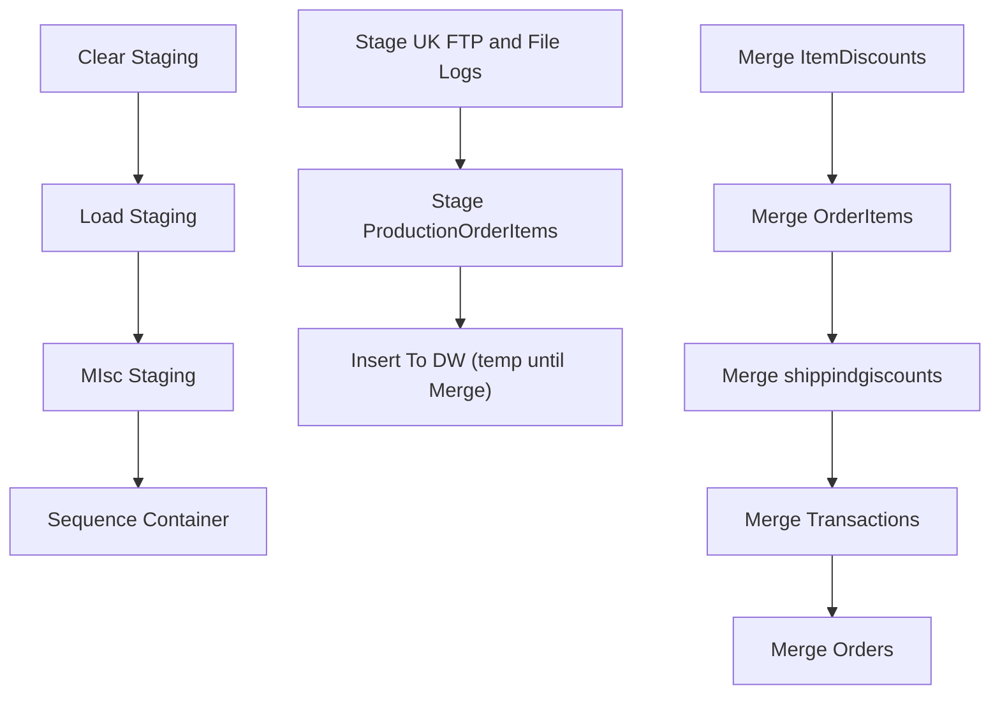

# SSIS Package: WebOrderUpload

**Project:** DataWareHouseETL  
**Folder:** SSIS  
**Server:** STL-SSIS-P-01  

## Connection Managers

| Name | Type | Server | Catalog | Connection (sanitized) |
|---|---|---|---|---|
| IntegrationServer | OLEDB | stl-ssis-t-01 | IntegrationStaging | Data Source=stl-ssis-t-01; Initial Catalog=IntegrationStaging; Provider=SQLNCLI11.1; Integrated Security=SSPI; Auto Translate=False |

## Control Flow Tasks

| Task | Type |
|---|---|
| WebOrderUpload | Package |
| Clear Staging | ExecuteSQLTask |
| Load Staging | Pipeline |
| MIsc Staging | SEQUENCE |
| Insert To DW (temp until Merge) | Pipeline |
| Stage ProductionOrderItems | Pipeline |
| Stage UK FTP and File Logs | Pipeline |
| Sequence Container | SEQUENCE |
| Merge ItemDiscounts | ExecuteSQLTask |
| Merge OrderItems | ExecuteSQLTask |
| Merge Orders | ExecuteSQLTask |
| Merge shippindgiscounts | ExecuteSQLTask |
| Merge Transactions | ExecuteSQLTask |

## Control Flow Outline

```text
- Clear Staging [ExecuteSQLTask]
- Load Staging [Pipeline]
- MIsc Staging [SEQUENCE]
  - Insert To DW (temp until Merge) [Pipeline]
  - Stage ProductionOrderItems [Pipeline]
  - Stage UK FTP and File Logs [Pipeline]
- Sequence Container [SEQUENCE]
  - Merge ItemDiscounts [ExecuteSQLTask]
  - Merge OrderItems [ExecuteSQLTask]
  - Merge Orders [ExecuteSQLTask]
  - Merge Transactions [ExecuteSQLTask]
  - Merge shippindgiscounts [ExecuteSQLTask]
```

## Architecture Diagram



## Variables

_None detected._

## Execute SQL Tasks

### Clear Staging

**Path:** `Package\Clear Staging`  
**Connection:** {8ECA936A-3987-45E3-A0FE-5EE2D613A707}  

```sql
Truncate table WebTransactions;
Truncate table WebOrders
Truncate Table WebOrderItems
Truncate table WebItemDiscounts
Truncate Table WebShippingDiscounts
```

### Merge ItemDiscounts

**Path:** `Package\Sequence Container\Merge ItemDiscounts`  
**Connection:** {3E839F8D-41E3-4624-B3C5-8E9FBAD93AB5}  

```sql
Merge WebItemDiscounts as Target
Using dwstaging.dbo.WebItemDiscounts as Source
on (target.DiscountID = source.DiscountID)
When Not Matched Then 
Insert (DiscountID,PromoCode,OrderID,OrderItemID,
    	DiscountAmount, IsOrderDiscount,
	DiscountName,InsertDate,UpdateDate)

Values  (source.DiscountID,source.PromoCode,
	source.OrderID,source.OrderItemID,
    	source.DiscountAmount, source.IsOrderDiscount,
	source.DiscountName,GetDate(),GetDate())

;
```

### Merge OrderItems

**Path:** `Package\Sequence Container\Merge OrderItems`  
**Connection:** {3E839F8D-41E3-4624-B3C5-8E9FBAD93AB5}  

```sql
Merge WebOrderItems as Target
Using dwstaging.dbo.WebOrderItems as Source
on (target.OrderID = source.OrderID and target.OrderItemID = source.OrderItemID)
When Not Matched Then 
Insert (TransactionID,
	OrderID,OrderItemID,SKU,
	Qty,ItemDescription,Price,DiscountedPrice,
	InsertDate,UpdateDate,ParentItem,Product_Key)

Values  (source.TransactionID,
	source.OrderID, source.OrderItemID, source.SKU,
	source.Qty, source.ItemDescription, source.Price,
	source.DiscountedPrice, GetDate(),GetDate(),
	source.ParentItem, source.Product_Key)

;
```

### Merge Orders

**Path:** `Package\Sequence Container\Merge Orders`  
**Connection:** {3E839F8D-41E3-4624-B3C5-8E9FBAD93AB5}  

```sql
Merge WebOrders  as Target
Using dwstaging.dbo.WebOrders as Source
on (target.OrderID = source.OrderID)
When Matched then 
  Update Set OrderStatus = source.OrderStatus , UpdateDate = GetDate(), 
                     StatusDate = source.StatusDate
When Not Matched Then 
Insert (SourceSite, TransactionID,
	OrderID, OrderNum, OrderDate,
	ShippingAmount,
	OrderStatus, StatusDate,
	Physical, InsertDate,UpdateDate,
	Transaction_ID)

Values  (source.SourceSite, source.TransactionID,
	source.OrderID, source.OrderNum, source.OrderDate,
	source.ShippingAmount,
	source.OrderStatus, source.StatusDate,
	source.Physical,GetDate(),GetDate(),
	source.Transaction_ID)

;
```

### Merge Transactions

**Path:** `Package\Sequence Container\Merge Transactions`  
**Connection:** {3E839F8D-41E3-4624-B3C5-8E9FBAD93AB5}  

```sql
Merge WebTransactions as Target
Using dwstaging.dbo.WebTransactions  as Source
on (target.TransactionID = source.TransactionID)
When Not Matched Then
Insert (TransactionID, 
	TransactionNum, 
	TransactionDateTime,
	TaxAmount,
	TaxJurisdiction,
	InsertDate, UpdateDate)

Values  (source.TransactionID, 
	source.TransactionNum, 
	source.TransactionDateTime,
	source.TaxAmount,
	source.TaxJurisdiction,GetDate(),GetDate())

;
```

### Merge shippindgiscounts

**Path:** `Package\Sequence Container\Merge shippindgiscounts`  
**Connection:** {3E839F8D-41E3-4624-B3C5-8E9FBAD93AB5}  

```sql
Merge WebShippingDiscounts as Target
Using dwstaging.dbo.WebShippingDiscounts as Source
on (target.ShippingDiscountID = source.ShippingDiscountID)
When Not Matched Then 
Insert (ShippingDiscountID, OrderID, 
	PromoCode, DiscountAmount, 
	DiscountName, InsertDate, 
	UpdateDate)

Values (source.ShippingDiscountID, source.OrderID, 
	source.PromoCode, source.DiscountAmount, 
	source.DiscountName,GetDate(),GetDate())

;
```

## Data Flow: Sources

| Component | Source Object | Type | Data Flow Task | Connection | SQL Kind |
|---|---|---|---|---|---|
| ItemDiscounts |  | OLEDBSource | Load Staging | {8EFA9482-FC80-4560-95C1-DC5F69E92601}:external | SqlCommand |
| OrderItems |  | OLEDBSource | Load Staging | {8EFA9482-FC80-4560-95C1-DC5F69E92601}:external | SqlCommand |
| Orders |  | OLEDBSource | Load Staging | {8EFA9482-FC80-4560-95C1-DC5F69E92601}:external | SqlCommand |
| ShippingDiscounts |  | OLEDBSource | Load Staging | {8EFA9482-FC80-4560-95C1-DC5F69E92601}:external | SqlCommand |
| Transactions |  | OLEDBSource | Load Staging | {8EFA9482-FC80-4560-95C1-DC5F69E92601}:external | SqlCommand |
| dwstaging WebProductionOrderItem |  | OLEDBSource | Insert To DW (temp until Merge) | {8ECA936A-3987-45E3-A0FE-5EE2D613A707}:external |  |
| dwstaging WebProductionOrderSummary |  | OLEDBSource | Insert To DW (temp until Merge) | {8ECA936A-3987-45E3-A0FE-5EE2D613A707}:external |  |
| vwProductionOrderItem |  | OLEDBSource | Stage ProductionOrderItems | {8EFA9482-FC80-4560-95C1-DC5F69E92601}:external |  |
| FTP |  | OLEDBSource | Stage UK FTP and File Logs | IntegrationServer | SqlCommand |

#### ItemDiscounts — SqlCommand

```sql
SELECT        WM.OrderStatus.Status, WM.OrderStatus.StatusDate, WM.OrderStatus.CurrentStatus, WM.Orders.TransactionID AS Expr1, WM.ItemDiscounts.DiscountID, WM.ItemDiscounts.PromoCode, 
                         WM.ItemDiscounts.OrderItemID, WM.ItemDiscounts.OrderID, WM.ItemDiscounts.DiscountAmount, WM.ItemDiscounts.IsOrderDiscount, WM.ItemDiscounts.DiscountName
FROM            WM.OrderStatus INNER JOIN
                         WM.Orders ON WM.OrderStatus.OrderId = WM.Orders.OrderId INNER JOIN
                         WM.OrderItems ON WM.Orders.OrderId = WM.OrderItems.OrderId INNER JOIN
                         WM.ItemDiscounts ON WM.OrderItems.OrderItemID = WM.ItemDiscounts.OrderItemID AND WM.OrderItems.OrderId = WM.ItemDiscounts.OrderID
WHERE        (WM.OrderStatus.CurrentStatus = 1) AND (WM.OrderStatus.StatusDate >= GETDATE() - 30)
```

#### OrderItems — SqlCommand

```sql
SELECT        WM.OrderStatus.Status, WM.OrderStatus.StatusDate, WM.OrderStatus.CurrentStatus, WM.Orders.TransactionID, WM.OrderItems.OrderItemID, WM.OrderItems.OrderId, WM.OrderItems.sku, WM.OrderItems.qty, 
                         WM.OrderItems.ItemDescription, WM.OrderItems.Price, WM.OrderItems.DiscountedPrice, WM.OrderItems.ParentItem
FROM            WM.OrderStatus INNER JOIN
                         WM.Orders ON WM.OrderStatus.OrderId = WM.Orders.OrderId INNER JOIN
                         WM.OrderItems ON WM.Orders.OrderId = WM.OrderItems.OrderId
WHERE        (WM.OrderStatus.CurrentStatus = 1)   and StatusDate >= GetDate() - 30
```

#### Orders — SqlCommand

```sql
SELECT        WM.OrderStatus.Status, WM.OrderStatus.StatusDate, WM.OrderStatus.CurrentStatus, WM.Orders.TransactionID, WM.Orders.OrderNum, WM.Orders.OrderDate, WM.Orders.ShippingAmount, 
                         WM.Orders.OrderId,orderNumber,right(SourceSite,2) as SourceSite,Case charindex('_',OrderNum) when 0 then 'No' else 'Yes' end as Physical
FROM            WM.OrderStatus INNER JOIN
                         WM.Orders ON WM.OrderStatus.OrderId = WM.Orders.OrderId
WHERE        (WM.OrderStatus.CurrentStatus = 1)   and StatusDate >= GetDate() - 30
```

#### ShippingDiscounts — SqlCommand

```sql
SELECT        WM.OrderStatus.Status, WM.OrderStatus.StatusDate, WM.OrderStatus.CurrentStatus, WM.Orders.TransactionID, WM.ShippingDiscounts.ShippingDiscountID, WM.ShippingDiscounts.OrderId, 
                         WM.ShippingDiscounts.PromoCode, WM.ShippingDiscounts.DiscountAmount, WM.ShippingDiscounts.DiscountName
FROM            WM.OrderStatus INNER JOIN
                         WM.Orders ON WM.OrderStatus.OrderId = WM.Orders.OrderId INNER JOIN
                         WM.ShippingDiscounts ON WM.Orders.OrderId = WM.ShippingDiscounts.OrderId
WHERE        (WM.OrderStatus.CurrentStatus = 1)   and StatusDate >= GetDate() - 30
```

#### Transactions — SqlCommand

```sql
SELECT        WM.OrderStatus.Status, WM.OrderStatus.StatusDate, WM.OrderStatus.CurrentStatus, WM.Transactions.TransactionNum, WM.Transactions.TransactionDateTime, WM.Transactions.TaxAmount, 
                         WM.Transactions.TaxJurisdiction, WM.Transactions.TransactionID
FROM            WM.OrderStatus INNER JOIN
                         WM.Orders ON WM.OrderStatus.OrderId = WM.Orders.OrderId INNER JOIN
                         WM.Transactions ON WM.Orders.TransactionID = WM.Transactions.TransactionID
WHERE        (WM.OrderStatus.CurrentStatus = 1)   and StatusDate >= GetDate() - 30
```

#### FTP — SqlCommand

```sql
select 
	substring(ftpLog,64,8) as OrderNumber,
	substring(ftpLog,49,43) as OrderFileName,
	case 
		when right(ftpLog,4) = '100%'
			then 'YES'
			else 'NO'
	end as SuccessfullyUploaded,
	LogDateTime

,Cast( LogDateTime as date) as LogDate
from WEB.UKFTPTransmissionLogDump  with (nolock)
where ftplog like '%OMSInBoundOrder%'
and datediff(dd, LogDateTime, getdate()) <= ?
```

## Data Flow: Destinations

| Component | Target Table | Type | Data Flow Task | Connection | SQL Kind |
|---|---|---|---|---|---|
| OLE DB Destination |  | OLEDBDestination | Load Staging | {8ECA936A-3987-45E3-A0FE-5EE2D613A707}:external |  |
| stage Item Discounts |  | OLEDBDestination | Load Staging | {8ECA936A-3987-45E3-A0FE-5EE2D613A707}:external |  |
| Stage Orders |  | OLEDBDestination | Load Staging | {8ECA936A-3987-45E3-A0FE-5EE2D613A707}:external |  |
| Stage Orders 1 |  | OLEDBDestination | Load Staging | {8ECA936A-3987-45E3-A0FE-5EE2D613A707}:external |  |
| stage shipping Discounts |  | OLEDBDestination | Load Staging | {8ECA936A-3987-45E3-A0FE-5EE2D613A707}:external |  |
| stage Transactions |  | OLEDBDestination | Load Staging | {8ECA936A-3987-45E3-A0FE-5EE2D613A707}:external |  |
| dw WebProductionOrderItem |  | OLEDBDestination | Insert To DW (temp until Merge) | {3E839F8D-41E3-4624-B3C5-8E9FBAD93AB5}:external |  |
| DW WebProductionOrderSummary |  | OLEDBDestination | Insert To DW (temp until Merge) | {3E839F8D-41E3-4624-B3C5-8E9FBAD93AB5}:external |  |
| WebProductionOrderItem |  | OLEDBDestination | Stage ProductionOrderItems | {8ECA936A-3987-45E3-A0FE-5EE2D613A707}:external |  |
| WebUKFTPFiles |  | OLEDBDestination | Stage UK FTP and File Logs | {8ECA936A-3987-45E3-A0FE-5EE2D613A707}:external |  |
