# SSIS Package: WebOrderUpload

**Project:** DataWareHouseETL  
**Folder:** SSIS  
**Server:** STL-SSIS-P-01  

## Architecture Diagram

```mermaid
flowchart TD
    subgraph Connections
        IntegrationServer_conn(["IntegrationServer [OLEDB]"])
    end
    subgraph ControlFlow
        WebOrderUpload_task["WebOrderUpload"]
        Clear_Staging_task["Clear Staging"]
        WebOrderUpload_task --> Clear_Staging_task
        Load_Staging_task["Load Staging"]
        Clear_Staging_task --> Load_Staging_task
        MIsc_Staging_task["MIsc Staging"]
        Load_Staging_task --> MIsc_Staging_task
        Insert_To_DW__temp_until_Merge__task["Insert To DW (temp until Merge)"]
        MIsc_Staging_task --> Insert_To_DW__temp_until_Merge__task
        Stage_ProductionOrderItems_task["Stage ProductionOrderItems"]
        Insert_To_DW__temp_until_Merge__task --> Stage_ProductionOrderItems_task
        Stage_UK_FTP_and_File_Logs_task["Stage UK FTP and File Logs"]
        Stage_ProductionOrderItems_task --> Stage_UK_FTP_and_File_Logs_task
        Sequence_Container_task["Sequence Container"]
        Stage_UK_FTP_and_File_Logs_task --> Sequence_Container_task
        Merge_ItemDiscounts_task["Merge ItemDiscounts"]
        Sequence_Container_task --> Merge_ItemDiscounts_task
        Merge_OrderItems_task["Merge OrderItems"]
        Merge_ItemDiscounts_task --> Merge_OrderItems_task
        Merge_Orders_task["Merge Orders"]
        Merge_OrderItems_task --> Merge_Orders_task
        Merge_shippindgiscounts_task["Merge shippindgiscounts"]
        Merge_Orders_task --> Merge_shippindgiscounts_task
        Merge_Transactions_task["Merge Transactions"]
        Merge_shippindgiscounts_task --> Merge_Transactions_task
    end
```

## Connection Managers

| Name | Type |
|---|---|
| IntegrationServer | OLEDB |

## Control Flow Tasks

| Task | Type |
|---|---|
| WebOrderUpload | Microsoft.Package |
| Clear Staging | Microsoft.ExecuteSQLTask |
| Load Staging | Microsoft.Pipeline |
| MIsc Staging | STOCK:SEQUENCE |
| Insert To DW (temp until Merge) | Microsoft.Pipeline |
| Stage ProductionOrderItems | Microsoft.Pipeline |
| Stage UK FTP and File Logs | Microsoft.Pipeline |
| Sequence Container | STOCK:SEQUENCE |
| Merge ItemDiscounts | Microsoft.ExecuteSQLTask |
| Merge OrderItems | Microsoft.ExecuteSQLTask |
| Merge Orders | Microsoft.ExecuteSQLTask |
| Merge shippindgiscounts | Microsoft.ExecuteSQLTask |
| Merge Transactions | Microsoft.ExecuteSQLTask |

## Data Flow: Sources

| Component | SQL Preview |
|---|---|
|  | SELECT        WM.OrderStatus.Status, WM.OrderStatus.StatusDate, WM.OrderStatus.CurrentStatus, WM.Orders.TransactionID AS Expr1, WM.ItemDiscounts.DiscountID, WM.ItemDiscounts.PromoCode,                           WM.ItemDiscounts.OrderItemID, WM.ItemDiscounts.OrderID, WM.ItemDiscounts.DiscountAmount, WM.ItemDiscounts.IsOrderDiscount, WM.ItemDiscounts.DiscountName FROM            WM.OrderStatus INNER |
|  | select  distinct  cast(substring (ln.line_note,CHARINDEX('_',ln.line_note,1)-8,8) as varchar(8)) as OrderNumber,th.transaction_id 				 from auditworks.dbo.transaction_header th (nolock) join auditworks.dbo.line_note ln (nolock) on th.transaction_id = ln.transaction_id and datediff(dd, th.transaction_date, getdate()) <=300 and th.store_no in ( '13','2013') and ln.line_note like 'Web Order%'  union  |
|  | SELECT        style_code, MAX(product_key) AS Product_Key FROM            product_dim GROUP BY style_code ORDER BY style_code |
|  | select  distinct                 cast(substring (ln.line_note,CHARINDEX(':',ln.line_note,1)+2,20) as varchar(10)) as OrderNumber,th.transaction_id 				 from auditworks.dbo.transaction_header th (nolock) join auditworks.dbo.line_note ln (nolock) on th.transaction_id = ln.transaction_id --and datediff(dd, th.transaction_date, getdate()) <=300 where th.store_no in ( '13','2013') and ln.line_note like |
|  | SELECT        WM.OrderStatus.Status, WM.OrderStatus.StatusDate, WM.OrderStatus.CurrentStatus, WM.Orders.TransactionID, WM.OrderItems.OrderItemID, WM.OrderItems.OrderId, WM.OrderItems.sku, WM.OrderItems.qty,                           WM.OrderItems.ItemDescription, WM.OrderItems.Price, WM.OrderItems.DiscountedPrice, WM.OrderItems.ParentItem FROM            WM.OrderStatus INNER JOIN                   |
|  | SELECT        WM.OrderStatus.Status, WM.OrderStatus.StatusDate, WM.OrderStatus.CurrentStatus, WM.Orders.TransactionID, WM.Orders.OrderNum, WM.Orders.OrderDate, WM.Orders.ShippingAmount,                           WM.Orders.OrderId,orderNumber,right(SourceSite,2) as SourceSite,Case charindex('_',OrderNum) when 0 then 'No' else 'Yes' end as Physical FROM            WM.OrderStatus INNER JOIN           |
|  | SELECT        WM.OrderStatus.Status, WM.OrderStatus.StatusDate, WM.OrderStatus.CurrentStatus, WM.Orders.TransactionID, WM.ShippingDiscounts.ShippingDiscountID, WM.ShippingDiscounts.OrderId,                           WM.ShippingDiscounts.PromoCode, WM.ShippingDiscounts.DiscountAmount, WM.ShippingDiscounts.DiscountName FROM            WM.OrderStatus INNER JOIN                          WM.Orders ON W |
|  | SELECT        WM.OrderStatus.Status, WM.OrderStatus.StatusDate, WM.OrderStatus.CurrentStatus, WM.Transactions.TransactionNum, WM.Transactions.TransactionDateTime, WM.Transactions.TaxAmount,                           WM.Transactions.TaxJurisdiction, WM.Transactions.TransactionID FROM            WM.OrderStatus INNER JOIN                          WM.Orders ON WM.OrderStatus.OrderId = WM.Orders.OrderI |
|  | select * from [WEB].[vwProductionOrderItemLookups] |
|  | select  	substring(ftpLog,64,8) as OrderNumber, 	substring(ftpLog,49,43) as OrderFileName, 	case  		when right(ftpLog,4) = '100%' 			then 'YES' 			else 'NO' 	end as SuccessfullyUploaded, 	LogDateTime  ,Cast( LogDateTime as date) as LogDate from WEB.UKFTPTransmissionLogDump  with (nolock) where ftplog like '%OMSInBoundOrder%' and datediff(dd, LogDateTime, getdate()) <= ? |

## Data Flow: Destinations

| Component | Destination |
|---|---|
|  | [dbo].[WebOrderItems] |
|  | [dbo].[WebItemDiscounts] |
|  | [dbo].[WebOrders] |
|  | [dbo].[WebOrders] |
|  | [dbo].[WebShippingDiscounts] |
|  | [dbo].[WebTransactions] |
|  | [dbo].[WebProductionOrderItem] |
|  | [dbo].[WebProductionOrderSummary] |
|  | [dbo].[WebProductionOrderItem] |
|  | [dbo].[WebProductionOrderSummary] |
|  | [dbo].[WebRptProductionOrderItem] |
|  | [dbo].[WebProductionOrderItem] |
|  | [dbo].[WebUKFTPFiles] |

