# SSIS Package: PFTOpentoBuy

**Project:** ERPSuppliesProcessing  
**Folder:** SSIS  
**Server:** STL-SSIS-P-01  

## Connection Managers

| Name | Type | Server | Catalog | Connection (sanitized) |
|---|---|---|---|---|
| Inventory Movement Journal Entries | FLATFILE |  |  |  |
| SMTP_EMAIL | SMTP |  |  |  |
| SQL_LOG | OLEDB | stl-ssis-p-01 | msdb | Data Source=stl-ssis-p-01; Initial Catalog=msdb; Provider=SQLNCLI11.1; Integrated Security=SSPI; Auto Translate=False |
| Warehouse on Hand | FLATFILE |  |  |  |

## Control Flow Tasks

| Task | Type |
|---|---|
| PFTOpentoBuy | Package |
| Sequence Container | SEQUENCE |
| FLC - Get Inventory Movement from dynsnc | FOREACHLOOP |
| Move Files to Stage | FileSystemTask |
| FLC - Get Warehouse On Hand from dynsnc | FOREACHLOOP |
| Move Files to Stage | FileSystemTask |
| FLC - Process Inventory Movement from dynsnc | FOREACHLOOP |
| DFT - Get ERP Supply Movement Data | Pipeline |
| Move Files to Archive | FileSystemTask |
| FLC - Process Warehouse On Hand from dynsnc | FOREACHLOOP |
| DFT - Get Warehouse On Hand Data | Pipeline |
| Move Files to Archive | FileSystemTask |
| Script Task | ScriptTask |
| Send Email onError | SendMailTask |

## Control Flow Outline

```text
- Send Email onError [SendMailTask]
- Sequence Container [SEQUENCE]
  - FLC - Get Inventory Movement from dynsnc [FOREACHLOOP]
    - Move Files to Stage [FileSystemTask]
  - FLC - Get Warehouse On Hand from dynsnc [FOREACHLOOP]
    - Move Files to Stage [FileSystemTask]
  - FLC - Process Inventory Movement from dynsnc [FOREACHLOOP]
    - DFT - Get ERP Supply Movement Data [Pipeline]
    - Move Files to Archive [FileSystemTask]
  - FLC - Process Warehouse On Hand from dynsnc [FOREACHLOOP]
    - DFT - Get Warehouse On Hand Data [Pipeline]
    - Move Files to Archive [FileSystemTask]
    - Script Task [ScriptTask]
```

## Architecture Diagram

```mermaid
flowchart TD
    n_Package_Sequence_Container["Sequence Container"]
    n_Package_Sequence_Container_FLC___Get_Inventory_Movement_from_dynsnc["FLC - Get Inventory Movement from dynsnc"]
    n_Package_Sequence_Container_FLC___Get_Inventory_Movement_from_dynsnc_Move_Files_to_Stage["Move Files to Stage"]
    n_Package_Sequence_Container_FLC___Get_Warehouse_On_Hand_from_dynsnc["FLC - Get Warehouse On Hand from dynsnc"]
    n_Package_Sequence_Container_FLC___Get_Warehouse_On_Hand_from_dynsnc_Move_Files_to_Stage["Move Files to Stage"]
    n_Package_Sequence_Container_FLC___Process_Inventory_Movement_from_dynsnc["FLC - Process Inventory Movement from dynsnc"]
    n_Package_Sequence_Container_FLC___Process_Inventory_Movement_from_dynsnc_DFT___Get_ERP_Supply_Movement_Data["DFT - Get ERP Supply Movement Data"]
    n_Package_Sequence_Container_FLC___Process_Inventory_Movement_from_dynsnc_Move_Files_to_Archive["Move Files to Archive"]
    n_Package_Sequence_Container_FLC___Process_Warehouse_On_Hand_from_dynsnc["FLC - Process Warehouse On Hand from dynsnc"]
    n_Package_Sequence_Container_FLC___Process_Warehouse_On_Hand_from_dynsnc_DFT___Get_Warehouse_On_Hand_Data["DFT - Get Warehouse On Hand Data"]
    n_Package_Sequence_Container_FLC___Process_Warehouse_On_Hand_from_dynsnc_Move_Files_to_Archive["Move Files to Archive"]
    n_Package_Sequence_Container_FLC___Process_Warehouse_On_Hand_from_dynsnc_Script_Task["Script Task"]
    n_Package_EventHandlers_OnError__Send_Email_onError["Send Email onError"]
    n_Package_Sequence_Container_FLC___Process_Inventory_Movement_from_dynsnc_DFT___Get_ERP_Supply_Movement_Data --> n_Package_Sequence_Container_FLC___Process_Inventory_Movement_from_dynsnc_Move_Files_to_Archive
    n_Package_Sequence_Container_FLC___Process_Warehouse_On_Hand_from_dynsnc_DFT___Get_Warehouse_On_Hand_Data --> n_Package_Sequence_Container_FLC___Process_Warehouse_On_Hand_from_dynsnc_Move_Files_to_Archive
    n_Package_Sequence_Container_FLC___Process_Warehouse_On_Hand_from_dynsnc_Script_Task --> n_Package_Sequence_Container_FLC___Process_Warehouse_On_Hand_from_dynsnc_DFT___Get_Warehouse_On_Hand_Data
    n_Package_Sequence_Container_FLC___Get_Warehouse_On_Hand_from_dynsnc --> n_Package_Sequence_Container_FLC___Process_Warehouse_On_Hand_from_dynsnc
    n_Package_Sequence_Container_FLC___Get_Inventory_Movement_from_dynsnc --> n_Package_Sequence_Container_FLC___Process_Inventory_Movement_from_dynsnc
```



## Variables

| Namespace | Name | Expression-bound |
|---|---|---|
| System | Propagate | No |
| User | Entity | No |
| User | SupplyInventoryMovementArchiveDestination | Yes |
| User | SupplyInventoryMovementFileName | No |
| User | SupplyWarehouseOnHandArchiveDestination | Yes |
| User | SupplyWarehouseOnHandFileDate | No |
| User | SupplyWarehouseOnHandFileName | No |

### Expression-bound variable values

#### User::SupplyInventoryMovementArchiveDestination

**Expression:**

```sql
@[$Project::SupplyInventoryMovementArchive] +  @[User::Entity]
```

**Evaluated value:**

```sql
\\stl-dynsnc-p-01\BABWIntegrations\SupplyProcessing\InventoryMovement\Archive\3001
```

#### User::SupplyWarehouseOnHandArchiveDestination

**Expression:**

```sql
@[$Project::SupplyWarehouseOnHandArchive] +  @[User::Entity]
```

**Evaluated value:**

```sql
\\stl-dynsnc-p-01\BABWIntegrations\SupplyProcessing\WarehouseOnHand\Archive\3001
```

## Execute SQL Tasks

_None detected._

## Data Flow: Sources

| Component | Source Object | Type | Data Flow Task | Connection | SQL Kind |
|---|---|---|---|---|---|
| Flat File Source |  | FlatFileSource | DFT - Get ERP Supply Movement Data | Inventory Movement Journal Entries |  |
| Flat File Source |  | FlatFileSource | DFT - Get Warehouse On Hand Data | Warehouse on Hand |  |

## Data Flow: Destinations

| Component | Target Table | Type | Data Flow Task | Connection | SQL Kind |
|---|---|---|---|---|---|
| OLE DB Destination |  | OLEDBDestination | DFT - Get ERP Supply Movement Data | {28B6F557-CC43-401E-9EC1-3D0366410765}:external |  |
| OLE DB Destination |  | OLEDBDestination | DFT - Get Warehouse On Hand Data | {28B6F557-CC43-401E-9EC1-3D0366410765}:external |  |
