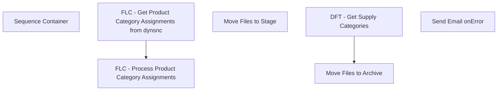

# SSIS Package: PFTOpentoBuyProductCategoryAssignments

**Project:** ERPSuppliesProcessing  
**Folder:** SSIS  
**Server:** STL-SSIS-P-01  

## Connection Managers

| Name | Type | Server | Catalog | Connection (sanitized) |
|---|---|---|---|---|
| Product Category Assignments | FLATFILE |  |  |  |
| SMTP_EMAIL | SMTP |  |  |  |
| SQL_LOG | OLEDB | stl-ssis-p-01 | msdb | Data Source=stl-ssis-p-01; Initial Catalog=msdb; Provider=SQLNCLI11.1; Integrated Security=SSPI; Auto Translate=False |

## Control Flow Tasks

| Task | Type |
|---|---|
| PFTOpentoBuyProductCategoryAssignments | Package |
| Sequence Container | SEQUENCE |
| FLC - Get Product Category Assignments from dynsnc | FOREACHLOOP |
| Move Files to Stage | FileSystemTask |
| FLC - Process Product Category Assignments | FOREACHLOOP |
| DFT - Get Supply Categories | Pipeline |
| Move Files to Archive | FileSystemTask |
| Send Email onError | SendMailTask |

## Control Flow Outline

```text
- Send Email onError [SendMailTask]
- Sequence Container [SEQUENCE]
  - FLC - Get Product Category Assignments from dynsnc [FOREACHLOOP]
    - Move Files to Stage [FileSystemTask]
  - FLC - Process Product Category Assignments [FOREACHLOOP]
    - DFT - Get Supply Categories [Pipeline]
    - Move Files to Archive [FileSystemTask]
```

## Architecture Diagram



## Variables

| Namespace | Name | Expression-bound |
|---|---|---|
| System | Propagate | No |
| User | SupplyCategoryAssignmentFileName | No |
| User | SupplyInventoryMovementFileName | No |
| User | SupplyWarehouseOnHandFileName | No |

## Execute SQL Tasks

_None detected._

## Data Flow: Sources

| Component | Source Object | Type | Data Flow Task | Connection | SQL Kind |
|---|---|---|---|---|---|
| Flat File Source |  | FlatFileSource | DFT - Get Supply Categories | Product Category Assignments |  |

## Data Flow: Destinations

| Component | Target Table | Type | Data Flow Task | Connection | SQL Kind |
|---|---|---|---|---|---|
| OLE DB Destination |  | OLEDBDestination | DFT - Get Supply Categories | {28B6F557-CC43-401E-9EC1-3D0366410765}:external |  |
