# SSIS Package: PFTOpentoBuyProductCategoryAssignments

**Project:** ERPSuppliesProcessing  
**Folder:** SSIS  
**Server:** STL-SSIS-P-01  

## Architecture Diagram

```mermaid
flowchart TD
    subgraph Connections
        Product_Category_Assignments_conn(["Product Category Assignments [FLATFILE]"])
        SMTP_EMAIL_conn(["SMTP_EMAIL [SMTP]"])
        SQL_LOG_conn(["SQL_LOG [OLEDB]"])
    end
    subgraph ControlFlow
        PFTOpentoBuyProductCategoryAssignments_task["PFTOpentoBuyProductCategoryAssignments"]
        Sequence_Container_task["Sequence Container"]
        PFTOpentoBuyProductCategoryAssignments_task --> Sequence_Container_task
        FLC___Get_Product_Category_Assignments_from_dynsnc_task["FLC - Get Product Category Assignments from dynsnc"]
        Sequence_Container_task --> FLC___Get_Product_Category_Assignments_from_dynsnc_task
        Move_Files_to_Stage_task["Move Files to Stage"]
        FLC___Get_Product_Category_Assignments_from_dynsnc_task --> Move_Files_to_Stage_task
        FLC___Process_Product_Category_Assignments_task["FLC - Process Product Category Assignments"]
        Move_Files_to_Stage_task --> FLC___Process_Product_Category_Assignments_task
        DFT___Get_Supply_Categories_task["DFT - Get Supply Categories"]
        FLC___Process_Product_Category_Assignments_task --> DFT___Get_Supply_Categories_task
        Move_Files_to_Archive_task["Move Files to Archive"]
        DFT___Get_Supply_Categories_task --> Move_Files_to_Archive_task
        Send_Email_onError_task["Send Email onError"]
        Move_Files_to_Archive_task --> Send_Email_onError_task
    end
```

## Connection Managers

| Name | Type |
|---|---|
| Product Category Assignments | FLATFILE |
| SMTP_EMAIL | SMTP |
| SQL_LOG | OLEDB |

## Control Flow Tasks

| Task | Type |
|---|---|
| PFTOpentoBuyProductCategoryAssignments | Microsoft.Package |
| Sequence Container | STOCK:SEQUENCE |
| FLC - Get Product Category Assignments from dynsnc | STOCK:FOREACHLOOP |
| Move Files to Stage | Microsoft.FileSystemTask |
| FLC - Process Product Category Assignments | STOCK:FOREACHLOOP |
| DFT - Get Supply Categories | Microsoft.Pipeline |
| Move Files to Archive | Microsoft.FileSystemTask |
| Send Email onError | Microsoft.SendMailTask |

## Data Flow: Sources

| Component | SQL Preview |
|---|---|
|  | select * from [ERP].[SupplyCategoryAssignments] |
|  | select * from [ERP].[SupplyCategoryAssignments] |
|  | UPDATE [ERP].[SupplyCategoryAssignments] SET [ProductCategoryName] = ? WHERE [ProductNumber] = ? |

## Data Flow: Destinations

| Component | Destination |
|---|---|
|  | [ERP].[SupplyCategoryAssignments] |

