# SSIS Package: ERP_ItemLoadtoD365

**Project:** ERP_ItemLoadToD365  
**Folder:** SSIS  
**Server:** STL-SSIS-P-01  

## Architecture Diagram

```mermaid
flowchart TD
    subgraph Connections
        ArchiveFolder_conn(["ArchiveFolder [FILE]"])
        IntegrationStaging_conn(["IntegrationStaging [OLEDB]"])
        ME_01_conn(["ME_01 [OLEDB]"])
        SMTP_EMAIL_conn(["SMTP_EMAIL [SMTP]"])
        SQL_LOG_conn(["SQL_LOG [OLEDB]"])
        XML_FILES_conn(["XML FILES [FILE]"])
    end
    subgraph ControlFlow
        ERP_ItemLoadtoD365_task["ERP_ItemLoadtoD365"]
        Delete_Old_Files_task["Delete Old Files"]
        ERP_ItemLoadtoD365_task --> Delete_Old_Files_task
        File_Generation_and_Move_task["File Generation and Move"]
        Delete_Old_Files_task --> File_Generation_and_Move_task
        Foreach_ReleasedProductCreation_task["Foreach ReleasedProductCreation"]
        File_Generation_and_Move_task --> Foreach_ReleasedProductCreation_task
        Archive_Files_task["Archive Files"]
        Foreach_ReleasedProductCreation_task --> Archive_Files_task
        Copy_Files_to_D365_Drop_Folder_task["Copy Files to D365 Drop Folder"]
        Archive_Files_task --> Copy_Files_to_D365_Drop_Folder_task
        spOutputItemLoadxml_task["spOutputItemLoadxml"]
        Copy_Files_to_D365_Drop_Folder_task --> spOutputItemLoadxml_task
        Stage_Data_task["Stage Data"]
        spOutputItemLoadxml_task --> Stage_Data_task
        Merge_Item_Data_task["Merge Item Data"]
        Stage_Data_task --> Merge_Item_Data_task
        Stage_Item_Data_task["Stage Item Data"]
        Merge_Item_Data_task --> Stage_Item_Data_task
        Truncate_Stage_task["Truncate Stage"]
        Stage_Item_Data_task --> Truncate_Stage_task
        Send_Email_onError_task["Send Email onError"]
        Truncate_Stage_task --> Send_Email_onError_task
    end
```

## Connection Managers

| Name | Type |
|---|---|
| ArchiveFolder | FILE |
| IntegrationStaging | OLEDB |
| ME_01 | OLEDB |
| SMTP_EMAIL | SMTP |
| SQL_LOG | OLEDB |
| XML FILES | FILE |

## Control Flow Tasks

| Task | Type |
|---|---|
| ERP_ItemLoadtoD365 | Microsoft.Package |
| Delete Old Files | Microsoft.ExecuteSQLTask |
| File Generation and Move | STOCK:SEQUENCE |
| Foreach ReleasedProductCreation | STOCK:FOREACHLOOP |
| Archive Files | Microsoft.FileSystemTask |
| Copy Files to D365 Drop Folder | Microsoft.FileSystemTask |
| spOutputItemLoadxml | Microsoft.ExecuteSQLTask |
| Stage Data | STOCK:SEQUENCE |
| Merge Item Data | Microsoft.ExecuteSQLTask |
| Stage Item Data | Microsoft.Pipeline |
| Truncate Stage | Microsoft.ExecuteSQLTask |
| Send Email onError | Microsoft.SendMailTask |

## Data Flow: Sources

| Component | SQL Preview |
|---|---|
|  | select * from [WMS].[CountryCodes] |

## Data Flow: Destinations

| Component | Destination |
|---|---|
|  | [ERP].[ItemLoadtoD365Stage] |
|  | [dbo].[vwERPItemLoadtoD365] |

