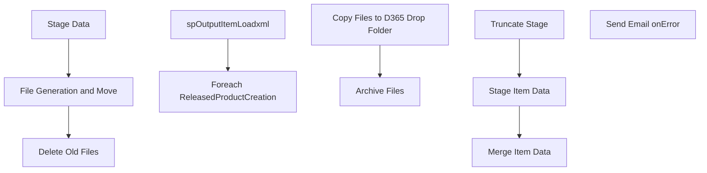

# SSIS Package: ERP_ItemLoadtoD365

**Project:** ERP_ItemLoadToD365  
**Folder:** SSIS  
**Server:** STL-SSIS-P-01  

## Connection Managers

| Name | Type | Server | Catalog | Connection (sanitized) |
|---|---|---|---|---|
| ArchiveFolder | FILE |  |  |  |
| IntegrationStaging | OLEDB | STL-SSIS-P-01 | IntegrationStaging | Data Source=STL-SSIS-P-01; Initial Catalog=IntegrationStaging; Provider=SQLNCLI11.1; Integrated Security=SSPI; Auto Translate=False |
| ME_01 | OLEDB | bedrockdb02 | me_01 | Data Source=bedrockdb02; Initial Catalog=me_01; Provider=SQLNCLI11.1; Integrated Security=SSPI; Auto Translate=False |
| SMTP_EMAIL | SMTP |  |  |  |
| SQL_LOG | OLEDB | stl-ssis-p-01 | msdb | Data Source=stl-ssis-p-01; Initial Catalog=msdb; Provider=SQLNCLI11.1; Integrated Security=SSPI; Auto Translate=False |
| XML FILES | FILE |  |  |  |

## Control Flow Tasks

| Task | Type |
|---|---|
| ERP_ItemLoadtoD365 | Package |
| Delete Old Files | ExecuteSQLTask |
| File Generation and Move | SEQUENCE |
| Foreach ReleasedProductCreation | FOREACHLOOP |
| Archive Files | FileSystemTask |
| Copy Files to D365 Drop Folder | FileSystemTask |
| spOutputItemLoadxml | ExecuteSQLTask |
| Stage Data | SEQUENCE |
| Merge Item Data | ExecuteSQLTask |
| Stage Item Data | Pipeline |
| Truncate Stage | ExecuteSQLTask |
| Send Email onError | SendMailTask |

## Control Flow Outline

```text
- Send Email onError [SendMailTask]
- Delete Old Files [ExecuteSQLTask]
- File Generation and Move [SEQUENCE]
  - Foreach ReleasedProductCreation [FOREACHLOOP]
    - Archive Files [FileSystemTask]
    - Copy Files to D365 Drop Folder [FileSystemTask]
  - spOutputItemLoadxml [ExecuteSQLTask]
- Stage Data [SEQUENCE]
  - Merge Item Data [ExecuteSQLTask]
  - Stage Item Data [Pipeline]
  - Truncate Stage [ExecuteSQLTask]
```

## Architecture Diagram



## Variables

| Namespace | Name | Expression-bound |
|---|---|---|
| System | Propagate | No |
| User | ArchiveFolder | Yes |
| User | D365DropFolder | Yes |
| User | Entity | No |
| User | FileName | No |
| User | RunControlFlag | No |
| User | SQLItemLoadViewByEntity | Yes |

### Expression-bound variable values

#### User::ArchiveFolder

**Expression:**

```sql
@[$Package::ERP_ItemFileStageLocation] + "Archive\\"
```

**Evaluated value:**

```sql
\\stl-ssis-P-01\IntegrationStaging\ERP\Items\Archive\
```

#### User::D365DropFolder

**Expression:**

```sql
@[$Package::ERP_ItemLoadToD365DropFolder]  +  @[User::Entity] + "\\Inbound\\"
```

**Evaluated value:**

```sql
\\STL-DYNSNC-P-01\BABWIntegrations\WMS_Items\prod\1100\Inbound\
```

#### User::SQLItemLoadViewByEntity

**Expression:**

```sql
"select *
 from vwERPItemLoadtoD365
where Entity = '" + @[User::Entity]  + "'"
```

**Evaluated value:**

```sql
select *
 from vwERPItemLoadtoD365
where Entity = '1100'
```

## Execute SQL Tasks

### Delete Old Files

**Path:** `Package\Delete Old Files`  
**Connection:** IntegrationStaging (STL-SSIS-P-01/IntegrationStaging)  

```sql
exec spDeleteOldFiles @path = '\\stl-ssis-p-01\IntegrationStaging\ERP\Items\Archive\', @filemask = '*.xml', @retention = 7
```

### spOutputItemLoadxml

**Path:** `Package\File Generation and Move\spOutputItemLoadxml`  
**Connection:** IntegrationStaging (STL-SSIS-P-01/IntegrationStaging)  

> ⚠️ `SqlStatementSource` is overridden at runtime by a property expression (shown below); the static SQL may not be what executes.

**Static SqlStatementSource:**

```sql
exec ERP.spOutputItemLoadxml '1100'
```

**Property expression (runtime override):**

```sql
"exec ERP.spOutputItemLoadxml '" +  @[User::Entity] + "'"
```

### Merge Item Data

**Path:** `Package\Stage Data\Merge Item Data`  
**Connection:** IntegrationStaging (STL-SSIS-P-01/IntegrationStaging)  

> ⚠️ `SqlStatementSource` is overridden at runtime by a property expression (shown below); the static SQL may not be what executes.

**Static SqlStatementSource:**

```sql
exec ERP.spMergeItemLoadtoD365 'DELTA'
```

**Property expression (runtime override):**

```sql
"exec ERP.spMergeItemLoadtoD365 " +  "'" + @[$Package::ERP_ItemLoadType] + "'"
```

### Truncate Stage

**Path:** `Package\Stage Data\Truncate Stage`  
**Connection:** IntegrationStaging (STL-SSIS-P-01/IntegrationStaging)  

```sql
TRUNCATE TABLE ERP.ItemLoadtoD365Stage
```

## Data Flow: Sources

| Component | Source Object | Type | Data Flow Task | Connection | SQL Kind |
|---|---|---|---|---|---|
| vwERPItemLoadtoD365 |  | OLEDBSource | Stage Item Data | ME_01 |  |

## Data Flow: Destinations

| Component | Target Table | Type | Data Flow Task | Connection | SQL Kind |
|---|---|---|---|---|---|
| ItemLoadtoD365Stage |  | OLEDBDestination | Stage Item Data | IntegrationStaging |  |
