# SSIS Package: ERP_ItemMasterToWM3PL

**Project:** ERP_ItemMasterToWM3PL  
**Folder:** SSIS  
**Server:** STL-SSIS-P-01  

## Connection Managers

| Name | Type | Server | Catalog | Connection (sanitized) |
|---|---|---|---|---|
| CNItemMasterCSV | FLATFILE |  |  |  |
| IntegrationStaging | OLEDB | STL-SSIS-P-01 | IntegrationStaging | Data Source=STL-SSIS-P-01; Initial Catalog=IntegrationStaging; Provider=SQLNCLI11.1; Integrated Security=SSPI; Auto Translate=False |
| SMTP_EMAIL | SMTP |  |  |  |
| SQL_LOG | OLEDB | stl-ssis-p-01 | msdb | Data Source=stl-ssis-p-01; Initial Catalog=msdb; Provider=SQLNCLI11.1; Integrated Security=SSPI; Auto Translate=False |
| WCItemMasterCSV | FLATFILE |  |  |  |
| WM | OLEDB | wmdb01 | wmprod | Data Source=wmdb01; Initial Catalog=wmprod; Provider=SQLNCLI10.1; Integrated Security=SSPI; Auto Translate=False |

## Control Flow Tasks

| Task | Type |
|---|---|
| ERP_ItemMasterToWM3PL | Package |
| Data Flow Task | Pipeline |
| Generate File Sequence | SEQUENCE |
| CN File Sequence | SEQUENCE |
| CN ItemMasterCSV | Pipeline |
| Count CN Items | ExecuteSQLTask |
| Delete Old Files - CN | ExecuteSQLTask |
| Foreach Loop - CN Files | FOREACHLOOP |
| Archive File | FileSystemTask |
| Move File  to CN | FileSystemTask |
| UK File Sequence | SEQUENCE |
| Count UK Items | ExecuteSQLTask |
| Delete Old Files - UK | ExecuteSQLTask |
| Foreach Loop - UK Files | FOREACHLOOP |
| Archive File | FileSystemTask |
| Move File  to UK | FileSystemTask |
| spOutputItemMasterUKxml | ExecuteSQLTask |
| WC File Sequence | SEQUENCE |
| Count WC Items | ExecuteSQLTask |
| Delete Old Files - WC | ExecuteSQLTask |
| Foreach Loop - WC Files | FOREACHLOOP |
| Archive File | FileSystemTask |
| Move File  to WC | FileSystemTask |
| WC ItemMaster CSV | Pipeline |
| WM File Sequence | SEQUENCE |
| Country of Origin | Pipeline |
| Delete Old Files - WM | ExecuteSQLTask |
| Foreach Loop - WM Files | FOREACHLOOP |
| Archive File | FileSystemTask |
| Move File  to WM | FileSystemTask |
| Item_Master_HTS | Pipeline |
| spOutputItemMasterWMxml | ExecuteSQLTask |
| Stage Data Sequence | SEQUENCE |
| Merge ItemMasterData | ExecuteSQLTask |
| Stage ItemMaster Data | Pipeline |
| Truncate Stage | ExecuteSQLTask |
| Send Email onError | SendMailTask |

## Control Flow Outline

```text
- Send Email onError [SendMailTask]
- Data Flow Task [Pipeline]
- Generate File Sequence [SEQUENCE]
  - CN File Sequence [SEQUENCE]
    - CN ItemMasterCSV [Pipeline]
    - Count CN Items [ExecuteSQLTask]
    - Delete Old Files - CN [ExecuteSQLTask]
    - Foreach Loop - CN Files [FOREACHLOOP]
      - Archive File [FileSystemTask]
      - Move File  to CN [FileSystemTask]
  - UK File Sequence [SEQUENCE]
    - Count UK Items [ExecuteSQLTask]
    - Delete Old Files - UK [ExecuteSQLTask]
    - Foreach Loop - UK Files [FOREACHLOOP]
      - Archive File [FileSystemTask]
      - Move File  to UK [FileSystemTask]
    - spOutputItemMasterUKxml [ExecuteSQLTask]
  - WC File Sequence [SEQUENCE]
    - Count WC Items [ExecuteSQLTask]
    - Delete Old Files - WC [ExecuteSQLTask]
    - Foreach Loop - WC Files [FOREACHLOOP]
      - Archive File [FileSystemTask]
      - Move File  to WC [FileSystemTask]
    - WC ItemMaster CSV [Pipeline]
  - WM File Sequence [SEQUENCE]
    - Country of Origin [Pipeline]
    - Delete Old Files - WM [ExecuteSQLTask]
    - Foreach Loop - WM Files [FOREACHLOOP]
      - Archive File [FileSystemTask]
      - Move File  to WM [FileSystemTask]
    - Item_Master_HTS [Pipeline]
    - spOutputItemMasterWMxml [ExecuteSQLTask]
- Stage Data Sequence [SEQUENCE]
  - Merge ItemMasterData [ExecuteSQLTask]
  - Stage ItemMaster Data [Pipeline]
  - Truncate Stage [ExecuteSQLTask]
```

## Architecture Diagram

```mermaid
flowchart TD
    n_Package_Data_Flow_Task["Data Flow Task"]
    n_Package_Generate_File_Sequence["Generate File Sequence"]
    n_Package_Generate_File_Sequence_CN_File_Sequence["CN File Sequence"]
    n_Package_Generate_File_Sequence_CN_File_Sequence_CN_ItemMasterCSV["CN ItemMasterCSV"]
    n_Package_Generate_File_Sequence_CN_File_Sequence_Count_CN_Items["Count CN Items"]
    n_Package_Generate_File_Sequence_CN_File_Sequence_Delete_Old_Files___CN["Delete Old Files - CN"]
    n_Package_Generate_File_Sequence_CN_File_Sequence_Foreach_Loop___CN_Files["Foreach Loop - CN Files"]
    n_Package_Generate_File_Sequence_CN_File_Sequence_Foreach_Loop___CN_Files_Archive_File["Archive File"]
    n_Package_Generate_File_Sequence_CN_File_Sequence_Foreach_Loop___CN_Files_Move_File__to_CN["Move File  to CN"]
    n_Package_Generate_File_Sequence_UK_File_Sequence["UK File Sequence"]
    n_Package_Generate_File_Sequence_UK_File_Sequence_Count_UK_Items["Count UK Items"]
    n_Package_Generate_File_Sequence_UK_File_Sequence_Delete_Old_Files___UK["Delete Old Files - UK"]
    n_Package_Generate_File_Sequence_UK_File_Sequence_Foreach_Loop___UK_Files["Foreach Loop - UK Files"]
    n_Package_Generate_File_Sequence_UK_File_Sequence_Foreach_Loop___UK_Files_Archive_File["Archive File"]
    n_Package_Generate_File_Sequence_UK_File_Sequence_Foreach_Loop___UK_Files_Move_File__to_UK["Move File  to UK"]
    n_Package_Generate_File_Sequence_UK_File_Sequence_spOutputItemMasterUKxml["spOutputItemMasterUKxml"]
    n_Package_Generate_File_Sequence_WC_File_Sequence["WC File Sequence"]
    n_Package_Generate_File_Sequence_WC_File_Sequence_Count_WC_Items["Count WC Items"]
    n_Package_Generate_File_Sequence_WC_File_Sequence_Delete_Old_Files___WC["Delete Old Files - WC"]
    n_Package_Generate_File_Sequence_WC_File_Sequence_Foreach_Loop___WC_Files["Foreach Loop - WC Files"]
    n_Package_Generate_File_Sequence_WC_File_Sequence_Foreach_Loop___WC_Files_Archive_File["Archive File"]
    n_Package_Generate_File_Sequence_WC_File_Sequence_Foreach_Loop___WC_Files_Move_File__to_WC["Move File  to WC"]
    n_Package_Generate_File_Sequence_WC_File_Sequence_WC_ItemMaster_CSV["WC ItemMaster CSV"]
    n_Package_Generate_File_Sequence_WM_File_Sequence["WM File Sequence"]
    n_Package_Generate_File_Sequence_WM_File_Sequence_Country_of_Origin["Country of Origin"]
    n_Package_Generate_File_Sequence_WM_File_Sequence_Delete_Old_Files___WM["Delete Old Files - WM"]
    n_Package_Generate_File_Sequence_WM_File_Sequence_Foreach_Loop___WM_Files["Foreach Loop - WM Files"]
    n_Package_Generate_File_Sequence_WM_File_Sequence_Foreach_Loop___WM_Files_Archive_File["Archive File"]
    n_Package_Generate_File_Sequence_WM_File_Sequence_Foreach_Loop___WM_Files_Move_File__to_WM["Move File  to WM"]
    n_Package_Generate_File_Sequence_WM_File_Sequence_Item_Master_HTS["Item_Master_HTS"]
    n_Package_Generate_File_Sequence_WM_File_Sequence_spOutputItemMasterWMxml["spOutputItemMasterWMxml"]
    n_Package_Stage_Data_Sequence["Stage Data Sequence"]
    n_Package_Stage_Data_Sequence_Merge_ItemMasterData["Merge ItemMasterData"]
    n_Package_Stage_Data_Sequence_Stage_ItemMaster_Data["Stage ItemMaster Data"]
    n_Package_Stage_Data_Sequence_Truncate_Stage["Truncate Stage"]
    n_Package_EventHandlers_OnError__Send_Email_onError["Send Email onError"]
    n_Package_Generate_File_Sequence_CN_File_Sequence_Foreach_Loop___CN_Files_Move_File__to_CN --> n_Package_Generate_File_Sequence_CN_File_Sequence_Foreach_Loop___CN_Files_Archive_File
    n_Package_Generate_File_Sequence_CN_File_Sequence_Count_CN_Items --> n_Package_Generate_File_Sequence_CN_File_Sequence_CN_ItemMasterCSV
    n_Package_Generate_File_Sequence_CN_File_Sequence_CN_ItemMasterCSV --> n_Package_Generate_File_Sequence_CN_File_Sequence_Foreach_Loop___CN_Files
    n_Package_Generate_File_Sequence_CN_File_Sequence_Foreach_Loop___CN_Files --> n_Package_Generate_File_Sequence_CN_File_Sequence_Delete_Old_Files___CN
    n_Package_Generate_File_Sequence_UK_File_Sequence_Foreach_Loop___UK_Files_Move_File__to_UK --> n_Package_Generate_File_Sequence_UK_File_Sequence_Foreach_Loop___UK_Files_Archive_File
    n_Package_Generate_File_Sequence_UK_File_Sequence_Count_UK_Items --> n_Package_Generate_File_Sequence_UK_File_Sequence_spOutputItemMasterUKxml
    n_Package_Generate_File_Sequence_UK_File_Sequence_spOutputItemMasterUKxml --> n_Package_Generate_File_Sequence_UK_File_Sequence_Foreach_Loop___UK_Files
    n_Package_Generate_File_Sequence_UK_File_Sequence_Foreach_Loop___UK_Files --> n_Package_Generate_File_Sequence_UK_File_Sequence_Delete_Old_Files___UK
    n_Package_Generate_File_Sequence_WC_File_Sequence_Foreach_Loop___WC_Files_Move_File__to_WC --> n_Package_Generate_File_Sequence_WC_File_Sequence_Foreach_Loop___WC_Files_Archive_File
    n_Package_Generate_File_Sequence_WC_File_Sequence_Count_WC_Items --> n_Package_Generate_File_Sequence_WC_File_Sequence_WC_ItemMaster_CSV
    n_Package_Generate_File_Sequence_WC_File_Sequence_WC_ItemMaster_CSV --> n_Package_Generate_File_Sequence_WC_File_Sequence_Foreach_Loop___WC_Files
    n_Package_Generate_File_Sequence_WC_File_Sequence_Foreach_Loop___WC_Files --> n_Package_Generate_File_Sequence_WC_File_Sequence_Delete_Old_Files___WC
    n_Package_Generate_File_Sequence_WM_File_Sequence_Foreach_Loop___WM_Files_Move_File__to_WM --> n_Package_Generate_File_Sequence_WM_File_Sequence_Foreach_Loop___WM_Files_Archive_File
    n_Package_Generate_File_Sequence_WM_File_Sequence_spOutputItemMasterWMxml --> n_Package_Generate_File_Sequence_WM_File_Sequence_Foreach_Loop___WM_Files
    n_Package_Generate_File_Sequence_WM_File_Sequence_Foreach_Loop___WM_Files --> n_Package_Generate_File_Sequence_WM_File_Sequence_Delete_Old_Files___WM
    n_Package_Generate_File_Sequence_WM_File_Sequence_Delete_Old_Files___WM --> n_Package_Generate_File_Sequence_WM_File_Sequence_Item_Master_HTS
    n_Package_Generate_File_Sequence_WM_File_Sequence_Item_Master_HTS --> n_Package_Generate_File_Sequence_WM_File_Sequence_Country_of_Origin
    n_Package_Generate_File_Sequence_WM_File_Sequence --> n_Package_Generate_File_Sequence_UK_File_Sequence
    n_Package_Generate_File_Sequence_UK_File_Sequence --> n_Package_Generate_File_Sequence_CN_File_Sequence
    n_Package_Stage_Data_Sequence_Truncate_Stage --> n_Package_Stage_Data_Sequence_Stage_ItemMaster_Data
    n_Package_Stage_Data_Sequence_Stage_ItemMaster_Data --> n_Package_Stage_Data_Sequence_Merge_ItemMasterData
    n_Package_Stage_Data_Sequence --> n_Package_Generate_File_Sequence
```



## Variables

| Namespace | Name | Expression-bound |
|---|---|---|
| System | Propagate | No |
| User | CNItemCount | No |
| User | Entity | No |
| User | ItemMasterCNArchive | No |
| User | ItemMasterCNFileDrop | Yes |
| User | ItemMasterCNFileName | No |
| User | ItemMasterFileName | No |
| User | ItemMasterStageArchive | Yes |
| User | ItemMasterUKArchive | Yes |
| User | ItemMasterUKFileDrop | Yes |
| User | ItemMasterUKFilename | No |
| User | ItemMasterWCArchive | No |
| User | ItemMasterWCFileDrop | Yes |
| User | ItemMasterWCFileName | No |
| User | ItemMasterWMFileDrop | Yes |
| User | SQLItemLoadStage | Yes |
| User | UKItemsCount | No |
| User | UpdatedCount | No |
| User | WCItemCount | No |

### Expression-bound variable values

#### User::ItemMasterCNFileDrop

**Expression:**

```sql
"\\\\" + @[$Package::ERP_ItemMasterWM_IntegrationStaging_ServerName] + "\\IntegrationStaging\\Dynamics\\WarehouseInterfaces\\ItemMaster\\CN\\"
```

**Evaluated value:**

```sql
\\STL-SSIS-P-01\IntegrationStaging\Dynamics\WarehouseInterfaces\ItemMaster\CN\
```

#### User::ItemMasterStageArchive

**Expression:**

```sql
@[User::ItemMasterWMFileDrop] + "Archive"
```

**Evaluated value:**

```sql
\\STL-SSIS-P-01\IntegrationStaging\Dynamics\WarehouseInterfaces\ItemMaster\WM\Archive
```

#### User::ItemMasterUKArchive

**Expression:**

```sql
@[User::ItemMasterUKFileDrop] + "Archive"
```

**Evaluated value:**

```sql
\\STL-SSIS-P-01\IntegrationStaging\Dynamics\WarehouseInterfaces\ItemMaster\UK\Archive
```

#### User::ItemMasterUKFileDrop

**Expression:**

```sql
"\\\\" + @[$Package::ERP_ItemMasterWM_IntegrationStaging_ServerName] + "\\IntegrationStaging\\Dynamics\\WarehouseInterfaces\\ItemMaster\\UK\\"
```

**Evaluated value:**

```sql
\\STL-SSIS-P-01\IntegrationStaging\Dynamics\WarehouseInterfaces\ItemMaster\UK\
```

#### User::ItemMasterWCFileDrop

**Expression:**

```sql
"\\\\" + @[$Package::ERP_ItemMasterWM_IntegrationStaging_ServerName] + "\\IntegrationStaging\\Dynamics\\WarehouseInterfaces\\ItemMaster\\WC\\"
```

**Evaluated value:**

```sql
\\STL-SSIS-P-01\IntegrationStaging\Dynamics\WarehouseInterfaces\ItemMaster\WC\
```

#### User::ItemMasterWMFileDrop

**Expression:**

```sql
"\\\\" + @[$Package::ERP_ItemMasterWM_IntegrationStaging_ServerName] + "\\IntegrationStaging\\Dynamics\\WarehouseInterfaces\\ItemMaster\\WM\\"
```

**Evaluated value:**

```sql
\\STL-SSIS-P-01\IntegrationStaging\Dynamics\WarehouseInterfaces\ItemMaster\WM\
```

#### User::SQLItemLoadStage

**Expression:**

```sql
"select * from ERP.vwItemLoadToWhseStage with (nolock) where entity = '" +  @[User::Entity] + "'"
```

**Evaluated value:**

```sql
select * from ERP.vwItemLoadToWhseStage with (nolock) where entity = '1100'
```

## Execute SQL Tasks

### Count CN Items

**Path:** `Package\Generate File Sequence\CN File Sequence\Count CN Items`  
**Connection:** IntegrationStaging (STL-SSIS-P-01/IntegrationStaging)  

```sql
select count(*) from ERP.vwItemMasterCN
```

### Delete Old Files - CN

**Path:** `Package\Generate File Sequence\CN File Sequence\Delete Old Files - CN`  
**Connection:** IntegrationStaging (STL-SSIS-P-01/IntegrationStaging)  

> ⚠️ `SqlStatementSource` is overridden at runtime by a property expression (shown below); the static SQL may not be what executes.

**Static SqlStatementSource:**

```sql
exec spDeleteOldFiles @path = '\\STL-SSIS-P-01\IntegrationStaging\Dynamics\WarehouseInterfaces\ItemMaster\WM\Archive', @filemask = '*.xml', @retention = 14
```

**Property expression (runtime override):**

```sql
"exec spDeleteOldFiles @path = '" + @[User::ItemMasterStageArchive] + "', @filemask = '*.xml', @retention = 14"
```

### Count UK Items

**Path:** `Package\Generate File Sequence\UK File Sequence\Count UK Items`  
**Connection:** IntegrationStaging (STL-SSIS-P-01/IntegrationStaging)  

```sql
select count(*) 
from erp.ItemMasterToWM 
where entity = 2110 
and left(style, 1) in ('4','5','6') 
and datediff(dd, isnull(UpdateDate, InsertDate), getdate()) = 0


```

### Delete Old Files - UK

**Path:** `Package\Generate File Sequence\UK File Sequence\Delete Old Files - UK`  
**Connection:** IntegrationStaging (STL-SSIS-P-01/IntegrationStaging)  

> ⚠️ `SqlStatementSource` is overridden at runtime by a property expression (shown below); the static SQL may not be what executes.

**Static SqlStatementSource:**

```sql
exec spDeleteOldFiles @path = '\\STL-SSIS-P-01\IntegrationStaging\Dynamics\WarehouseInterfaces\ItemMaster\WM\Archive', @filemask = '*.xml', @retention = 14
```

**Property expression (runtime override):**

```sql
"exec spDeleteOldFiles @path = '" + @[User::ItemMasterStageArchive] + "', @filemask = '*.xml', @retention = 14"
```

### spOutputItemMasterUKxml

**Path:** `Package\Generate File Sequence\UK File Sequence\spOutputItemMasterUKxml`  
**Connection:** IntegrationStaging (STL-SSIS-P-01/IntegrationStaging)  

> ⚠️ `SqlStatementSource` is overridden at runtime by a property expression (shown below); the static SQL may not be what executes.

**Static SqlStatementSource:**

```sql
exec ERP.spOutputItemMasterUKxml '\\STL-SSIS-P-01\IntegrationStaging\Dynamics\WarehouseInterfaces\ItemMaster\UK\'
```

**Property expression (runtime override):**

```sql
"exec ERP.spOutputItemMasterUKxml '" + @[User::ItemMasterUKFileDrop]  + "'"
```

### Count WC Items

**Path:** `Package\Generate File Sequence\WC File Sequence\Count WC Items`  
**Connection:** IntegrationStaging (STL-SSIS-P-01/IntegrationStaging)  

```sql
select count(*) 
from erp.ItemMasterToWM with (nolock) 
where entity = 1100
--and InWM is null 
```

### Delete Old Files - WC

**Path:** `Package\Generate File Sequence\WC File Sequence\Delete Old Files - WC`  
**Connection:** IntegrationStaging (STL-SSIS-P-01/IntegrationStaging)  

> ⚠️ `SqlStatementSource` is overridden at runtime by a property expression (shown below); the static SQL may not be what executes.

**Static SqlStatementSource:**

```sql
exec spDeleteOldFiles @path = '\\STL-SSIS-P-01\IntegrationStaging\Dynamics\WarehouseInterfaces\ItemMaster\WM\Archive', @filemask = '*.xml', @retention = 14
```

**Property expression (runtime override):**

```sql
"exec spDeleteOldFiles @path = '" + @[User::ItemMasterStageArchive] + "', @filemask = '*.xml', @retention = 14"
```

### Delete Old Files - WM

**Path:** `Package\Generate File Sequence\WM File Sequence\Delete Old Files - WM`  
**Connection:** IntegrationStaging (STL-SSIS-P-01/IntegrationStaging)  

> ⚠️ `SqlStatementSource` is overridden at runtime by a property expression (shown below); the static SQL may not be what executes.

**Static SqlStatementSource:**

```sql
exec spDeleteOldFiles @path = '\\STL-SSIS-P-01\IntegrationStaging\Dynamics\WarehouseInterfaces\ItemMaster\WM\Archive', @filemask = '*.xml', @retention = 14
```

**Property expression (runtime override):**

```sql
"exec spDeleteOldFiles @path = '" + @[User::ItemMasterStageArchive] + "', @filemask = '*.xml', @retention = 14"
```

### spOutputItemMasterWMxml

**Path:** `Package\Generate File Sequence\WM File Sequence\spOutputItemMasterWMxml`  
**Connection:** IntegrationStaging (STL-SSIS-P-01/IntegrationStaging)  

> ⚠️ `SqlStatementSource` is overridden at runtime by a property expression (shown below); the static SQL may not be what executes.

**Static SqlStatementSource:**

```sql
exec ERP.spOutputItemMasterWMxml '\\STL-SSIS-P-01\IntegrationStaging\Dynamics\WarehouseInterfaces\ItemMaster\WM\'
```

**Property expression (runtime override):**

```sql
"exec ERP.spOutputItemMasterWMxml '" + @[User::ItemMasterWMFileDrop]   + "'"
```

### Merge ItemMasterData

**Path:** `Package\Stage Data Sequence\Merge ItemMasterData`  
**Connection:** IntegrationStaging (STL-SSIS-P-01/IntegrationStaging)  

```sql
exec erp.spMergeItemMasterToWM
```

### Truncate Stage

**Path:** `Package\Stage Data Sequence\Truncate Stage`  
**Connection:** IntegrationStaging (STL-SSIS-P-01/IntegrationStaging)  

```sql
TRUNCATE TABLE ERP.ItemMasterToWMStage
```

## Data Flow: Sources

| Component | Source Object | Type | Data Flow Task | Connection | SQL Kind |
|---|---|---|---|---|---|
| OLE DB Source |  | OLEDBSource | Data Flow Task | IntegrationStaging | SqlCommand |
| vwItemMasterCN |  | OLEDBSource | CN ItemMasterCSV | IntegrationStaging |  |
| vwItemMasterWC |  | OLEDBSource | WC ItemMaster CSV | IntegrationStaging |  |
| vwItemFactoryMaster |  | OLEDBSource | Country of Origin | IntegrationStaging | SqlCommand |
| ItemMasterProducts |  | OLEDBSource | Item_Master_HTS | IntegrationStaging | SqlCommand |
| vwItemMasterWM |  | OLEDBSource | Stage ItemMaster Data | IntegrationStaging |  |

#### OLE DB Source — SqlCommand

```sql
select 
			style as Style,
			HTS,
			orgn_cert_code 
		from erp.ItemMasterToWM with (nolock) 
		where entity = 1100
```

#### vwItemFactoryMaster — SqlCommand

```sql
select cast(right(ProductNumber,6) as varchar) as Style, cast(FactoryCountry as varchar(2) ) as CountyOfOrigin
from ERP.vwItemFactoryMaster
where Entity = '1100'
and left(ProductNumber,1) = 'S'
```

#### ItemMasterProducts — SqlCommand

```sql
select 
	cast(right(ProductNumber, 6) as varchar(6)) StyleCode,
	cast(HARMONIZEDSYSTEMCODE as varchar(7)) as	AE,
	cast(HARMONIZEDSYSTEMCODE as varchar(7)) as AU,
	cast(HARMONIZEDSYSTEMCODE as varchar(7)) as	BE,
	cast(HARMONIZEDSYSTEMCODE as varchar(7)) as CA,
	cast(HARMONIZEDSYSTEMCODE as varchar(7)) as	DE,
	cast(HARMONIZEDSYSTEMCODE as varchar(7)) as	DK,
	cast(HARMONIZEDSYSTEMCODE as varchar(7)) as	FR,
	cast(HARMONIZEDSYSTEMCODE as varchar(7)) as	IE,
	cast(HARMONIZEDSYSTEMCODE as varchar(7)) as	JP,
	cast(HARMONIZEDSYSTEMCODE as varchar(7)) as KR,
	cast(HARMONIZEDSYSTEMCODE as varchar(7)) as	MX,
	cast(HARMONIZEDSYSTEMCODE as varchar(7)) as	NL,
	cast(HARMONIZEDSYSTEMCODE as varchar(7)) as	NO,
	cast(HARMONIZEDSYSTEMCODE as varchar(7)) as	RU,
	cast(HARMONIZEDSYSTEMCODE as varchar(7)) as SE,
	cast(HARMONIZEDSYSTEMCODE as varchar(7)) as G,
	cast(HARMONIZEDSYSTEMCODE as varchar(7)) as	TH,
	cast(HARMONIZEDSYSTEMCODE as varchar(7)) as	TW,
	cast(HARMONIZEDSYSTEMCODE as varchar(7)) as	UK,
	cast(HARMONIZEDSYSTEMCODE as varchar(7)) as	ZA
from WMS.ItemMasterProducts p
where HARMONIZEDSYSTEMCODE is not NULL
and exists (
				select im.ProductNumber 
				from wms.ItemMaster im with (nolock)
				where im.ProductNumber = p.ProductNumber 
				and im.NecessaryProductionWorkingTimeSchedulingPropertyId = 'Supplies'
			)
```

## Data Flow: Destinations

| Component | Target Table | Type | Data Flow Task | Connection | SQL Kind |
|---|---|---|---|---|---|
| ItemMasterUpdateStage |  | OLEDBDestination | Data Flow Task | WM |  |
| CNItemMasterCSV |  | FlatFileDestination | CN ItemMasterCSV | CNItemMasterCSV |  |
| WCItemMasterCSV |  | FlatFileDestination | WC ItemMaster CSV | WCItemMasterCSV |  |
| Item_Master_HTS |  | OLEDBDestination | Item_Master_HTS | WM |  |
| ItemMasterToWMStage |  | OLEDBDestination | Stage ItemMaster Data | IntegrationStaging |  |
