# SSIS Package: ERP_POReceipts

**Project:** ERP_POReceipts  
**Folder:** SSIS  
**Server:** STL-SSIS-P-01  

## Connection Managers

| Name | Type | Server | Catalog | Connection (sanitized) |
|---|---|---|---|---|
| Archive | FILE |  |  |  |
| IntegrationStaging | OLEDB | STL-SSIS-T-01 | IntegrationStaging | Data Source=STL-SSIS-T-01; Initial Catalog=IntegrationStaging; Provider=SQLNCLI11.1; Integrated Security=SSPI; Auto Translate=False |
| SMTP_EMAIL | SMTP |  |  |  |
| SQL_LOG | OLEDB | stl-ssis-p-01 | msdb | Data Source=stl-ssis-p-01; Initial Catalog=msdb; Provider=SQLNCLI11.1; Integrated Security=SSPI; Auto Translate=False |
| me_01 | OLEDB | bedrocktestdb02 | me_01 | Data Source=bedrocktestdb02; Initial Catalog=me_01; Provider=SQLNCLI11.1; Integrated Security=SSPI; Auto Translate=False |

## Control Flow Tasks

| Task | Type |
|---|---|
| ERP_POReceipts | Package |
| Sequence - Generate XML and Upload to D365 | SEQUENCE |
| Foreach Loop - PO Receipts | FOREACHLOOP |
| Archive File | FileSystemTask |
| Copy File to D365 | FileSystemTask |
| Foreach Loop - Transfer Receipts | FOREACHLOOP |
| Archive File | FileSystemTask |
| Copy File To D365 | FileSystemTask |
| spOutputD365PurchaseOrderReceiptXMLByEntity | ExecuteSQLTask |
| spOutputTransferPalletReceipt | ExecuteSQLTask |
| Sequence - Stage Receipts from Warehouses | SEQUENCE |
| Merge Non PO Receipts | ExecuteSQLTask |
| Merge PO Receipts | ExecuteSQLTask |
| PO Exceptions | Pipeline |
| Sequence Container | SEQUENCE |
| Data Flow - Stage 3PL Receipts | Pipeline |
| Data Flow - Stage WC Receipts | Pipeline |
| Stage Pallet Receipts | Pipeline |
| Truncate Stage | ExecuteSQLTask |
| Send Email onError | SendMailTask |

## Control Flow Outline

```text
- Send Email onError [SendMailTask]
- Sequence - Generate XML and Upload to D365 [SEQUENCE]
  - Foreach Loop - PO Receipts [FOREACHLOOP]
    - Archive File [FileSystemTask]
    - Copy File to D365 [FileSystemTask]
  - Foreach Loop - Transfer Receipts [FOREACHLOOP]
    - Archive File [FileSystemTask]
    - Copy File To D365 [FileSystemTask]
  - spOutputD365PurchaseOrderReceiptXMLByEntity [ExecuteSQLTask]
  - spOutputTransferPalletReceipt [ExecuteSQLTask]
- Sequence - Stage Receipts from Warehouses [SEQUENCE]
  - Merge Non PO Receipts [ExecuteSQLTask]
  - Merge PO Receipts [ExecuteSQLTask]
  - PO Exceptions [Pipeline]
  - Sequence Container [SEQUENCE]
    - Data Flow - Stage 3PL Receipts [Pipeline]
    - Data Flow - Stage WC Receipts [Pipeline]
    - Stage Pallet Receipts [Pipeline]
    - Truncate Stage [ExecuteSQLTask]
```

## Architecture Diagram

```mermaid
flowchart TD
    n_Package_Sequence___Generate_XML_and_Upload_to_D365["Sequence - Generate XML and Upload to D365"]
    n_Package_Sequence___Generate_XML_and_Upload_to_D365_Foreach_Loop___PO_Receipts["Foreach Loop - PO Receipts"]
    n_Package_Sequence___Generate_XML_and_Upload_to_D365_Foreach_Loop___PO_Receipts_Archive_File["Archive File"]
    n_Package_Sequence___Generate_XML_and_Upload_to_D365_Foreach_Loop___PO_Receipts_Copy_File_to_D365["Copy File to D365"]
    n_Package_Sequence___Generate_XML_and_Upload_to_D365_Foreach_Loop___Transfer_Receipts["Foreach Loop - Transfer Receipts"]
    n_Package_Sequence___Generate_XML_and_Upload_to_D365_Foreach_Loop___Transfer_Receipts_Archive_File["Archive File"]
    n_Package_Sequence___Generate_XML_and_Upload_to_D365_Foreach_Loop___Transfer_Receipts_Copy_File_To_D365["Copy File To D365"]
    n_Package_Sequence___Generate_XML_and_Upload_to_D365_spOutputD365PurchaseOrderReceiptXMLByEntity["spOutputD365PurchaseOrderReceiptXMLByEntity"]
    n_Package_Sequence___Generate_XML_and_Upload_to_D365_spOutputTransferPalletReceipt["spOutputTransferPalletReceipt"]
    n_Package_Sequence___Stage_Receipts_from_Warehouses["Sequence - Stage Receipts from Warehouses"]
    n_Package_Sequence___Stage_Receipts_from_Warehouses_Merge_Non_PO_Receipts["Merge Non PO Receipts"]
    n_Package_Sequence___Stage_Receipts_from_Warehouses_Merge_PO_Receipts["Merge PO Receipts"]
    n_Package_Sequence___Stage_Receipts_from_Warehouses_PO_Exceptions["PO Exceptions"]
    n_Package_Sequence___Stage_Receipts_from_Warehouses_Sequence_Container["Sequence Container"]
    n_Package_Sequence___Stage_Receipts_from_Warehouses_Sequence_Container_Data_Flow___Stage_3PL_Receipts["Data Flow - Stage 3PL Receipts"]
    n_Package_Sequence___Stage_Receipts_from_Warehouses_Sequence_Container_Data_Flow___Stage_WC_Receipts["Data Flow - Stage WC Receipts"]
    n_Package_Sequence___Stage_Receipts_from_Warehouses_Sequence_Container_Stage_Pallet_Receipts["Stage Pallet Receipts"]
    n_Package_Sequence___Stage_Receipts_from_Warehouses_Sequence_Container_Truncate_Stage["Truncate Stage"]
    n_Package_EventHandlers_OnError__Send_Email_onError["Send Email onError"]
    n_Package_Sequence___Generate_XML_and_Upload_to_D365_Foreach_Loop___PO_Receipts_Copy_File_to_D365 --> n_Package_Sequence___Generate_XML_and_Upload_to_D365_Foreach_Loop___PO_Receipts_Archive_File
    n_Package_Sequence___Generate_XML_and_Upload_to_D365_Foreach_Loop___Transfer_Receipts_Copy_File_To_D365 --> n_Package_Sequence___Generate_XML_and_Upload_to_D365_Foreach_Loop___Transfer_Receipts_Archive_File
    n_Package_Sequence___Generate_XML_and_Upload_to_D365_spOutputD365PurchaseOrderReceiptXMLByEntity --> n_Package_Sequence___Generate_XML_and_Upload_to_D365_Foreach_Loop___PO_Receipts
    n_Package_Sequence___Generate_XML_and_Upload_to_D365_spOutputD365PurchaseOrderReceiptXMLByEntity --> n_Package_Sequence___Generate_XML_and_Upload_to_D365_spOutputTransferPalletReceipt
    n_Package_Sequence___Generate_XML_and_Upload_to_D365_spOutputTransferPalletReceipt --> n_Package_Sequence___Generate_XML_and_Upload_to_D365_Foreach_Loop___Transfer_Receipts
    n_Package_Sequence___Stage_Receipts_from_Warehouses_Sequence_Container_Truncate_Stage --> n_Package_Sequence___Stage_Receipts_from_Warehouses_Sequence_Container_Data_Flow___Stage_WC_Receipts
    n_Package_Sequence___Stage_Receipts_from_Warehouses_Sequence_Container_Truncate_Stage --> n_Package_Sequence___Stage_Receipts_from_Warehouses_Sequence_Container_Data_Flow___Stage_3PL_Receipts
    n_Package_Sequence___Stage_Receipts_from_Warehouses_Sequence_Container_Data_Flow___Stage_WC_Receipts --> n_Package_Sequence___Stage_Receipts_from_Warehouses_Sequence_Container_Stage_Pallet_Receipts
    n_Package_Sequence___Stage_Receipts_from_Warehouses_Sequence_Container --> n_Package_Sequence___Stage_Receipts_from_Warehouses_PO_Exceptions
    n_Package_Sequence___Stage_Receipts_from_Warehouses_PO_Exceptions --> n_Package_Sequence___Stage_Receipts_from_Warehouses_Merge_PO_Receipts
    n_Package_Sequence___Stage_Receipts_from_Warehouses_Merge_PO_Receipts --> n_Package_Sequence___Stage_Receipts_from_Warehouses_Merge_Non_PO_Receipts
    n_Package_Sequence___Stage_Receipts_from_Warehouses --> n_Package_Sequence___Generate_XML_and_Upload_to_D365
```



## Variables

| Namespace | Name | Expression-bound |
|---|---|---|
| System | Propagate | No |
| User | D365FileDropLocation | Yes |
| User | Entity | No |
| User | OutputFileLocation | Yes |
| User | PalletCount | No |
| User | PurchaseOrderReceiptXMLFileName | No |
| User | SQL_3PL_ReceiptsByEntity | Yes |
| User | TransferReceiptArchive | Yes |
| User | TransferReceiptFile | No |
| User | TransferReceiptStageFolder | Yes |
| User | TransferReceiptsDynamicsDropFolder | Yes |

### Expression-bound variable values

#### User::D365FileDropLocation

**Expression:**

```sql
@[$Package::ERP_PurchaseOrderReceiptFileDropFolder] +  @[User::Entity] + "\\Import\\"
```

**Evaluated value:**

```sql
\\stl-dynsnc-t-02\BABWIntegrations\WMS_PO\test3\2110\Import\
```

#### User::OutputFileLocation

**Expression:**

```sql
"\\\\" + @[$Package::ERP_IntegrationStaging_ServerName] + "\\IntegrationStaging\\Dynamics\\WarehouseInterfaces\\PurchaseOrder\\PurchaseOrderReceipts\\" + @[User::Entity] + "\\"
```

**Evaluated value:**

```sql
\\STL-SSIS-T-01\IntegrationStaging\Dynamics\WarehouseInterfaces\PurchaseOrder\PurchaseOrderReceipts\2110\
```

#### User::SQL_3PL_ReceiptsByEntity

**Expression:**

```sql
"with 
Receipt as
	(
		select
			--PurchaseOrderNumber,
			cast(replace(
					case 
						when PurchaseOrderNumber like 'PO%-%'
							then substring(PurchaseOrderNumber, 0, charindex('-',PurchaseOrderNumber, 1))
						else PurchaseOrderNumber
					end,
					'PO ', 'PO'
				) as varchar(50)) as PurchaseOrderNumber,
			ReceiptLocation,
			ReceiptDate,
			cast(concat(ReceiptLocation, replace(ReceiptDate,'-',''), ItemID) as varchar(50)) as CaseNumber,
			ItemID,
			Qty,
			cast(InsertDate as date) InsertDate,
			Entity 
		from D365_PurchaseOrderReceiptStage 
		where Entity = '" + @[User::Entity]  + "' 
 AND datediff(dd, InsertDate, getdate()) <= 20	
)
select 
	case 
		when left(PurchaseOrderNumber,2) = 'PO' 
			then left(PurchaseOrderNumber, 11) 
		else PurchaseOrderNumber 
	end as PurchaseOrderNumber,
	ReceiptLocation,
	ReceiptDate,
	CaseNumber,
	ItemID,
	sum(Qty) as Qty,
	InsertDate,
	Entity 
from Receipt 
group by 
case 
		when left(PurchaseOrderNumber,2) = 'PO' 
			then left(PurchaseOrderNumber, 11) 
		else PurchaseOrderNumber 
	end,
	ReceiptLocation,
	ReceiptDate,
	CaseNumber,
	ItemID,
	InsertDate,
	Entity
"
```

**Evaluated value:**

```sql
with 
Receipt as
	(
		select
			--PurchaseOrderNumber,
			cast(replace(
					case 
						when PurchaseOrderNumber like 'PO%-%'
							then substring(PurchaseOrderNumber, 0, charindex('-',PurchaseOrderNumber, 1))
						else PurchaseOrderNumber
					end,
					'PO ', 'PO'
				) as varchar(50)) as PurchaseOrderNumber,
			ReceiptLocation,
			ReceiptDate,
			cast(concat(ReceiptLocation, replace(ReceiptDate,'-',''), ItemID) as varchar(50)) as CaseNumber,
			ItemID,
			Qty,
			cast(InsertDate as date) InsertDate,
			Entity 
		from D365_PurchaseOrderReceiptStage 
		where Entity = '2110' 
 AND datediff(dd, InsertDate, getdate()) <= 20	
)
select 
	case 
		when left(PurchaseOrderNumber,2) = 'PO' 
			then left(PurchaseOrderNumber, 11) 
		else PurchaseOrderNumber 
	end as PurchaseOrderNumber,
	ReceiptLocation,
	ReceiptDate,
	CaseNumber,
	ItemID,
	sum(Qty) as Qty,
	InsertDate,
	Entity 
from Receipt 
group by 
case 
		when left(PurchaseOrderNumber,2) = 'PO' 
			then left(PurchaseOrderNumber, 11) 
		else PurchaseOrderNumber 
	end,
	ReceiptLocation,
	ReceiptDate,
	CaseNumber,
	ItemID,
	InsertDate,
	Entity

```

#### User::TransferReceiptArchive

**Expression:**

```sql
@[User::TransferReceiptStageFolder] + "\\Archive"
```

**Evaluated value:**

```sql
\\stl-ssis-t-01\IntegrationStaging\Dynamics\WarehouseInterfaces\TransferAndSaleOrders\TransferReceipts\2110\Archive
```

#### User::TransferReceiptStageFolder

**Expression:**

```sql
@[$Package::ERP_TransferReceiptsStageFolder] +  @[User::Entity]
```

**Evaluated value:**

```sql
\\stl-ssis-t-01\IntegrationStaging\Dynamics\WarehouseInterfaces\TransferAndSaleOrders\TransferReceipts\2110
```

#### User::TransferReceiptsDynamicsDropFolder

**Expression:**

```sql
@[$Package::ERP_TransferReceiptsDynamicsDropFolder] +  @[User::Entity]
```

**Evaluated value:**

```sql
\\stl-dynsnc-t-02\BABWIntegrations\WMSTransferOrders\Inbound\test3\2110
```

## Execute SQL Tasks

### spOutputD365PurchaseOrderReceiptXMLByEntity

**Path:** `Package\Sequence - Generate XML and Upload to D365\spOutputD365PurchaseOrderReceiptXMLByEntity`  
**Connection:** IntegrationStaging (STL-SSIS-T-01/IntegrationStaging)  

> ⚠️ `SqlStatementSource` is overridden at runtime by a property expression (shown below); the static SQL may not be what executes.

**Static SqlStatementSource:**

```sql
exec ERP.spOutputD365PurchaseOrderReceiptXMLByEntity @DropFile = '\\STL-SSIS-T-01\IntegrationStaging\Dynamics\WarehouseInterfaces\PurchaseOrder\PurchaseOrderReceipts\2110\', @Entity = '2110'
```

**Property expression (runtime override):**

```sql
"exec ERP.spOutputD365PurchaseOrderReceiptXMLByEntity @DropFile = '" +  @[User::OutputFileLocation] + "', @Entity = '" + @[User::Entity] + "'"
```

### spOutputTransferPalletReceipt

**Path:** `Package\Sequence - Generate XML and Upload to D365\spOutputTransferPalletReceipt`  
**Connection:** IntegrationStaging (STL-SSIS-T-01/IntegrationStaging)  

> ⚠️ `SqlStatementSource` is overridden at runtime by a property expression (shown below); the static SQL may not be what executes.

**Static SqlStatementSource:**

```sql
exec ERP.spOutputTransferPalletReceipt @DropFile = '\\stl-ssis-t-01\IntegrationStaging\Dynamics\WarehouseInterfaces\TransferAndSaleOrders\TransferReceipts\2110\'
```

**Property expression (runtime override):**

```sql
"exec ERP.spOutputTransferPalletReceipt @DropFile = '" + @[User::TransferReceiptStageFolder]  + "\\'"
```

### Merge Non PO Receipts

**Path:** `Package\Sequence - Stage Receipts from Warehouses\Merge Non PO Receipts`  
**Connection:** IntegrationStaging (STL-SSIS-T-01/IntegrationStaging)  

```sql
exec ERP.spMergeWhseReceipt_NonPO
```

### Merge PO Receipts

**Path:** `Package\Sequence - Stage Receipts from Warehouses\Merge PO Receipts`  
**Connection:** IntegrationStaging (STL-SSIS-T-01/IntegrationStaging)  

```sql
exec ERP.spMergePurchaseOrderReceipt
```

### Truncate Stage

**Path:** `Package\Sequence - Stage Receipts from Warehouses\Sequence Container\Truncate Stage`  
**Connection:** IntegrationStaging (STL-SSIS-T-01/IntegrationStaging)  

```sql
TRUNCATE TABLE ERP.PurchaseOrderReceiptStage
TRUNCATE TABLE ERP.WhseReceiptStage_NonPO
TRUNCATE TABLE ERP.WCPalletReceipts
```

## Data Flow: Sources

| Component | Source Object | Type | Data Flow Task | Connection | SQL Kind |
|---|---|---|---|---|---|
| vwPOReceiptIntegrationExceptionLog |  | OLEDBSource | PO Exceptions | IntegrationStaging |  |
| D365_PurchaseOrderReceiptStage |  | OLEDBSource | Data Flow - Stage 3PL Receipts | me_01 | SqlCommand |
| D365_PurchaseOrderReceiptStage |  | OLEDBSource | Data Flow - Stage WC Receipts | me_01 | SqlCommand |
| ERP_WCPalletReceipts |  | OLEDBSource | Stage Pallet Receipts | me_01 | SqlCommand |

#### D365_PurchaseOrderReceiptStage — SqlCommand

```sql
with 
Receipt as
	(
		select
			PurchaseOrderNumber,
			ReceiptLocation,
			ReceiptDate,
			cast(concat(ReceiptLocation, replace(ReceiptDate,'-',''), ItemID) as varchar(50)) as CaseNumber,
			ItemID,
			Qty,
			cast(InsertDate as date) InsertDate,
			Entity 
		from D365_PurchaseOrderReceiptStage 
		where datediff(dd, InsertDate, getdate()) <= 1
	)
select 
	PurchaseOrderNumber,
	ReceiptLocation,
	ReceiptDate,
	CaseNumber,
	ItemID,
	sum(Qty) as Qty,
	InsertDate,
	Entity 
from Receipt 
group by 
	PurchaseOrderNumber,
	ReceiptLocation,
	ReceiptDate,
	CaseNumber,
	ItemID,
	InsertDate,
	Entity
```

#### ERP_WCPalletReceipts — SqlCommand

```sql
select *
from ERP_WCPalletReceipts 
where datediff(dd, ReceiptDate, getdate()) = 0
```

## Data Flow: Destinations

| Component | Target Table | Type | Data Flow Task | Connection | SQL Kind |
|---|---|---|---|---|---|
| PurchaseOrderReceiptExceptions |  | OLEDBDestination | PO Exceptions | IntegrationStaging |  |
| PurchaseOrderReceiptStage |  | OLEDBDestination | Data Flow - Stage 3PL Receipts | IntegrationStaging |  |
| WhseReceiptStage_NonPO |  | OLEDBDestination | Data Flow - Stage 3PL Receipts | IntegrationStaging |  |
| PurchaseOrderReceiptStage |  | OLEDBDestination | Data Flow - Stage WC Receipts | IntegrationStaging |  |
| WhseReceiptStage_NonPO |  | OLEDBDestination | Data Flow - Stage WC Receipts | IntegrationStaging |  |
| WCPalletReceipts |  | OLEDBDestination | Stage Pallet Receipts | IntegrationStaging |  |
